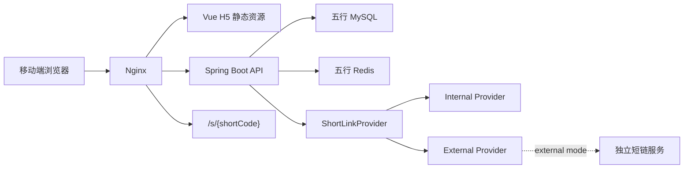
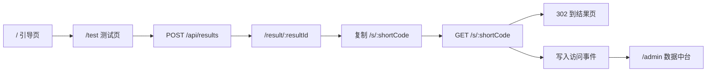

# 五行人格卡

五行人格卡是一个传统文化元素启发下的娱乐性人格测试 H5 全栈项目。项目以“测算结果页分享”为真实业务场景，重点实现从用户测算、结果生成、短链接分享到访问统计和后台数据中台的完整闭环。

```text
匿名用户测算 -> 生成结果页 -> 生成专属短链接 -> 朋友访问短链 -> 后台看到 PV / UV / UIP
```

项目不是命理预测工具，而是一个正向、娱乐化、可分享的人格解读产品原型；工程重点是短链接真实接入业务、匿名访问统计、Redis 缓存和 Docker 单机部署。

## 项目状态

| 项 | 说明 |
| --- | --- |
| 当前版本 | `v2.4-commercial-growth-suite` |
| 稳定分支 | `main` |
| 当前开发分支 | `codex/v2.2-v2.4-commercial-growth-suite` |
| MVP 状态 | v0.1 已完成完整单人测算闭环 |
| v0.2 状态 | 已完成短链接 Provider 适配层，可配置 `internal` / `external` 模式 |
| v0.3 状态 | 已增强 external 真实 HTTP 联调配置，并为后台总览、短链列表、访问日志增加日期筛选 |
| v0.4 状态 | 已完成外部短链服务级联调，后台短链列表可读取外部 PV / UV / UIP |
| v0.5 状态 | 已接入外部短链访问记录，后台短链详情支持 `local` / `external` 来源 |
| v0.6 状态 | 已建立严格质量门禁和 v1.0 路线图 |
| v0.7 状态 | 已完成生产短链路由与部署预检加固 |
| v0.8 状态 | 已完成后台日趋势、热门星官、最近结果和最近短链展示 |
| v0.9 状态 | 已完成短码校验、Referer 隐私收敛和 external 空记录稳定性加固 |
| v1.0 状态 | 稳定版收口，README、发布检查表、质量评分和版本记录已完成 |
| v1.1 状态 | 已补 external 生产接入 overlay、预检脚本、联调脚本、失败测试、对接说明和隐私审计 |
| v1.2-v1.4 状态 | 已补 CI/CD、运行态治理、后台工具、安全加固、Testcontainers 能力和分享图 |
| v2.0 状态 | 商业级产品化基线启动，已升级首页、测试流、结果页分享体验和增长埋点 |
| v2.1 状态 | 已落地 session、channel、campaign、device、eventDate 事件归因和后台增长漏斗 |
| v2.2-v2.4 状态 | 已补日聚合、生产 smoke/备份/回滚/限流和结果页传播体验增强 |
| 最新自评 | MVP 工程基线 99 / 100；v2.4 商业化初评 94 / 100，详见 [quality-scorecard.md](docs/quality-scorecard.md) |
| GitHub 标签 | `v0.1.0-mvp`、`v0.2.0-shortlink-adapter`、`v0.3.0-external-shortlink-and-analytics`、`v0.4.0-external-shortlink-service-integration`、`v0.5.0-external-shortlink-access-records`、`v0.6.0-quality-gates-and-roadmap`、`v0.7.0-production-routing-hardening`、`v0.8.0-admin-operational-insights`、`v0.9.0-stability-privacy-audit`、`v1.0.0-stable`、`v1.1.0-external-shortlink-production-readiness`、`v1.4.0-production-quality-suite` |

## 核心亮点

- **真实业务短链**：每个测算结果都会生成专属短链接，不是页面假字段。
- **完整访问统计**：记录并展示 PV、UV、UIP、提交量、短链访问量。
- **隐私克制**：不做登录注册，不收集昵称和性别，clientId、IP、User-Agent 均 hash 后入库。
- **Redis 缓存闭环**：结果详情缓存、短链解析缓存、无效短码空值缓存均已落地。
- **可切换短链架构**：v0.2 将短链模块升级为 Provider 适配层，默认内置实现，external 模式可接入独立短链服务。
- **外部短链服务级联调**：v0.4 已跑通本地独立短链项目创建短链、302 跳转和外部 PV / UV / UIP 读取。
- **外部访问明细接入**：v0.5 后台短链详情可读取外部 `access-record`，并对外部 IP / user 做 hash 后展示。
- **后台日期分析**：v0.3 支持按日期查看总览指标、短链列表和单条短链访问日志。
- **可部署验证**：Docker Compose 管理 MySQL、Redis、后端和 Nginx，已完成本地容器验收。
- **严格质量门禁**：v0.6 建立统一质量脚本、编辑规范和 v1.0 路线，后续版本必须按同一套标准验收。
- **生产路由加固**：v0.7 补充短链子域名 / 同域 rewrite 示例和部署预检脚本。
- **后台运营可读性**：v0.8 补充日趋势、热门星官、最近结果和最近短链，让上线初期数据更好解释。
- **稳定性与隐私审计**：v0.9 统一后台短码校验，Referer 去 query / fragment，external 空访问记录稳定返回。
- **稳定版交付**：v1.0 收口 README、部署检查表、质量评分和版本记录，作为可演示 MVP 基线。
- **external 生产接入准备**：v1.1 补充 external 模式 Compose overlay、环境样例、预检脚本、联调脚本、失败测试、对接说明和隐私审计报告。
- **生产质量增强**：v1.2-v1.4 补齐 GitHub Actions、Docker smoke、external 运行态状态、后台筛选导出、安全响应头、Testcontainers 和分享图。
- **商业级产品化基线**：v2.0 以“愿意测、感觉被看见、愿意分享、朋友继续测”为主循环，重做首页承诺、答题进度、结果身份表达、完整五行分布和分享面板。
- **增长漏斗埋点**：新增测试开始、答题选择、提交尝试、分享面板、原生分享、保存分享图、二次测试等事件，为后续渠道、留存和传播分析预留数据口径。
- **增长归因基础**：v2.1 将 session、channel、campaign、device、eventDate 写入事件表，分享短链自动带来源参数，后台展示增长漏斗、Top Channel 和 Top Campaign。
- **商业增长增强**：v2.2-v2.4 新增日聚合表、手动聚合接口、生产 smoke、备份恢复、回滚脚本、Nginx 限流安全头和更适合传播的结果页/分享图。
- **教学沉淀**：项目计划、质量评分、短链集成方案、教学手册均已文档化。

## 目录

- [在线地址](#在线地址)
- [技术栈](#技术栈)
- [项目结构](#项目结构)
- [项目架构图](#项目架构图)
- [核心流程图](#核心流程图)
- [已实现功能](#已实现功能)
- [短链接接入说明](#短链接接入说明)
- [本地启动方式](#本地启动方式)
- [Docker 部署方式](#docker-部署方式)
- [质量门禁](#质量门禁)
- [验证结果](#验证结果)
- [开发进度记录](#开发进度记录)
- [MVP 功能边界](#mvp-功能边界)
- [后续建议](#后续建议)

## 在线地址

生产地址按实际部署环境填写。当前仓库重点保留可复现的本地、Docker Compose 和云服务器单机部署能力。

## 技术栈

| 层 | 技术 |
| --- | --- |
| 前端 | Vue 3、Vite、TypeScript、Vue Router |
| 后端 | Java 17、Spring Boot 3、Maven、MyBatis、MySQL、Redis |
| 部署 | Docker Compose、Nginx |
| 测试 | JUnit 5、Spring Boot Test、MockMvc、H2 |

## 项目结构

```text
.
├── AGENTS.md
├── .github/workflows/
├── README.md
├── docs/
├── frontend/
│   ├── package.json
│   ├── vite.config.ts
│   └── src/
│       ├── api/
│       ├── components/
│       ├── pages/
│       ├── router/
│       └── utils/
├── backend/
│   ├── pom.xml
│   ├── Dockerfile
│   └── src/main/
│       ├── java/com/wuxing/persona/
│       └── resources/db/schema.sql
├── deploy/
    ├── docker-compose.yml
    ├── docker-compose.external-mode.yml
    ├── nginx.Dockerfile
    ├── nginx.conf
    ├── .env.example
    └── .env.external.example
└── scripts/
    ├── deploy-preflight.sh
    ├── docker-smoke-test.sh
    ├── production-smoke-test.sh
    ├── backup-mysql.sh
    ├── restore-mysql.sh
    ├── deploy-rollback.sh
    ├── mobile-e2e.sh
    ├── external-shortlink-preflight.sh
    ├── external-shortlink-smoke-test.sh
    └── quality-check.sh
```

## 项目架构图



## 核心流程图



## 已实现功能

- H5 页面：引导页、测试页、结果页、后台总览、短链访问详情、404。
- 结果生成：出生年月、可选日期和时段、5 道价值题、五行主副比例、星官、关键词和三段正向文案。
- 短链接：每个结果生成一个 6 位 Base62 短码，访问 `/s/{shortCode}` 后 302 跳回同一个结果页。
- 短链适配层：默认使用内置短链，也可通过配置切换到外部短链服务创建模式，外部失败时可降级到内置实现。
- 外部短链统计：external 模式下可从独立短链服务读取短链列表 PV / UV / UIP，并在后台显示统计来源。
- Redis 缓存：结果详情缓存、短链解析缓存、无效短码空值缓存。
- 访问统计：匿名 clientId、IP、User-Agent 均 hash 后入库，统计 PV、UV、UIP。
- 数据中台：总览指标、日趋势、热门组合、热门星官、最近结果、最近短链、短链列表、单条短链访问日志，并支持日期筛选。
- 后台运营工具：短链列表支持短码 / resultId 关键词筛选、`local` / `external` 来源筛选、CSV 导出和 external 运行态状态检查。
- 外部访问明细：external 模式且统计开关开启时，短链详情页优先读取独立短链服务访问记录，失败时回退本地日志。
- 隐私加固：访问事件只保存 hash 后的 clientId / IP / User-Agent，Referer 入库前会去掉 query 和 fragment。
- 安全加固：后端统一返回基础安全响应头，后台 token 使用常量时间比较。
- 管理保护：后台接口要求 `X-Admin-Token`。
- 分享体验：结果页可生成 PNG 分享图，同时保留专属短链复制能力。

## 短链接接入说明

v0.2 将短链模块拆成门面和 Provider：

```text
ResultService
  -> ShortLinkService
    -> ShortLinkProvider
      -> InternalShortLinkProvider
      -> ExternalShortLinkProvider
        -> ExternalShortLinkClient
```

默认 `internal` 模式仍然使用五行后端内置短链：

- `short_link` 表保存 `shortCode -> resultId -> shortUrl`。
- `GET /s/{shortCode}` 记录 `SHORT_LINK_VISIT`，更新短链 PV 和最近访问时间。
- 有效短码写入 Redis：`shortlink:code:{shortCode}`。
- 无效短码写入 Redis：`shortlink:null:{shortCode}`，降低重复无效请求对数据库的压力。

`external` 模式会优先调用已克隆的独立短链项目 `/Users/linyuxiang/JavaBackend/01_Projects/shortlink` 的创建接口，并将返回的 `fullShortUrl` 解析成本地业务绑定。外部服务不可用时，默认降级到内置短链，避免测算主流程中断。

v0.4 已完成本地服务级联调：

- 五行 `POST /api/results` 调用外部短链服务创建短链。
- 外部短链服务访问 `/{shortCode}` 后 302 到五行结果页。
- 五行本地继续保存 `resultId -> shortCode -> shortUrl` 业务绑定。
- 后台短链列表可在 `SHORT_LINK_EXTERNAL_STATS_ENABLED=true` 时读取外部 PV / UV / UIP。
- 外部统计失败时保留本地统计，`statSource` 显示为 `local`。

v1.1 将 external 模式补齐为生产接入前可执行方案：

- `deploy/docker-compose.external-mode.yml` 用于在默认 Compose 上叠加 external 配置。
- `deploy/.env.external.example` 给 external 模式提供单独环境样例。
- `scripts/external-shortlink-preflight.sh` 检查 external 配置、系统用户、domain 和可选连通性。
- `scripts/external-shortlink-smoke-test.sh` 创建一次真实测算并验证短链 302 和后台统计来源。
- [外部短链服务对接说明](docs/external-shortlink-integration-guide.md) 记录 API、header、统计和路由约定。
- [外部短链接入隐私审计报告](docs/external-shortlink-privacy-audit.md) 区分五行侧脱敏能力和外部服务自身待治理风险。

切换配置：

```text
SHORT_LINK_MODE=external
SHORT_LINK_EXTERNAL_BASE_URL=http://shortlink:8003
SHORT_LINK_EXTERNAL_GROUP_ID=wuxing_persona
SHORT_LINK_EXTERNAL_DOMAIN=nurl.ink:8003
SHORT_LINK_EXTERNAL_FALLBACK_TO_INTERNAL=true
SHORT_LINK_EXTERNAL_CONNECT_TIMEOUT_MILLIS=2000
SHORT_LINK_EXTERNAL_READ_TIMEOUT_MILLIS=3000
SHORT_LINK_EXTERNAL_STATS_ENABLED=true
SHORT_LINK_EXTERNAL_STATS_ENABLE_STATUS=0
```

生产路由建议使用短链子域名，例如 `s.your-domain.com/{shortCode}`。若必须同域 `/s/{shortCode}`，可在 Nginx 将 `/s/**` rewrite 到独立短链服务；五行后端的 `/s/**` 仍保留为 internal 模式和本地兼容入口。

## 数据统计说明

- PV：符合条件的事件总数。
- UV：去重后的 `client_id_hash` 数量；缺少 clientId 时用 IP 和 User-Agent hash 兜底。
- UIP：去重后的 `ip_hash` 数量。

前端首次访问会生成 `wuxing_client_id` 写入 localStorage，并通过 `X-Client-Id` 传给后端。后端只保存 hash，不保存明文 IP。

后台接口支持可选日期筛选，未传日期时保持全量累计：

```text
GET /api/admin/overview?startDate=2026-06-09&endDate=2026-06-09
GET /api/admin/short-links?page=1&pageSize=20&startDate=2026-06-09&endDate=2026-06-09
GET /api/admin/short-links/{shortCode}/visits?startDate=2026-06-09&endDate=2026-06-09
```

短链列表返回 `statSource`：

- `local`：使用五行本地 `visit_event` 和 `short_link` 统计。
- `external`：使用独立短链服务 `/api/short-link/v1/stats` 返回的 PV / UV / UIP。

短链详情记录也返回 `statSource`：

- `local`：展示五行本地 `visit_event` 访问记录。
- `external`：展示独立短链服务 `/api/short-link/v1/stats/access-record` 访问记录；外部 `ip` 和 `user` 会按五行项目的 `HASH_SALT` 做 hash 后再返回。

## 数据库表说明

第一版表结构位于 `backend/src/main/resources/db/schema.sql`。

| 表 | 作用 |
| --- | --- |
| `user_result` | 保存一次测算结果、五行分数、星官、关键词和文案 |
| `short_link` | 保存短码、结果映射、短链接和访问计数 |
| `visit_event` | 保存页面访问、按钮点击、结果生成、短链访问等事件 |

## 本地启动方式

前端：

```bash
cd frontend
npm install
npm run dev
```

后端需要本地 MySQL 和 Redis，配置见 `backend/src/main/resources/application.yml`。启动：

```bash
cd backend
mvn spring-boot:run
```

健康检查：

```bash
curl http://localhost:8080/api/health
```

无 Docker 演示模式：

后端使用 H2 内存库启动，不要求本机 MySQL；Redis 不启动时缓存会降级，不影响主流程。

```bash
cd backend
APP_BASE_URL=http://127.0.0.1:4173 mvn spring-boot:run -Dspring-boot.run.profiles=local
```

前端使用生产预览：

```bash
cd frontend
npm run build
npm run preview -- --host 127.0.0.1 --port 4173
```

访问 `http://127.0.0.1:4173/`，本地后台 token 为 `dev-token`。

## Docker 部署方式

```bash
cp deploy/.env.example deploy/.env
docker compose --env-file deploy/.env -f deploy/docker-compose.yml up --build -d
```

Nginx 默认暴露 `80` 端口：

- H5：`http://localhost/`
- API：`http://localhost/api/**`
- 短链：`http://localhost/s/{shortCode}`
- 后台：`http://localhost/admin`

上线前必须替换 `deploy/.env` 中的 `APP_BASE_URL`、`ADMIN_TOKEN`、`HASH_SALT` 和数据库密码。

external 模式使用单独样例和 Compose overlay：

```bash
cp deploy/.env.external.example deploy/.env.external
scripts/deploy-preflight.sh deploy/.env.external
scripts/external-shortlink-preflight.sh deploy/.env.external
docker compose --env-file deploy/.env.external \
  -f deploy/docker-compose.yml \
  -f deploy/docker-compose.external-mode.yml \
  up --build -d
```

外部短链服务启动后可加 `--probe` 做连通性探测：

```bash
scripts/external-shortlink-preflight.sh deploy/.env.external --probe
```

五行服务启动后执行联调脚本：

```bash
WUXING_BASE_URL=http://127.0.0.1:8088 \
ADMIN_TOKEN=<your-admin-token> \
EXPECTED_STAT_SOURCE=external \
scripts/external-shortlink-smoke-test.sh
```

如果本机 Docker Hub 访问超时，可以临时通过环境变量切换基础镜像源，默认部署仍使用官方镜像：

```bash
APP_BASE_URL=http://localhost:8088 \
NGINX_HTTP_PORT=8088 \
BACKEND_MAVEN_IMAGE=docker.m.daocloud.io/library/maven:3.9.9-eclipse-temurin-17 \
BACKEND_RUNTIME_IMAGE=docker.m.daocloud.io/library/eclipse-temurin:17-jre \
FRONTEND_NODE_IMAGE=docker.m.daocloud.io/library/node:20-alpine \
FRONTEND_NGINX_IMAGE=docker.m.daocloud.io/library/nginx:1.27-alpine \
docker compose --env-file deploy/.env.example -f deploy/docker-compose.yml up --build -d
```

## 质量门禁

v0.6 开始，所有版本合并前必须执行：

```bash
scripts/quality-check.sh
```

该脚本会检查：

- Git 空白差异：`git diff --check`
- 构建产物未被 Git 跟踪
- 用户可见源码不包含负面宿命文案
- 后端测试：`mvn -q test`
- 前端构建：`npm run build`
- Compose 配置：`docker compose config`
- external 预检和 smoke 脚本语法检查
- Docker smoke 脚本语法检查
- external Compose overlay 配置检查

v1.0 路线和质量要求详见 [v1.0-roadmap-and-quality-gates.md](docs/v1.0-roadmap-and-quality-gates.md)。

上线前部署预检：

```bash
scripts/deploy-preflight.sh deploy/.env
```

v1.2-v1.4 新增 GitHub Actions：

```text
.github/workflows/quality-gate.yml
```

Pull Request 和 feature 分支 push 会执行本地同款质量门禁，另有可选 Testcontainers job 使用真实 MySQL schema 验证主链路。

容器启动后的主链路 smoke：

```bash
BASE_URL=http://127.0.0.1:8088 \
ADMIN_TOKEN=<your-admin-token> \
scripts/docker-smoke-test.sh
```

可选 Testcontainers 集成测试：

```bash
mvn -q -f backend/pom.xml -Pcontainer-it verify
```

## 验证结果

已通过：

- `scripts/quality-check.sh`
- `scripts/deploy-preflight.sh` 语法检查已纳入质量门禁；真实 `deploy/.env` 上线前执行
- `scripts/deploy-preflight.sh /private/tmp/wuxing-v07.env` 正向预检通过
- `cd backend && mvn -q test`
- `cd frontend && npm run build`
- `docker compose --env-file deploy/.env.example -f deploy/docker-compose.yml config`
- `docker compose --env-file deploy/.env.external.example -f deploy/docker-compose.yml -f deploy/docker-compose.external-mode.yml config`
- v0.5 Docker 内部链路验收：容器内健康检查、Nginx 到 backend 网络、创建结果、短链访问、访问明细 `statSource=local`
- v0.4 external 服务级联调：外部短链创建、外部短链 302、五行本地业务绑定、后台 `statSource=external`
- 本地浏览器验收：`/admin` 日期筛选控件显示正常，按日期应用筛选后接口正常返回
- Docker Compose 容器全链路验收：MySQL、Redis、backend、nginx 均启动成功，本机验证入口 `http://127.0.0.1:8088`
- 文案边界关键词扫描无命中
- 本地 H2 演示模式浏览器验收：首页、测试页、结果页、短链 302、后台总览、短链详情
- Docker 版 API 验收：健康检查、题目接口、创建结果、查询结果、短链 302、后台总览、短链列表、访问日志
- v0.8 后端测试覆盖 overview 日趋势默认返回、日期筛选当天有数据和未来日期为空
- v0.9 后端测试覆盖 Referer 去 query / fragment、后台非法短码返回 400、external 空访问记录稳定返回空页
- v1.0 发布检查表已补充，详见 [v1.0-release-checklist.md](docs/v1.0-release-checklist.md)
- v1.1 后端测试覆盖 external 业务错误码、统计空数据、访问明细错误码、外部短码冲突降级和关闭降级后的明确错误
- v1.1 新增 external 预检脚本、smoke 联调脚本、Compose overlay、环境样例、对接说明和隐私审计报告
- v1.2-v1.4 后端测试覆盖后台短链关键词筛选、来源筛选、CSV 导出、external runtime 状态和安全响应头
- v1.2-v1.4 前端构建覆盖后台筛选导出、external 状态面板和结果页 Canvas 分享图
- v2.0 后端测试覆盖非法出生时段业务异常，前端构建覆盖新版首页、测试页、结果页、分享面板和五行分布组件
- v2.0 本地浏览器验收覆盖首页首屏、测试页答题进度、创建结果、结果页分享区域和 `/s/{shortCode}` 302

v0.4 外部联调样例：

```text
resultId: R20260609153410726802
shortCode: 1cgeMu
shortUrl: http://127.0.0.1:8003/1cgeMu
external short link Location: http://127.0.0.1:4173/result/R20260609153410726802
admin statSource: external
admin pv/uv/uip: 1/1/1
```

后端测试覆盖：创建结果、查询结果、短链跳转、短链列表、访问详情、非法参数、非法事件、后台 token、无效短码、后台日期筛选、短链复用、短码冲突重试、空值缓存、短链统计计数更新、Redis key/TTL/序列化、异常降级、Provider 默认模式、Provider 配置切换、外部短链创建成功、失败降级，以及 external RestClient 的创建、统计和访问明细接口路径、请求体、查询参数、分页参数和系统用户 header。

浏览器验收截图：

- [结果页截图](docs/screenshots/local-result-page.png)
- [后台总览截图](docs/screenshots/local-admin-overview.png)
- [短链详情截图](docs/screenshots/local-shortlink-detail.png)
- [Docker 首页截图](docs/screenshots/docker-home-page.png)
- [Docker 结果页截图](docs/screenshots/docker-result-page.png)
- [Docker 后台 token 门禁截图](docs/screenshots/docker-admin-token-gate.png)
- [Docker 后台详情保护截图](docs/screenshots/docker-admin-detail-protected.png)

## 开发进度记录

<details open>
<summary><strong>2026-06-11｜v2.2-v2.4 商业增长与生产体验增强</strong></summary>

- 新建分支：`codex/v2.2-v2.4-commercial-growth-suite`。
- v2.2 新增 `site_daily_metric` 和 `short_link_daily_metric`，用于站点和短链日聚合。
- 新增 `POST /api/admin/analytics/aggregate`，支持管理员手动聚合已闭合日期，禁止聚合当天。
- 后台日趋势展示 `metricSource` 和 `aggregatedThroughDate`，历史日期优先读聚合表，缺失或当天回退实时事件。
- v2.3 新增 `production-smoke-test.sh`、`backup-mysql.sh`、`restore-mysql.sh`、`deploy-rollback.sh` 和 `mobile-e2e.sh`。
- Nginx 增加 `/api/**`、`/api/events`、`/s/**` 分区限流、基础安全响应头和请求体限制。
- v2.4 增强首页首屏、结果页身份摘要、一句话人格感、分享模块和 Canvas 分享图布局。
- 新增 [v2.2-v2.4 商业增长与生产体验增强](docs/v2.2-v2.4-commercial-growth-suite.md)。

</details>

<details>
<summary><strong>2026-06-11｜v2.1 增长分析基础</strong></summary>

- 新建分支：`codex/v2.1-growth-analytics-foundation`。
- 前端新增 sessionId，使用 `sessionStorage` 区分单次访问会话。
- 前端识别 `channel`、`campaign`、`utm_source`、`utm_campaign`、`sc` 等来源参数，并通过请求 header 传给后端。
- 分享短链自动追加 `channel=share&campaign=result-card`，短链跳转会把来源继续带到结果页。
- 后端 `visit_event` 新增 `session_id_hash`、`channel`、`campaign`、`device_type`、`event_date` 字段。
- 后端继续 hash sessionId，不保存明文 session 标识。
- 后台总览新增增长漏斗、Top Channel 和 Top Campaign。
- 短链访问详情新增 Channel、Campaign 和设备类型。
- 后端测试覆盖事件归因、漏斗指标、渠道排行、短链来源跳转和访问明细来源字段。
- 验证通过：后端测试、前端构建、Docker Compose config、后台增长漏斗浏览器验收。

</details>

<details>
<summary><strong>2026-06-11｜v2.0 商业级产品化基线</strong></summary>

- 新建分支：`codex/v2-commercial-product-system`。
- 采用产品经理、架构师、前端体验、后端工程、增长分析和质量治理多角色协作方式，重新定义 v2.0 主目标。
- 产品目标从“功能可用”升级为“用户愿意测、结果有身份感、愿意分享、朋友继续测”的传播闭环。
- 首页升级为商业化首屏：明确 90 秒、5 道题、结果可分享，并增加人格卡样例。
- 测试页升级为轻测评体验：增加答题进度、完成度反馈、出生信息隐私说明和移动端 sticky CTA。
- 答题选项隐藏五行元素标签，降低用户按结果倒推选择的自我引导。
- 结果页升级为分享优先：新增人格身份标题、完整五行分布、保存分享图、重新测试和“我也要测”入口。
- 分享面板支持原生分享，并对分享面板、原生分享、保存分享图等增长事件补充埋点。
- 修复 Vite 开发代理 `/s` 误拦截 `/src/**` 的白屏问题，改为只代理 `^/s/`。
- 后端补强非法出生时段校验，将错误收敛为明确业务异常，并补充单元测试。
- 新增 [v2.0 商业级产品化方案](docs/v2.0-commercial-product-system.md)，沉淀产品漏斗、前端体验、后端架构和运维路线。
- 验证通过：后端测试、前端构建、Compose config、本地 H2 + Vite 浏览器主流程和短链 302。

</details>

<details>
<summary><strong>2026-06-10｜v1.2-v1.4 生产质量增强包</strong></summary>

- 新建分支：`feature/v1.2-v1.4-production-quality-suite`。
- 新增 GitHub Actions 质量门禁：`quality` 与 `container-integration` 两个 job。
- 新增 `scripts/docker-smoke-test.sh`，用于容器启动后的主链路 smoke 验证。
- 后台新增 external 短链运行态状态接口和状态面板。
- 后台短链列表新增关键词筛选、来源筛选和 CSV 导出。
- 后端新增安全响应头和后台 token 常量时间比较。
- 新增 Testcontainers MySQL 集成测试 profile：`mvn -q -f backend/pom.xml -Pcontainer-it verify`。
- 结果页新增 Canvas PNG 分享图生成能力。
- 新增 [v1.2-v1.4 生产质量增强包](docs/v1.2-v1.4-production-quality-suite.md)。
- 验证通过：后端测试、前端构建和统一质量门禁。

</details>

<details>
<summary><strong>2026-06-10｜v1.1 外部短链生产级接入增强</strong></summary>

- 新建分支：`feature/v1.1-external-shortlink-production-readiness`。
- 新增 `deploy/docker-compose.external-mode.yml`，用于 external 模式 Compose overlay。
- 新增 `deploy/.env.external.example`，单独记录 external 模式环境变量。
- 新增 `scripts/external-shortlink-preflight.sh`，部署前检查 external 关键配置并支持可选连通性探测。
- 新增 `scripts/external-shortlink-smoke-test.sh`，用于创建结果、验证短链 302 和后台 `statSource`。
- 新增 [v1.1 外部短链生产级接入增强](docs/v1.1-external-shortlink-production-readiness.md)、[外部短链服务对接说明](docs/external-shortlink-integration-guide.md)、[外部短链接入隐私审计报告](docs/external-shortlink-privacy-audit.md)。
- 补充 external 失败场景测试：业务错误码、空数据、访问明细错误码、外部短码冲突降级和关闭降级后的明确错误。
- 验证通过：统一质量门禁。

</details>

<details open>
<summary><strong>2026-06-09｜v1.0 稳定版收口</strong></summary>

- 新建分支：`feature/v1.0-stable-release`。
- README 更新为稳定版项目主页，展示 v1.0 状态、版本标签、质量门禁和开发进度。
- 新增 [v1.0 稳定版发布检查表](docs/v1.0-release-checklist.md)。
- 同步项目计划、质量评分、教学手册和 v1.0 路线图。
- 验证通过：统一质量门禁。

</details>

<details>
<summary><strong>2026-06-09｜v0.9 稳定性与隐私审计</strong></summary>

- 新建分支：`feature/v0.9-stability-privacy-audit`。
- 后台短链访问明细接口复用 Base62 短码校验，非法短码直接返回 400。
- `visit_event.referer` 入库前去掉 query 和 fragment，减少分享参数、临时 token 等敏感信息留存。
- external `access-record` 响应 `records=null` 时稳定返回空列表，不误触发本地回退。
- 新增 [v0.9 稳定性与隐私审计文档](docs/v0.9-stability-privacy-audit.md)。
- 验证通过：后端测试、前端构建和统一质量门禁。

</details>

<details>
<summary><strong>2026-06-09｜v0.8 后台运营可读性增强</strong></summary>

- 新建分支：`feature/v0.8-admin-operational-insights`。
- 后端 `/api/admin/overview` 新增 `dailyTrends`，默认返回最近 7 天，筛选范围最多展示 14 天。
- 日趋势展示 PV、结果生成、短链生成和短链访问。
- 前端 `/admin` 新增日趋势、热门星官、最近结果、最近短链展示。
- 保留原有 PV / UV / UIP、短链列表、访问明细和 `local` / `external` 统计来源展示。
- 新增 [v0.8 后台运营可读性增强文档](docs/v0.8-admin-operational-insights.md)。
- 验证通过：后端集成测试、前端构建和统一质量门禁。

</details>

<details>
<summary><strong>2026-06-09｜v0.7 生产路由与部署加固</strong></summary>

- 新建分支：`feature/v0.7-production-routing-hardening`。
- 新增 `deploy/nginx.shortlink-routing.example.conf`，提供短链子域名和同域 `/s/**` rewrite 两种生产路由策略。
- 新增 `scripts/deploy-preflight.sh`，上线前检查 `.env` 必填项、占位值、弱密码占位和 external 模式配置完整性。
- 更新 [部署说明](docs/deploy.md) 和 [v0.7 生产路由与部署加固文档](docs/v0.7-production-routing-hardening.md)。
- 验证通过：`scripts/quality-check.sh`、临时 `.env` 部署预检。

</details>

<details>
<summary><strong>2026-06-09｜v0.6 质量门禁与 v1.0 路线规划</strong></summary>

- 新建分支：`feature/v0.6-quality-gates-and-roadmap`。
- 新增 `.editorconfig`，统一换行、缩进、编码和尾随空白处理。
- 新增 `scripts/quality-check.sh`，把后端测试、前端构建、Compose config、构建产物检查和文案边界扫描收束为统一门禁。
- 新增 [v1.0 路线图与质量门禁](docs/v1.0-roadmap-and-quality-gates.md)。
- 更新 README、开发规范、项目计划和质量评分，明确 v0.6-v1.0 的版本节奏。

</details>

<details>
<summary><strong>2026-06-09｜v0.5 外部短链访问明细接入</strong></summary>

- 新建分支：`feature/v0.5-external-access-records`。
- 接入独立短链服务 `/api/short-link/v1/stats/access-record`。
- 后台短链详情优先读取 external 访问记录，失败、internal 模式或 domain 不匹配时回退本地 `visit_event`。
- 外部 `ip` 和 `user` 字段按五行项目 `HASH_SALT` 做 hash 后映射到后台访问详情。
- 短链访问详情新增 `statSource`，前端表格显示 `local` / `external` 来源。
- 新增 [v0.5 外部短链访问明细接入文档](docs/v0.5-external-shortlink-access-records.md)。
- 验证通过：`mvn test`、前端构建。

</details>

<details>
<summary><strong>2026-06-09｜v0.4 外部短链服务级联调与统计适配</strong></summary>

- 新建分支：`feature/v0.4-external-shortlink-service-integration`。
- 启动并验证本地独立短链项目 `/Users/linyuxiang/JavaBackend/01_Projects/shortlink` 的 `aggregation` 服务。
- 五行 external 模式跑通 `POST /api/results -> 外部短链创建 -> 保存本地业务绑定`。
- 访问外部短链 `/{shortCode}` 可 302 到五行结果页。
- 新增外部短链统计适配，后台短链列表可读取外部 PV / UV / UIP。
- 后台短链列表新增 `statSource`，区分 `local` 和 `external` 统计来源。
- 补齐 `SHORT_LINK_EXTERNAL_STATS_ENABLED`、`SHORT_LINK_EXTERNAL_STATS_ENABLE_STATUS` 配置和 Compose 透传。
- 新增 [v0.4 外部短链服务级联调与统计适配文档](docs/v0.4-external-shortlink-service-integration.md)。
- 验证通过：外部服务级联调、`mvn test`、前端构建、Compose 配置校验。
- Git 提交：`feat: integrate external shortlink service stats`。
- Git 标签：`v0.4.0-external-shortlink-service-integration`。

</details>

<details>
<summary><strong>2026-06-09｜v0.3 external 短链联调准备与后台日期统计</strong></summary>

- 新建分支：`feature/v0.3-external-shortlink-and-analytics`。
- 对齐外部短链项目 `project/aggregation` 的创建接口、系统用户 header 和响应结构。
- external 创建请求补充 `domain` 字段，新增外部短链域名、连接超时、读取超时配置。
- 保留 `fallback-to-internal=true` 默认策略，外部服务不可用时不打断测算主流程。
- 后台总览、短链列表、短链访问详情增加 `startDate/endDate` 日期筛选。
- 前端 `/admin` 和短链详情页增加日期筛选控件，并透传到后台接口。
- 新增 [v0.3 外部短链联调准备与后台日期统计文档](docs/v0.3-external-shortlink-and-analytics.md)。
- 验证通过：`mvn test`、前端构建、Compose 配置校验、后台日期筛选浏览器验收。
- Git 提交：`feat: prepare external shortlink integration and date analytics`。
- Git 标签：`v0.3.0-external-shortlink-and-analytics`。

</details>

<details>
<summary><strong>2026-06-09｜v0.2 短链接适配层</strong></summary>

- 新建分支：`feature/v0.2-shortlink-integration`。
- 新增 `ShortLinkProvider` 统一接口。
- 将 v0.1 内置短链逻辑迁移为 `InternalShortLinkProvider`。
- 新增 `ExternalShortLinkProvider` 和 `ExternalShortLinkClient`，预留外部短链服务创建链路。
- 支持 `SHORT_LINK_MODE=internal|external` 配置切换。
- 支持外部短链创建失败后按配置降级到内置短链。
- 新增 [v0.2 短链适配层设计文档](docs/v0.2-shortlink-adapter-design.md)。
- 更新 README、部署文档、短链集成评估、教学手册和质量评分。
- 验证通过：`mvn test`、前端构建、Compose 配置校验、Docker 入口健康检查、创建结果和短链 302。
- Git 提交：`19ab737 feat: add short link provider adapter`。
- Git 标签：`v0.2.0-shortlink-adapter`。

</details>

<details>
<summary><strong>2026-06-09｜v0.1 MVP 完整闭环</strong></summary>

- 完成前端 H5：引导页、测试页、结果页、后台总览、短链详情和 404。
- 完成后端主流程：题目配置、五行计算、星官生成、模板文案、结果保存和查询。
- 完成内置短链接：Base62 短码生成、短链绑定、短链解析、302 跳转。
- 完成统计能力：匿名 clientId、访问事件、PV、UV、UIP、后台总览和短链访问日志。
- 完成 Redis 能力：结果缓存、短链解析缓存、无效短码空值缓存。
- 完成 Docker Compose 初版：MySQL、Redis、backend、nginx。
- 完成质量机制：开发规范、项目计划、自评机制、教学手册。
- 验证通过：后端测试、前端构建、Compose 配置、Docker 容器全链路、浏览器截图验收。
- Git 提交：`c2dea88 feat: complete wuxing persona card MVP`。
- Git 标签：`v0.1.0-mvp`。

</details>

<details>
<summary><strong>2026-06-08｜项目初始化与短链系统评估</strong></summary>

- 阅读并整理项目开发指令，明确第一版只做单人测算闭环。
- 初始化 monorepo 结构：`frontend/`、`backend/`、`docs/`、`deploy/`。
- 建立开发规范、8-10 小时开发计划和质量评分机制。
- 克隆并评估外部短链项目 `/Users/linyuxiang/JavaBackend/01_Projects/shortlink`。
- 输出 [短链接系统评估与五行人格卡集成方案](docs/shortlink-integration-assessment.md)。
- 明确 v0.1 先用内置短链，后续再服务化接入外部短链项目。

</details>

## MVP 功能边界

第一版只做单人测算、结果页、短链接、访问统计和数据中台。

第一版不做朋友匹配、登录注册、用户历史记录、社区、评论、点赞、关注、付费、AI 深度解读、复杂排盘、多套卡片模板、复杂图片编辑器、复杂后台权限系统和复杂 BI 大屏。

## 后续建议

1. v2.5 优先引入 Flyway 或 Liquibase，治理线上 schema 演进。
2. 将 `scripts/mobile-e2e.sh` 接入 GitHub Actions，并配置浏览器依赖缓存。
3. 生产域名上线后完成 HTTPS、HSTS、备份恢复演练和线上 smoke 常态化。
4. 再评估商业化功能，例如运营活动页、多套卡片和轻量报告增强；登录、付费、AI 深度解读和朋友匹配必须单独立项。

## 娱乐声明与隐私说明

本项目所有结果均为传统文化元素启发下的娱乐性人格解读，不构成现实决策建议。MVP 不做登录注册，不收集昵称和性别；出生日期与出生时段可选。访问统计只保存 hash 后的匿名标识，不保存明文 IP。
