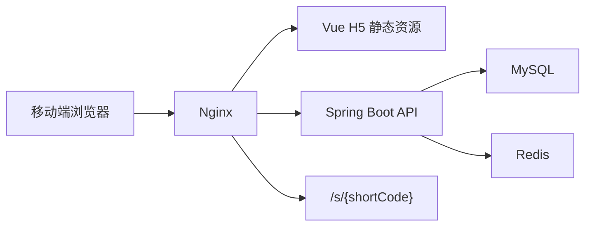
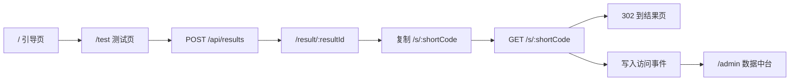

# 五行人格卡

五行人格卡是一个传统文化元素启发下的娱乐性人格测试 H5 微项目。第一版 MVP 的重点不是复杂测评，而是跑通一条真实业务闭环：

```text
匿名用户测算 -> 生成结果页 -> 生成专属短链接 -> 朋友访问短链 -> 后台看到 PV / UV / UIP
```

当前仓库状态：v0.2 已在 v0.1 MVP 闭环基础上完成短链接适配层升级。项目包含前端 H5、后端 API、可切换短链接 Provider、访问统计、后台数据页、Docker Compose 初版和配套文档。

## 在线地址

暂未部署。上线后在这里补充公网访问地址。

## 技术栈

| 层 | 技术 |
| --- | --- |
| 前端 | Vue 3、Vite、TypeScript、Vue Router |
| 后端 | Java 17、Spring Boot 3、Maven、MyBatis、MySQL、Redis |
| 部署 | Docker Compose、Nginx |
| 测试 | JUnit 5、Spring Boot Test、MockMvc、H2 |

## 项目结构

```text
.
├── AGENTS.md
├── README.md
├── docs/
├── frontend/
│   ├── package.json
│   ├── vite.config.ts
│   └── src/
│       ├── api/
│       ├── components/
│       ├── pages/
│       ├── router/
│       └── utils/
├── backend/
│   ├── pom.xml
│   ├── Dockerfile
│   └── src/main/
│       ├── java/com/wuxing/persona/
│       └── resources/db/schema.sql
└── deploy/
    ├── docker-compose.yml
    ├── nginx.Dockerfile
    ├── nginx.conf
    └── .env.example
```

## 项目架构图



## 核心流程图



## 已实现功能

- H5 页面：引导页、测试页、结果页、后台总览、短链访问详情、404。
- 结果生成：出生年月、可选日期和时段、5 道价值题、五行主副比例、星官、关键词和三段正向文案。
- 短链接：每个结果生成一个 6 位 Base62 短码，访问 `/s/{shortCode}` 后 302 跳回同一个结果页。
- 短链适配层：默认使用内置短链，也可通过配置切换到外部短链服务创建模式，外部失败时可降级到内置实现。
- Redis 缓存：结果详情缓存、短链解析缓存、无效短码空值缓存。
- 访问统计：匿名 clientId、IP、User-Agent 均 hash 后入库，统计 PV、UV、UIP。
- 数据中台：总览指标、热门组合、热门星官、最近结果、短链列表、单条短链访问日志。
- 管理保护：后台接口要求 `X-Admin-Token`。

## 短链接接入说明

v0.2 将短链模块拆成门面和 Provider：

```text
ResultService
  -> ShortLinkService
    -> ShortLinkProvider
      -> InternalShortLinkProvider
      -> ExternalShortLinkProvider
        -> ExternalShortLinkClient
```

默认 `internal` 模式仍然使用五行后端内置短链：

- `short_link` 表保存 `shortCode -> resultId -> shortUrl`。
- `GET /s/{shortCode}` 记录 `SHORT_LINK_VISIT`，更新短链 PV 和最近访问时间。
- 有效短码写入 Redis：`shortlink:code:{shortCode}`。
- 无效短码写入 Redis：`shortlink:null:{shortCode}`，降低重复无效请求对数据库的压力。

`external` 模式会优先调用已克隆的独立短链项目 `/Users/linyuxiang/JavaBackend/01_Projects/shortlink` 的创建接口，并将返回的 `fullShortUrl` 解析成本地业务绑定。外部服务不可用时，默认降级到内置短链，避免测算主流程中断。

切换配置：

```text
SHORT_LINK_MODE=external
SHORT_LINK_EXTERNAL_BASE_URL=http://shortlink:8003
SHORT_LINK_EXTERNAL_GROUP_ID=wuxing_persona
SHORT_LINK_EXTERNAL_FALLBACK_TO_INTERNAL=true
```

## 数据统计说明

- PV：符合条件的事件总数。
- UV：去重后的 `client_id_hash` 数量；缺少 clientId 时用 IP 和 User-Agent hash 兜底。
- UIP：去重后的 `ip_hash` 数量。

前端首次访问会生成 `wuxing_client_id` 写入 localStorage，并通过 `X-Client-Id` 传给后端。后端只保存 hash，不保存明文 IP。

## 数据库表说明

第一版表结构位于 `backend/src/main/resources/db/schema.sql`。

| 表 | 作用 |
| --- | --- |
| `user_result` | 保存一次测算结果、五行分数、星官、关键词和文案 |
| `short_link` | 保存短码、结果映射、短链接和访问计数 |
| `visit_event` | 保存页面访问、按钮点击、结果生成、短链访问等事件 |

## 本地启动方式

前端：

```bash
cd frontend
npm install
npm run dev
```

后端需要本地 MySQL 和 Redis，配置见 `backend/src/main/resources/application.yml`。启动：

```bash
cd backend
mvn spring-boot:run
```

健康检查：

```bash
curl http://localhost:8080/api/health
```

无 Docker 演示模式：

后端使用 H2 内存库启动，不要求本机 MySQL；Redis 不启动时缓存会降级，不影响主流程。

```bash
cd backend
APP_BASE_URL=http://127.0.0.1:4173 mvn spring-boot:run -Dspring-boot.run.profiles=local
```

前端使用生产预览：

```bash
cd frontend
npm run build
npm run preview -- --host 127.0.0.1 --port 4173
```

访问 `http://127.0.0.1:4173/`，本地后台 token 为 `dev-token`。

## Docker 部署方式

```bash
cp deploy/.env.example deploy/.env
docker compose --env-file deploy/.env -f deploy/docker-compose.yml up --build -d
```

Nginx 默认暴露 `80` 端口：

- H5：`http://localhost/`
- API：`http://localhost/api/**`
- 短链：`http://localhost/s/{shortCode}`
- 后台：`http://localhost/admin`

上线前必须替换 `deploy/.env` 中的 `APP_BASE_URL`、`ADMIN_TOKEN`、`HASH_SALT` 和数据库密码。

如果本机 Docker Hub 访问超时，可以临时通过环境变量切换基础镜像源，默认部署仍使用官方镜像：

```bash
APP_BASE_URL=http://localhost:8088 \
NGINX_HTTP_PORT=8088 \
BACKEND_MAVEN_IMAGE=docker.m.daocloud.io/library/maven:3.9.9-eclipse-temurin-17 \
BACKEND_RUNTIME_IMAGE=docker.m.daocloud.io/library/eclipse-temurin:17-jre \
FRONTEND_NODE_IMAGE=docker.m.daocloud.io/library/node:20-alpine \
FRONTEND_NGINX_IMAGE=docker.m.daocloud.io/library/nginx:1.27-alpine \
docker compose --env-file deploy/.env.example -f deploy/docker-compose.yml up --build -d
```

## 验证结果

已通过：

- `cd backend && mvn -q test`
- `cd frontend && npm run build`
- `docker compose --env-file deploy/.env.example -f deploy/docker-compose.yml config`
- Docker Compose 容器全链路验收：MySQL、Redis、backend、nginx 均启动成功，本机验证入口 `http://127.0.0.1:8088`
- 文案边界关键词扫描无命中
- 本地 H2 演示模式浏览器验收：首页、测试页、结果页、短链 302、后台总览、短链详情
- Docker 版 API 验收：健康检查、题目接口、创建结果、查询结果、短链 302、后台总览、短链列表、访问日志

后端测试覆盖：创建结果、查询结果、短链跳转、短链列表、访问详情、非法参数、非法事件、后台 token、无效短码、短链复用、短码冲突重试、空值缓存、短链统计计数更新、Redis key/TTL/序列化、异常降级、Provider 默认模式、Provider 配置切换、外部短链创建成功和失败降级。

浏览器验收截图：

- [结果页截图](docs/screenshots/local-result-page.png)
- [后台总览截图](docs/screenshots/local-admin-overview.png)
- [短链详情截图](docs/screenshots/local-shortlink-detail.png)
- [Docker 首页截图](docs/screenshots/docker-home-page.png)
- [Docker 结果页截图](docs/screenshots/docker-result-page.png)
- [Docker 后台 token 门禁截图](docs/screenshots/docker-admin-token-gate.png)
- [Docker 后台详情保护截图](docs/screenshots/docker-admin-detail-protected.png)

## MVP 功能边界

第一版只做单人测算、结果页、短链接、访问统计和数据中台。

第一版不做朋友匹配、登录注册、用户历史记录、社区、评论、点赞、关注、付费、AI 深度解读、复杂排盘、多套卡片模板、复杂图片编辑器、复杂后台权限系统和复杂 BI 大屏。

## 后续迭代计划

1. 启动独立短链服务，补齐 `ExternalShortLinkClient` 的真实联调和服务间鉴权。
2. 后台统计增强：从外部短链服务读取单条短链 PV/UV/UIP 和访问记录。
3. 管理后台增强：增加日期筛选、趋势图和短链详情聚合。
4. 部署完善：域名、HTTPS、Nginx Basic Auth 或更强后台保护。
5. 压测与观测：补充短链高频访问、无效短码攻击和 Redis 降级场景。

## 娱乐声明与隐私说明

本项目所有结果均为传统文化元素启发下的娱乐性人格解读，不构成现实决策建议。MVP 不做登录注册，不收集昵称和性别；出生日期与出生时段可选。访问统计只保存 hash 后的匿名标识，不保存明文 IP。
