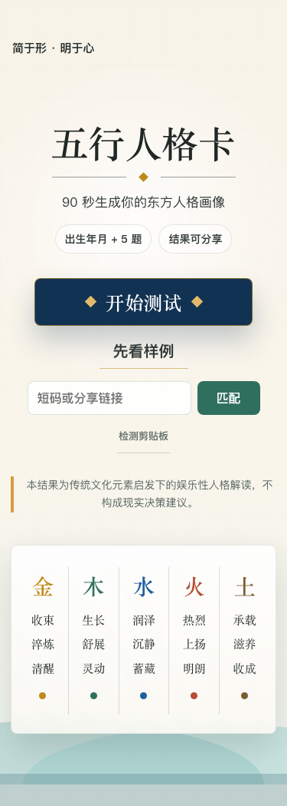
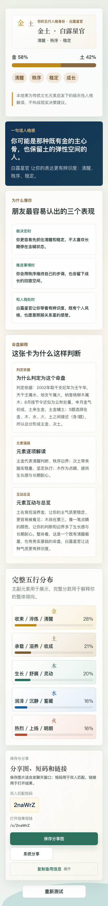
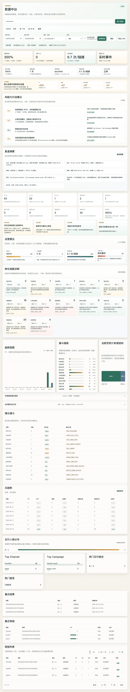
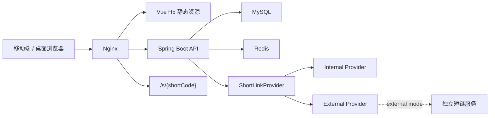
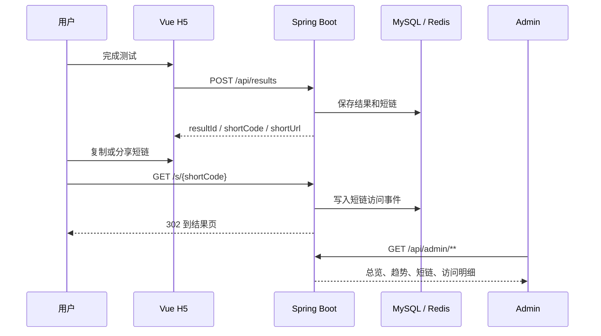

# 五行人格卡

五行人格卡是一个以传统五行元素为灵感的娱乐型人格测试 H5 全栈项目。它不是命理预测工具，而是围绕“用户完成测试、生成人格卡、分享短链、后台观察传播数据”构建的一套可演示、可联调、可部署的产品闭环。

```text
用户测试 -> 生成结果 -> 复制/分享短链 -> 好友打开 -> 访问事件入库 -> 后台分析 PV / UV / UIP
```

## 项目概览

| 项目 | 说明 |
| --- | --- |
| 产品定位 | 娱乐型人格测试、结果页分享、匿名访问统计和数据中台 |
| 当前状态 | 主流程、短链、后台、移动端体验、前后端联调和质量门禁已完成 |
| 技术栈 | Vue 3、Vite、TypeScript、Java 17、Spring Boot 3、MyBatis、MySQL、Redis、Docker Compose、Nginx |
| 核心场景 | H5 测试、结果卡、短链跳转、分享图、后台总览、短链详情、增长归因 |
| 质量策略 | 本地脚本、后端测试、前端构建、契约校验、浏览器截图校验、MySQL schema smoke、Docker Compose config |
| 隐私边界 | 不做登录注册；访问统计只保存 hash 后的 clientId、IP、User-Agent |

## 核心能力

- **用户端 H5**：首页引导、出生信息、逐题卡片式问答、结果页、分享页、匹配页和 404 状态。
- **人格结果生成**：结合出生信息和 5 道价值题生成五行比例、主副元素、星官、关键词和正向解读文案。
- **短链接闭环**：每个结果生成 6 位 Base62 短码，访问 `/s/{shortCode}` 后跳转到对应结果页。
- **可切换短链实现**：默认内置短链，也可配置 external 模式对接独立短链服务；外部失败时可降级。
- **匿名访问统计**：记录页面访问、测试提交、分享行为、短链访问等事件，支持 PV、UV、UIP 和渠道归因。
- **后台数据中台**：总览、趋势、漏斗、热门组合、最近结果、短链列表、访问明细、CSV 导出和运行态状态。
- **前后端联调硬化**：API DTO、错误处理、CORS、admin token、短链代理、分享来源参数和移动端 E2E 均有校验。
- **上线辅助脚本**：部署预检、Docker smoke、external 短链 smoke、性能 smoke、备份恢复、回滚和域名绑定预检。

## 界面预览

| H5 首页 | 结果页 | 数据中台 |
| --- | --- | --- |
|  |  |  |

更多截图见 [docs/screenshots/showcase](docs/screenshots/showcase)。

## 快速导航

| 分类 | 入口 |
| --- | --- |
| 产品与学习 | [从零学习手册](docs/wuxing-from-zero-learning-manual.md)、[项目学习文档](docs/project-learning-guide-v1.md)、[人格评判标准](docs/wuxing-persona-standard-v1.md)、[人格样稿](docs/persona-description-samples-v1.md) |
| 接口与数据 | [API 说明](docs/api-spec.md)、[数据库说明](docs/db-schema.md)、[数据中台手册](docs/admin-data-center-guide.md)、[指标字典](docs/admin-metric-dictionary.md) |
| 联调与上线 | [本地预览 Runbook](docs/local-preview-runbook.md)、[生产运维 Runbook](docs/production-operations-runbook.md)、[external 短链对接](docs/external-shortlink-integration-guide.md)、[真实域名上线自审](docs/domain-launch-self-audit.md) |
| 质量与证据 | [前端 QA 记录 2026-06-19](docs/frontend-qa-record-20260619.md)、[CI 浏览器 E2E 方案](docs/ci-browser-e2e-plan.md)、[质量评分](docs/quality-scorecard.md)、[压测报告索引](docs/performance-reports/README.md) |
| 展示材料 | [项目宣传包](docs/project-promotion-kit.md)、[项目展示 PPT 资产包](docs/artifacts/presentations/README.md)、[压测视觉简报](docs/performance-visual-brief.md) |

## 系统架构




## 核心流程



## 目录结构

```text
.
├── frontend/                 # Vue 3 H5 和后台前端
├── backend/                  # Spring Boot API、MyBatis、schema 和测试
├── deploy/                   # Docker Compose、Nginx、环境样例
├── docs/                     # 产品、接口、联调、上线、性能和学习文档
├── docs-site/                # 可直接打开的静态文档站
├── docs/screenshots/         # Showcase 截图证据
├── design-final/             # 最终设计参考图
├── scripts/                  # 质量门、部署预检、smoke、E2E、性能脚本
└── README.md
```

## 本地启动

推荐本地联调用 H2 演示库启动后端，不要求本机先准备 MySQL。Redis 不启动时缓存会降级，不影响主流程。

后端：

```bash
cd backend
SERVER_PORT=48081 \
APP_BASE_URL=http://127.0.0.1:5175 \
ADMIN_TOKEN=dev-token \
mvn spring-boot:run -Dspring-boot.run.profiles=local
```

前端：

```bash
cd frontend
npm install
BACKEND_PROXY_TARGET=http://127.0.0.1:48081 npm run dev -- --host 127.0.0.1 --port 5175
```

常用入口：

| 页面 | 地址 |
| --- | --- |
| H5 首页 | `http://127.0.0.1:5175/` |
| 测试页 | `http://127.0.0.1:5175/test` |
| 后台 | `http://127.0.0.1:5175/admin` |
| 健康检查 | `http://127.0.0.1:48081/api/health` |

本地短链和代理校验：

```bash
FRONTEND_URL=http://127.0.0.1:5175 \
BACKEND_URL=http://127.0.0.1:48081 \
ADMIN_TOKEN=dev-token \
scripts/local-preview-smoke-test.sh
```

## Docker 部署

```bash
cp deploy/.env.example deploy/.env
scripts/deploy-preflight.sh deploy/.env
docker compose --env-file deploy/.env -f deploy/docker-compose.yml up --build -d
```

默认入口：

- H5：`http://localhost/`
- API：`http://localhost/api/**`
- 短链：`http://localhost/s/{shortCode}`
- 后台：`http://localhost/admin`

上线前必须替换 `APP_BASE_URL`、`ADMIN_TOKEN`、`HASH_SALT`、MySQL 密码等占位值。

external 短链模式：

```bash
cp deploy/.env.external.example deploy/.env.external
scripts/deploy-preflight.sh deploy/.env.external
scripts/external-shortlink-preflight.sh deploy/.env.external
docker compose --env-file deploy/.env.external \
  -f deploy/docker-compose.yml \
  -f deploy/docker-compose.external-mode.yml \
  up --build -d
```

## 关键接口

| 能力 | 接口 |
| --- | --- |
| 健康检查 | `GET /api/health` |
| 题目配置 | `GET /api/questions` |
| 创建结果 | `POST /api/results` |
| 查询结果 | `GET /api/results/{resultId}` |
| 访问事件 | `POST /api/events` |
| 短链跳转 | `GET /s/{shortCode}` |
| 后台总览 | `GET /api/admin/overview` |
| 短链列表 | `GET /api/admin/short-links` |
| 短链访问明细 | `GET /api/admin/short-links/{shortCode}/visits` |
| 手动聚合 | `POST /api/admin/analytics/aggregate` |

后台接口需要 `X-Admin-Token`。完整请求体、响应字段和错误码见 [docs/api-spec.md](docs/api-spec.md)。

## 数据与隐私

- `user_result` 保存一次测算结果、五行分数、星官、关键词和文案。
- `short_link` 保存短码、结果映射、短链接、访问计数和统计来源。
- `visit_event` 保存访问、点击、提交、分享、短链访问等匿名事件。
- `site_daily_metric` 和 `short_link_daily_metric` 支持历史日聚合，降低后台实时聚合压力。
- clientId、sessionId、IP、User-Agent 入库前会 hash；Referer 会去掉 query 和 fragment。
- 本项目结果仅用于娱乐表达，不构成现实决策建议。

## 质量门禁

合并前推荐执行完整质量门：

```bash
env REQUIRE_TRACKED_QUALITY_SCRIPTS=1 scripts/quality-check.sh
```

该脚本覆盖：

- `git diff --check`
- 质量脚本跟踪状态检查
- Bash 脚本语法检查
- 构建产物未被 Git 跟踪检查
- 用户可见文案边界扫描
- 后端 Maven 测试
- 前端 production build
- 前端 API / UI / E2E 契约校验
- 静态预览 flow 校验和浏览器截图校验
- 新 MySQL schema smoke
- internal / external Docker Compose config

常用专项验证：

```bash
npm --prefix frontend run build
mvn -q -f backend/pom.xml test
node scripts/verify-frontend-contracts.mjs
scripts/mobile-e2e.sh
scripts/capture-showcase-screenshots.sh
scripts/docker-smoke-test.sh
scripts/performance-smoke-test.sh
```

移动端 E2E 和 showcase 截图默认只应对本地地址运行。若要对公网地址写入测试数据，需要在明确授权的测试窗口内设置 `ALLOW_PUBLIC_E2E=1`。

## 当前交付状态

- 前端主要页面已完成统一视觉、移动端排版、结果页纯文字五行标识、分享图和后台移动端适配。
- 前后端接口已覆盖主流程、短链、后台、错误处理、CORS 和 admin token 场景。
- external 短链、RocketMQ 访问事件发布、生产压测和域名上线均已有设计与脚本入口。
- 最近一次完整门禁已通过：`env REQUIRE_TRACKED_QUALITY_SCRIPTS=1 scripts/quality-check.sh`。
- 本地 `outputs/` 下的预览和调试文件是开发产物，不作为仓库交付内容。

## 开发日志

<details>
<summary><strong>2026-06-19｜前端交付与联调加固</strong></summary>

- 重做 H5 首页、测试页、结果页、分享页、匹配页、404 和后台关键页面的视觉与移动端排版。
- 结果页和分享图移除弱简笔画元素，改用更稳定的文字化五行标识。
- 补齐 CORS、API 契约、admin 移动端短链卡片、分享降级、短链来源参数和错误状态校验。
- 新增 `verify-frontend-contracts.mjs`、`verify-wuxing-browser.mjs`、`verify-eight-hour-artifacts.sh` 等严格校验脚本。
- 更新 `docs/frontend-qa-record-20260619.md`、showcase 截图、性能报告和上线 runbook。

</details>

<details>
<summary><strong>2026-06-11｜v2.0-v2.6 产品化与 H5 体验升级</strong></summary>

- v2.0 将项目目标从“功能可用”升级为“愿意测、感觉被看见、愿意分享、朋友继续测”的传播闭环。
- v2.1 增加 session、channel、campaign、device、eventDate 等增长归因字段。
- v2.2-v2.4 增加日聚合、生产 smoke、备份恢复、回滚、限流、安全头和分享体验增强。
- v2.5 优化出生信息输入，使用年份滑杆、快捷年份和移动端触控卡片。
- v2.6 将问答改为逐题卡片式流程，支持年份微调、手动输入和选项稳定打散。

</details>

<details>
<summary><strong>2026-06-09 至 2026-06-10｜v0.1-v1.4 工程基线</strong></summary>

- v0.1 完成 H5、结果生成、内置短链、访问统计、Redis 和 Docker Compose MVP。
- v0.2-v0.5 完成短链 Provider 适配层、external 短链创建、统计读取和访问明细接入。
- v0.6-v1.0 建立质量门、稳定版 README、发布检查表、开发规范和教学手册。
- v1.1 完成 external 生产级接入样例、预检脚本、联调脚本和隐私审计。
- v1.2-v1.4 增加 GitHub Actions、Docker smoke、后台筛选导出、安全响应头、Testcontainers 和分享图。

</details>

<details>
<summary><strong>2026-06-08｜项目初始化</strong></summary>

- 初始化 `frontend/`、`backend/`、`docs/`、`deploy/` 和 `scripts/`。
- 明确第一版只做单人测算、结果页、短链接、访问统计和数据中台。
- 评估独立短链系统，确定 v0.1 先内置短链，后续再服务化接入 external 模式。

</details>

## 功能边界

已完成范围：单人测试、结果页、分享短链、访问统计、后台数据中台、本地联调和单机部署。

暂不内置：登录注册、用户历史、社区评论、点赞关注、付费、AI 深度解读、复杂排盘、多模板卡片编辑器、复杂权限系统和 BI 大屏。若要加入这些能力，应作为独立产品迭代设计。

## 许可与声明

本项目用于学习、演示和娱乐型产品原型表达。人格解读文案不构成医学、法律、投资、职业或现实决策建议。生产部署前请根据实际域名、隐私政策、数据保留周期和安全要求补齐合规说明。
