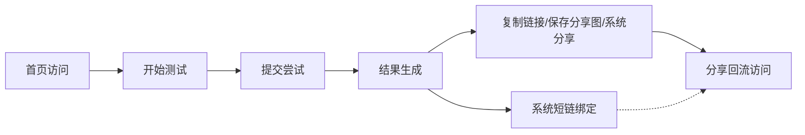

# 数据中台指标字典 v1

## 定位

这份指标字典配合 `/admin` 桌面端数据中台使用。目标是让每个数字都能回答三个问题：

- 它来自哪里。
- 它说明什么业务现象。
- 它什么时候容易被误读。

## 阅读顺序

先判断口径，再判断链路，最后才进入明细。不要一打开页面就盯某一个短链或某一天的 PV。

## 核心指标字典

| 指标 | 页面位置 | 事实来源 | 说明什么 | 误读风险 |
| --- | --- | --- | --- | --- |
| `totalPv` | 关键指标、趋势 | `visit_event` 或日聚合 | 总访问量，用于判断整体流量规模 | 压测、刷新、内部验收都会放大 PV |
| `totalUv` | 关键指标 | `client_id_hash` 去重 | 近似用户数，用于判断访问人数 | 匿名 clientId 换浏览器或清缓存会变化 |
| `totalUip` | 关键指标 | `ip_hash` 去重 | 近似独立网络来源 | 公司/校园网多人共用出口会低估 |
| `homeViews` | 漏斗 | 首页访问事件 | 首页曝光和入口承接 | 直接访问结果页不会进入这个指标 |
| `startClicks` | 运营诊断、漏斗 | 开始测试事件 | 首页是否成功把用户带进测试 | 用户直接进入测试页会让分母偏低 |
| `testSubmits` | 漏斗 | 提交尝试事件 | 用户是否完成答题并提交 | 提交失败也可能被记入尝试，需要看结果数 |
| `resultCreated` | 关键指标、趋势 | `user_result` 或事件 | 真实结果生成量 | 接口直调或压测会让完成率异常 |
| `shortLinkCreated` | 关键指标、传播 | `short_link` | 系统为结果绑定了多少短码 | 自动生成不等于用户主动分享，不能单独当作分享率 |
| `shortLinkVisits` | 关键指标、传播 | `SHORT_LINK_VISIT` | 系统短链 `/s/{code}` 被打开的回流次数 | 压测、自己反复点同一链接会放大；是否来自朋友传播要结合真实分享动作、IP/设备和渠道判断 |
| `shareExposure` | 运营诊断、漏斗 | `SHARE_PANEL_VIEW` | 结果页分享区曝光次数 | 当前是组件展示即记录，不代表用户主动打开分享面板 |
| `shareActions` | 运营诊断、漏斗 | `SHORT_LINK_COPY` / `SAVE_SHARE_IMAGE_SUCCESS` / `NATIVE_SHARE_SUCCESS` | 用户真实触发了复制链接、保存分享图或系统分享 | 浏览器权限失败、用户截图转发等行为可能无法完全记录 |
| `completionRate` | 运营诊断 | `resultCreated / startClicks` | 从开始测试到结果生成的粗略完成率 | 超过 100% 时先排除压测、直达、补数 |
| `metricSource` | 数据口径、短链列表 | `live_event` / `daily_metric` / `mixed` / `external` | 当前数字来自实时明细、日聚合或外部短链 | 不同口径不能直接横向比较 |
| `syntheticTrafficExcluded` | 过滤栏、口径差异 | `visit_event.channel=perf-test` 过滤 | 默认是否按事件 channel 排除压测和巡检流量 | 只隔离已正确打标的事件流量，不是实体层强隔离 |
| `syntheticIsolationLevel` | 数据口径、风险建议 | 后端 overview 固定说明 | 当前测试流量隔离属于 `event_channel` 还是全量口径 | 不能把 `event_channel` 讲成 `user_result` / `short_link` 强隔离 |

## 运营诊断卡

| 卡片 | 正常看法 | 需要警惕 |
| --- | --- | --- |
| 完成判断 | 完成率稳定，结果生成数和开始点击量同向变化 | 完成率突然超过 `100%`，通常不是“体验太好”，而是口径异常 |
| 分享判断 | 真实分享动作跟结果生成量同向增长 | 结果多但分享动作少，说明结果页分享动机或入口弱 |
| 回流判断 | 每条系统短链平均访问次数增长，说明短链有回流热度 | 回流强度极高时先看是否压测、内部验收或单链接重复打开 |
| 数据口径 | 默认真实口径，必要时打开测试流量复盘工程验证 | 把 `live_event` 和 `daily_metric` 数字混在一起讲结论 |

## 风险与行动建议

风险建议是规则合成层，不是独立数据源。它把以下信号转成可执行的优先级：

| 建议来源 | 使用字段 | 典型提示 | 解释方式 |
| --- | --- | --- | --- |
| 访问事件运行态 | `healthStatus`、`queueSize`、`droppedAsyncEvents`、`batchWriteFailures` | `P0` 或 `P1` | 先保证数据能可靠写入，再解释运营数据 |
| 完成链路 | `completionRate`、`startClicks`、`resultCreated` | 完成率超过 `100%` 或偏低 | 判断是否压测/直调，或答题链路有掉点 |
| 分享链路 | `shareExposure`、`shareActions` | 分享区有曝光但真实分享动作不足 | 结果页内容或按钮交互需要优化 |
| 回流链路 | `shortLinkVisits / shortLinkCreated` | 回流强度异常偏高 | 先排除压测、验收和同一链接反复打开 |
| 外部短链 | `externalMode`、`reachable`、`fallbackToInternal` | 外部短链不可达 | 判断是否已安全降级到内部短链 |

面试表达时可以说：这里不是用模型猜结论，而是把低层指标组合成“先修可信度、再看体验、最后看渠道”的运营处理队列。

## 运营雷达

运营雷达也是规则合成层，不是后端新增指标。页面把已有 overview 派生成四个 0-100 观察值：

| 雷达项 | 计算依据 | 说明 | 误读风险 |
| --- | --- | --- | --- |
| 完成力 | `completionRate`，超过 `100%` 时强制转关注 | 衡量从开始测试到结果生成的顺畅度 | 高于 `100%` 不是优秀，而是口径异常 |
| 分享意愿 | 真实分享动作 / 结果生成 | 衡量结果页是否促成用户主动分享 | 系统短链自动生成不能算分享意愿 |
| 回流热度 | `shortLinkVisits / shortLinkCreated` | 衡量每条短链平均带来的访问 | 过高时可能是压测、内部验收或重复打开 |
| 口径可信 | `metricSource`、`includeSynthetic`、测试增量、完成率异常 | 衡量当前口径是否适合直接汇报 | 它不是审计结论，只是运营看板的可信度提示 |

雷达项适合做第一眼判断；正式复盘时仍应引用原始指标和明细表。

## 转化链路诊断

转化链路诊断也是前端解释层。它不新增字段，而是基于 `funnelSteps` 的顺序计算相邻两步之间的保留率和流失数：

| 派生项 | 计算方式 | 说明 | 误读风险 |
| --- | --- | --- | --- |
| 保留率 | 当前步骤次数 / 上一步次数 | 判断从上一步到当前步骤保留了多少用户行为 | 不是用户级 cohort，只是事件次数相邻比 |
| 流失数 | 上一步次数 - 当前步骤次数 | 快速定位哪一段掉点最大 | 当后一步高于前一步时会显示倒挂，需要先校准口径 |
| 诊断说明 | 根据保留率、倒挂情况生成规则文案 | 帮运营优先判断入口、答题、提交、结果或分享哪段最该处理 | 规则只做提示，不能替代日志、接口错误和真实用户访谈 |

面试表达时可以说：这个模块把漏斗从“展示数据”推进到“辅助判断”，但仍然保持可解释规则，不引入黑盒模型。

## 趋势视图

趋势视图适合回答“什么时候变好或变坏”，不适合单独回答“为什么”。

| 观察形态 | 优先判断 |
| --- | --- |
| PV 涨，结果不涨 | 首页吸引、测试入口、提交接口或移动端体验可能有问题 |
| 结果涨，分享动作不涨 | 结果页共鸣、分享按钮位置、分享话术可能需要调整 |
| 分享动作不涨，短链访问涨 | 旧链接持续传播，或单个链接被反复打开 |
| 全部同时暴涨 | 先检查是否打开了 `includeSynthetic` 或刚跑过压测 |

## 漏斗指标

图里的虚线表示：系统短链提供可访问地址，但只有复制、保存、系统分享等真实动作，才更接近用户主动传播。

| 阶段 | 说明 | 常见问题 |
| --- | --- | --- |
| 首页访问 -> 开始测试 | 首页承诺是否清楚，CTA 是否可见 | 首屏信息太散、用户不知道测完能得到什么 |
| 开始测试 -> 提交尝试 | 答题过程是否顺畅 | 题卡太长、底部按钮挡内容、年份月份选择困难 |
| 提交尝试 -> 结果生成 | 后端生成是否稳定 | 参数校验失败、接口报错、重复提交被挡 |
| 结果生成 -> 分享动作 | 用户是否愿意分享 | 文案共鸣不足、分享入口不明显 |
| 分享动作 -> 回流访问 | 分享是否产生传播 | 链接打不开、备案/域名限制、朋友页引导弱 |

## 来源与口径

| 字段 | 当前作用 | 适合回答的问题 |
| --- | --- | --- |
| `channel` | 入口渠道，例如自然访问、分享、压测 | 哪个入口带来了真实访问 |
| `campaign` | 活动或压测批次 | 哪次投放或压测造成了数据变化 |
| `statSource=local` | 五行项目本地统计 | 站内短链和本地事件明细是否健康 |
| `statSource=external` | 外部短链服务统计 | 第三方短链平台返回的 PV/UV/UIP |
| `includeSynthetic` | 是否包含 `perf-test` | 日常运营与压测复盘切换 |

`statSource` 属于计算后的来源：后台会先取短链，再判断这一条短链是否有外部平台统计可用。为避免大量数据后漏算，来源筛选会跨完整日期范围分页扫描，而不是只看最近一小段；但因为它可能触发外部统计探测，仍建议作为运营排查工具使用，不当作长周期 BI 报表。

### 测试流量隔离边界

当前默认视图通过 `visit_event.channel=perf-test` 排除压测和巡检流量。它能保护日常看板不被压测污染，但仍属于事件查询层隔离。后端会返回 `syntheticIsolationLevel=event_channel` 和对应说明，用来提醒页面和面试表达不要把它说成实体层强隔离。

下一阶段如果要更严密，应把来源下沉到实体层：

- `user_result.synthetic`
- `short_link.synthetic`
- 日聚合按 `organic` 和 `all` 分口径存储

详细设计见 [`synthetic-traffic-isolation-design.md`](synthetic-traffic-isolation-design.md)。

## 运行态指标

| 字段 | 说明 | 正常解读 | 风险信号 |
| --- | --- | --- | --- |
| `queueSize` | 本地事件队列积压 | 短时间波动可接受 | 持续接近 `queueCapacity` |
| `droppedAsyncEvents` | 队列满后丢弃数 | 应长期为 `0` | 持续增加代表统计丢失 |
| `totalFlushedEvents` | 后台写库成功数 | 随访问增加而上升 | 不增长且有新访问，说明 worker 或写库异常 |
| `batchWriteFailures` | 批量写失败次数 | 应长期为 `0` | 增加时查 DB 连接、SQL、表结构 |
| `asyncMode` | `local` 或 `rocketmq` | 默认 `local` 最稳 | `rocketmq` 下要看 fallback 和 shadow |
| `rocketMqPublishFailures` | MQ 发布失败 | shadow 期可被本地队列兜底 | 如果 consumer 接管后增加，需要立即告警 |
| `rocketMqFallbackEvents` | MQ 失败回退本地 | 表明降级正在生效 | 突增说明 MQ 不稳定 |
| `healthStatus` | 后端综合判断 | `ok` 可继续看业务 | `watch` 或 `danger` 先排障再解读运营数据 |

## 异常诊断矩阵

| 现象 | 第一步 | 第二步 | 第三步 |
| --- | --- | --- | --- |
| 完成率超过 `100%` | 看“包含测试流量”是否开启 | 看 `口径差异` 是否有结果增量 | 查是否存在接口直调或历史结果补录 |
| PV 高但结果少 | 看漏斗中开始测试是否低 | 检查首页 CTA 和测试入口 | 查提交接口错误和移动端按钮遮挡 |
| 结果多但分享少 | 看分享区曝光、复制链接、保存分享图和系统分享 | 检查结果文案共鸣和分享入口 | 对比不同人格结果的真实分享动作 |
| 短链访问高但回流低 | 看朋友打开页是否有“我也要测”入口 | 查域名/备案/HTTPS 是否稳定 | 看渠道是否来自内部验收或压测 |
| 后台突然变慢 | 看 `metricSource` 是否回退到 `live_event` | 看日期范围是否过长 | 查 DB 慢查询、索引和 overview 缓存 |
| 压测后数据很怪 | 默认关闭测试流量 | 打开测试流量对比增量 | 对照 `X-Perf-Run-Id` 和压测报告 |

## 面试表达模板

> 数据中台的设计不是把所有数字堆在一个页面，而是围绕“完成、真实分享动作、系统短链回流热度、运行态”四条线做观察。日常默认排除 `perf-test`，避免压测污染运营判断；需要复盘压测时再打开全量口径。统计来源会标出 `live_event`、`daily_metric` 或 `external`，因为实时明细适合今天和排障，日聚合适合历史复盘，外部统计适合第三方短链接入。运行态面板则用队列、丢弃、批量写失败和 RocketMQ shadow 指标证明统计链路是否健康。

不要这样说：

- 不说“PV 就代表用户数”，要区分 PV、UV、UIP。
- 不说“后台数字强一致”，要说运营统计最终一致。
- 不说“已完整 BI 化”，要说目前是围绕传播闭环的运营工作台第一版。
- 不说“测试流量完全隔离”，要说当前默认视图隔离，实体层隔离是下一阶段。
