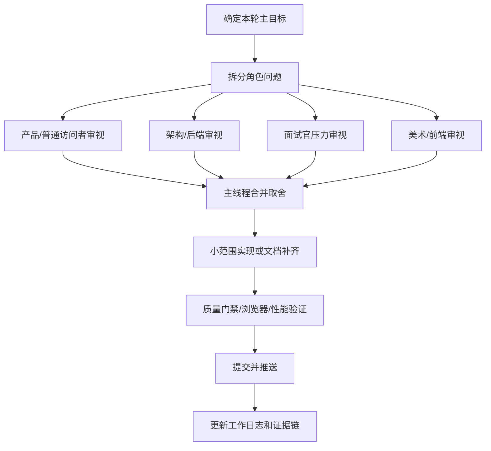

# 八小时工作流角色 Agent 编排

本文档用于指导后续持续开发：主线程负责做最终取舍、集成和提交；角色 agent 负责并行审视，不直接替代主线程判断。

## 1. 工作原则

1. 每轮只推进一个主目标，例如“移动端答题更自然”或“短链跳转更稳”。
2. 角色 agent 做侧向审视，主线程负责合并建议、改代码、跑验证、提交。
3. 代码改动要有明确写入边界，避免多个 agent 同时改同一组文件。
4. 对外宣传只说已验证的内容；未压测、未演练、未截图归档的部分要写成下一步。

## 2. 角色池

| 角色 | 核心任务 | 常看文件 | 典型输出 |
| --- | --- | --- | --- |
| 产品经理 | 判断用户动机、完成率、分享闭环 | `frontend/src/pages`、`docs/project-promotion-kit.md` | 优先级、用户场景、转化卡点 |
| 普通访问者 | 模拟第一次访问和移动端使用 | 首页、测试页、结果页、分享入口 | 看不懂、点不动、不想分享的具体原因 |
| 美术经理 | 判断品牌质感和截图传播力 | `frontend/src/style.css`、`docs/assets`、宣传包 | 配色、层级、截图分镜建议 |
| 前端开发 | 检查响应式、状态反馈、可访问性 | Vue 组件、CSS、e2e 脚本 | 可实现的交互修复和浏览器验证点 |
| 资深架构师 | 检查热路径、缓存、降级、扩展性 | service、mapper、schema、部署文档 | 高峰值风险、扩展路线、压测指标 |
| 后端开发 | 检查 Spring Boot 分层、事务、测试 | controller、service、mapper、test | 具体代码风险和测试补点 |
| 大厂面试官 | 追问真实性、取舍、边界和证据 | README、质量评分、学习手册、工作日志 | 高压追问、薄弱点、回答证据 |

## 3. 每轮执行节奏

## 4. 八小时建议排期

| 时段 | 主线程任务 | 并行 agent 任务 | 产物 |
| --- | --- | --- | --- |
| 0-1 小时 | 对齐仓库、目标、质量门禁 | 产品/普通访问者找交互卡点 | 优先级清单 |
| 1-3 小时 | 修最影响完成率的交互问题 | 美术/前端检查移动端和截图质感 | 前端小提交、浏览器证据 |
| 3-5 小时 | 修短链和统计热路径风险 | 架构/后端检查缓存、索引、降级 | 后端小提交、测试证据 |
| 5-6 小时 | 跑完整质量门禁和局部性能验证 | 面试官准备追问清单 | 验证记录 |
| 6-7 小时 | 补宣传包、架构图、学习手册 | 角色复核材料是否能讲清 | 文档提交 |
| 7-8 小时 | 最终审计、推送、总结 | 面试官复盘薄弱点 | 完成度审计和下一步 |

## 5. 主线程拍板标准

| 类型 | 立即做 | 进入 backlog | 暂不做 |
| --- | --- | --- | --- |
| 用户体验 | 影响首次完成、分享、错误恢复 | 轻微视觉偏好 | 新增大业务玩法 |
| 后端性能 | 影响短链跳转、统计查询、数据写入稳定性 | 需要线上数据才能判断 | 空泛中间件堆叠 |
| 宣传材料 | 能直接支撑作品集和 README | 需要真实截图后完善 | 夸大生产能力 |
| 面试学习 | 能解释核心链路和取舍 | 深入源码拓展题 | 背诵式八股堆砌 |

## 6. 当前编排状态

2026-06-12 八小时持续工作流已启动。本轮主线程先完成生产压测与告警 Runbook 的提交，再把角色 agent 拆成只读审视任务，避免并行改同一批文件。

本轮已启动：

- 产品经理 + 普通访问者审视：找下一轮交互优化优先级，重点看首次访问、答题动力、分享动机和文案口语化。
- 前端交互审视：找移动端答题、结果页、分享组件和后台操作的交互断点。
- 美术经理审视：看 showcase 页面、截图墙和前台视觉是否有足够五行气质与可信产品感。
- 资深架构师 + 后端性能审视：找下一轮抗峰值和低延迟优化优先级，重点看短链热路径、异步事件、缓存、索引和告警证据。
- 大厂面试官审视：找项目介绍、后端架构、前端工程化和性能表述里最容易被打穿的点。

主线程承担：

- 最终集成、验证、提交和推送。
- 合并角色建议，选择小范围高价值改动。
- 保持宣传口径诚实：已验证的写进 README 和作品集，未验证的进入 runbook 或 backlog。

## 7. 本轮实时角色分配

| 角色 | 工作方式 | 本轮输入 | 交付物 |
| --- | --- | --- | --- |
| 主线程 | 本地执行、集成、提交 | `main`、质量门禁、GitHub 推送 | 小提交、验证记录、工作日志 |
| 产品经理 | 只读审查 | README、docs-site、前端页面 | 用户动机和优先级建议 |
| 普通访问者 | 只读审查 | showcase 截图、测试页、结果页 | 首访困惑点和口语化文案建议 |
| 前端开发 | 只读审查 | Vue 页面、组件、CSS、E2E | 可落地交互修复与验证点 |
| 美术经理 | 只读审查 | showcase 页面、截图墙、视觉资产 | 展示页和宣传视觉建议 |
| 资深架构师 | 只读审查 | backend、deploy、performance smoke、runbook | 高峰值风险和架构演进建议 |
| 大厂面试官 | 只读审查 | README、学习手册、后端核心代码 | 高压追问和证据补强建议 |

## 8. 八小时运行节奏

| 时间盒 | 主线程动作 | 角色输入怎么用 | 验收 |
| --- | --- | --- | --- |
| 0-30 分钟 | 确认 Git 状态、推送已有文档、启动角色审查 | 只收敛任务，不做大改 | `git status -sb` 干净，远端 SHA 确认 |
| 30-90 分钟 | 合并角色建议，选 1 个 UX 小切口和 1 个后端证据小切口 | 只做影响完成率或可讲述证据的项 | 有明确文件边界和回滚面 |
| 90-240 分钟 | 小步实现并验证 | 前端建议用浏览器/截图验证，后端建议用测试或 smoke 验证 | `scripts/quality-check.sh` 通过 |
| 240-360 分钟 | 补作品集和学习材料 | 美术和面试官建议转成宣传页、学习手册或追问清单 | README 可导航，文档能直接讲 |
| 360-480 分钟 | 最终审计、推送、列残余风险 | 普通用户和面试官建议进入完成度审计 | 不夸大生产能力，下一步清楚 |
