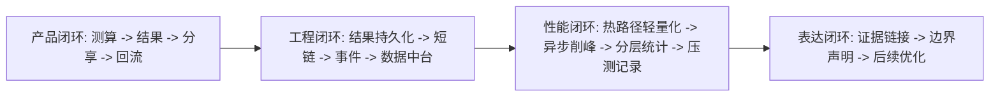
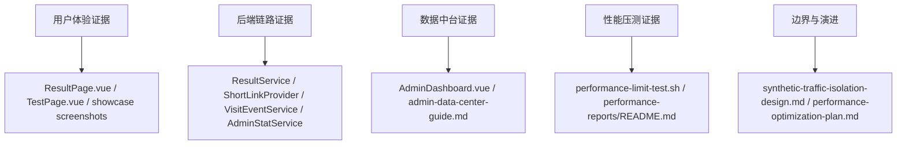
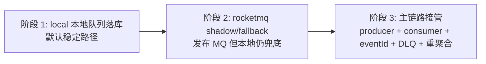

# 五行人格项目展示 PPT 讲稿 v1

## 使用定位

这份文档配合 [`wuxing-persona-project-showcase.pptx`](wuxing-persona-project-showcase.pptx) 使用，重点不是复述幻灯片文字，而是帮助讲清楚：

- 这个项目解决了什么产品问题。
- 为什么它不是一个静态 H5 Demo。
- 哪些后端设计支撑了分享、统计和低延迟。
- 压测证据能证明什么，又不能证明什么。
- 面试官追问时应该怎样诚实表达边界。

## 5 分钟讲解主线

建议开场：

> 我这个项目做的是一个五行人格测试 H5，但重点不只是生成一段人格文案，而是把“用户完成测试、生成结果、复制分享链接、朋友回流、后台看到数据”做成真实闭环。前端侧关注移动端答题和结果共鸣，后端侧重点是短链低延迟、访问事件异步写入、统计口径隔离和可复现压测记录。

## 讲解证据链

讲的时候要始终把“功能、证据、边界”放在一起。能验证的地方就指向脚本、测试和截图；还没有完成生产化的地方，要明确说成下一阶段方案。

## 逐页讲稿

### 1. 项目定位：90 秒生成可分享人格卡

**核心说法**：项目不是命理预测，而是一个正向、娱乐化、可分享的人格测试产品原型。

**怎么讲**：先用普通用户语言讲清楚：用户不登录，填出生年月和 5 道题，拿到人格卡，然后可以复制分享链接。再补一句工程价值：这个分享链接不是假按钮，而是真实短码和访问统计。

**证据位置**：

- [`README.md`](../../../README.md)
- [`docs/project-promotion-kit.md`](../../project-promotion-kit.md)
- [`frontend/src/pages/GuidePage.vue`](../../../frontend/src/pages/GuidePage.vue)

**不要夸大**：不说“算命很准”，只说“传统文化意象启发下的娱乐人格表达”。

**可能追问**：为什么选择五行，而不是 MBTI？

**回答角度**：五行更适合做轻量、视觉化、正向表达；项目核心是产品闭环和工程实现，不是证明人格理论科学性。

### 2. 传播闭环：进入、完成、生成、分享、回流

**核心说法**：项目的主流程是一条可被数据观察的传播循环。

**怎么讲**：按“我测一次 -> 生成结果 -> 发给朋友 -> 朋友打开 -> 后台看到回流”讲，不要先讲数据库表。这里要强调分享后的朋友回流能被统计到，这是从页面 Demo 进入业务闭环的关键。

**证据位置**：

- [`frontend/src/pages/ResultPage.vue`](../../../frontend/src/pages/ResultPage.vue)
- [`backend/src/main/java/com/wuxing/persona/service/ResultService.java`](../../../backend/src/main/java/com/wuxing/persona/service/ResultService.java)
- [`backend/src/main/java/com/wuxing/persona/service/VisitEventService.java`](../../../backend/src/main/java/com/wuxing/persona/service/VisitEventService.java)

**不要夸大**：当前是匿名传播闭环，不是完整用户增长系统；没有登录、好友关系和留存 cohort。

**可能追问**：没有登录，怎么做 UV？

**回答角度**：用匿名 clientId、IP hash、User-Agent hash 做运营统计，够支撑 MVP 数据观察，同时减少隐私采集。

### 3. 卡片式问答降低移动端理解成本

**核心说法**：移动端答题体验从表单变成一题一张卡，降低视觉负担。

**怎么讲**：强调用户每次只做一个选择，底部操作区承担上一题和下一题，减少一屏内信息密度。这个点适合给普通用户或产品面试官讲。

**证据位置**：

- [`frontend/src/pages/TestPage.vue`](../../../frontend/src/pages/TestPage.vue)
- [`frontend/src/components/QuestionCard.vue`](../../../frontend/src/components/QuestionCard.vue)
- [`docs/screenshots/showcase/`](../../screenshots/showcase)

**不要夸大**：还没有真实用户 AB 实验，只能说是基于移动端可用性原则和本地多视口验证。

**可能追问**：为什么去掉自动下一题？

**回答角度**：自动前进虽然快，但用户容易怀疑自己点错；显式下一题让节奏更可控，尤其适合人格测试这种需要确认选择的场景。

### 4. 结果页承接共鸣、解释和分享

**核心说法**：结果页不是只展示一句文案，而是承担共鸣、解释、保存和分享。

**怎么讲**：先讲用户看到身份名、关键词、主副五行和共鸣卡，再讲复制分享链接、系统分享、保存分享图。这里要突出“为什么像你”的解释，能提升分享动机。

**证据位置**：

- [`frontend/src/pages/ResultPage.vue`](../../../frontend/src/pages/ResultPage.vue)
- [`frontend/src/utils/shareCard.ts`](../../../frontend/src/utils/shareCard.ts)
- [`docs/persona-description-samples-v1.md`](../../persona-description-samples-v1.md)

**不要夸大**：描述文案仍然需要真实用户持续调校；当前版本是第一版正向人格表达。

**可能追问**：人格描述怎么避免空泛？

**回答角度**：结果文案按“判定依据、元素解释、元素互动、总体评价”组织，并把出生时间和五题回答纳入说明，让用户知道结论从哪里来。

### 5. 后端把测算变成可持久化结果资产

**核心说法**：一次测算会落成结果记录、分享链接和访问事件，而不是只存在前端内存里。

**怎么讲**：这页开始切到工程视角：`ResultService` 生成结果并保存，短链服务绑定结果，访问事件记录用户关键动作。强调结果可以被再次打开、分享和统计。

**证据位置**：

- [`backend/src/main/java/com/wuxing/persona/service/ResultService.java`](../../../backend/src/main/java/com/wuxing/persona/service/ResultService.java)
- [`backend/src/main/java/com/wuxing/persona/service/ResultTextService.java`](../../../backend/src/main/java/com/wuxing/persona/service/ResultTextService.java)
- [`docs/db-schema.md`](../../db-schema.md)

**不要夸大**：当前不是复杂账号资产系统，没有用户中心、权限分层和付费体系。

**可能追问**：为什么不直接前端生成结果？

**回答角度**：前端生成无法保证分享链接可重复访问，也无法沉淀统计和后台运营数据；后端持久化让结果成为可传播资产。

### 6. 部署架构：Nginx、Spring Boot、MySQL、Redis

**核心说法**：项目以单机 Docker Compose 为当前交付形态，保留生产演进路径。

**怎么讲**：用“入口层、应用层、数据层、缓存层”讲架构。Nginx 管静态资源和转发，Spring Boot 管业务接口，MySQL 保存结果和事件，Redis 做结果、短码和空值缓存。

**证据位置**：

- [`deploy/docker-compose.yml`](../../../deploy/docker-compose.yml)
- [`docs/deploy.md`](../../deploy.md)
- [`docs/domain-server-runbook.md`](../../domain-server-runbook.md)

**不要夸大**：腾讯云域名访问受备案影响，生产压测需要备案和授权后再跑；本地和公网链路不能混为一个结论。

**可能追问**：为什么单机，而不是一上来上 Kubernetes？

**回答角度**：项目阶段更适合先把单机可部署、可回滚、可观测做好；K8s 解决的是更后面的编排问题，不能替代业务链路设计。

### 7. 短链热路径低延迟设计

**核心说法**：短链跳转是传播链路最关键的热路径，必须轻、快、可降级。

**怎么讲**：讲 `/s/{shortCode}` 时只做短码解析、事件入队、低频展示字段更新和 302 跳转；不要在跳转请求里做 PV/UV distinct 聚合。Redis 命中时减少 MySQL 回源。

**证据位置**：

- [`backend/src/main/java/com/wuxing/persona/service/shortlink/InternalShortLinkProvider.java`](../../../backend/src/main/java/com/wuxing/persona/service/shortlink/InternalShortLinkProvider.java)
- [`backend/src/main/java/com/wuxing/persona/service/VisitEventService.java`](../../../backend/src/main/java/com/wuxing/persona/service/VisitEventService.java)
- [`docs/interview-learning-manual.md`](../../interview-learning-manual.md)

**不要夸大**：当前访问事件队列是单机削峰，RocketMQ 仍是可选 shadow/fallback 方案，还不是完整生产 consumer 接管。

**可能追问**：事件异步后丢了怎么办？

**回答角度**：统计是低价值运营数据，允许最终一致；但项目暴露队列水位、丢弃数和批量写失败，压测脚本也会记录这些指标，避免“接口很快但统计坏了”的假象。

### 8. 数据中台把传播效果变成可观察证据

**核心说法**：后台不是给开发者看表，而是帮助判断完成、分享和回流在哪里出问题。

**怎么讲**：讲四组数据：完成链路、真实分享动作、渠道归因、运行态健康。这里要特别区分：系统短链生成代表结果具备可访问地址，不等于用户主动分享；复制链接、保存分享图、系统分享这些动作才更接近真实分享意愿。当前默认排除 `perf-test`，并有“口径差异”诊断带对比真实口径和包含测试流量的增量。新版桌面中台还增加了“运营雷达”和“转化链路诊断”：前者把完成力、分享意愿、回流热度和口径可信压成 0-100 观察值，后者用相邻步骤保留率、流失数和倒挂提示定位断点。最新版本又补了证据索引、复盘摘要、刷新时间、日趋势环比、短链列表分页和短链详情分页，所以运营人员可以先确认口径，再从风险建议直接定位到证据区块，最后把带刷新时间的摘要复制到复盘材料里。

**证据位置**：

- [`frontend/src/pages/AdminDashboard.vue`](../../../frontend/src/pages/AdminDashboard.vue)
- [`backend/src/main/java/com/wuxing/persona/service/AdminStatService.java`](../../../backend/src/main/java/com/wuxing/persona/service/AdminStatService.java)
- [`docs/admin-data-center-guide.md`](../../admin-data-center-guide.md)
- [`docs/admin-metric-dictionary.md`](../../admin-metric-dictionary.md)

**不要夸大**：它是运营数据中台第一版，不是完整 BI；复杂 cohort、留存、转化分群还没做。

**可能追问**：为什么默认排除压测流量？

**回答角度**：压测会集中造 PV、结果和短链，如果混在默认看板会误导运营判断；所以默认看真实口径，复盘压测时再打开全量口径。新版压测脚本还会把 `RUN_ID` 追加到 Campaign，方便后台按批次对照报告。

### 9. 统计模型：live_event + daily_metric 分层

**核心说法**：实时明细负责今天和排障，日聚合负责历史复盘，避免所有后台查询都扫明细。

**怎么讲**：用一句话讲 tradeoff：今天的数据需要实时，历史数据需要轻查询。后台根据日期范围选择 `live_event`、`daily_metric` 或混合口径，并在页面展示 metricSource。

这页可以补一个工程细节：后台不是只靠缓存遮住慢查询。overview 有 45 秒短缓存，但手动日聚合成功后会递增缓存版本，让下一次读取直接切到新口径。默认排除 `perf-test` 时，结果和短链会通过 `visit_event` 创建事件反查，所以补了 `result_id + event_type + channel` 组合索引；短链列表批量统计 PV/UV/UIP 时，补了 `event_type + short_code + created_at + channel` 组合索引，避免分页列表退化成 N+1 或大范围扫描。

**证据位置**：

- [`backend/src/main/java/com/wuxing/persona/mapper/VisitEventMapper.java`](../../../backend/src/main/java/com/wuxing/persona/mapper/VisitEventMapper.java)
- [`backend/src/main/java/com/wuxing/persona/service/AdminStatService.java`](../../../backend/src/main/java/com/wuxing/persona/service/AdminStatService.java)
- [`docs/api-spec.md`](../../api-spec.md)

**不要夸大**：当前默认排除测试流量时会更多依赖实时事件，因为历史聚合表还是全量口径；实体层隔离是下一阶段。

**可能追问**：为什么不所有数据都实时算？

**回答角度**：实时 distinct 和分组在数据增长后会拖慢后台；日聚合把历史查询成本前移，后台打开时只读轻量结果。

### 10. 隐私与安全边界

**核心说法**：MVP 阶段主动减少个人信息采集，并把后台作为受保护的内部页面。

**怎么讲**：强调不登录、不收集昵称性别，clientId/IP/User-Agent hash 后用于统计；后台用 `X-Admin-Token` 保护敏感接口。安全上要诚实说这是 MVP 管理边界，不是完整 RBAC。

**证据位置**：

- [`backend/src/main/java/com/wuxing/persona/controller/AdminController.java`](../../../backend/src/main/java/com/wuxing/persona/controller/AdminController.java)
- [`docs/external-shortlink-privacy-audit.md`](../../external-shortlink-privacy-audit.md)
- [`docs/big-tech-interviewer-qa.md`](../../big-tech-interviewer-qa.md)

**不要夸大**：不说已经具备企业级权限系统；后续应补登录、角色、审计日志和操作留痕。

**可能追问**：hash 后就完全安全吗？

**回答角度**：hash 是最小化展示和降低泄露风险，不是万能匿名化；生产还需要盐值管理、日志脱敏、访问控制和数据生命周期。

### 11. 本地阶梯压测记录与边界

**核心说法**：压测记录证明了方法和本地拐点，不等于生产承诺。

**怎么讲**：第一句先讲边界：这是 `localhost + Spring Boot + H2 + 本地异步队列` 的方法验证，不是生产 QPS 承诺。第 11 页右上角的金色戳就是防误读提醒。再说脚本能按 workload 分别压 health、shortlink、result、admin、mixed；报告保存 CSV、summary 和 Markdown。现有本地报告显示配置并发阶梯 512、256 请求样本未触发错误率和队列边界，配置并发阶梯 768 时 P95 触达边界；当前代码又补了新版小阶梯回归：mixed 1-32 最高 P95 104ms，admin 1-64 最高 P95 216ms，result 1-64 最高 P95 112ms，shortlink 1-64 最高 P95 185ms。真实服务器必须在备案、授权和环境卡片完整后重新压测。这里还要补一句：512/768 是 legacy mixed 本地 H2 样本，新版脚本目前验证的是环境卡片、readiness、Location 校验、runtime stop gate 和 public safety gates，不能把新版脚本能力反推到旧容量报告。

**证据位置**：

- [`scripts/performance-limit-test.sh`](../../../scripts/performance-limit-test.sh)
- [`docs/performance-visual-brief.md`](../../performance-visual-brief.md)
- [`docs/performance-reports/README.md`](../../performance-reports/README.md)
- [`docs/performance-load-test-record-20260614.md`](../../performance-load-test-record-20260614.md)

**不要夸大**：不说“服务器能抗 768 并发”；要说“本地单机配置并发阶梯 768 时出现延迟边界，真实服务器需重新压测”。

**可能追问**：怎么判断极限？

**回答角度**：看 P95、错误率、状态码、队列水位、批量写失败和服务端日志；平均响应时间不是主要判断指标。

### 12. 后续优化路线

**核心说法**：后续优化分成真实部署压测、热路径保护、统计分层、测试流量强隔离、RocketMQ 接管五条线。

**怎么讲**：按优先级讲，不要把所有未来规划混在一起。P0 是真实链路压测和短链热路径保护；P1 是实体层 synthetic 字段、日聚合口径维度，以及 RocketMQ 从可选异步通道演进到完整消费链路所需的 producer、consumer、eventId 幂等、DLQ、失败重放和重聚合。

**RocketMQ 三阶段图**：

讲图时只说“当前具备阶段 1 和阶段 2 的可选/观察能力，阶段 3 仍是后续建设目标”。不要把 shadow/fallback 说成完整削峰接管。

**证据位置**：

- [`docs/performance-optimization-plan.md`](../../performance-optimization-plan.md)
- [`docs/synthetic-traffic-isolation-design.md`](../../synthetic-traffic-isolation-design.md)
- [`docs/rocketmq-visit-event-design.md`](../../rocketmq-visit-event-design.md)

**不要夸大**：RocketMQ 是可选接入点，不是已经完整生产接管；公网压测也必须等备案、授权和安全边界确认。

**可能追问**：如果下一步只能做一件事，做什么？

**回答角度**：先做真实部署链路的授权压测和环境卡片化报告。没有真实链路数据，就不能确定瓶颈在 Nginx、Tomcat、DB、Redis、网络还是应用逻辑。

## 面试收束话术

可以这样结束：

> 这个项目我最想展示的是“产品体验和后端工程不是分开的”。用户侧看到的是轻量人格卡和分享链接；后端侧支撑的是结果持久化、短链热路径、异步访问事件、数据中台和压测证据。当前我对边界也比较明确：本地压测不是生产结论，RocketMQ 还处在可选 shadow/fallback 阶段，测试流量隔离也需要下一步下沉到实体层。这些边界反而是我后续优化路线的依据。

## 快速自检清单

每次拿这套 PPT 展示前，先检查：

- PPT 能打开，12 页总览图能显示。
- 数据中台截图不是手机窄版，而是桌面运营面板。
- 压测报告索引能说明“本地方法”和“生产边界”的区别。
- 讲到 RocketMQ 时使用“可选接入 / shadow / fallback / consumer 接管”四个词，不说已经完整生产削峰。
- 讲到域名时说明当前受备案和授权条件限制，不把临时访问状态说成稳定线上服务。
