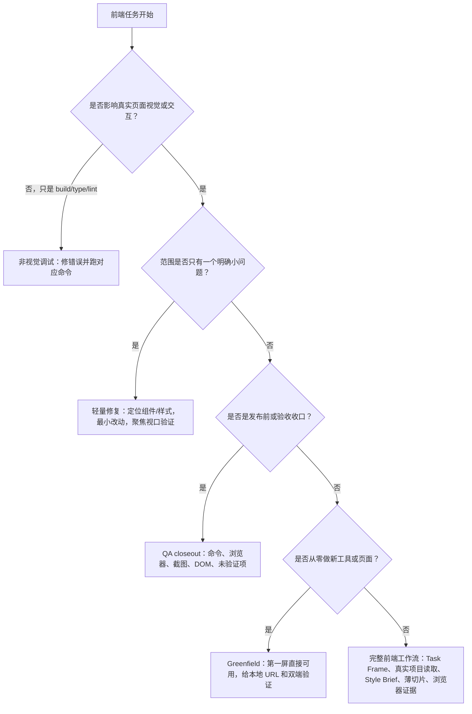

# Codex 前端真实任务样例库

记录日期：2026-06-22
关联 skill：`codex-frontend-workflow`
用途：以后在 webcoding 或 Codex 里快速发起真实前端任务，避免每次从空白 prompt 开始。

## 使用原则

- 复制一个最接近的样例。
- 填清楚页面、用户场景、视觉方向、必须保留项和验收证据。
- 小修走轻量路径，主流程改造走完整路径。
- 视觉/交互任务没有浏览器、截图、DOM 或 E2E 的真实页面证据前，不说视觉完成；QA 记录只能承载证据，不能单独替代页面验收。

## 快速决策树



分流后再选择下面的样例，不要把所有任务都塞进完整流程。

## 样例 1：结果页和分享区产品化

```text
请使用 codex-frontend-workflow skill，并遵守 Codex Webcoding 前端协议。

项目：五行人格卡
目标：优化 `/result/:resultId` 结果页和分享区
用户场景：手机用户完成测算后，希望先确认“我是什么人格”，再保存或分享给朋友
视觉效果：克制中式数据感，身份先被看见，分享区像产品能力，不像调试工具
必须保留：`/result/:resultId` 路由、短链参数、channel/campaign 归因、shareCard.ts 900x1200 输出、E2E/testid
验收：frontend build、verify-frontend-contracts、mobile-e2e、showcase screenshots、QA 记录、visual QA scorecard 硬门禁和 20 分评分

请先输出 Task Frame、要读取的真实文件、视觉方向和第一片最小可验收改造。
```

先读文件：

- `frontend/src/pages/ResultPage.vue`
- `frontend/src/components/PersonaCard.vue`
- `frontend/src/components/ElementRatioCard.vue`
- `frontend/src/components/ShareLinkBox.vue`
- `frontend/src/utils/shareCard.ts`
- `docs/frontend-visual-system.md`
- `docs/frontend-workflow-playbook.md`

验收重点：

- 移动端首屏身份信息清楚。
- 五行比例用于解释，不抢主身份。
- 分享回流页不出现二次分享盒。
- 分享图尺寸和内容不被破坏。

## 样例 2：测试页移动端答题体验

```text
请使用 codex-frontend-workflow skill。

项目：五行人格卡
目标：优化 `/test` 逐题问答体验
用户场景：手机用户在碎片时间答题，必须知道当前进度、已选答案和下一步
视觉效果：一屏一任务，低压迫，触控舒适，选中反馈明确
必须保留：题目 API、选项字段、进度逻辑、E2E 锚点、结果生成链路
验收：build、verify-frontend-contracts、mobile-e2e、iPhone SE/390 宽 DOM 检查、QA 记录、visual QA scorecard 硬门禁和 20 分评分

请先读 TestPage、QuestionCard、style.css 和 mobile E2E，再给第一片改造。
```

验收重点：

- 主按钮和选项触控目标接近或大于 44px。
- 选中态和禁用态清楚。
- 长题干不遮挡下一题入口。
- 没有横向溢出。

## 样例 3：后台短链详情移动端治理

```text
请使用 codex-frontend-workflow skill，并按运营工具方式优化。

项目：五行人格卡
目标：优化 `/admin/short-links/:shortCode` 在移动端的访问明细
用户场景：运营者在手机上查看来源、referer、campaign、访问时间和统计口径
视觉效果：高密度但可扫描，长文本不撑破布局，少装饰
必须保留：includeSynthetic、statSource、perf-test 口径、分页、导出、admin token 行为
验收：build、contract、desktop screenshot、mobile DOM overflow、console/network、QA 记录、visual QA scorecard 硬门禁和 20 分评分

请先读 AdminShortLinkDetail、API wrapper、contract 脚本和现有 QA，再给桌面/移动双布局计划。
```

验收重点：

- 桌面端保留运营效率。
- 移动端不依赖横向滚动承载主信息。
- referer/campaign/shortUrl 有明确换行、截断或展开策略。
- 统计口径和 synthetic 状态不被隐藏。

## 样例 4：截图参考还原

```text
请使用 codex-frontend-workflow skill。

项目：五行人格卡
目标：让 [页面/组件] 向这张参考截图靠齐
参考：[截图路径或描述]
用户场景：[普通用户/后台运营者] 在 [设备] 上完成 [任务]
必须保留：现有路由、接口、字段、testid、E2E 和统计口径
验收：before/after screenshot、desktop/mobile、DOM overflow、build、QA 记录、visual QA scorecard 硬门禁和 20 分评分

请先抽取截图的层级、密度、色彩角色和组件规则，不要机械照抄。
```

验收重点：

- 说明参考图哪些约束被采用。
- 说明哪些内容因五行项目业务状态需要调整。
- 长文本、空态、错误态和移动端都要复核。

## 样例 5：小型视觉修复

```text
请使用 codex-frontend-workflow skill，但这是小修，不要展开完整流程。

项目：五行人格卡
问题：[按钮溢出/文字重叠/触控目标不足/长文本撑破]
目标页面或组件：[路由/文件]
验收视口：[iPhone SE / 390x844 / desktop]
要求：最小改动，保留接口和 E2E，跑聚焦浏览器或 DOM 检查。
```

Codex 应该做：

- 定位目标组件和样式。
- 只改必要规则。
- 给出聚焦验证，不写长篇流程。

## 样例 6：前端 QA 收口

```text
请使用 codex-frontend-workflow skill 做五行人格卡前端 QA closeout。

范围：[页面/链路/本轮改动]
必须覆盖：
- `npm --prefix frontend run build`
- `node scripts/verify-frontend-contracts.mjs`
- `scripts/mobile-e2e.sh` 或说明为什么不适用
- `scripts/capture-showcase-screenshots.sh` 或目标截图
- 桌面和移动端浏览器
- DOM 横向溢出、触控目标、文字重叠
- console/network
- `docs/frontend-qa-record-YYYYMMDD.md`

不要把未跑过的检查写成已通过。
```

最终输出必须区分：

- 已验证。
- 未验证。
- 环境阻塞。
- 不适用。
- 残余风险。

## 样例 7：真实 UI 改造最终验收话术

```text
请按 codex-frontend-workflow 做最终验收。

本轮是视觉/交互任务，所以 QA 记录不能单独替代页面证据。
最终回复必须列出：
- build/typecheck/contract/E2E 的命令和结果
- desktop/mobile browser 证据
- screenshots 或 DOM overflow/touch target/text overlap 检查
- console/network 检查
- QA record 路径
- 未验证项、环境阻塞和残余风险

请同时使用 `custom-skills/codex-frontend-workflow/templates/frontend-visual-qa-scorecard.md` 做硬门禁和 20 分评分。

如果没有真实页面浏览器、截图、DOM 或 E2E 证据，请明确说“视觉未完成验收”，不要把 build 或 QA 记录写成视觉通过。
```

## 样例 8：文档/Skill 工作流最终验收话术

```text
请按 codex-frontend-workflow 对本轮文档/skill 工作流做最终验收。

本轮不修改真实 H5 页面，所以不要声明页面视觉已验证。
最终回复必须列出：
- skill source 与 installed copy diff
- .skill package verifier 和 SHA
- artifact manifest
- JSON parse / trigger eval / benchmark
- README/docs-site 入口
- Wuxing workflow docs verifier
- final completion audit 状态
- 未到至少 N 小时时不能 complete
- 真实页面视觉未验证或不适用的说明

可直接运行的最小命令块，从 workspace 根目录逐条运行：
- `node custom-skills/codex-frontend-workflow-workspace/verify_frontend_workflow_assets.mjs`
- `node custom-skills/codex-frontend-workflow-workspace/verify_artifact_manifest.mjs`
- `node custom-skills/codex-frontend-workflow-workspace/verify_skill_package.mjs`
- `node custom-skills/codex-frontend-workflow-workspace/verify_wuxing_frontend_workflow_docs.mjs`
- `node custom-skills/codex-frontend-workflow-workspace/run_release_readiness_check.mjs`
- `node custom-skills/codex-frontend-workflow-workspace/run_requirement_completion_audit.mjs`
- `node custom-skills/codex-frontend-workflow-workspace/run_final_completion_audit.mjs`
- `node custom-skills/codex-frontend-workflow-workspace/run_ordered_closeout_check.mjs`
- `node custom-skills/codex-frontend-workflow-workspace/run_frontend_workflow_doctor.mjs`
- `node custom-skills/codex-frontend-workflow-workspace/verify_frontend_workflow_doctor.mjs`

当前十小时窗口内，`run_release_readiness_check.mjs` 预期是 `not_ready`，`run_final_completion_audit.mjs` 预期是 `active_timebox_not_complete`，`run_ordered_closeout_check.mjs` 预期是 `phase_closeout_passed_not_ready`。十小时结束后才允许期待本地 `complete_ready`；只有 Git 可见性也解除时才允许称为 `release_ready`。
```

## 多 Agent 样例

大任务可这样拆：

| Agent | 只负责 | 不负责 |
| --- | --- | --- |
| Context | 读路由、页面、API、E2E、QA 文档，输出保留项。 | 改代码。 |
| Visual | 输出 style brief、token、组件规则和反目标。 | 改业务逻辑。 |
| Page | 按第一片改页面和局部样式。 | 改验收脚本或无关页面。 |
| Contract | 跑 build、contract、E2E、截图、DOM。 | 重写视觉方向。 |
| Docs | 写 QA 记录和最终交付说明。 | 夸大未验证项。 |

小修不要拆 agent。

决策表：

| 任务形状 | 是否拆 agent | 顺序 | 交接物 | 验收 owner |
| --- | --- | --- | --- | --- |
| 小型视觉修复 | 不拆 | 主 agent 定位、修复、聚焦验证 | diff + 单视口证据 | 主 agent |
| 单页视觉改造 | 视复杂度拆 | Context -> Visual -> Page -> Contract -> Docs | Task Frame、Style Brief、改动文件、QA record | Contract |
| 后台/数据密集页 | 建议拆 | Context -> Visual/信息架构 -> Page -> Contract -> Docs | 字段口径、密度规则、桌面/移动截图、DOM 记录 | Contract |
| API 联动前端 | 建议拆 | Context -> Integration -> Page -> Contract -> Docs | API/端口/环境记录、smoke 结果 | Integration + Contract |
| 文档/skill/release readiness | 可拆审稿 | 主 agent -> Review agents -> 主 agent 整合 -> Audit | review findings、报告路径、open items | 主 agent |
