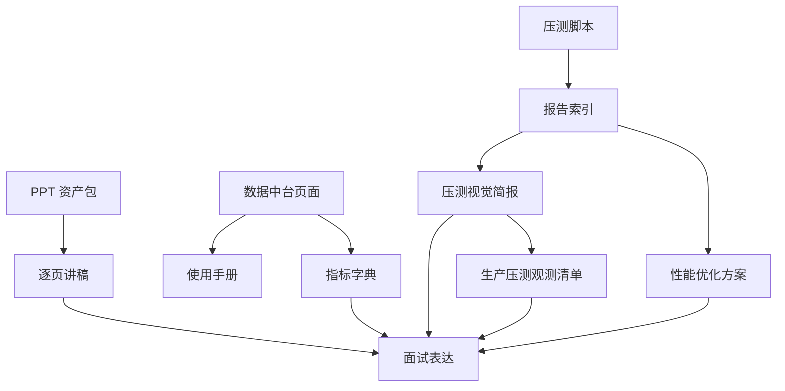

# 八小时性能与展示工作流交付索引

记录日期：2026-06-14

## 一句话结论

本轮工作流围绕三个核心产出推进：专业展示 PPT、桌面数据中台解释体系、压测记录与后续性能优化方案。当前最重要的成果不是“又堆了几个文档”，而是把项目的产品故事、工程证据、压测边界和面试表达接成了一个可追溯的交付包。

## 最终自检入口

| 先看什么 | 入口 | 你能确认什么 |
| --- | --- | --- |
| 一页式交付索引 | 本文档 | PPT、数据中台、压测报告、优化方案和面试材料分别在哪里 |
| PPT 成品 | [`docs/artifacts/presentations/wuxing-persona-project-showcase.pptx`](artifacts/presentations/wuxing-persona-project-showcase.pptx) | 12 页项目展示材料是否能直接打开演示 |
| PPT 总览图 | [`docs/artifacts/presentations/contact-sheet.png`](artifacts/presentations/contact-sheet.png) | 整套 PPT 的视觉节奏和截图是否完整 |
| 展示截图 | [`docs/screenshots/showcase/`](screenshots/showcase/) | 手机端、Android 宽屏和电脑端数据中台截图是否完整 |
| 数据中台 | `http://127.0.0.1:5175/admin` | 电脑端运营面板、证据索引、复盘摘要、短链追查是否可用 |
| 压测证据 | [`docs/performance-reports/README.md`](performance-reports/README.md) | 12 份本地报告、legacy/新版脚本、smoke/limit 的边界是否清楚 |
| 后续优化 | [`docs/performance-optimization-plan.md`](performance-optimization-plan.md) | 后续性能优化应该按什么顺序做、每一步看什么证据 |

## 交付总览

| 方向 | 产物 | 怎么看 | 当前边界 |
| --- | --- | --- | --- |
| 项目展示 PPT | [`docs/artifacts/presentations/README.md`](artifacts/presentations/README.md) | 打开 PPT、总览图、源码和构建清单 | PPT 已有 12 页资产，但后续仍可继续美化视觉 |
| PPT 逐页讲稿 | [`docs/artifacts/presentations/wuxing-showcase-speaker-notes.md`](artifacts/presentations/wuxing-showcase-speaker-notes.md) | 按 5 分钟主线或逐页讲解 | 讲稿强调证据和边界，不替代现场演练 |
| 数据中台使用 | [`docs/admin-data-center-guide.md`](admin-data-center-guide.md) | 看每日怎么读数据、怎么区分口径、怎么按风险建议排序处理 | 数据中台仍是运营工作台第一版，不是完整 BI |
| 指标定义 | [`docs/admin-metric-dictionary.md`](admin-metric-dictionary.md) | 查每个指标来源、用途和误读风险 | 当前测试流量隔离仍是事件视图层隔离 |
| 压测报告索引 | [`docs/performance-reports/README.md`](performance-reports/README.md) | 看历史压测报告、停止原因和下一轮顺序 | 本地报告不能当生产 QPS 结论 |
| 压测视觉简报 | [`docs/performance-visual-brief.md`](performance-visual-brief.md) | 用图表和讲解话术串起 512/768 配置阶梯、证据链和下一轮公网矩阵 | 它解释现有报告，不新增生产容量结论 |
| 生产压测观测清单 | [`docs/production-load-observability-checklist.md`](production-load-observability-checklist.md) | 公网压测前按授权、采集、冷却、停止条件逐项准备 | 只是一份执行清单，不代表已经跑过公网压测 |
| 本地预览 smoke | [`docs/local-preview-runbook.md`](local-preview-runbook.md) | 验证 `APP_BASE_URL`、前端 `/s/{code}` 代理、后台 runtime 和短链跳转 | 只用于本地/授权预览，不替代生产 smoke |
| 交付物完整性门禁 | [`scripts/verify-eight-hour-artifacts.sh`](../scripts/verify-eight-hour-artifacts.sh) | 检查 PPT、contact sheet、压测报告、优化方案和数据中台文档是否仍在位 | 只验证交付物存在与基础结构，不替代人工内容审校 |
| 新版报告格式验证 | [`docs/performance-reports/workflow-health-env-card/report.md`](performance-reports/workflow-health-env-card/report.md) | 看环境卡片、Run ID、synthetic 标记 | 这是 health 小流量格式验证，不是业务链路压测 |
| 短链 Location 验证 | [`docs/performance-reports/workflow-shortlink-location-verify/report.md`](performance-reports/workflow-shortlink-location-verify/report.md) | 看 302 是否带 `Location`，CSV 是否保存跳转目标 | 这是脚本正确性验证，不是容量结论 |
| 当前 mixed 回归报告 | [`docs/performance-reports/workflow-mixed-current-sanity/report.md`](performance-reports/workflow-mixed-current-sanity/report.md) | 看新版脚本在短链、结果、后台、health 混合链路上的环境卡片和分接口 P95 | 这是本机 H2 小阶梯回归，不是生产容量结论 |
| 当前 admin 单路径报告 | [`docs/performance-reports/workflow-admin-current-sanity/report.md`](performance-reports/workflow-admin-current-sanity/report.md) | 看后台 overview 查询在本机 1-64 小阶梯下的 P95、错误率和 runtime 风险 | 这是本机 H2 后台查询回归，不是公网后台容量 |
| 当前 result 单路径报告 | [`docs/performance-reports/workflow-result-current-sanity/report.md`](performance-reports/workflow-result-current-sanity/report.md) | 看结果读取接口在本机 1-64 小阶梯下的 P95、错误率和访问事件 runtime | 这是本机 H2 结果页读取回归，不是公网结果页容量 |
| 当前 shortlink 单路径报告 | [`docs/performance-reports/workflow-shortlink-current-sanity/report.md`](performance-reports/workflow-shortlink-current-sanity/report.md) | 看短链 302 热路径在本机 1-64 小阶梯下的 P95、错误率、Location 和 runtime 风险 | 这是本机 H2 短链回归，不是公网短链容量 |
| 压测记录说明 | [`docs/performance-load-test-record-20260614.md`](performance-load-test-record-20260614.md) | 看 512/768 配置阶梯边界和解释图 | 环境是本地单机 H2，不是公网 MySQL/Nginx |
| 后续优化方案 | [`docs/performance-optimization-plan.md`](performance-optimization-plan.md) | 按“从报告到行动”表判断下一步 | 调参前必须先定位瓶颈来源 |

## 按目的找成果

| 你现在想做什么 | 先打开 | 再看 | 判断标准 |
| --- | --- | --- | --- |
| 想快速看这次八小时到底交付了什么 | 本文档 | [`docs/codex-worklog.md`](codex-worklog.md) | 能从 PPT、数据中台、压测、优化方案四条线复述成果 |
| 想展示项目亮点 | [`docs/artifacts/presentations/README.md`](artifacts/presentations/README.md) | [`docs/artifacts/presentations/wuxing-showcase-speaker-notes.md`](artifacts/presentations/wuxing-showcase-speaker-notes.md) | PPT 能打开，讲稿能在 5 分钟内讲清产品、工程、性能和边界 |
| 想实际看数据中台 | `http://127.0.0.1:5175/admin` | [`docs/admin-data-center-guide.md`](admin-data-center-guide.md) / [`docs/admin-metric-dictionary.md`](admin-metric-dictionary.md) | 默认关闭“包含测试流量”，能解释完成、分享、回流和运行态 |
| 想复盘压测证据 | [`docs/performance-reports/README.md`](performance-reports/README.md) | [`docs/performance-visual-brief.md`](performance-visual-brief.md) | 能区分 legacy 本地 H2 样本、新版脚本格式验证和未来公网重测 |
| 想准备面试表达 | [`docs/interview-learning-manual.md`](interview-learning-manual.md) | [`docs/big-tech-interviewer-qa.md`](big-tech-interviewer-qa.md) | 讲得出“为什么这样设计”，也讲得出“现在还没做到什么” |
| 想继续做性能优化 | [`docs/performance-optimization-plan.md`](performance-optimization-plan.md) | [`docs/production-load-observability-checklist.md`](production-load-observability-checklist.md) | 每次优化只改一个变量，压测报告能前后对照 |

## 本地复测入口

当前这轮验证使用前端 `5175` + 后端 `48082` 的组合；如果你后续按默认脚本重新启动后端，端口可能回到 `48081`，复测命令里请以实际运行端口为准。复测时先确认两个服务仍在运行，再按目标选择命令。

```bash
# 1. 检查本地预览、短链代理和后台 runtime
FRONTEND_URL=http://127.0.0.1:5175 \
BACKEND_URL=http://127.0.0.1:48082 \
ADMIN_TOKEN=dev-token \
scripts/local-preview-smoke-test.sh

# 2. 检查八小时交付物是否仍完整
scripts/verify-eight-hour-artifacts.sh

# 3. 跑完整质量门禁
scripts/quality-check.sh
```

如果只想验证新版压测脚本格式，可以跑极小样本，不要把它当容量结论：

```bash
BASE_URL=http://127.0.0.1:48082 \
ADMIN_TOKEN=dev-token \
WORKLOAD=health \
STEPS=1,2 \
REQUESTS_PER_STAGE=12 \
RUN_ID=manual-health-format-check \
scripts/performance-limit-test.sh
```

公网压测必须等备案、授权、生产观测和停止条件齐全后再跑；脚本默认拒绝非本机目标，避免误伤线上服务。

## 成果关系图



## 当前可展示主线

1. 产品主线：90 秒完成五行人格测试，生成可分享结果页。
2. 工程主线：结果持久化、分享链接、访问事件和数据中台形成闭环。
3. 性能主线：短链热路径轻量化，访问事件异步写入，后台统计分层。
4. 证据主线：PPT、截图、压测报告、指标字典和优化路线图互相引用。
5. 边界主线：不把本地 H2 压测宣传成生产 QPS，不把 RocketMQ shadow 宣传成完整接管。

## 阶段自检卡

这张卡用于继续八小时工作流时快速判断“现在是否能继续加压、演示或准备提交”。每次大改后先看这里，再决定下一步。

| 自检项 | 当前状态 | 判断 |
| --- | --- | --- |
| 交付物完整性 | `scripts/verify-eight-hour-artifacts.sh` 已覆盖 PPT、讲稿、截图、数据中台文档、12 份压测报告和优化方案 | 可以继续追加材料，但新增报告也要纳入 verifier |
| 代码质量门禁 | 最近一次 `scripts/quality-check.sh` 已通过 Maven、前端构建、脚本语法、Docker Compose config 和禁止夸大宣传扫描 | 当前适合做小步迭代，不适合无验证地堆大改 |
| 数据中台可演示性 | `/admin` 已有风险建议、运营雷达、转化链路诊断、趋势、分布、短链列表和 runtime 区块 | 可以电脑端演示，仍不是完整 BI |
| 压测证据 | legacy 512/768 本地样本、新版 health/shortlink 格式验证、当前 mixed 1-32 回归已串成证据链 | 只能讲本地方法和边界，不能讲生产 QPS |
| 公网压测前置条件 | 脚本已要求公网授权、真实 profile、runtime 可观测和 `STAGE_COOLDOWN_SECONDS>=30` | 未完成备案和授权前不继续真实公网加压 |
| 面试表达边界 | PPT、讲稿、学习/面试文档均强调“可验证、可回退、不过度宣传” | 适合讲工程判断，而不是只讲页面效果 |

## 建议提交拆分

这轮工作树覆盖面很大，后续发布时不建议直接压成一个不可审的大提交。推荐按下面四组拆分：

| 建议提交 | 主要内容 | 审查重点 |
| --- | --- | --- |
| `feat: strengthen admin analytics and synthetic isolation` | 后台统计、运行态字段、测试流量默认排除、聚合后短链列表保护测试 | SQL 口径、索引、缓存、`includeSynthetic` 行为 |
| `feat: polish admin dashboard and mobile flow` | 数据中台桌面 UI、移动端答题/结果页体验、前端类型与 API 对齐 | 桌面密度、窄屏横向画布、文案是否误导 |
| `test: add performance and preview verification gates` | `performance-limit-test.sh`、local preview smoke、artifact verifier、quality gate 更新 | 公网保护、runtime stop、RUN_ID/campaign 追踪、短链 Location |
| `docs: add showcase deck, performance reports, and learning materials` | PPT 资产、讲稿、压测报告、视觉简报、优化方案、学习/面试文档 | 本地/公网边界、RocketMQ shadow 口径、证据链接是否可打开 |

拆分时仍要保留统一验证：至少跑 `scripts/quality-check.sh`；如果只发文档/PPT，也要跑 `scripts/verify-eight-hour-artifacts.sh`。

## 本轮验证记录

| 检查 | 结果 | 说明 |
| --- | --- | --- |
| 文档格式检查 | 通过 | 多次运行 `git diff --check` |
| 临时后端启动 | 通过 | `127.0.0.1:18082` 本地 Spring Boot local profile |
| 小规模压测验证 | 通过 | `WORKLOAD=health`、`STEPS=1,2`、`REQUESTS_PER_STAGE=12` |
| 短链跳转验证 | 通过 | `WORKLOAD=shortlink`、`STEPS=1`、`REQUESTS_PER_STAGE=6`，CSV 含 `location` |
| 自动结论报告验证 | 通过 | `workflow-health-analysis-section/report.md` 含“自动结论与下一步”，`summary.json` 含 `analysis` |
| 当前 mixed 小阶梯报告 | 通过 | `workflow-mixed-current-sanity` 在本机 mixed 1-32 阶梯完成，最后一阶 P95 `104ms`，错误率 `0%` |
| 当前 admin 小阶梯报告 | 通过 | `workflow-admin-current-sanity` 在本机 admin 1-64 阶梯完成，最后一阶 P95 `216ms`，错误率 `0%` |
| 当前 result 小阶梯报告 | 通过 | `workflow-result-current-sanity` 在本机 result 1-64 阶梯完成，最后一阶 P95 `112ms`，错误率 `0%` |
| 当前 shortlink 小阶梯报告 | 通过 | `workflow-shortlink-current-sanity` 在本机 shortlink 1-64 阶梯完成，最后一阶 P95 `185ms`，错误率 `0%` |
| 阈值版 performance smoke | 通过 | 本地 `48082`：短链 P95 `27ms`、后台 P95 `36ms`、队列 `0`、丢弃 `0`、批量失败 `0`、readiness `UP` |
| Smoke 证据落盘验证 | 通过 | `SMOKE_OUT_DIR=/private/tmp/wuxing-smoke-artifact-check` 生成 `smoke-output.txt` 和 `summary.json`；小样本短链 P95 `28ms`、后台 P95 `36ms` |
| 公网拒跑审计 | 通过 | 非本机目标未设置 `ALLOW_PUBLIC_LOAD_TEST=1` 时拒绝执行，并写出 `/private/tmp/wuxing-preflight-fail-check/preflight-failed.json` |
| Limit 成功路径回归 | 通过 | `WORKLOAD=health`、`STEPS=1`、`STRICT_RUNTIME_OBSERVATION=1` 生成 `/private/tmp/wuxing-limit-success-check/report.md` 和 `summary.json`，stopReason 为 `completed all stages` |
| 交付物完整性门禁 | 通过 | `scripts/verify-eight-hour-artifacts.sh` 覆盖 12 份报告、PPT、截图、数据中台文档和优化方案 |
| 完整质量门禁 | 通过 | `scripts/quality-check.sh` 覆盖 Maven、前端构建、脚本语法、Docker Compose config 和禁止夸大宣传扫描 |
| 多角色口径自审 | 通过 | 修正“系统短链生成”和“真实分享动作”的指标边界，回流强度改为每条系统短链平均访问次数 |
| 压测报告落盘 | 通过 | `workflow-health-env-card/report.md`、`summary.json`、CSV |
| 临时服务清理 | 通过 | `18082` 端口已无监听 |
| 后端测试 | 通过 | `mvn -q test` |
| 前端构建 | 通过 | `npm run build` |
| 浏览器页面验证 | 通过 | `http://127.0.0.1:5175/admin` 可渲染后台首屏，显示“测算完成”“分享入口”“回流强度”“风险与行动建议”等核心模块 |
| 布局自检 | 通过 | 桌面后台保持高密度数据台；移动窄屏已折叠为可阅读布局，无页面级横向桌面画布，表格仅在局部容器内横向滚动 |
| 行动建议区块 | 通过 | 新增“风险与行动建议”桌面端区域，并已通过前端构建和浏览器只读核验 |
| 运营雷达区块 | 通过 | 新增完成力、分享意愿、回流热度、口径可信四个 0-100 观察值，并已刷新桌面 showcase 截图 |
| 转化链路诊断 | 通过 | 新增相邻步骤保留率、流失数和倒挂提示，并已刷新桌面 showcase 截图 |
| 短链详情追查 | 通过 | 详情页支持访问明细分页，并可带原筛选返回 `/admin` |
| Showcase 截图归档 | 通过 | `scripts/capture-showcase-screenshots.sh` 在 `127.0.0.1:5175` 重新跑通，生成 21 张移动端/桌面截图，并纳入交付物 verifier |

## 面试表达收束

可以这样讲：

> 我把这个项目分成产品闭环、数据闭环和性能闭环三条线。产品上，用户能完成测试，系统能记录用户触发的真实分享动作；数据上，后台能看完成、真实分享、系统短链回流热度和运行态；性能上，短链跳转和访问统计解耦，压测报告会记录 P95、错误率、队列、丢弃和环境卡片。当前我不会夸大成本地压测等于生产 QPS，后续会在备案和授权完成后，用真实 Nginx、Spring Boot、MySQL、Redis 链路重新压测。

不要这样讲：

- 不说“已经完整生产高并发验证”。
- 不说“数据中台等于完整 BI”。
- 不说“RocketMQ 已经接管统计落库”。
- 不说“测试流量完全强隔离”。

## 下一步建议

| 优先级 | 下一步 | 验收方式 |
| --- | --- | --- |
| P0 | 域名备案后跑真实链路 smoke 和分层压测 | 生成带环境卡片的公网报告 |
| P0 | 用电脑端打开 `/admin` 做一次真实运营口径检查 | 默认排除 `perf-test`，口径差异为可解释状态 |
| P0 | 公网压测前按观测清单复制分路径命令模板 | health、shortlink、result、admin、mixed 分开出报告，不直接混压冲顶 |
| P1 | 挑选 PPT 中最能讲的 5 页做一次 5 分钟录屏 | 讲清产品、短链、数据中台、压测和边界 |
| P1 | 推进实体层 synthetic 字段设计 | `user_result` / `short_link` 能直接区分测试数据 |
| P2 | 根据真实报告再决定 JVM、连接池、MQ 或索引优化 | 每次只改一个变量，有前后对照报告 |

## 交付前最后两条命令

```bash
scripts/verify-eight-hour-artifacts.sh
scripts/quality-check.sh
```

第一条确认交付物还完整，第二条确认代码、脚本、前端构建、后端测试和 Docker Compose 配置仍然过关。
