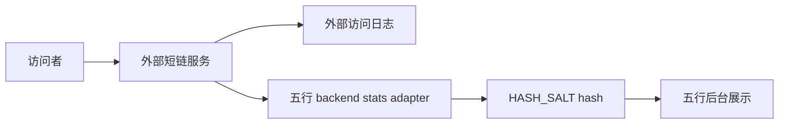

# 外部短链接入隐私审计报告

审计日期：2026-06-10

审计范围：

- 五行人格卡 external 短链适配层。
- 五行后台读取外部短链统计和访问明细时的数据处理。
- 本地外部短链项目 `/Users/linyuxiang/JavaBackend/01_Projects/shortlink` 的已知数据风险。

## 1. 当前结论

五行项目自身仍满足 MVP 隐私边界：

- 不做登录注册。
- 不收集昵称、性别等身份信息。
- 普通访问的 `clientId`、IP、User-Agent 均 hash 后入库。
- `visit_event.referer` 入库前去掉 query 和 fragment。
- 后台读取外部访问记录时，外部 `ip` 和 `user` 会使用五行项目 `HASH_SALT` 再 hash 后返回。

外部短链项目自身仍有独立隐私风险：

- 访问日志表中可能保存明文 IP。
- UV cookie 或访问用户标识可能按外部项目原始策略保存。
- 地区、浏览器、OS、设备、网络等指纹字段会提升访问者可识别性。
- 上游 demo 种子用户 `admin/admin123456` 不能用于生产。

因此，v1.1 的结论是：五行项目展示层已经做了脱敏处理，但生产前仍建议对外部短链项目做单独治理，尤其是明文 IP 和默认账号。

## 2. 数据流

重点：五行后台不直接展示外部 `ip` 和 `user` 明文字段，而是转成 hash。

## 3. 五行项目已做保护

| 数据 | 处理方式 |
| --- | --- |
| 五行 clientId | `sha256(clientId + HASH_SALT)` 后保存 |
| 五行 IP | `sha256(ip + HASH_SALT)` 后保存 |
| 五行 User-Agent | `sha256(userAgent + HASH_SALT)` 后保存 |
| Referer | 去掉 query 和 fragment |
| 外部 access-record `user` | 五行读取后再次 hash |
| 外部 access-record `ip` | 五行读取后再次 hash |
| 外部指纹组合 | browser / os / network / device / locale 组合后 hash 到 `userAgentHash` |
| 后台来源标记 | `statSource=local` 或 `external` |

## 4. 仍需治理的外部风险

| 风险 | 等级 | 说明 | 建议 |
| --- | --- | --- | --- |
| 外部短链明文 IP 入库 | 高 | 外部项目访问日志可能直接保存 IP | 生产前在外部项目落库前 hash，或缩短保留周期 |
| 默认 demo 账号 | 高 | `admin/admin123456` 只适合本地演示 | 生产创建专用系统用户并禁用弱口令 |
| 分组归属不清 | 中 | 五行需要固定 `wuxing_persona` 分组 | 初始化专用分组并限制系统用户权限 |
| 地区和设备指纹 | 中 | 统计维度越多，可识别性越高 | 后台只展示必要维度，避免明细长期保留 |
| 短链 domain 配错 | 中 | 可能导致统计查错或访问跳错 | 预检脚本校验 domain 不带 scheme，部署后 smoke test |
| 外部服务不可用 | 中 | 会影响 external 创建和统计 | 保留 fallback，设置短超时，后台统计回退 local |

## 5. 生产建议

上线前建议执行：

1. 外部短链项目创建专用数据库用户，不使用 root。
2. 外部短链项目创建专用系统用户 `wuxing_system`。
3. 外部短链项目创建分组 `wuxing_persona`。
4. 禁用或删除 demo 用户 `admin/admin123456`。
5. 明确外部访问日志保留周期。
6. 如果保留地区统计，确认 IP 地理位置处理方式和保留边界。
7. 用强随机值替换五行 `HASH_SALT`，不要与外部系统复用。
8. 使用 HTTPS 暴露五行主域名和短链域名。

## 6. 验收口径

v1.1 可认为“生产接入准备完成”的条件：

- `scripts/deploy-preflight.sh` 能拦截五行 `.env` 中的占位值。
- `scripts/external-shortlink-preflight.sh` 能校验 external 关键配置。
- `scripts/external-shortlink-smoke-test.sh` 能创建结果并验证短链跳转。
- 后台短链列表可显示 `statSource`。
- 后台访问明细不展示外部明文 IP 或 user。

真正“生产隐私闭环完成”的条件还需要外部短链项目配合：

- 外部访问日志不再长期保存明文 IP。
- 外部默认账号和弱口令全部替换。
- 外部服务部署网络、数据库权限和日志保留策略完成收口。
