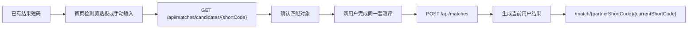
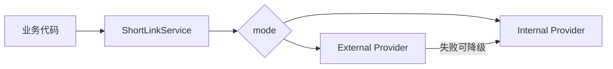

# 五行人格卡面试表达文档 v1

这份文档服务一个目标：让你能在面试里把项目讲清楚、讲高级、讲诚实。

它不是从零教学，而是站在面试官视角，用母题和追问训练表达。第一版只抓最值得讲的项目流程、项目亮点、项目难点，后续可以继续扩展。

## 面试总口径

### 30 秒开场

> 我做的是一个五行人格卡全栈项目，不只是测试页面。它的核心闭环是用户测算生成结果页，系统生成短链，朋友通过短链访问结果，同时后端记录匿名访问事件，后台能看到 PV、UV、UIP 和传播漏斗。技术上用了 Vue、Spring Boot、MySQL、Redis、Nginx 和 Docker Compose，重点做了短链热路径、访问统计、缓存、异步事件、隐私收敛和部署运维。

### 2 分钟展开

> 这个项目我会从三个层面讲。第一是业务流程：从首页、测试页、结果页，到短链分享和后台统计，形成了一个完整传播闭环。第二是工程亮点：短链模块用了 Provider 适配 internal/external 两种模式，Redis 缓存结果和短码映射，短链访问事件用有界队列异步批量写库，后台 overview 有短缓存，Nginx 对不同路径做限流。第三是难点和边界：短链传播会带来瞬时高峰，统计查询会有 `COUNT DISTINCT` 和聚合压力，隐私数据需要 hash，真实域名部署还涉及备案和 HTTPS。现阶段它是单机可部署作品，我不会夸大成分布式短链平台，但能讲清楚每个取舍和下一步演进方向。

## 一、项目流程母题

### 母题 1：你这个项目到底解决什么问题？

面试官想听：

- 你不是只做了页面。
- 你能说清楚业务闭环。
- 你知道这个项目为什么适合后端面试。

回答主线：

```text
人格测试内容产品 -> 结果页 -> 分享短链 -> 朋友访问 -> 访问统计 -> 后台运营
```

可直接表达：

> 它表面上是一个五行人格测试，但我真正做的是一个内容传播闭环。用户完成出生年月和 5 道题后，后端生成人格结果和短链；朋友打开短链会跳到结果页，同时记录匿名访问事件；后台可以看 PV、UV、UIP、漏斗、短链列表和访问明细。所以它能体现的不只是页面交互，还有短链、缓存、统计、隐私和部署。

可能追问：

> 为什么不直接把结果页链接发出去，还要短链？

应对：

> 短链让传播链接更短、更稳定，也方便以 shortCode 作为统计和匹配入口。比如双人匹配只需要 6-7 位短码，后台也能围绕 shortCode 聚合访问数据。

边界：

> 它不是完整商业平台，但已经具备从用户行为到运营数据的闭环。

### 母题 2：用户创建一张人格卡时，后端发生了什么？

面试官想听：

- 你能顺着调用链讲。
- 你知道哪些数据是强一致主流程。
- 你知道哪些动作是辅助动作。

回答主线：


可直接表达：

> 前端提交出生信息和 5 道题到 `POST /api/results`。后端 `ResultService` 先计算五行分数、星官和结果文案，然后写 `user_result`。结果写成功后创建短链，记录 `TEST_SUBMIT`、`RESULT_CREATED`、`SHORT_LINK_CREATED` 这些事件，最后把结果详情写入 Redis 并返回给前端。

可能追问：

> 如果 resultId 撞了怎么办？

应对：

> 数据库有唯一键，代码里捕获 `DuplicateKeyException` 后最多重试 5 次。这样不是假设随机数永远不撞，而是把极小概率冲突纳入可靠性处理。

边界：

> 当前外部短链调用仍可能影响结果创建体验，后续如果 external 模式变重，可以考虑 outbox 或异步补偿。

### 母题 3：短链跳转为什么是核心链路？

面试官想听：

- 你能识别热路径。
- 你能讲低延迟设计。
- 你能区分跳转和统计。

回答主线：

```text
GET /s/{shortCode}
  -> 校验短码
  -> Redis 查 shortCode -> resultId
  -> 未命中查 short_link
  -> 异步记录 SHORT_LINK_VISIT
  -> 302 /result/{resultId}?sc={shortCode}
```

可直接表达：

> 短链跳转是传播入口，一张卡可能只创建一次，但可能被很多朋友打开。我的目标是让 `/s/{shortCode}` 尽快返回 302。短码映射优先从 Redis 拿，未命中才查 MySQL；访问事件不阻塞跳转，而是进入有界队列异步批量写库。

可能追问：

> 如果短码不存在呢？

应对：

> 会返回 not-found，并且写短 TTL 空值缓存，避免同一个错误短码反复穿透数据库。

边界：

> 当前是单机内存队列，适合作品阶段；多实例高峰要引入 MQ 或日志管道。

### 母题 4：双人匹配流程怎么设计的？

面试官想听：

- 你知道它和单人测算的复用关系。
- 你能解释为什么第一版不加新表。

回答主线：



可直接表达：

> 双人匹配没有重新造一套结果系统，而是复用已有短链和结果。已有用户给出 shortCode，新用户完成同一套测评，后端用两个结果的五行分布和主副元素关系计算匹配分和建议。第一版没有新增匹配表，因为匹配结果可以由两个 shortCode 重新计算，降低数据迁移成本。

可能追问：

> 不存匹配结果有什么问题？

应对：

> 好处是简单、无状态、易刷新；问题是不能做历史匹配、排行榜和复访提醒。如果后续要做社交化增长，就应该新增 match_result 表。

## 二、项目亮点母题

### 母题 5：你这个项目最大的后端亮点是什么？

面试官想听：

- 不要罗列技术栈。
- 要把技术和业务问题连起来。

回答主线：

```text
短链传播热路径 + 匿名访问统计 + 后台运营数据
```

可直接表达：

> 我认为最大的亮点是把一个人格测试做成了可传播、可观测的业务闭环。短链不是装饰字段，而是真实参与跳转和统计；访问事件不是只写日志，而是支撑后台 PV、UV、UIP、漏斗和短链访问明细。围绕这条链路，我做了 Redis 缓存、异步事件、日聚合、后台短缓存和 Nginx 限流。

追问：

> 这和普通 CRUD 项目有什么区别？

应对：

> 普通 CRUD 更多是表单增删改查；这个项目有传播热路径、有读写分离思维、有统计口径、有匿名隐私处理，也有真实部署和健康检查脚本，更接近一个小型线上业务。

### 母题 6：Redis 在项目里到底解决了什么？

面试官想听：

- 你不要说“为了快”这么空。
- 要说清楚 key、场景、降级。

回答主线：

| 场景 | 缓存什么 | 解决什么 |
| --- | --- | --- |
| 结果页 | resultId -> ResultDetailVO | 结果页重复访问少查库 |
| 短链跳转 | shortCode -> resultId | 传播高峰低延迟解析 |
| 错误短码 | null shortCode | 防止缓存穿透 |
| 后台总览 | date range -> overview | 防止运营刷新打主库 |

可直接表达：

> Redis 在这里是削峰层，不是权威数据源。结果详情和短码映射都是读多写少，适合缓存；不存在的短码做 5 分钟空值缓存；后台 overview 做 45 秒短缓存。Redis 读写失败时会记录 warn 并回源 MySQL，主流程不依赖 Redis 强可用。

追问：

> Redis 挂了怎么办？

应对：

> 功能不会完全不可用，但压力会回到 MySQL。所以生产上还需要限流、告警和容量评估，不能把 Redis 当成唯一防线。

### 母题 7：为什么用了 ShortLinkProvider 适配层？

面试官想听：

- 你是否理解抽象的价值。
- 你是否避免过度设计。

回答主线：



可直接表达：

> 短链是业务核心，但短链来源可能变化。第一版用 internal 内置短链保证项目能独立运行；如果接入外部短链服务，业务层不应该到处改代码，所以我把它抽成 Provider。这样 `ResultService` 只管创建短链，不关心底层是 internal 还是 external。

追问：

> 这是不是过度设计？

应对：

> 如果项目永远只有一个内置短链，那确实可以不用。但这个项目已经有 external 接入和 stats 适配，所以 Provider 是为真实变化点服务，不是为了炫技。

### 母题 8：你如何保护用户隐私？

面试官想听：

- 你不是只说“不存隐私”。
- 要说具体做法。

可直接表达：

> 项目不做登录注册，不收昵称和性别。访问事件里 clientId、IP、User-Agent 都加盐 hash 后入库，Referer 入库前去掉 query 和 fragment，避免泄露 URL 参数。文案上也限制为娱乐性人格解读，不做疾病、财富、婚恋这类高风险判断。

追问：

> Hash 后就绝对安全吗？

应对：

> 不是。Hash 是降低直接暴露风险，不等于绝对匿名。生产环境还要保护 hashSalt、控制后台权限、限制导出范围，并遵守数据最小化原则。

## 三、项目难点母题

### 母题 9：如果短链突然被大量访问，你怎么扛？

面试官想听：

- 热点识别。
- 缓存路径。
- 限流与异步。
- 诚实边界。

可直接表达：

> 最大压力会落在 `/s/{shortCode}`。当前处理是 Nginx 对 `/s/` 单独限流；后端短码解析优先走 Redis；未命中才查 MySQL；访问事件只入有界队列，后台 worker 批量写 `visit_event`；`last_visit_at` 按间隔更新，避免同一短链行被频繁写。这样用户跳转路径尽量短，统计写入延后处理。

追问：

> 队列满了怎么办？

应对：

> 当前会记录 warn 并丢弃低价值访问事件，保证用户 302 不被统计拖垮。这是单机作品阶段的取舍。如果要更可靠，就接 MQ，做重试、死信和消费监控。

边界：

> 我不能说它已经扛住真实高 QPS，因为现在只有 smoke 和本地验证，还需要正式压测。

### 母题 10：后台统计为什么可能慢？你怎么优化？

面试官想听：

- 你知道 `COUNT DISTINCT` 和聚合成本。
- 你知道 N+1 问题。
- 你知道缓存和聚合表的关系。

可直接表达：

> 后台统计慢主要有三个来源：日期范围内事件多、UV/UIP 需要 distinct、短链列表如果每条再查统计会变成 N+1。我的处理是 overview 做 45 秒 Redis 短缓存；历史趋势优先读日聚合表；短链列表先分页拉 short_link，再批量拉 user_result 和 shortCode 集合统计，减少数据库往返。

追问：

> 数据量更大怎么办？

应对：

> 下一步是定时聚合、明细归档、分区或离线数仓。缓存只能削峰，不能替代数据生命周期治理。

### 母题 11：external 短链服务失败怎么办？

面试官想听：

- 外部依赖故障意识。
- 降级策略。
- 一致性边界。

可直接表达：

> external 模式下，创建短链要调用外部服务。项目里有超时配置，并且允许 fallback 到 internal，这样用户仍能拿到可访问链接。如果外部已经创建成功但本地绑定失败，代码不会假装成功，而是暴露错误，因为这属于跨系统一致性问题，需要补偿或人工处理。

追问：

> 为什么不强一致？

应对：

> 跨系统强一致成本很高，当前作品阶段先把失败显性化。更成熟的做法是 outbox、本地事务消息、补偿任务和外部短链回查。

### 母题 12：后台只靠 token 安全吗？

面试官想听：

- 你不要把 MVP token 说成完整权限系统。
- 要知道后续演进。

可直接表达：

> 当前后台接口统一要求 `X-Admin-Token`，并用常量时间比较，适合单人演示和作品集阶段，避免后台数据裸奔。测试覆盖了 overview、短链列表、导出、访问明细、runtime 等接口的未授权场景。

追问：

> 如果真实上线多人运营呢？

应对：

> 要补账号登录、RBAC、操作审计、token 轮换、后台 IP 白名单或内网访问，敏感导出还要权限和日志。

### 母题 13：这个项目最大的不足是什么？

面试官想听：

- 你是否能诚实评估项目。
- 你是否知道下一步怎么补。

可直接表达：

> 我认为最大不足有三个。第一，虽然有性能 smoke，但还没有正式生产压测报告。第二，访问事件异步化目前是单机内存队列，不是 MQ，可靠性和多实例能力有限。第三，数据库迁移还主要依赖 schema 脚本，没有正式 Flyway/Liquibase 版本化迁移。下一步我会补压测报告、引入定时聚合和迁移工具，再根据流量决定是否引入 MQ。

## 面试表达时的“三不要”

| 不要这样说 | 更好的说法 |
| --- | --- |
| 我做了一个人格测试网页 | 我做的是测算、短链分享、访问统计、后台运营的业务闭环 |
| 用 Redis 是为了快 | Redis 承担结果详情、短码映射、空短码和后台 overview 的削峰职责 |
| 我这个项目能扛高并发 | 我围绕短链热路径做了缓存、异步和限流，但还需要正式压测验证容量 |
| 后台有 token，所以很安全 | 当前 token 适合演示环境，真实多人运营要补 RBAC、审计和网络隔离 |
| external 失败也没事 | external 可降级 internal，但跨系统一致性仍需要补偿机制 |

## 你的练习顺序

1. 先背 30 秒开场。
2. 再练母题 1、2、3，确保项目流程讲顺。
3. 然后练母题 6、7、9，突出 Redis、Provider 和短链热路径。
4. 最后练母题 10、12、13，表现出边界意识和工程成熟度。

## 最终表达目标

面试官听完后应该得到三个印象：

1. 你做的不是玩具页面，而是有业务闭环的全栈项目。
2. 你能把 Redis、MySQL、异步、Nginx、Docker 和隐私治理讲到业务场景里。
3. 你知道项目现阶段的边界，不夸大，但能说出下一步演进路径。
