# 五行人格卡面试学习手册

## 1. 项目定位

五行人格卡是一个以“测算结果页分享”为真实业务场景的 Java 全栈项目。你面试时不要只说“我做了一个人格测试页面”，而要说清楚：

```text
匿名用户测算 -> 结果生成 -> 分享动作 -> 短链回流 -> 访问事件 -> 后台数据中台
```

这个项目适合后端面试的原因是：它有真实业务闭环、短链系统、Redis 缓存、MySQL 统计查询、匿名隐私设计、Docker Compose 部署和可解释的性能取舍。

## 2. 系统架构

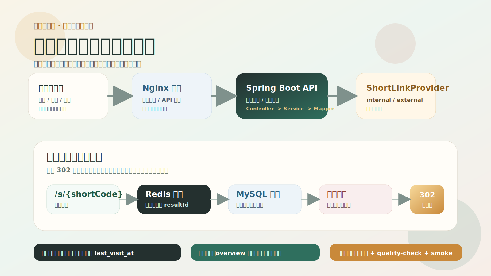

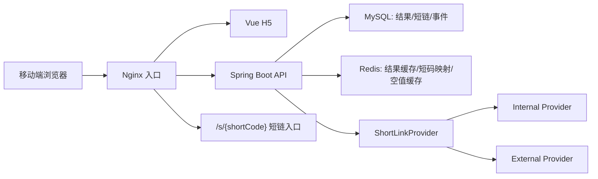

各层职责：

- Vue H5：完成首页、测试页、结果页、分享动作和后台页面展示。
- Nginx：托管静态资源，转发 `/api/**` 和 `/s/**`，承担第一层限流。
- Spring Boot：处理结果生成、短链创建/解析、事件记录、后台统计。
- MySQL：保存 `user_result`、`short_link`、`visit_event` 和日聚合表。
- Redis：缓存结果详情、短码到 resultId 映射、无效短码空值。

## 3. 核心链路

### 创建结果链路

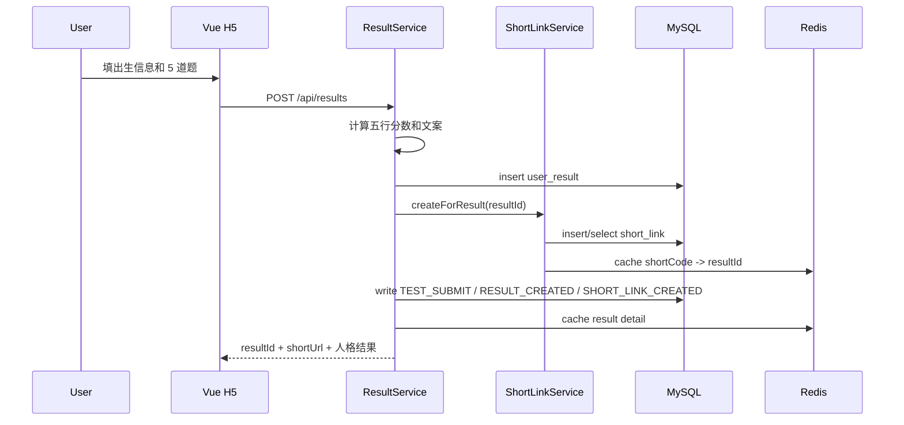

面试要点：

- 创建结果是强业务链路，结果和短链要尽量一起成功。
- external 短链失败时可以降级 internal，保证用户仍能拿到可访问结果。
- 一次提交会放大成多次 DB 写，所以要控制事务边界和外部调用风险。

### 结果判定与文案链路

这一段是回答“为什么判成主火次土”的核心，不要只说“后端算了一个分数”。当前模型是“文化背景 + 自我选择”的轻量人格模型，不是完整八字排盘。

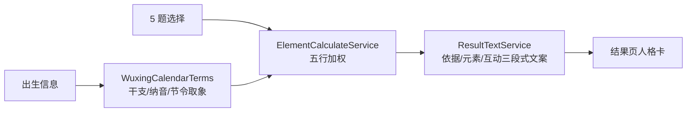

算法入口：

| 模块 | 做什么 | 面试表达 |
| --- | --- | --- |
| `WuxingCalendarTerms` | 年份用干支纪年和纳音取象，月份用节令/月令取主辅气，日期/时段只做轻量修饰 | “我没有用简单年份数字硬映射，而是把传统名词转成可解释的人格底色。” |
| `ElementCalculateService` | 五行先各给基础分，再叠加年份、月份、日期、时段和 5 题选择 | “基础分避免出现缺某一行的负面暗示，答题权重保证用户当下选择更重要。” |
| `ResultTextService` | 输出判定依据、元素逐项解释、元素互动与总览 | “结果页先解释为什么，再讲每个元素代表什么，最后把相生/制衡转成正向人格语言。” |

可以这样讲一个样例：

> 例如 2005 年 12 月、5 题里火向最多、土向补强，系统会先说 2005 年是乙酉年，纳音泉中水；12 月近大雪冬至，子水当令、寒土收束；然后说明 5 题火向最多，所以最终形成主火、次土。文案不会说某个元素缺失，而是说主火代表活力斗志，次土带来稳重执行，水作为点睛让表达多了洞察和弹性。

### 结果读取链路

```text
GET /api/results/{resultId}
  -> Redis result:{resultId}
  -> 未命中查 user_result + short_link
  -> 写 RESULT_VIEW 事件
  -> 返回结果页数据
```

面试要点：

- 结果详情是读多写少，适合缓存。
- 事件记录失败不应该影响用户查看结果。
- 如果 Redis 不可用，主流程仍可回源 MySQL。

### 双人匹配链路

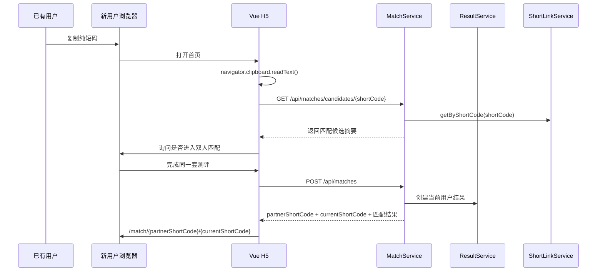

面试要点：

- 首页只接受 `6-7` 位 Base62 纯短码，不从链接里提取，避免误触发。
- 浏览器剪贴板读取受权限策略限制，所以首页先尝试自动检测；失败时提供“检测剪贴板短码”和手动短码输入作为兜底。
- 匹配页用两个短码查询，所以刷新页面不会丢状态。
- 第一版不新增匹配表，降低迁移成本；如果未来要做历史匹配、排行榜或复访提醒，再把匹配结果持久化。

### 短链跳转链路

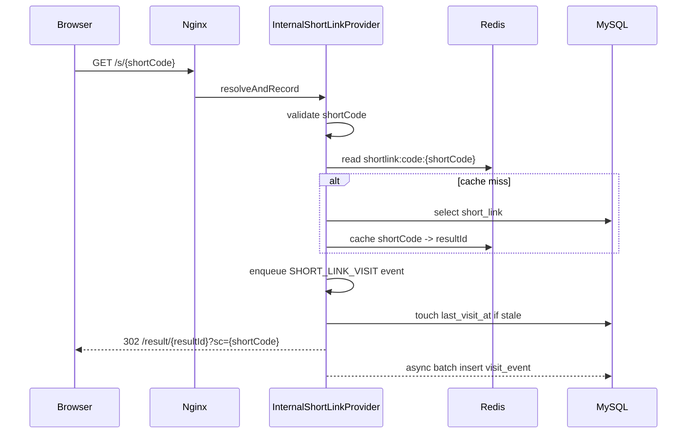

面试要点：

- 短链是传播峰值入口，必须低延迟。
- 当前优化点是：Redis 命中时直接用 cached resultId 返回，不再为了跳转回查 `short_link`；访问事件进入有界队列，由后台 worker 批量写库。
- 后台统计仍可从事件表或日聚合表计算，用户跳转链路不被统计查询拖慢。

## 4. 数据模型

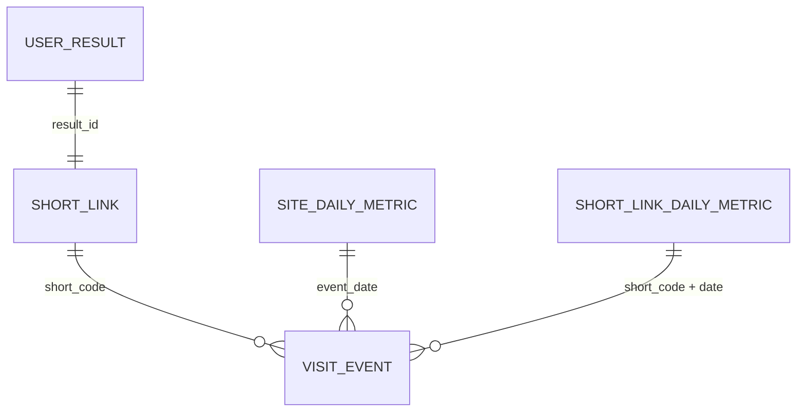

核心表：

- `user_result`：保存出生信息、答案、五行结果、星官、关键词和文案。
- `short_link`：保存 shortCode、resultId、shortUrl、累计计数和最后访问时间。
- `visit_event`：保存匿名事件，包括 eventType、resultId、shortCode、clientIdHash、ipHash、channel、campaign、deviceType。
- `site_daily_metric` / `short_link_daily_metric`：用于把明细事件聚合成更适合后台查询的数据。

## 5. 缓存设计

| 缓存 | Key | Value | 作用 |
| --- | --- | --- | --- |
| 结果详情 | `result:{resultId}` | ResultDetailVO JSON | 减少结果页重复查库 |
| 短码映射 | `shortlink:code:{shortCode}` | resultId | 降低短链跳转延迟 |
| 空短码 | `shortlink:null:{shortCode}` | `1` | 防止不存在短码反复打 DB |

缓存不是替代数据库，而是削峰。面试时要讲清楚 Redis 异常时会回源 MySQL，并且空值缓存 TTL 较短，避免长期误伤后续合法短码。

## 6. 性能与抗峰值设计

当前最重要的性能取舍：

1. 用户核心链路优先：创建结果、查看结果、短链跳转要保成功率。
2. 统计类查询后置：后台 PV/UV/UIP 不应该阻塞短链 302。
3. Redis 承担读热点：结果和短链映射都适合缓存。
4. Nginx 先挡一层：`/api/**`、`/api/events`、`/s/**` 可以有不同限流策略。
5. Admin overview 可以接受 45 秒级短缓存，避免运营刷新反复触发 live 聚合查询。
6. 统计表补齐 `created_at`、`status + created_at`、`result_id + event_type + channel`、`event_type + short_code + created_at + channel` 等索引，让后台日期筛选、测试流量过滤、短链列表和日聚合更容易走索引。
7. 后台短链列表要避免 N+1 查询：一页短链先批量拉结果信息，再按短码集合一次聚合 PV/UV/UIP。
8. 单机阶段不急着上 MQ、分库分表、ES：先把热点查询、缓存和降级做好。

高峰场景回答模板：

> 如果某张人格卡在群里突然传播，最大压力会落在 `/s/{shortCode}`。我的处理是短码解析优先走 Redis，命中时直接拿 resultId 返回，未命中才查 MySQL；访问事件保留用于统计，但请求线程只入有界队列，后台 worker 再批量写 `visit_event`。后台统计可以走事件表或日聚合表，这样用户 302 延迟不会被运营查询拖慢。

短链跳转写放大的回答可以这样补充：

> 访问事件是统计明细的事实来源，所以不能简单丢掉；但它不需要卡住 302 跳转。我把低价值访问事件改成异步入队、后台批量 insert，批量失败时再降级单条写入。`short_link.last_visit_at` 只是列表展示字段，也改成至少间隔 30 秒才更新一次，减少同一热门短码在瞬时传播时对 `short_link` 行的反复写压力。

Admin overview 的回答可以这样补充：

> 后台总览不是用户核心链路，不需要秒级强实时。我给相同日期范围的 overview 加了 45 秒 Redis 短缓存，命中时直接返回，未命中再查事件表和聚合表；Redis 异常时退回 live 计算。手动日聚合成功后会递增 overview 缓存版本，让下一次读取直接走新口径，不用等旧缓存自然过期。这个取舍能减少运营刷新对主库的重复压力，同时不改变事件明细的真实性。

测试流量隔离的回答可以这样补充：

> 压测会真实创建结果和分享链接，如果混进运营看板，完成率和回流强度会失真。第一阶段我用 `visit_event.channel=perf-test` 做默认视图隔离，并提供“包含测试流量”和“口径差异”面板用于复盘压测影响。这个方案改动小、能快速保护运营判断，但不是强隔离；下一阶段会把 `source_channel` 和 `synthetic` 下沉到 `user_result`、`short_link`，并把日聚合拆成真实口径和全量口径。

数据库索引可以这样补充：

> 我没有只靠 Redis 掩盖慢查询。对于后台总览和聚合任务，`visit_event` 补了按时间范围、时间 + client/ip 去重、`result_id + event_type + channel`、`event_type + short_code + created_at + channel` 等组合索引；`short_link` 补了 `status + created_at` 索引。这样即使缓存失效，默认排除压测流量和短链列表批量统计也更容易落在可控查询路径上。

后台短链列表可以这样补充：

> 列表页不能按每条短链再查一次结果、三次统计，否则 pageSize=100 时会放大成几百次查询。我把结果信息改成按 resultId 集合批量读取，把 PV/UV/UIP 改成按 shortCode 集合一次 `GROUP BY` 聚合，再在 Java 里映射回列表项。这样接口语义不变，但数据库往返和重复 distinct 统计会少很多。

## 7. 安全与隐私

- 不做登录注册，不收集昵称和性别。
- clientId、IP、User-Agent hash 后入库。
- Referer 入库前去掉 query 和 fragment，避免泄露参数。
- 后台接口要求 `X-Admin-Token`；这是 MVP 管理保护，不是完整 RBAC，但 overview、短链列表、CSV 导出、访问明细、external 状态、事件 runtime 和手动聚合接口的未授权路径都有集成测试覆盖。
- 安全响应头由后端和 Nginx 配置协同提供。
- 文案只做娱乐性人格解读，不做宿命、财富、疾病、婚恋判断。

## 8. 部署链路

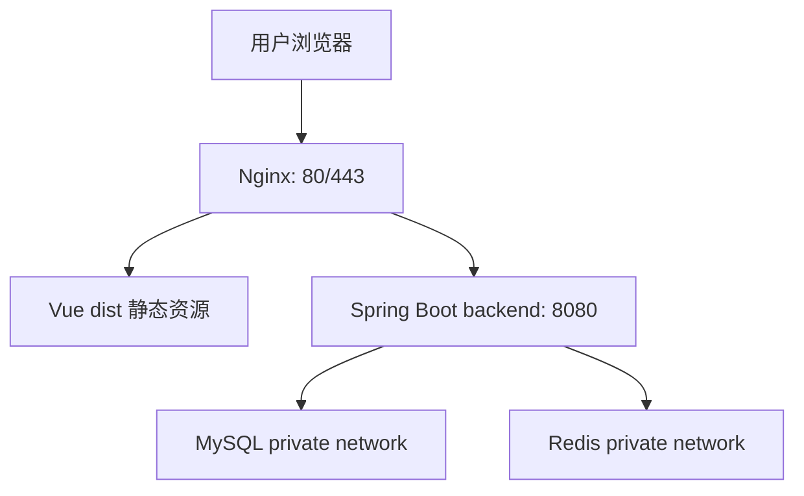

常用命令：

```bash
cp deploy/.env.example deploy/.env
scripts/deploy-preflight.sh deploy/.env
docker compose --env-file deploy/.env -f deploy/docker-compose.yml up --build -d
BASE_URL=http://127.0.0.1:8088 ADMIN_TOKEN=dev-token scripts/docker-smoke-test.sh
BASE_URL=http://127.0.0.1:8088 ADMIN_TOKEN=dev-token SHORTLINK_HITS=30 \
MAX_SHORTLINK_AVG_MS=120 MAX_SHORTLINK_P95_MS=200 \
MAX_ADMIN_AVG_MS=200 MAX_ADMIN_P95_MS=350 \
MAX_ASYNC_QUEUE_SIZE=0 MAX_ASYNC_DROPPED_EVENTS=0 \
MAX_ASYNC_BATCH_FAILURES=0 scripts/performance-smoke-test.sh
```

面试要点：

- 不能直接暴露 Spring Boot 8080 到公网，公网入口应走 Nginx。
- MySQL 和 Redis 不暴露公网。
- 上线前必须替换 `ADMIN_TOKEN`、`HASH_SALT`、数据库密码和 `APP_BASE_URL`。
- 真实域名上线时，`APP_BASE_URL` 决定新生成分享链接的域名；如果仍是 localhost 或 IP，用户分享出去的链接会错。
- 性能 smoke 不是压测报告，而是回归检查：它会创建一个真实结果，连续访问短链，并重复读取后台总览，用输出的 `shortlinkAvgMs`、`shortlinkP95Ms`、`adminAvgMs` 和 `adminP95Ms` 观察热点链路是否明显退化；设置 `MAX_*_AVG_MS` / `MAX_*_P95_MS` 后也可以把它变成低延迟阈值门。它还会读取访问事件 runtime，输出 `asyncQueueSize`、`asyncTotalFlushedEvents`、`asyncLastFlushAt`、`asyncDroppedEvents`、`asyncBatchWriteFailures` 和 `asyncWorkerAlive`；把 `MAX_ASYNC_QUEUE_SIZE=0`、`MAX_ASYNC_DROPPED_EVENTS=0`、`MAX_ASYNC_BATCH_FAILURES=0` 打开后，可以防止“接口很快，但事件都堆着、丢了或后台批量写失败”的假象。
- `scripts/performance-limit-test.sh` 是更完整的阶梯压测记录工具：它会先读 `/api/readiness`，确认核心表 `core_schema` 可用，再把 `RUN_ID` 写进 effective campaign，默认用 `perf-test` 隔离压测流量，并把环境卡片、CSV、summary 和报告一起沉淀。正式沉淀的本地报告建议加 `STRICT_RUNTIME_OBSERVATION=1`，这样 runtime 不可观测时会停止而不是误写“没有风险”。当前本地代码回归报告显示：mixed 1-32 阶梯最高 P95 `104ms`，admin 1-64 最高 P95 `216ms`，result 1-64 最高 P95 `112ms`，shortlink 1-64 最高 P95 `185ms`，错误率、事件丢弃和批量写失败均为 `0`；这些数字只能证明本地小阶梯回归，没有资格直接换算成生产 QPS。
- 三类验证要分开讲：`/api/readiness` 是核心表依赖前置检查，`performance-smoke-test.sh` 是小样本回归门，`performance-limit-test.sh` 才是阶梯探测报告；即使三者都通过，也只能证明方法链路完整，不能跳到“已验证生产 QPS”。
- 生产压测和告警演练的完整记录模板见 `docs/production-load-alert-runbook.md`；面试中可以讲演练方案和 smoke 证据，但没有真实报告前不要说已经验证生产 QPS。

### 真实域名上线链路

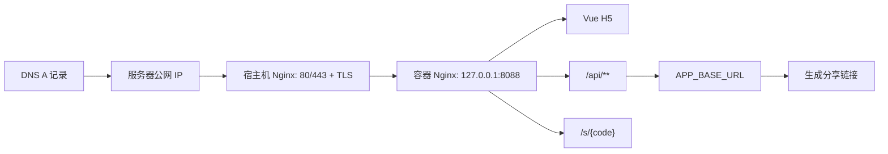

要讲清楚三个点：

1. DNS 只负责把域名指到服务器，不代表应用健康。
2. 宿主机 Nginx/TLS 负责公网 80/443，容器 Nginx 继续负责 H5、API 和短链入口。
3. `APP_BASE_URL` 是后端生成分享链接的源头，必须和用户实际访问域名一致。

本轮新增的域名预检脚本：

```bash
DOMAIN=<主域名> EXPECTED_IP=<服务器公网 IP> \
BASE_URL=https://<主域名> ADMIN_TOKEN=<token> \
scripts/domain-bind-preflight.sh
```

它证明的是：域名解析正确、健康接口通、题目接口通、后台 token 可访问 overview。它不替代 `production-smoke-test.sh`，后者还会创建结果、访问短链并检查后台统计。

服务器执行细节见 `docs/domain-server-runbook.md`。模板文件 `deploy/host-nginx-domain-tls.example.conf` 用于宿主机 Nginx，把 HTTPS 流量转发到 `127.0.0.1:8088` 的容器 Nginx。

## 9. 面试追问速答

| 问题 | 回答方向 |
| --- | --- |
| 为什么要短链 Provider？ | 隔离 internal 和 external 实现，上层结果生成不关心短链来源 |
| external 挂了怎么办？ | 可配置降级 internal，结果页仍可生成可访问短链 |
| 为什么要存本地 short_link？ | 绑定五行业务 resultId，支持后台统计和兼容跳转 |
| PV/UV/UIP 怎么算？ | PV 是事件数，UV 是 clientIdHash 去重，UIP 是 ipHash 去重 |
| 为什么 hash IP？ | 满足匿名统计，减少敏感信息落库 |
| Redis 挂了怎么办？ | 缓存读取失败返回 null，回源 DB；写缓存失败记录 warn 不阻断主流程 |
| 高峰短链怎么抗？ | Redis 映射、Nginx 限流、事件明细后置统计、避免跳转时实时 distinct 聚合 |
| 后台数据为什么能缓存？ | 后台总览用于运营观察，45 秒短缓存能削峰，明细和日聚合仍是权威来源 |
| 后台短链列表为什么不慢？ | 分页先拿短链，再批量取 result 信息和按 shortCode 聚合统计，避免一页触发 N+1 查询 |
| 当前项目边界？ | 单机商业化作品，不是大型分布式平台；后续才考虑 MQ、分库分表、多租户 |

## 10. 面试讲解图谱

### 一分钟总图


这张图用于开场。你要先说清楚它不是单纯页面，而是“测算结果页分享”这个真实业务闭环。

### 热点链路图

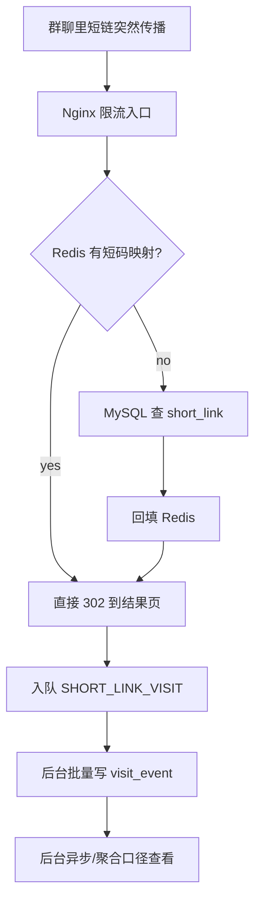

这张图用于回答高并发。核心句子是：短链跳转先保证 302 低延迟，统计查询不阻塞用户跳转。

### 后台统计图

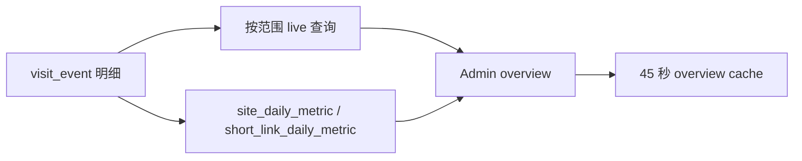

这张图用于解释为什么后台可以缓存：后台看趋势，不是金融交易，不需要每次刷新都实时重算。

## 11. 从单机抗峰值到分布式演进

面试时最稳的表达不是“我这个系统已经能扛所有高并发”，而是把当前阶段、已经做的优化和下一阶段演进讲清楚。

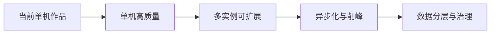

### 当前阶段：单机作品

当前系统是一个可部署的单机商业化作品，核心目标是让真实业务闭环稳定跑通：

- Nginx 作为公网入口，后端、MySQL、Redis 在内网。
- 结果详情和短码映射优先走 Redis。
- 短链跳转不做实时 distinct 聚合，避免传播入口被统计查询拖慢。
- 低价值访问事件异步入队和批量写入；队列满或写入失败只记录告警，不阻断结果读取和短链跳转。
- 后台统计使用索引、日聚合、短缓存和批量查询控制压力。

这一级适合个人作品集、实习面试和小规模上线验证。

### 下一阶段：单机高质量

如果要正式上线，先不要急着上复杂分布式组件，优先把单机质量补齐：

- 接入 HTTPS / HSTS、正式域名、生产日志和告警。
- 用具备 `workflow` scope 的凭据启用 Playwright 移动端 E2E 与截图捕获 GitHub Actions 方案，并继续把 production smoke 接入正式线上流水线。
- 定期做备份恢复演练，验证不是只会备份、不会恢复。
- 对 `/api/events`、`/s/**`、`/api/results` 分别设置更明确的限流阈值。
- 为 `visit_event` 增加归档策略，避免明细表无限增长。

这一阶段的关键词是“可运营、可回滚、可发现问题”。

### 再下一阶段：多实例可扩展

当单机资源成为瓶颈，可以把 Spring Boot 后端横向扩展为多实例：

- 前面放 Nginx 或云负载均衡。
- 后端实例保持无状态，session 仍用前端 `sessionStorage` 和事件 header 表达。
- Redis 和 MySQL 使用独立托管实例或主从架构。
- 短链跳转依赖 Redis 映射时，要考虑缓存预热、穿透保护和热点 key 观察。

这一阶段要避免把状态塞进单个后端进程，否则多实例扩容会失效。

### 已落地的下一阶段：可选 RocketMQ Shadow 削峰

当前项目已经完成单机内存队列 + 后台批量写库，适合单机作品阶段；同时也把访问事件投递抽象成了可插拔通道。默认 `local` 模式继续走本地有界队列，`rocketmq` 模式可以把清洗后的访问事件发布到 MQ，但在 consumer 落库、幂等、DLQ 没补齐前，系统仍然 shadow 写本地队列，保证数据中台口径不丢。

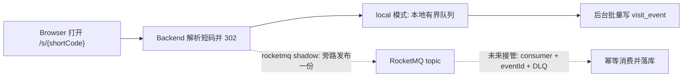

好处是跳转链路可以继续缩短，并能把突发访问事件转移到 MQ；坏处是统计会出现秒级延迟，还要处理消息重复、消费失败、积压告警和幂等写入。面试时要主动说出当前边界：现在已经有 `VisitEventRocketMqPublisher` 扩展点、shadow 模式和运行态指标，但还没有生产级 RocketMQ producer/consumer。

#### 三种模式怎么讲

| 模式 | 当前用途 | 数据中台口径 |
| --- | --- | --- |
| `local` | 默认生产安全模式，本地队列削峰后批量落库 | `visit_event` 本地落库 |
| `rocketmq + consumerEnabled=false` | 旁路观察 MQ 发布成功率和失败回退 | MQ 发布一份，同时 shadow 写本地 |
| `rocketmq + consumerEnabled=true` | 未来 MQ 主消费模式 | 只有 consumer persistence ready 后才允许 MQ 接管落库 |

这一层设计的核心不是“我已经完整接了 RocketMQ”，而是“我把统计事件主链路抽象出来，先允许低风险 shadow 验证，再逐步补 consumer、幂等和补偿”。

### 最后阶段：数据分层与治理

当访问明细量很大时，后台不应该继续直接扫明细表：

- 明细层：`visit_event` 保留原始事实，按时间分区或归档。
- 聚合层：`site_daily_metric`、`short_link_daily_metric` 承担后台趋势和列表指标。
- 查询层：后台优先读聚合表，缺失时再小范围回补 live 查询。
- 治理层：限制明细保留周期，继续坚持 IP、User-Agent、clientId hash。

面试收束句：

> 当前项目已经完成单机阶段的热路径优化、缓存、索引、访问事件异步批量写、降级和质量门禁；如果流量继续放大，我会按“多实例、外部消息队列、数据分层、观测告警”的顺序演进，而不是一开始就堆 MQ 和分库分表。

## 12. 代码阅读路线

按这个顺序读代码，能最快形成面试表达：

| 顺序 | 文件/模块 | 你要看懂什么 |
| --- | --- | --- |
| 1 | `frontend/src/pages/TestPage.vue` | 卡片式问答、出生信息、自动前进、提交入口 |
| 2 | `frontend/src/pages/ResultPage.vue` | 分享结果页、朋友回流入口、保存分享图 |
| 3 | `backend/.../ResultService.java` | 结果生成、短链创建、事件写入、缓存写入 |
| 4 | `backend/.../ShortLinkService.java` | 短链门面和 Provider 调用边界 |
| 5 | `backend/.../InternalShortLinkProvider.java` | 短码解析、Redis 缓存、302 跳转热路径 |
| 6 | `backend/.../AdminStatService.java` | 后台总览、日期范围、overview 短缓存 |
| 7 | `backend/.../RedisCacheService.java` | 结果缓存、短码缓存、空值缓存、降级 |
| 8 | `scripts/performance-smoke-test.sh` | 如何用脚本证明短链热点链路没有明显退化 |

### 代码阅读任务卡

这组任务卡用于把“我看过代码”变成“我能被追问”。每张卡都要做到三件事：找到入口、跑一次验证、用一句话讲清取舍。

| 任务 | 精确文件 | 验证命令 | 面试必须能说出的句子 |
| --- | --- | --- | --- |
| 移动端问答体验 | `frontend/src/pages/TestPage.vue` | `npm --prefix frontend run build` | 测试页从长表单变成逐题卡片流，默认出生年份也算有效选择，选中答案后由用户手动进入下一题，降低误触焦虑。 |
| 输入契约守门 | `frontend/src/pages/TestPage.vue`、`backend/src/main/java/com/wuxing/persona/service/ElementCalculateService.java` | `mvn -q -f backend/pom.xml -Dtest=ElementCalculateServiceTest,MvpFlowIntegrationTest test` | 前端会按年份和月份动态收窄日期选择，例如 2 月不显示 31 日；但最终安全边界在后端，服务层会拒绝未来月份、未来日期和不存在的日历日期。 |
| 双人短码匹配 | `frontend/src/pages/GuidePage.vue`、`frontend/src/pages/TestPage.vue`、`frontend/src/pages/MatchPage.vue`、`backend/src/main/java/com/wuxing/persona/service/MatchService.java` | `mvn -q -f backend/pom.xml -Dtest=MvpFlowIntegrationTest test && npm --prefix frontend run build` | 首页只从纯短码触发匹配邀请，剪贴板自动检测失败时有手动短码兜底，测完后调用 `/api/matches` 并进入可刷新访问的 `/match/{partnerShortCode}/{currentShortCode}`。 |
| 结果页分享闭环 | `frontend/src/pages/ResultPage.vue` | `E2E_BASE_URL=http://127.0.0.1:5175 E2E_ADMIN_TOKEN=dev-token scripts/mobile-e2e.sh` | 结果页不只展示文案，还承担保存分享图、复制分享链接、系统分享、朋友回流和二次测试入口。 |
| 创建结果链路 | `backend/src/main/java/com/wuxing/persona/service/ResultService.java` | `mvn -q -f backend/pom.xml -Dtest=MvpFlowIntegrationTest test` | 创建结果是强业务链路，结果、短链和关键事件要一起形成可恢复的业务证据。 |
| 短链门面和适配 | `backend/src/main/java/com/wuxing/persona/service/ShortLinkService.java` | `mvn -q -f backend/pom.xml -Dtest=ExternalShortLinkProviderTest,InternalShortLinkProviderTest test` | Provider 让结果生成不用关心短链来自 internal 还是 external，外部失败时可以降级。 |
| external 一致性边界 | `backend/src/main/java/com/wuxing/persona/service/shortlink/ExternalShortLinkProvider.java`、`docs/external-shortlink-integration-guide.md` | `mvn -q -f backend/pom.xml -Dtest=ExternalShortLinkProviderTest test` | external 短码冲突可降级，但外部已创建、本地绑定失败必须明确暴露，生产化再补撤销接口或补偿任务。 |
| 短链热路径 | `backend/src/main/java/com/wuxing/persona/service/shortlink/InternalShortLinkProvider.java` | `mvn -q -f backend/pom.xml -Dtest=InternalShortLinkProviderTest test` | `/s/{shortCode}` 是传播峰值入口，Redis 命中时直接拿 resultId 做 302，不同步做统计聚合。 |
| 异步访问事件 | `backend/src/main/java/com/wuxing/persona/service/VisitEventService.java` | `mvn -q -f backend/pom.xml -Dtest=VisitEventServiceTest test` | 访问事件是统计事实来源，但不该卡住用户跳转，所以进入可配置的有界队列并后台批量写库。 |
| 后台统计和缓存 | `backend/src/main/java/com/wuxing/persona/service/AdminStatService.java`、`backend/src/main/java/com/wuxing/persona/service/RedisCacheService.java` | `mvn -q -f backend/pom.xml -Dtest=MvpFlowIntegrationTest test` | 后台 overview 可以接受 45 秒短缓存，短链列表也要说明统计来自实时事件、日聚合表还是外部短链服务。 |
| 压测批次追踪 | `scripts/performance-limit-test.sh`、`docs/performance-reports/README.md` | `RUN_ID=study-check OUT_DIR=/private/tmp/wuxing-study-check WORKLOAD=health STEPS=1 REQUESTS_PER_STAGE=4 scripts/performance-limit-test.sh` | 压测流量用 `channel=perf-test` 默认隔离，用 `RUN_ID` 和 effective campaign 追踪批次，后台 Campaign 能和报告对上。 |
| 后台管理保护 | `backend/src/main/java/com/wuxing/persona/controller/AdminController.java`、`backend/src/test/java/com/wuxing/persona/MvpFlowIntegrationTest.java` | `mvn -q -f backend/pom.xml -Dtest=MvpFlowIntegrationTest#shouldRejectAllAdminEndpointsWithoutToken test` | 当前不是 RBAC 权限系统，但所有后台敏感入口都要求 `X-Admin-Token`，并用参数化集成测试覆盖未授权返回 401。 |
| 核心表就绪检查 | `backend/src/main/java/com/wuxing/persona/controller/HealthController.java`、`docs/api-spec.md` | `curl http://127.0.0.1:48081/api/readiness` | `/api/readiness` 的 scope 是 `core_schema`，用于确认结果、短链、访问事件和日聚合核心表可用；它不是 Redis、RocketMQ 和所有写路径的全量健康承诺。 |
| 可观测证据 | `scripts/performance-smoke-test.sh`、`backend/src/main/java/com/wuxing/persona/vo/VisitEventRuntimeVO.java` | `BASE_URL=http://127.0.0.1:48081 ADMIN_TOKEN=dev-token scripts/performance-smoke-test.sh` | 性能 smoke 看 avg / P95，也看 async queue、flushed events、dropped events 和 batch failures，避免只看快不看后台排水。 |
| 真实域名上线 | `docs/domain-launch-self-audit.md`、`docs/domain-launch-info-template.md`、`docs/domain-server-runbook.md`、`scripts/domain-bind-preflight.sh` | `DOMAIN=<domain> BASE_URL=https://<domain> scripts/domain-bind-preflight.sh` | 域名上线不是只改 DNS，还要确认 APP_BASE_URL、HTTPS、Nginx 路由、后台 token、production smoke 和 performance smoke；前置准备完成后要停下来等真实域名、DNS、SSH 和证书信息。 |
| 视觉与作品集证据 | `scripts/capture-showcase-screenshots.sh`、`docs/screenshots/showcase/`、`docs-site/showcase.html` | `E2E_BASE_URL=http://127.0.0.1:5175 E2E_ADMIN_TOKEN=dev-token scripts/capture-showcase-screenshots.sh` | 项目展示不只靠文字，已经有 iPhone SE、安卓宽屏和桌面后台三类可复现截图。 |
| 短码并发冲突 | `backend/src/main/java/com/wuxing/persona/service/shortlink/InternalShortLinkProvider.java`、`backend/src/main/java/com/wuxing/persona/mapper/ShortLinkMapper.java` | `mvn -q -f backend/pom.xml -Dtest=InternalShortLinkProviderTest test` | 当前短码生成依赖 `uk_short_code` 唯一键兜底，插入冲突时重试，避免 `count + insert` 的并发竞态。 |
| 数据库迁移治理 | `backend/src/main/resources/db/schema.sql`、`backend/src/main/resources/application.yml`、`docs/db-migration-plan.md` | `docker compose --env-file deploy/.env.example -f deploy/docker-compose.yml config` | 当前是初始化脚本和演示环境 DDL，不是成熟迁移体系；迁移治理计划说明了 Flyway 版本拆分、上线步骤和回滚边界。 |
| 异步事件丢失语义 | `backend/src/main/java/com/wuxing/persona/service/VisitEventService.java`、`scripts/performance-smoke-test.sh`、`docs/production-load-alert-runbook.md` | `mvn -q -f backend/pom.xml -Dtest=VisitEventServiceTest test` | 异步队列优先保护跳转低延迟，队列满或进程重启可能丢低价值事件；单测覆盖队列满时的丢弃计数，performance smoke 可用 `MAX_ASYNC_DROPPED_EVENTS=0` 把无丢弃变成门禁。 |

学习时建议每读完一张卡，就用自己的话录 30 秒音频。如果说到一半卡住，说明还不是代码没看懂，而是“入口、取舍、证据”三者没有串起来。

前端体验追问可以这样回答：

> 答题页的核心不是把按钮做多，而是降低犹豫和误操作。出生年份如果界面已经显示默认值，就应该同步作为有效选择；选中答案后不立刻硬切页面，而是让用户自己点“下一题”，这样误触后还能改选；移动端底部 sticky 操作条要留出安全区，不能挡住最后一个选项。

## 13. 五分钟面试讲解稿

### 0-60 秒：先讲业务闭环

> 这个项目叫五行人格卡，是一个以结果页分享为核心场景的 Java 全栈项目。用户完成出生信息和 5 道题后，后端生成一张人格结果卡，并绑定分享链接和短码。朋友打开分享链接会回到同一张结果页，也可以复制纯短码触发双人匹配。后台能看到 PV、UV、UIP、渠道、活动和短链访问明细。所以它不是单纯 H5 页面，而是“测算、分享、回流、匹配、统计”的完整闭环。

### 60-150 秒：讲核心架构

> 前端是 Vue H5，负责首页、卡片式答题、结果页、匹配页和后台展示；公网入口走 Nginx，转发静态资源、`/api/**` 和 `/s/**`；后端是 Spring Boot，核心模块包括 `ResultService`、`MatchService`、`ShortLinkService`、`ShortLinkProvider`、`VisitEventService` 和 `AdminStatService`；MySQL 保存结果、短链和访问事件，Redis 缓存结果详情、短码映射和无效短码。

### 150-240 秒：讲高峰值取舍

> 这个项目最容易被追问的是短链传播高峰。我的设计是让 `/s/{shortCode}` 跳转尽量轻：短码解析优先查 Redis，命中时不回查 MySQL，未命中才查 `short_link`；访问事件作为事实明细保留，但请求线程只入队，后台 worker 批量写库；`last_visit_at` 这种展示字段也做低频更新，避免同一个热门短码把一行反复打热。后台统计可以走 live 查询、日聚合和 45 秒 overview 缓存。

### 240-300 秒：讲隐私、验证和边界

> 项目刻意不做登录注册，也不收集昵称和性别；clientId、IP、User-Agent 都 hash 后入库，Referer 去掉 query 和 fragment。验证上有后端集成测试、前端构建、Compose 配置检查、性能 smoke、截图流程和统一 `scripts/quality-check.sh`。当前边界是单机商业化作品，不是大型分布式平台；如果真实流量继续上升，下一步才考虑消息队列、异步写事件、多实例、告警和更完整的权限系统。

### 面试官压迫式追问

| 追问 | 不慌的回答 |
| --- | --- |
| 你这是不是玩具项目？ | 我用人格测试做轻产品入口，但工程闭环是真实的：短链、访问事件、后台统计、缓存、部署和质量门禁都有落地。 |
| 为什么不让 MQ 直接接管？ | 当前已经有可选 RocketMQ shadow/fallback，但还没有把 consumer 落库、eventId 幂等、DLQ、失败重放和重聚合补成完整闭环；所以主路径先由本地队列保证数据中台稳定，MQ 接管要等这些安全边界齐全。 |
| 统计会不会拖慢跳转？ | 跳转链路只做短码解析、事件入队和低频展示字段更新，不同步做 distinct 聚合，后台统计走独立查询路径。 |
| 为什么双人匹配不建表？ | 第一版匹配是由两个已存在短码实时计算，先保证流程闭环和刷新可访问；只有当要做历史记录、关系复访或排行榜时，持久化匹配表才有明确收益。 |
| 剪贴板自动检测会不会失败？ | 会，浏览器经常要求用户手势或权限授权；所以代码先做非阻塞自动尝试，失败时不影响首页，并提供手动检测/输入短码入口保证流程可达。 |
| Redis 挂了是不是全挂？ | 不会。结果和短码缓存读取失败会回源 MySQL，写缓存失败只记录 warn，不阻断用户核心链路。 |
| UV 准不准？ | 匿名项目只能做到相对可信：优先 clientId hash，缺失时用 IP/User-Agent 兜底；它适合运营观察，不等同登录用户数。 |

更完整的 10 题压力追问、代码证据和边界口径见 `docs/big-tech-interviewer-qa.md`。

## 14. 8 小时学习路线

| 时间 | 学习目标 |
| --- | --- |
| 第 1 小时 | 跑通业务闭环：首页、测试、结果、短链、后台 |
| 第 2 小时 | 读 `ResultService`，讲清创建结果链路 |
| 第 3 小时 | 读 `ShortLinkService` 和 Provider，讲清 internal/external |
| 第 4 小时 | 读 `VisitEventService` 和 mapper，讲清 PV/UV/UIP |
| 第 5 小时 | 读 `RedisCacheService`，讲清缓存和降级 |
| 第 6 小时 | 读 Nginx/Compose，讲清部署拓扑 |
| 第 7 小时 | 用 Mermaid 图复述核心链路 |
| 第 8 小时 | 按面试追问表做口头演练 |
