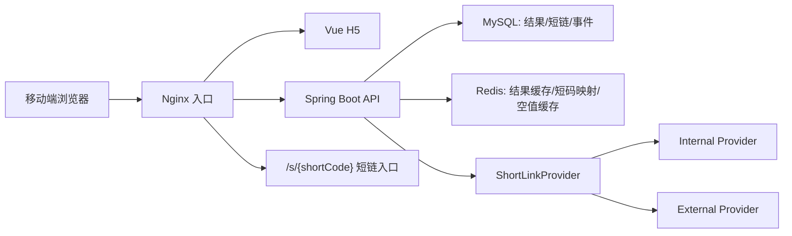
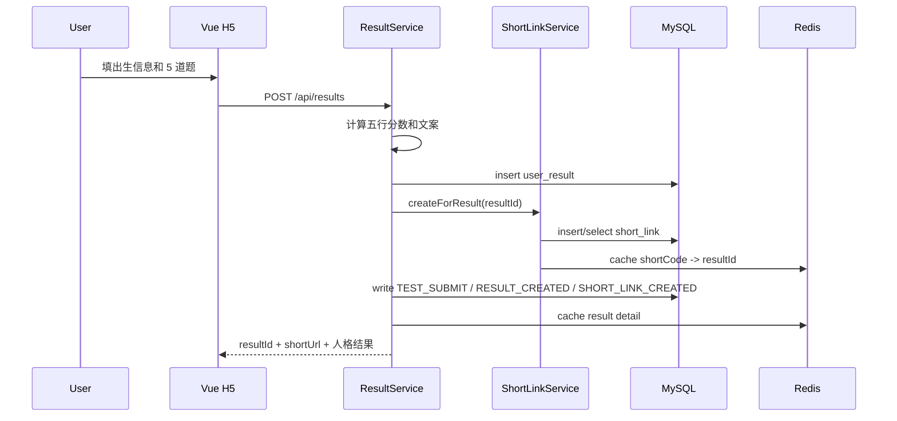
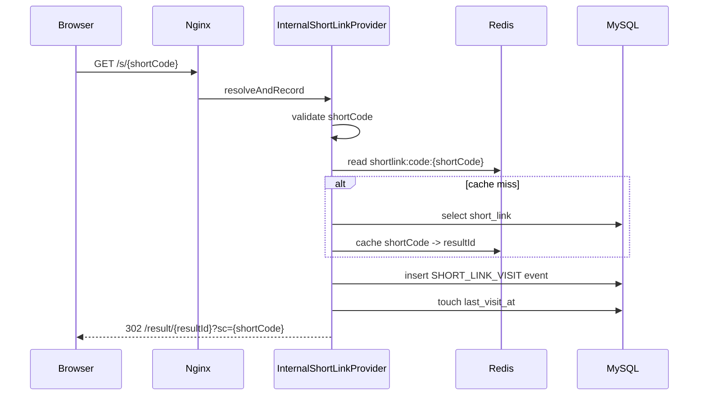
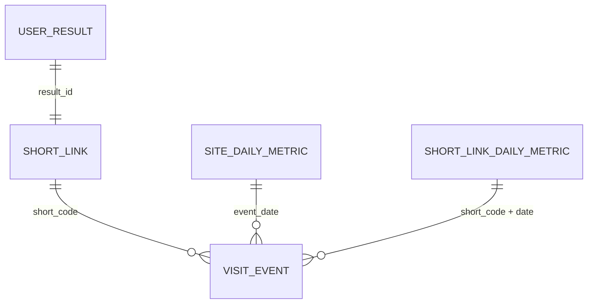
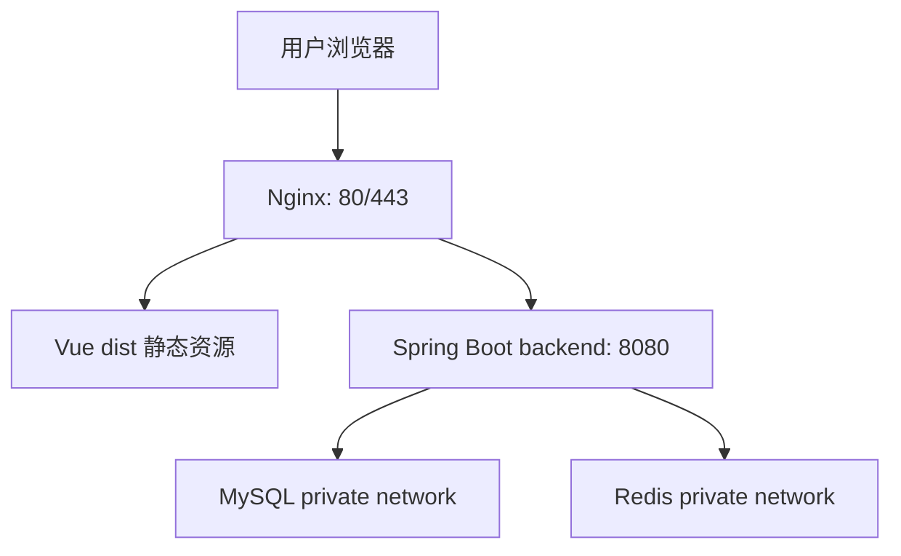
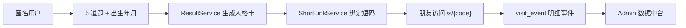
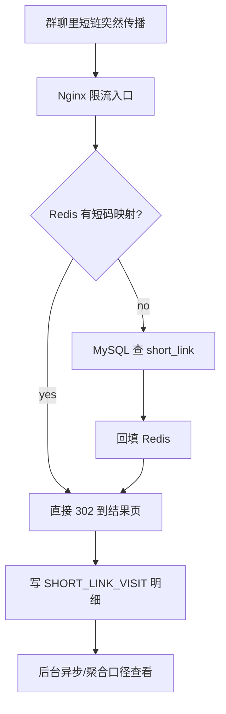
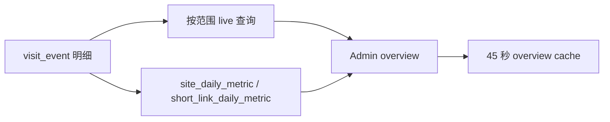

# 五行人格卡面试学习手册

## 1. 项目定位

五行人格卡是一个以“测算结果页分享”为真实业务场景的 Java 全栈项目。你面试时不要只说“我做了一个人格测试页面”，而要说清楚：

```text
匿名用户测算 -> 结果生成 -> 专属短链 -> 朋友访问 -> 访问事件 -> 后台数据中台
```

这个项目适合后端面试的原因是：它有真实业务闭环、短链系统、Redis 缓存、MySQL 统计查询、匿名隐私设计、Docker Compose 部署和可解释的性能取舍。

## 2. 系统架构



各层职责：

- Vue H5：完成首页、测试页、结果页、分享动作和后台页面展示。
- Nginx：托管静态资源，转发 `/api/**` 和 `/s/**`，承担第一层限流。
- Spring Boot：处理结果生成、短链创建/解析、事件记录、后台统计。
- MySQL：保存 `user_result`、`short_link`、`visit_event` 和日聚合表。
- Redis：缓存结果详情、短码到 resultId 映射、无效短码空值。

## 3. 核心链路

### 创建结果链路



面试要点：

- 创建结果是强业务链路，结果和短链要尽量一起成功。
- external 短链失败时可以降级 internal，保证用户仍能拿到可访问结果。
- 一次提交会放大成多次 DB 写，所以要控制事务边界和外部调用风险。

### 结果读取链路

```text
GET /api/results/{resultId}
  -> Redis result:{resultId}
  -> 未命中查 user_result + short_link
  -> 写 RESULT_VIEW 事件
  -> 返回结果页数据
```

面试要点：

- 结果详情是读多写少，适合缓存。
- 事件记录失败不应该影响用户查看结果。
- 如果 Redis 不可用，主流程仍可回源 MySQL。

### 短链跳转链路



面试要点：

- 短链是传播峰值入口，必须低延迟。
- 当前优化点是：跳转请求不再同步做 PV/UV/UIP 三次实时聚合，只记录事件和轻量更新时间。
- 后台统计仍可从事件表或日聚合表计算，用户跳转链路不被统计查询拖慢。

## 4. 数据模型



核心表：

- `user_result`：保存出生信息、答案、五行结果、星官、关键词和文案。
- `short_link`：保存 shortCode、resultId、shortUrl、累计计数和最后访问时间。
- `visit_event`：保存匿名事件，包括 eventType、resultId、shortCode、clientIdHash、ipHash、channel、campaign、deviceType。
- `site_daily_metric` / `short_link_daily_metric`：用于把明细事件聚合成更适合后台查询的数据。

## 5. 缓存设计

| 缓存 | Key | Value | 作用 |
| --- | --- | --- | --- |
| 结果详情 | `result:{resultId}` | ResultDetailVO JSON | 减少结果页重复查库 |
| 短码映射 | `shortlink:code:{shortCode}` | resultId | 降低短链跳转延迟 |
| 空短码 | `shortlink:null:{shortCode}` | `1` | 防止不存在短码反复打 DB |

缓存不是替代数据库，而是削峰。面试时要讲清楚 Redis 异常时会回源 MySQL，并且空值缓存 TTL 较短，避免长期误伤后续合法短码。

## 6. 性能与抗峰值设计

当前最重要的性能取舍：

1. 用户核心链路优先：创建结果、查看结果、短链跳转要保成功率。
2. 统计类查询后置：后台 PV/UV/UIP 不应该阻塞短链 302。
3. Redis 承担读热点：结果和短链映射都适合缓存。
4. Nginx 先挡一层：`/api/**`、`/api/events`、`/s/**` 可以有不同限流策略。
5. Admin overview 可以接受 45 秒级短缓存，避免运营刷新反复触发 live 聚合查询。
6. 统计表补齐 `created_at`、`status + created_at`、`event_type + created_at + short_code` 等索引，让后台日期筛选、短链列表和日聚合更容易走索引。
7. 单机阶段不急着上 MQ、分库分表、ES：先把热点查询、缓存和降级做好。

高峰场景回答模板：

> 如果某张人格卡在群里突然传播，最大压力会落在 `/s/{shortCode}`。我的处理是短码解析优先走 Redis，未命中才查 MySQL；访问事件保留用于统计，但跳转链路不再同步做三次 `COUNT DISTINCT`，只轻量更新最后访问时间。后台统计可以走事件表或日聚合表，这样用户 302 延迟不会被运营查询拖慢。

Admin overview 的回答可以这样补充：

> 后台总览不是用户核心链路，不需要秒级强实时。我给相同日期范围的 overview 加了 45 秒 Redis 短缓存，命中时直接返回，未命中再查事件表和聚合表；Redis 异常时退回 live 计算。这个取舍能减少运营刷新对主库的重复压力，同时不改变事件明细的真实性。

数据库索引可以这样补充：

> 我没有只靠 Redis 掩盖慢查询。对于后台总览和聚合任务，`visit_event` 补了按时间范围、时间 + client/ip 去重、事件类型 + 时间 + 短码的组合索引；`short_link` 补了 `status + created_at` 索引。这样即使缓存失效，常见日期筛选和短链列表也更容易落在可控查询路径上。

## 7. 安全与隐私

- 不做登录注册，不收集昵称和性别。
- clientId、IP、User-Agent hash 后入库。
- Referer 入库前去掉 query 和 fragment，避免泄露参数。
- 后台接口要求 `X-Admin-Token`。
- 安全响应头由后端和 Nginx 配置协同提供。
- 文案只做娱乐性人格解读，不做宿命、财富、疾病、婚恋判断。

## 8. 部署链路



常用命令：

```bash
cp deploy/.env.example deploy/.env
scripts/deploy-preflight.sh deploy/.env
docker compose --env-file deploy/.env -f deploy/docker-compose.yml up --build -d
BASE_URL=http://127.0.0.1:8088 ADMIN_TOKEN=dev-token scripts/docker-smoke-test.sh
BASE_URL=http://127.0.0.1:8088 ADMIN_TOKEN=dev-token SHORTLINK_HITS=30 scripts/performance-smoke-test.sh
```

面试要点：

- 不能直接暴露 Spring Boot 8080 到公网，公网入口应走 Nginx。
- MySQL 和 Redis 不暴露公网。
- 上线前必须替换 `ADMIN_TOKEN`、`HASH_SALT`、数据库密码和 `APP_BASE_URL`。
- 性能 smoke 不是压测报告，而是回归检查：它会创建一个真实结果，连续访问短链，并重复读取后台总览，用输出的 `shortlinkAvgMs` 和 `adminAvgMs` 观察热点链路是否明显退化。

## 9. 面试追问速答

| 问题 | 回答方向 |
| --- | --- |
| 为什么要短链 Provider？ | 隔离 internal 和 external 实现，上层结果生成不关心短链来源 |
| external 挂了怎么办？ | 可配置降级 internal，结果页仍可生成可访问短链 |
| 为什么要存本地 short_link？ | 绑定五行业务 resultId，支持后台统计和兼容跳转 |
| PV/UV/UIP 怎么算？ | PV 是事件数，UV 是 clientIdHash 去重，UIP 是 ipHash 去重 |
| 为什么 hash IP？ | 满足匿名统计，减少敏感信息落库 |
| Redis 挂了怎么办？ | 缓存读取失败返回 null，回源 DB；写缓存失败记录 warn 不阻断主流程 |
| 高峰短链怎么抗？ | Redis 映射、Nginx 限流、事件明细后置统计、避免跳转时实时 distinct 聚合 |
| 后台数据为什么能缓存？ | 后台总览用于运营观察，45 秒短缓存能削峰，明细和日聚合仍是权威来源 |
| 当前项目边界？ | 单机商业化作品，不是大型分布式平台；后续才考虑 MQ、分库分表、多租户 |

## 10. 面试讲解图谱

### 一分钟总图



这张图用于开场。你要先说清楚它不是单纯页面，而是“测算结果页分享”这个真实业务闭环。

### 热点链路图



这张图用于回答高并发。核心句子是：短链跳转先保证 302 低延迟，统计查询不阻塞用户跳转。

### 后台统计图



这张图用于解释为什么后台可以缓存：后台看趋势，不是金融交易，不需要每次刷新都实时重算。

## 11. 代码阅读路线

按这个顺序读代码，能最快形成面试表达：

| 顺序 | 文件/模块 | 你要看懂什么 |
| --- | --- | --- |
| 1 | `frontend/src/pages/TestPage.vue` | 卡片式问答、出生信息、自动前进、提交入口 |
| 2 | `frontend/src/pages/ResultPage.vue` | 分享结果页、朋友回流入口、保存分享图 |
| 3 | `backend/.../ResultService.java` | 结果生成、短链创建、事件写入、缓存写入 |
| 4 | `backend/.../ShortLinkService.java` | 短链门面和 Provider 调用边界 |
| 5 | `backend/.../InternalShortLinkProvider.java` | 短码解析、Redis 缓存、302 跳转热路径 |
| 6 | `backend/.../AdminStatService.java` | 后台总览、日期范围、overview 短缓存 |
| 7 | `backend/.../RedisCacheService.java` | 结果缓存、短码缓存、空值缓存、降级 |
| 8 | `scripts/performance-smoke-test.sh` | 如何用脚本证明短链热点链路没有明显退化 |

## 12. 8 小时学习路线

| 时间 | 学习目标 |
| --- | --- |
| 第 1 小时 | 跑通业务闭环：首页、测试、结果、短链、后台 |
| 第 2 小时 | 读 `ResultService`，讲清创建结果链路 |
| 第 3 小时 | 读 `ShortLinkService` 和 Provider，讲清 internal/external |
| 第 4 小时 | 读 `VisitEventService` 和 mapper，讲清 PV/UV/UIP |
| 第 5 小时 | 读 `RedisCacheService`，讲清缓存和降级 |
| 第 6 小时 | 读 Nginx/Compose，讲清部署拓扑 |
| 第 7 小时 | 用 Mermaid 图复述核心链路 |
| 第 8 小时 | 按面试追问表做口头演练 |
