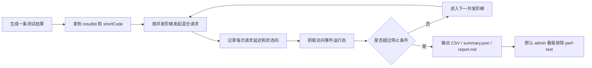
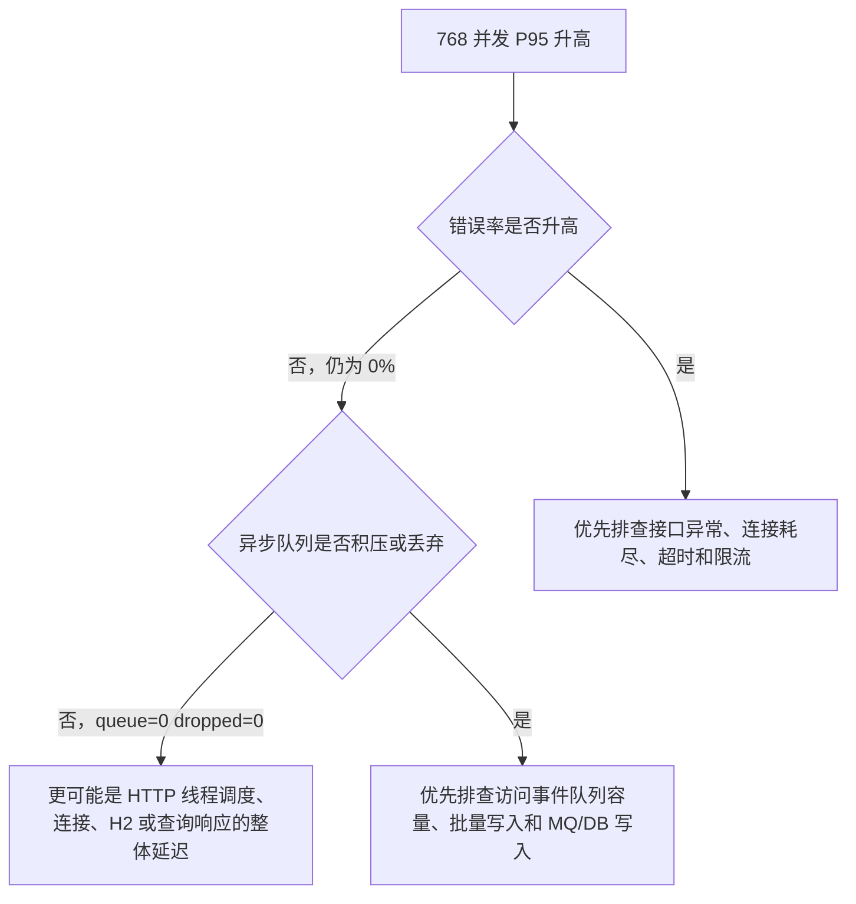

# 五行人格项目压测记录 2026-06-14

## 一句话结论

本轮压测在本地单机 `Spring Boot + H2 + 本地异步队列` 环境下完成。结果显示：混合业务流量在配置并发阶梯 `512`、`256` 个请求样本下未触发边界，`P95=406ms`、错误率 `0%`、异步事件丢弃 `0`；提升到配置并发阶梯 `768` 后 `P95=1769ms`，触发停止条件。当前边界更像是 HTTP/查询响应延迟拐点，而不是访问事件异步写入队列被打爆。

> 重要边界：这不是生产环境 QPS 结论。正式上云压测需要切到 `Nginx + Spring Boot + MySQL + Redis`，并从外部压测机发起。

## 压测对象

- Base URL: `http://127.0.0.1:18080`
- 管理端 Token: `dev-token`
- 压测脚本: [`scripts/performance-limit-test.sh`](/Users/linyuxiang/JavaBackend/06_Tools/skills/wuxing-persona-card/scripts/performance-limit-test.sh)
- 场景参数: `WORKLOAD=mixed|shortlink|result|admin|health`
- 追踪参数: 每次运行都有 `RUN_ID`，会写入 `summary.json`、`report.md`、CSV，并透传请求头 `X-Perf-Run-Id`
- 环境卡片: 每份报告记录 `Git SHA`、工作区状态、Java/Python 版本、主机名、目标 URL 和公网授权状态
- 测试流量标记:
  - `X-Channel: perf-test`
  - `X-Campaign: performance-limit-test:<RUN_ID>`（新版脚本会把实际落库 campaign 和运行批次绑定）
  - `User-Agent: wuxing-performance-limit-test/1.0`
- 主要路径:
  - `GET /s/{shortCode}`: 短链跳转热路径，不跟随 302
  - `GET /api/results/{resultId}`: 结果页读取
  - `GET /api/admin/overview`: 数据中台总览
  - `GET /api/health`: 服务健康检查
- 混合比例:
  - 短链 `60%`
  - 结果读取 `20%`
  - 后台总览 `10%`
  - 健康检查 `10%`

## 场景化压测命令

```bash
# 混合业务流量，适合模拟真实访问链路
WORKLOAD=mixed STEPS=1,2,4,8,16 REQUESTS_PER_STAGE=120 scripts/performance-limit-test.sh

# 短链热路径，只验证 302 与 Location，不跟随跳转
WORKLOAD=shortlink STEPS=32,64,128 REQUESTS_PER_STAGE=200 scripts/performance-limit-test.sh

# 结果页读取边界
WORKLOAD=result STEPS=16,32,64 REQUESTS_PER_STAGE=160 scripts/performance-limit-test.sh

# 后台总览查询边界
WORKLOAD=admin STEPS=4,8,16 REQUESTS_PER_STAGE=80 scripts/performance-limit-test.sh

# 脚本链路预检 + health 小流量，适合排除服务整体卡顿
WORKLOAD=health STEPS=1,2 REQUESTS_PER_STAGE=10 scripts/performance-limit-test.sh
```

默认情况下，压测脚本生成的事件会被数据中台排除在真实运营口径之外。需要在后台复盘压测数据时，打开“包含测试流量”开关即可看到全量。

安全闸：

- 默认只允许压测 `localhost`、`127.x.x.x`、`0.0.0.0`、`::1`。
- 如果要对公网域名压测，必须显式设置 `ALLOW_PUBLIC_LOAD_TEST=1`。
- 设置前需要确认目标域名、备案/授权、并发上限、停止条件和回滚方案，避免误伤真实访问。

可覆盖的追踪参数：

```bash
RUN_ID=prod-dry-run-001 \
SYNTHETIC_CHANNEL=perf-test \
SYNTHETIC_CAMPAIGN=performance-limit-test \
WORKLOAD=mixed \
scripts/performance-limit-test.sh
```

`SYNTHETIC_CAMPAIGN` 是基础活动名；新版脚本报告会同时写入 `Effective Synthetic Campaign`，实际事件的 `campaign` 会追加 `RUN_ID`，方便在数据中台按 Campaign 追踪某一轮压测。

## 压测流程图



## 阶梯结果

原始报告、CSV 和 summary 入口见 [压测报告索引](performance-reports/README.md)。
后续优化动作见 [五行人格项目后续性能优化方案](performance-optimization-plan.md)，其中“从报告到行动”章节把 P95、错误率、队列积压和测试流量污染映射到具体排查步骤。

| 轮次 | 报告 | 并发范围 | 关键结论 |
| --- | --- | ---: | --- |
| 基线轮 | [`20260614-010218`](/Users/linyuxiang/JavaBackend/06_Tools/skills/wuxing-persona-card/docs/performance-reports/20260614-010218/report.md) | 1-16 | 全部通过，16 并发 `P95=54ms` |
| 中高并发轮 | [`20260614-010616`](/Users/linyuxiang/JavaBackend/06_Tools/skills/wuxing-persona-card/docs/performance-reports/20260614-010616/report.md) | 32-128 | 全部通过，128 并发 `P95=273ms` |
| 冲顶轮 | [`20260614-010708`](/Users/linyuxiang/JavaBackend/06_Tools/skills/wuxing-persona-card/docs/performance-reports/20260614-010708/report.md) | 192-512 | 全部通过，512 配置阶梯 `P95=406ms` |
| 边界轮 | [`20260614-011017`](/Users/linyuxiang/JavaBackend/06_Tools/skills/wuxing-persona-card/docs/performance-reports/20260614-011017/report.md) | 768-1024 | 768 配置阶梯 `P95=1769ms`，自动停止 |

## 报告环境卡片怎么读

后续新报告会在开头写入环境卡片。面试或复盘时重点看这些字段：

| 字段 | 作用 |
| --- | --- |
| `Run ID` | 对齐 CSV、summary、请求头和人工备注 |
| `Git SHA` / `Git state` | 判断这次压测对应哪一版代码，工作区是否有未提交改动 |
| `Java` / `Python` | 解释运行时版本差异，避免不同机器结果混比 |
| `Host` | 区分本机、服务器或外部压测机 |
| `Public target allowed` | 判断是否是公网压测，公网必须有显式授权 |

## 关键数据

| 并发 | 请求数 | RPS | Avg(ms) | P50 | P95 | P99 | 错误率 | 队列 | 落库增量 | 丢弃增量 |
| ---: | ---: | ---: | ---: | ---: | ---: | ---: | ---: | ---: | ---: | ---: |
| 128 | 160 | 426.67 | 172.59 | 170 | 273 | 295 | 0.00% | 0 | 128 | 0 |
| 512 | 256 | 458.78 | 259.82 | 291 | 406 | 458 | 0.00% | 0 | 208 | 0 |
| 768 | 1024 | 406.83 | 1033.01 | 1078 | 1769 | 1822 | 0.00% | 0 | 820 | 0 |

注意：表里的“并发”是脚本配置阶梯，实际并发上限还受每阶请求数限制。正式复测建议让 `REQUESTS_PER_STAGE >= concurrency * 2`，或改用固定时长压测，避免把样本量不足的阶梯误讲成稳态容量。

## 分接口观察

768 并发下，四类接口 P95 同步升高：

| 接口类型 | P95(ms) | 说明 |
| --- | ---: | --- |
| shortlink | 1787 | 短链 302 热路径也被整体延迟拖高 |
| result | 1680 | 结果读取开始进入秒级等待 |
| admin | 1689 | 后台总览查询也进入明显延迟 |
| health | 1331 | 健康检查也变慢，说明不是单一业务 SQL 问题 |

## 瓶颈判断



本轮最有价值的结论不是“能扛多少 QPS”，而是已经建立了专业压测方法：

- 每轮都有固定停止条件：`P95` 和错误率。
- 每轮都记录分接口指标，而不是只看总平均值。
- 每轮都抓取访问事件运行态，能判断异步统计是否成为瓶颈。
- 压测产物可复现：CSV、summary JSON、Markdown 报告都落盘。
- 每轮都有 `perf-test` 渠道标记，默认不会污染数据中台的真实运营视图。
- 每轮都有 `RUN_ID`，便于把请求、CSV、报告和人工备注对齐。
- 每轮都有环境卡片，避免把本地 H2 结果误当成生产 MySQL/Nginx 结论。

## 下一轮生产式压测建议

1. 切换到 `deploy/docker-compose.yml` 的 MySQL/Redis/Nginx 链路。
2. 从另一台机器或云压测机访问公网域名，避免本机回环网络失真。
3. 先用 `WORKLOAD=health` 排除服务整体卡顿，再用 `shortlink/result/admin` 分别压单路径，最后用 `mixed` 压真实业务组合。
4. 同步观察 `docker stats`、JVM/GC、Nginx access log status/upstream time、MySQL processlist/slow log、Redis INFO 和访问事件运行态。
5. 将停止条件设为更贴近用户体验：`P95 > 800ms` 或错误率 `> 1%` 即停止。
6. 把 `droppedAsyncEvents > 0`、`batchWriteFailures > 0`、`healthStatus=danger`、队列水位超过阈值也列为硬停止线。
