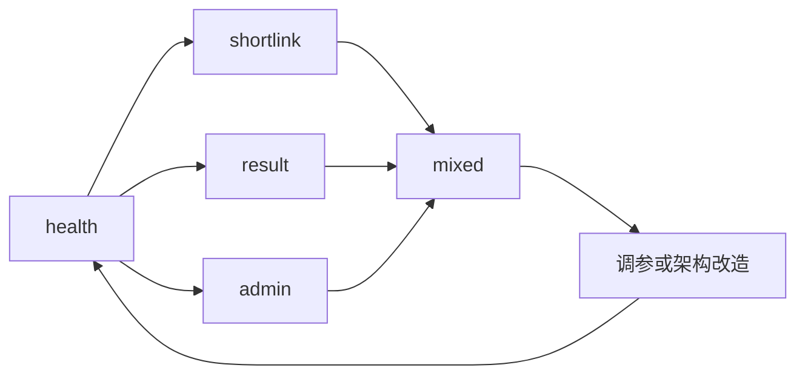
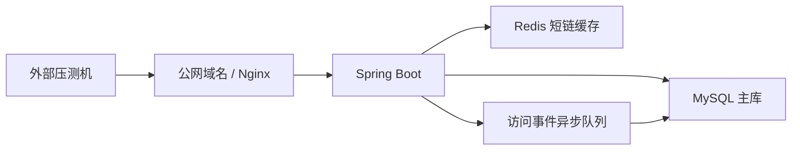

# 五行人格项目后续性能优化方案

## 当前状态

项目已经具备可运行的性能观测闭环：

- 短链访问事件走异步写入，避免把统计落库阻塞在用户跳转链路上。
- 数据中台有运行态指标，可以观察队列、丢弃、批量写失败、RocketMQ shadow 和回退状态。
- 阶梯压测脚本已经能生成 CSV、JSON 和 Markdown 报告，并写出“自动结论与下一步”。
- 公网多阶压测脚本会要求 `STAGE_COOLDOWN_SECONDS>=30`，避免未冷却状态被误读为下一阶容量。
- 压测和 smoke 脚本默认写入 `X-Channel=perf-test`，后台验证会显式包含测试流量，日常数据中台默认排除这些工程样本。
- 后台 overview 使用 45 秒版本化短缓存，手动日聚合成功后会切换缓存版本，不需要等待旧缓存自然过期。
- 本地单机压测显示：配置并发阶梯 512、256 请求样本未触发边界，配置并发阶梯 768 触达延迟边界。
- 当前阈值版 smoke 显示：本地 `127.0.0.1:48082` 下短链 P95 `27ms`、后台 overview P95 `36ms`、访问事件队列 `0`、丢弃 `0`、批量写失败 `0`；这是每轮改动后的回归门，不是容量上限。
- 当前本机 admin 单路径回归显示：后台 overview 在 `1-64` 小阶梯下完成所有阶段，最后一阶 P95 `216ms`、错误率 `0%`；这只证明本地回归健康，不代表公网后台容量。
- 当前本机 result 单路径回归显示：结果读取在 `1-64` 小阶梯下完成所有阶段，最后一阶 P95 `112ms`、错误率 `0%`；这只证明本地回归健康，不代表公网结果页容量。
- 当前本机 shortlink 单路径回归显示：短链 302 热路径在 `1-64` 小阶梯下完成所有阶段，最后一阶 P95 `185ms`、错误率 `0%`；这只证明本地回归健康，不代表公网短链容量。

公网压测前的逐阶观测模板见 [`production-load-observability-checklist.md`](production-load-observability-checklist.md)。

## 三类验证脚本分别证明什么

| 工具 | 证明什么 | 不证明什么 | 典型使用时机 |
| --- | --- | --- | --- |
| `/api/readiness` | 核心表 `core_schema` 可查询，结果、短链、访问事件和日聚合基础依赖可用 | 不证明 Redis、RocketMQ、外部短链、全链路写入和吞吐能力 | 部署后、smoke 前、阶梯压测前置门禁 |
| `scripts/performance-smoke-test.sh` | 热点链路没有明显回归；短链 302、结果读取、后台 overview、访问事件 runtime 都能跑通 | 不证明系统极限，不证明生产 QPS，也不替代长时间压测 | 每次改动后的小样本回归、低延迟阈值门 |
| `scripts/performance-limit-test.sh` | 在指定环境、指定 workload 和并发阶梯下，P95、错误率、状态码、runtime stop gate 的变化轨迹 | 不自动外推到其他机器、其他数据库、公网链路或长期稳定性 | 容量摸底、瓶颈定位、压测报告沉淀 |

面试或复盘时要先说工具边界：readiness 是“依赖前置检查”，performance smoke 是“回归门”，performance limit 才是“阶梯探测报告”。三者组合起来能证明工程方法完整，但没有真实公网授权压测前，仍不能说已经验证生产容量。

`performance-limit-test.sh` 如果在公网授权、部署画像、冷却时间、runtime 可观测或 RocketMQ shadow 等前置条件上拒绝执行，会在 `OUT_DIR` 写出 `preflight-failed.json`。这类文件只能证明脚本安全地拒跑，不能当作容量报告。

用于正式沉淀的本地阶梯报告建议打开：

```bash
STRICT_RUNTIME_OBSERVATION=1 scripts/performance-limit-test.sh
```

这样即使目标是本机 loopback，只要访问事件 runtime 在 preflight、阶段前或阶段后不可观测，脚本也会停止，而不是把“没观测到风险”误写成“没有风险”。

用于每次改动后的阈值回归门可以使用：

```bash
BASE_URL=http://127.0.0.1:48082 ADMIN_TOKEN=dev-token \
SHORTLINK_HITS=8 ADMIN_HITS=2 \
MAX_SHORTLINK_P95_MS=220 MAX_ADMIN_P95_MS=500 \
MAX_ASYNC_QUEUE_SIZE=0 MAX_ASYNC_DROPPED_EVENTS=0 MAX_ASYNC_BATCH_FAILURES=0 \
SMOKE_OUT_DIR=docs/performance-reports/smoke-manual-$(date +%Y%m%d%H%M%S) \
scripts/performance-smoke-test.sh
```

本轮样例输出：`shortlinkP95Ms=27`、`adminP95Ms=36`、`runtimeHealthStatus=ok`、`asyncQueueSize=0`、`asyncDroppedEvents=0`、`asyncBatchWriteFailures=0`、`readinessStatus=UP`。

## 从报告到行动

每次压测后先按下面的表判断，不要看到延迟升高就直接调 JVM、加机器或引入 MQ。

| 触发现象 | 优先判断 | 下一步动作 | 验证方式 |
| --- | --- | --- | --- |
| `health` P95 也升高 | 整体运行环境、线程调度或机器资源压力 | 先停压测，看 CPU、内存、负载、Tomcat 线程和容器日志 | 重新跑 `WORKLOAD=health`，确认健康检查恢复 |
| `shortlink` 升高但 `health` 正常 | 短码解析、Redis 回源、302 链路或事件入队 | 查 Redis 命中、无效短码缓存、`last_visit_at` 低频更新和事件队列 | 跑 `WORKLOAD=shortlink`，观察 P95、状态码和队列 |
| `result` 升高但 `shortlink` 正常 | 结果读取、结果缓存、文案对象序列化 | 查结果缓存命中、DB 查询和接口响应体大小 | 跑 `WORKLOAD=result`，对比缓存冷/热两轮 |
| `admin` 升高但用户链路正常 | 后台聚合、日期范围、实时明细 distinct 查询 | 优先使用日聚合、缩小日期范围、检查 overview cache | 跑 `WORKLOAD=admin`，看 `metricSource` 和 P95 |
| 错误率上升 | 连接耗尽、异常、限流或超时 | 立即停止升并发，先查 5xx、超时、Nginx/backend 日志 | 错误率恢复到目标阈值以下再继续 |
| `queueSize` 持续上升 | 异步事件写入速度小于进入速度 | 查 DB 写入、批量大小、队列容量，必要时降低流量 | 看 `queueSize` 是否回落、`totalFlushedEvents` 成功落库数是否增长 |
| `droppedAsyncEvents` 增加 | 统计事件已经丢失 | 停止压测，优先扩队列、提 drain、查 DB 写入或 MQ fallback | 丢弃不再增加后重新跑小阶梯 |
| `batchWriteFailures` 增加 | 批量落库失败 | 查表结构、SQL、连接池、锁等待和异常日志 | 小流量下确认批量写失败保持 `0` |
| 默认看板数字异常高 | 压测流量污染或口径混用 | 关闭“包含测试流量”，看“口径差异”增量 | 对照 `RUN_ID`、`summary.json` 和 `perf-test` 渠道 |

控制变量顺序：



只有单路径瓶颈清楚以后，才进入 mixed 压测和调参。否则 mixed 结果只会告诉你“整体变慢了”，不能告诉你该优化哪里。

## 优化优先级

### P0：把压测环境切到真实部署形态

本地 H2 压测只适合看方法，不适合下生产结论。下一步应先完成真实链路压测：



验收标准：

- 能输出公网域名下的短链、结果页、后台总览三类报告。
- 报告包含 P50、P90、P95、P99、错误率、状态码分布。
- 同时保存服务端运行态快照。

### P0：保护短链热路径

短链是传播链路里最敏感的接口。用户点不开，分享闭环就断了。

优化方向：

- 短链解析优先走 Redis，DB 只作为回源。
- 访问事件只入异步队列，不在跳转请求里等待落库。
- 对不存在或过期短链做轻量错误页，不进入复杂业务逻辑。
- Nginx 层启用 gzip、连接复用和合理超时。

建议目标：

- 短链 302 热路径 P95 控制在 `150ms` 内。
- 峰值时允许统计最终一致，但不允许跳转阻塞。

### P1：后台统计查询分层

数据中台查询天然会变重，不能和用户访问链路抢资源。

优化方向：

- 已闭合历史日期优先读 `daily_metric` 聚合表。
- 当天和未聚合日期才回退 `visit_event` 明细。
- 后台 overview 使用短 TTL + 版本号缓存；手动日聚合成功后推进版本，避免刷新后还看到旧口径。
- 长周期统计走离线任务或异步刷新，不在页面打开时临时大查询。
- `statSource=local/external` 是计算后来源筛选，当前会跨完整日期范围分页扫描；继续放大后应沉淀为离线 BI 或物化字段。
- 默认排除压测流量时，结果/短链实体会通过 `visit_event` 反查创建事件；已补 `result_id + event_type + channel` 索引，避免数据量变大后 `NOT EXISTS` 退化为大范围扫描。
- 短链列表批量统计按 `event_type + short_code + created_at + channel` 走索引，服务于桌面数据中台的分页列表和测试流量过滤。

建议目标：

- 后台总览 P95 控制在 `500ms` 内。
- 数据中台慢查询不影响短链与结果页。

### P1：测试流量实体层隔离

当前默认看板已经通过 `visit_event.channel=perf-test` 排除测试流量，但这仍属于视图层隔离。下一阶段应把来源下沉到实体层：

- `user_result.source_channel/source_campaign/synthetic`
- `short_link.source_channel/source_campaign/synthetic`
- Admin 默认查询使用 `synthetic=0`，减少对 `visit_event` 的反查依赖。
- 日聚合增加口径维度，例如 `organic` 和 `all`，避免默认排除时只能回退实时明细。

详细设计见 [测试流量隔离架构决策 v1](synthetic-traffic-isolation-design.md)。

### P1：RocketMQ 可选接入升级

当前 RocketMQ 方案适合做 shadow 验证，后续可以升级为真正削峰。

推荐分三步走：

| 阶段 | 模式 | 目标 |
| --- | --- | --- |
| Shadow | MQ 发布成功后仍写本地队列 | 验证 MQ 可用性，不改变数据来源 |
| Fallback | MQ 失败回退本地队列 | 保证 MQ 波动时不丢统计 |
| Consumer 接管 | MQ consumer 幂等落库 | 真正把统计写入从应用请求链路剥离 |

必须补齐：

- `eventId` 幂等，避免重复消费导致 PV 虚高。
- 死信队列和重试策略。
- consumer 落库失败告警。
- 日聚合重算能力。

### P2：JVM 与连接池调优

只有在真实部署压测后再做细调，不要提前拍脑袋。

可观察项：

- Tomcat 最大线程数、等待队列。
- HikariCP 活跃连接、等待连接、连接超时。
- JVM GC 暂停时间。
- MySQL 慢查询和索引命中。
- Redis 命中率和网络延迟。

建议动作：

- 先用默认值压出瓶颈，再逐项调参。
- 每次只改一个变量，保留对照报告。
- 所有调参都要服务于 P95 和错误率，不只看平均响应。

## 面试表达口径

可以这样讲：

> 这个项目的性能重点不是把所有请求都做成强一致，而是把传播链路拆成用户体验路径和运营统计路径。短链跳转和结果读取优先保障低延迟，访问统计走异步队列做最终一致。数据中台则通过实时明细和日聚合分层，避免运营查询拖慢用户链路。后续 RocketMQ 会以 shadow、fallback、consumer 接管三阶段引入，确保可回退、可验证，再谈生产接管。

不要这样讲：

- 不说“本地压测证明生产能抗 768 并发”，因为环境不等价。
- 不说“RocketMQ 已经完整削峰”，目前更准确是“具备可选接入和 shadow 验证”。
- 不说“所有统计实时准确”，更准确是“运营统计最终一致，用户路径优先低延迟”。
