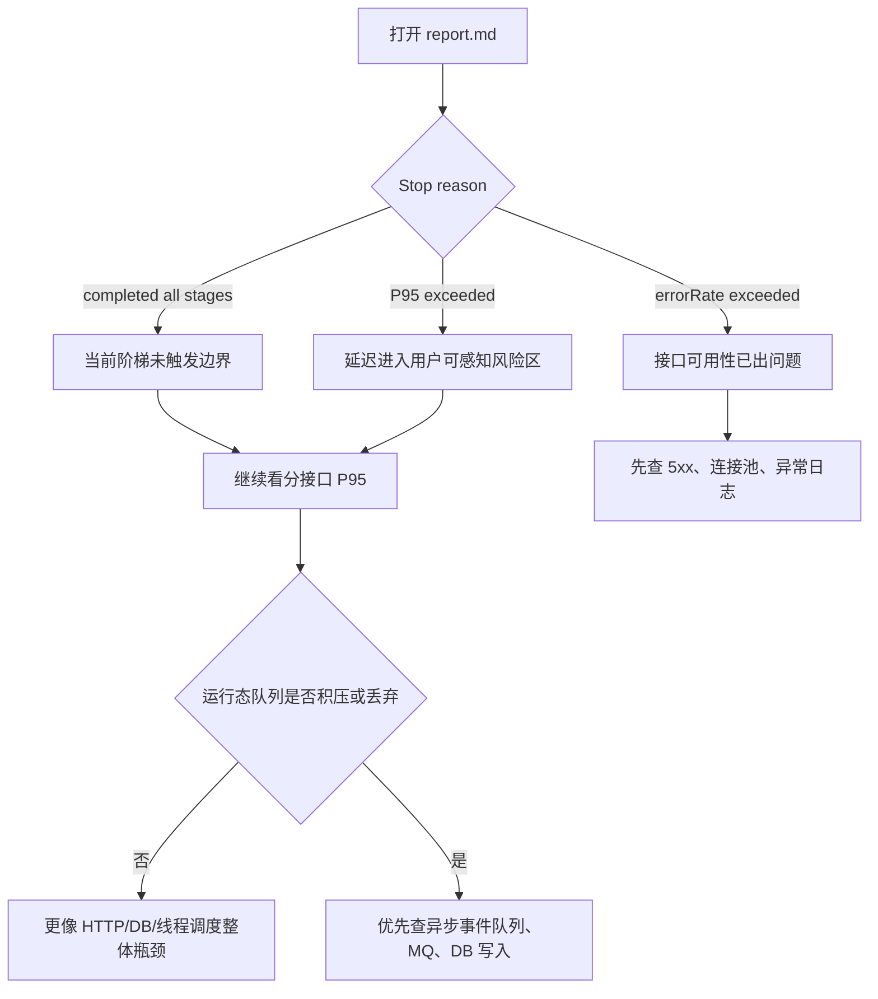

# 压测报告索引

## 一句话结论

当前报告证明的是“本地单机阶梯压测方法已经建立”，不是生产 QPS 结论。2026-07-04 新增数据中台分页后的本地 mixed 小阶梯报告：1-16 并发全部完成，最高 P95 `8ms`，错误率 `0.00%`，访问事件队列无丢弃、无批量写失败；后续生产结论必须在 `Nginx + Spring Boot + MySQL + Redis` 的真实链路上重新压测。

需要面试、PPT 或复盘讲解时，先看 [`../performance-visual-brief.md`](../performance-visual-brief.md)。报告索引保留原始证据，视觉简报负责把证据讲成一条清楚的性能故事线。

## 报告总览

| Run | Workload | 并发范围 | 最后一阶 P95 | 错误率 | 停止原因 | 报告 |
| --- | --- | ---: | ---: | ---: | --- | --- |
| `20260704-admin-dashboard-limit` | mixed | 1-16 | 8ms | 0.00% | completed all stages | [report](20260704-admin-dashboard-limit/report.md) |
| `20260621-shortlink-redirect-optimized` | shortlink | 1-64 | 179ms | 0.00% | completed all stages | [report](20260621-shortlink-redirect-optimized/report.md) |
| `20260621-mixed-after-shortlink-optimization` | mixed | 1-32 | 104ms | 0.00% | completed all stages | [report](20260621-mixed-after-shortlink-optimization/report.md) |
| `20260614-010218` | legacy mixed | 1-16 | 54ms | 0.00% | completed all stages | [report](20260614-010218/report.md) |
| `20260614-010616` | legacy mixed | 32-128 | 273ms | 0.00% | completed all stages | [report](20260614-010616/report.md) |
| `20260614-010708` | legacy mixed | 192-512 | 406ms | 0.00% | completed all stages | [report](20260614-010708/report.md) |
| `20260614-011017` | legacy mixed | 768 | 1769ms | 0.00% | P95 exceeded 800ms | [report](20260614-011017/report.md) |
| `workflow-health-verify` | health | 1-2 | 1ms | 0.00% | completed all stages | [report](workflow-health-verify/report.md) |
| `workflow-health-env-card` | health | 1-2 | 1ms | 0.00% | completed all stages | [report](workflow-health-env-card/report.md) |
| `workflow-shortlink-location-verify` | shortlink | 1 | 11ms | 0.00% | completed all stages | [report](workflow-shortlink-location-verify/report.md) |
| `workflow-health-analysis-section` | health | 1 | 0ms | 0.00% | completed all stages | [report](workflow-health-analysis-section/report.md) |
| `workflow-mixed-current-sanity` | mixed | 1-32 | 104ms | 0.00% | completed all stages | [report](workflow-mixed-current-sanity/report.md) |
| `workflow-admin-current-sanity` | admin | 1-64 | 216ms | 0.00% | completed all stages | [report](workflow-admin-current-sanity/report.md) |
| `workflow-result-current-sanity` | result | 1-64 | 112ms | 0.00% | completed all stages | [report](workflow-result-current-sanity/report.md) |
| `workflow-shortlink-current-sanity` | shortlink | 1-64 | 185ms | 0.00% | completed all stages | [report](workflow-shortlink-current-sanity/report.md) |

`legacy mixed` 表示这些报告生成于环境卡片和 `WORKLOAD` 字段完善之前，实际场景是混合业务链路。

`workflow-health-env-card` 是环境卡片格式验证报告，只用于确认新版脚本会写入运行上下文和 synthetic 标记，不代表业务链路性能。

`workflow-shortlink-location-verify` 是 shortlink 跳转校验报告，用于确认新版脚本会保存并校验 `Location` 响应头。这个能力不能回贴到 legacy mixed 报告上，下一轮真实链路压测需要用新版脚本重新覆盖。

`workflow-health-analysis-section` 是新版“自动结论与下一步”报告样例，用于确认脚本会把停止原因、最慢接口、runtime 风险和本地/公网外推边界写成可读结论。它仍然只是 health 小流量格式验证，不代表业务容量。

`workflow-mixed-current-sanity` 是当前代码状态下的新版 mixed 小阶梯回归，覆盖短链、结果读取、后台 overview 和 health。它用于证明新版脚本在混合链路上也能写出环境卡片、自动结论、runtime 增量和分接口 P95；因为目标仍是本机 `local-h2`，不能作为生产容量结论。

`workflow-admin-current-sanity` 是当前代码状态下的后台 overview 单路径回归。它用于单独观察数据中台相关查询、overview cache、日期口径和聚合查询在本机小阶梯下的表现；因为目标仍是本机 `local-h2`，不能外推为公网后台容量。

`workflow-result-current-sanity` 是当前代码状态下的结果读取单路径回归。它用于单独观察结果页读取、结果缓存和访问事件入队在本机小阶梯下的表现；因为目标仍是本机 `local-h2`，不能外推为公网结果页容量。

`workflow-shortlink-current-sanity` 是当前代码状态下的短链热路径单路径回归。它用于观察 `/s/{code}` 302、`Location` 响应、访问事件入队和本地短链查询在本机小阶梯下的表现；因为目标仍是本机 `local-h2`，不能外推为公网短链容量。

`20260704-admin-dashboard-limit` 是数据中台分页改造后的本地 mixed 回归，覆盖短链、结果读取、后台 overview 和 health，同时开启 `STRICT_RUNTIME_OBSERVATION=1`。它用于确认分页后台和访问事件异步写入在本机小样本下仍然可观测、无队列积压、无丢弃、无批量写失败；因为目标仍是本机 `local-h2`，不能外推为公网容量。

`20260621-shortlink-redirect-optimized` 是本轮短链热路径优化后的正式本地回归，重点验证 `/s/{code}` 302、`Location`、`last_visit_at` 限频后的跳转稳定性和访问事件 runtime。它仍然是本机 `local-h2` 证据，不等同公网容量。

`20260621-mixed-after-shortlink-optimization` 是同一轮优化后的 mixed 回归，用于确认短链优化没有拖累结果读取、后台 overview 和 health；最高阶最慢接口是 admin，适合作为下一轮后台查询优化的线索。

本轮另有一份 `20260621-shortlink-redirect-optimized/preflight-failed.json`，记录了修复前 local H2 内存库丢表导致 readiness 拒跑的真实前置失败。它不是通过报告，但保留为质量门拦截风险的证据。

## 阈值版 smoke 记录

阶梯报告用于摸容量曲线，`scripts/performance-smoke-test.sh` 用于每次改动后的低成本回归门。本轮阈值版 smoke 在 `BASE_URL=http://127.0.0.1:48082` 下通过，并额外落盘到 [`20260704-admin-dashboard-smoke`](20260704-admin-dashboard-smoke/summary.json)：

| 检查项 | 结果 |
| --- | ---: |
| `shortlinkP95Ms` | `30ms` |
| `adminP95Ms` | `28ms` |
| `asyncQueueSize` | `0` |
| `asyncDroppedEvents` | `0` |
| `asyncBatchWriteFailures` | `0` |
| `runtimeHealthStatus` | `ok` |
| `readinessStatus` | `UP` |

这条记录证明当前小样本回归门通过，不说明生产容量，也不能替代 `performance-limit-test.sh` 的 stepped report。

后续 smoke 建议带上 `SMOKE_OUT_DIR`，让回归门也留下 `smoke-output.txt` 和 `summary.json`：

```bash
BASE_URL=http://127.0.0.1:48082 ADMIN_TOKEN=dev-token \
SHORTLINK_HITS=8 ADMIN_HITS=2 \
MAX_SHORTLINK_P95_MS=220 MAX_ADMIN_P95_MS=500 \
MAX_ASYNC_QUEUE_SIZE=0 MAX_ASYNC_DROPPED_EVENTS=0 MAX_ASYNC_BATCH_FAILURES=0 \
SMOKE_OUT_DIR=docs/performance-reports/smoke-manual-$(date +%Y%m%d%H%M%S) \
scripts/performance-smoke-test.sh
```

## 下一轮 strict mixed 本地模板

SRE 自审建议在下一轮允许本机端口访问时补一条 strict runtime 的 mixed 小阶梯报告，用来证明混合链路在“runtime 必须可观测”的门禁下仍可跑通。建议命令：

```bash
BASE_URL=http://127.0.0.1:48082 ADMIN_TOKEN=dev-token \
OUT_DIR=/private/tmp/wuxing-mixed-strict-runtime-check \
WORKLOAD=mixed STEPS=1,2,4,8 REQUESTS_PER_STAGE=32 \
STRICT_RUNTIME_OBSERVATION=1 \
scripts/performance-limit-test.sh
```

这条模板的目的只是本地 `local-h2` 严格门禁验证：如果 runtime 在 preflight、阶段前或阶段后不可观测，脚本应停止；即使通过，也不能写成公网容量结论。

## 怎么读这些报告

先看停止原因，再看 P95，不要只看平均响应：



## 关键结论

- 配置并发阶梯 `512`：`256` 个请求样本下混合链路 P95 为 `406ms`，错误率 `0%`，异步事件丢弃 `0`。
- 配置并发阶梯 `768`：P95 升至 `1769ms`，同时 health/admin/result/shortlink 都变慢，更像整体运行环境或线程/连接/查询延迟拐点。
- 访问事件队列在本轮没有成为第一瓶颈；但压测脚本已经把队列、落库增量、丢弃增量写进报告，后续真实链路可以继续观察。
- `workflow-health-verify` 只用于验证脚本的 `WORKLOAD=health` 分支，不代表业务链路性能。

## 新报告应该满足什么

后续每次压测都应满足：

1. 报告开头有环境卡片：`Run ID`、Git SHA、工作区状态、Java/Python 版本、主机名、目标 URL。
2. 请求带 `X-Channel: perf-test`、`X-Perf-Run-Id` 和包含 `RUN_ID` 的 effective campaign，默认不污染数据中台真实运营口径，同时能在 Campaign 维度追踪某轮压测。
3. `WORKLOAD=shortlink` 的 CSV 应包含 `location` 列，302 响应必须带可用跳转目标。
4. 压测前必须通过 `/api/readiness`，确认核心业务表可查询，避免进程活着但 schema 不可用。
5. 公网目标必须显式设置 `ALLOW_PUBLIC_LOAD_TEST=1`，且 `REQUESTS_PER_STAGE >= max(STEPS) * 2`。
6. 报告必须写入 `DEPLOYMENT_PROFILE`，例如 `local-h2`、`compose-mysql`、`public-compose`；公网目标不能继续使用 `local-h2` / `local` / `dev`。
7. 公网多阶压测必须设置 `STAGE_COOLDOWN_SECONDS>=30`，报告环境卡片也要写出冷却秒数。
8. 公网目标必须能读取访问事件 runtime；如果 runtime 缺失、不可观测、基线丢弃或批量失败超过阈值，脚本应拒绝继续。
9. 正式沉淀的本地报告建议设置 `STRICT_RUNTIME_OBSERVATION=1`，避免 runtime 不可观测时误写“未观察到丢弃或失败”。
10. 公网且 `asyncMode=rocketmq` 时，若 MQ 不可用或 consumer 未就绪，默认拒绝压测；只有明确设置 `ALLOW_ROCKETMQ_SHADOW_LOAD_TEST=1` 才测试 shadow/fallback。
11. 报告应包含“自动结论与下一步”，把停止原因、最慢接口、runtime 风险和外推边界讲清楚。
12. 每轮至少保存 `summary.json`、`report.md` 和各阶梯 CSV。
13. 压测记录要说明停止条件，不把本地 H2 结果宣传成生产 MySQL/Nginx 结论。

如果脚本在前置安全检查阶段拒绝执行，会在 `OUT_DIR` 写入 `preflight-failed.json`，记录拒跑原因、阶段、Run ID、目标 URL、workload、部署画像和安全开关。这个文件不是压测报告，但可以用于复盘“为什么没有继续加压”。

## 下一轮建议

推荐下一轮按这个顺序跑：

1. `WORKLOAD=health`：排除服务整体不可用。
2. `WORKLOAD=shortlink`：单压短链 302 热路径。
3. `WORKLOAD=result`：单压结果读取。
4. `WORKLOAD=admin`：单压后台总览。
5. `WORKLOAD=mixed`：最后再压真实混合业务比例。

压测后不要直接调参，先按 [性能优化方案](../performance-optimization-plan.md) 的“从报告到行动”表判断瓶颈属于整体环境、短链、结果读取、后台查询、异步队列还是测试流量口径。

公网压测前先按 [生产压测观测清单](../production-load-observability-checklist.md) 准备授权窗口、停止条件、服务端采集和每阶冷却。
