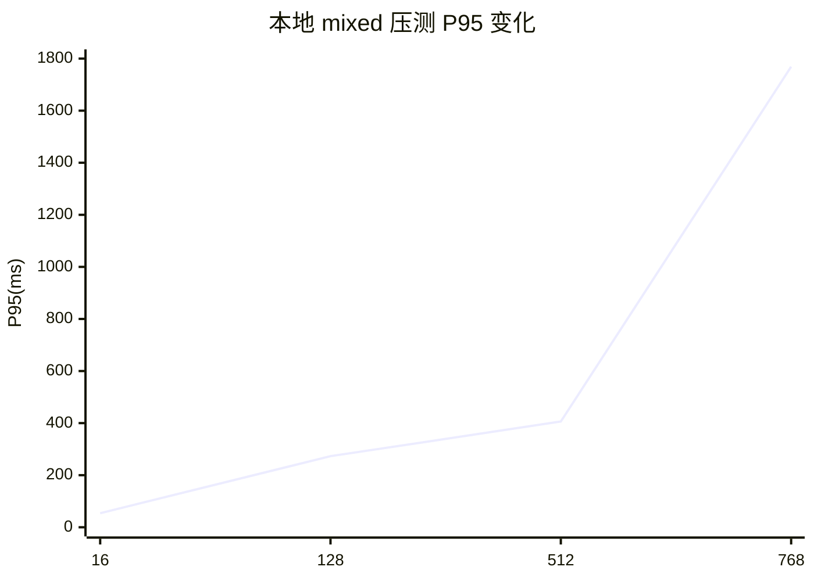
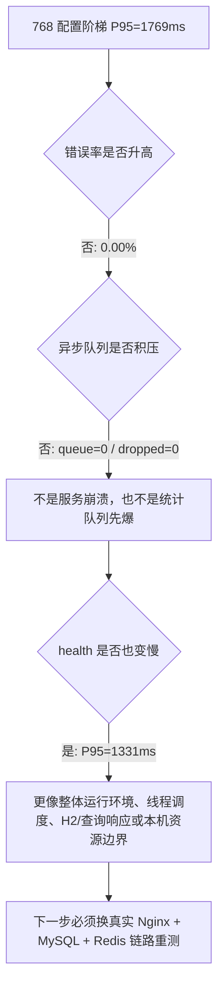
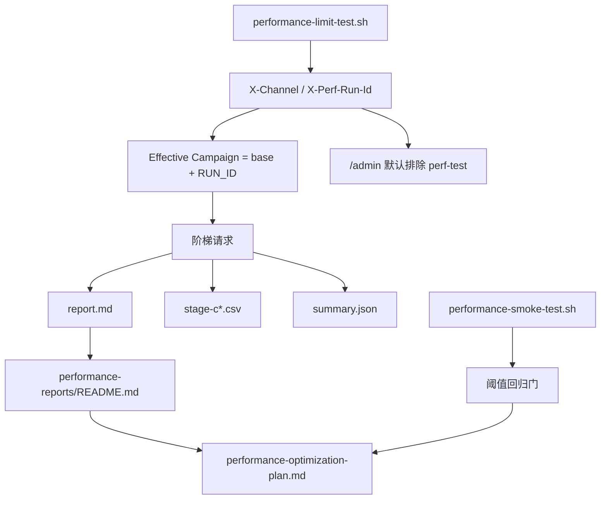
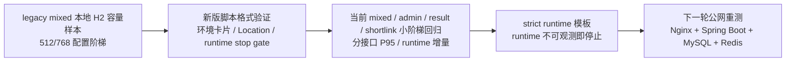

# 五行人格项目压测视觉简报 v1

记录日期：2026-06-14

## 一句话结论

本地单机压测已经证明：项目具备可复现的阶梯压测方法、明确的停止条件、可解释的报告产物和默认运营视图隔离能力。当前本地 `Spring Boot + H2 + 本地异步队列` 混合业务链路在配置并发阶梯 `512`、`256` 个请求样本下未触发边界，配置并发阶梯 `768` 时触发 P95 延迟边界；这个结论不能直接等同于公网生产 QPS。

## 这份简报怎么用

- 给普通观众：看“容量故事线”和“红线图”，知道项目不是只做页面。
- 给面试官：看“为什么 768 不是失败”和“下一轮真实压测矩阵”，体现工程边界感。
- 给自己复盘：看“报告证据链”和“瓶颈判断图”，后续每次压测按同一套格式补证据。

## 容量故事线

| 阶段 | 配置阶梯 | P95 | 错误率 | 队列/丢弃 | 怎么讲 |
| --- | ---: | ---: | ---: | --- | --- |
| 基线 | 16 | 54ms | 0.00% | queue=0 / dropped=0 | 低压下链路和脚本健康 |
| 中段 | 128 | 273ms | 0.00% | queue=0 / dropped=0 | 业务混合流量进入稳定区 |
| 高压 | 512 | 406ms | 0.00% | queue=0 / dropped=0 | 256 请求样本未触发错误率和队列边界 |
| 边界 | 768 | 1769ms | 0.00% | queue=0 / dropped=0 | 用户可感知延迟出现，脚本按停止条件刹车 |

## P95 红线图

如果 Mermaid `xychart-beta` 在某些环境不渲染，可以按下面这张表讲：

| 配置阶梯 | P95 | 用户体验解释 |
| ---: | ---: | --- |
| 16 | 54ms | 基本无感 |
| 128 | 273ms | 仍然顺滑 |
| 512 | 406ms | 可接受，但已进入需要观察区 |
| 768 | 1769ms | 明显等待，应该停止并定位瓶颈 |

## 为什么 768 不是失败

这轮最有价值的不是“我能说自己抗住 512 并发”，而是：

- 脚本知道什么时候该停，避免把服务压到不可恢复。
- 报告会同时看总 P95、分接口 P95、错误率和异步队列。
- 数据中台能通过 `channel=perf-test` 默认排除压测流量。
- 历史 `512/768` 报告是 legacy mixed 容量样本；新版脚本已补环境卡片、synthetic 标记、runtime 停止门禁和 `WORKLOAD=shortlink` 的 `Location` 校验，下一轮需要用新版脚本重新覆盖真实链路。

## 分接口放大现象

768 并发下，四类接口 P95 同步升高：

| 接口类型 | P95 | 说明 |
| --- | ---: | --- |
| shortlink | 1787ms | 短链 302 热路径也被整体拖慢 |
| result | 1680ms | 结果读取进入秒级等待 |
| admin | 1689ms | 后台 overview 查询同步变慢 |
| health | 1331ms | 健康检查也变慢，说明不是单一业务 SQL 独占瓶颈 |

讲解时可以用这个比喻：这不像某一条业务通道堵住了，更像整个收费站的通行速度下降；所以不能只盯一个接口改 SQL，应该先换真实部署链路和外部压测机复测。

## 报告证据链

| 证据 | 文件 | 说明 |
| --- | --- | --- |
| 报告索引 | [`performance-reports/README.md`](performance-reports/README.md) | 所有 run 的入口和停止原因 |
| 本地混合压测记录 | [`performance-load-test-record-20260614.md`](performance-load-test-record-20260614.md) | 512/768 配置阶梯边界和瓶颈判断 |
| 阈值版 smoke | [`performance-reports/README.md`](performance-reports/README.md) | 本地 48082 小样本回归门：短链 P95 27ms、后台 P95 36ms、队列/丢弃/批量失败均为 0 |
| 环境卡片验证 | [`performance-reports/workflow-health-env-card/report.md`](performance-reports/workflow-health-env-card/report.md) | 新版报告能写运行上下文 |
| 短链 Location 验证 | [`performance-reports/workflow-shortlink-location-verify/report.md`](performance-reports/workflow-shortlink-location-verify/report.md) | 确认 302 必须带跳转目标 |
| 当前 mixed 回归 | [`performance-reports/workflow-mixed-current-sanity/report.md`](performance-reports/workflow-mixed-current-sanity/report.md) | 新版脚本在当前代码的本机 mixed 1-32 小阶梯报告 |
| 当前 admin 回归 | [`performance-reports/workflow-admin-current-sanity/report.md`](performance-reports/workflow-admin-current-sanity/report.md) | 后台 overview 单路径在本机 1-64 小阶梯下最高 P95 216ms |
| 当前 result 回归 | [`performance-reports/workflow-result-current-sanity/report.md`](performance-reports/workflow-result-current-sanity/report.md) | 结果读取单路径在本机 1-64 小阶梯下最高 P95 112ms |
| 当前 shortlink 回归 | [`performance-reports/workflow-shortlink-current-sanity/report.md`](performance-reports/workflow-shortlink-current-sanity/report.md) | 短链热路径单路径在本机 1-64 小阶梯下最高 P95 185ms |
| 优化路线 | [`performance-optimization-plan.md`](performance-optimization-plan.md) | 把报告现象映射到下一步动作 |

## 回归门和极限摸底不是一回事

| 工具 | 说法 | 本轮证据 | 面试边界 |
| --- | --- | --- | --- |
| readiness | 核心表可查询 | `scope=core_schema` | 不证明吞吐能力 |
| smoke | 改动后没有明显低延迟回归 | 短链 P95 `27ms`、admin P95 `36ms`、runtime `ok` | 不证明系统极限 |
| limit | 在阶梯下观察 P95、错误率、runtime stop gate | legacy 512/768 边界 + 当前四条小阶梯回归 | 本地 H2 不能外推生产 |
| strict runtime | runtime 不可观测就停止 | health strict 已验证；mixed strict 是下一轮模板 | 通过也只是本地严格门禁 |

## 压测证据版本戳

这张图用于避免把不同阶段的压测证据混成一个结论：

| 证据阶段 | 已经证明 | 不能证明 |
| --- | --- | --- |
| legacy mixed 本地 H2 样本 | 本地混合链路在 512/768 配置阶梯下的 P95 变化和停止边界 | 生产 QPS、真实公网链路、MySQL/Nginx 组合容量 |
| 新版脚本格式验证 | 报告环境卡片、synthetic 标记、Location 校验、runtime stop gate 能工作 | 不能把小流量 health/shortlink 验证反推到 512/768 容量 |
| 当前 mixed / admin / result / shortlink 小阶梯回归 | 当前代码在本机 H2 mixed 1-32 阶梯下最高 P95 104ms；admin 单路径 1-64 阶梯最高 P95 216ms；result 单路径 1-64 阶梯最高 P95 112ms；shortlink 单路径 1-64 阶梯最高 P95 185ms | 生产容量、真实公网网络、MySQL/Redis/Nginx 组合容量 |
| strict runtime 本地模板 | 明确 mixed 小阶梯下一轮应打开 `STRICT_RUNTIME_OBSERVATION=1`，防止 runtime 不可观测时误判 | 尚未执行前不能写成已完成 strict mixed 报告 |
| 公网重测计划 | 明确下一轮怎么采集、怎么停、怎么复盘 | 尚未执行前不能写成已完成生产压测 |

## 面试表达模板

> 我没有把本地 H2 压测包装成生产 QPS。我的做法是先建立三层验证：readiness 做核心依赖前置检查，performance smoke 做小样本阈值回归门，performance limit 做阶梯摸底报告。每个 run 有环境卡片、停止条件、CSV、summary 和 Markdown 报告，并把压测流量打上 `perf-test` 标记，默认不污染运营看板。本地历史结果显示配置并发阶梯 512、256 请求样本下 P95 为 406ms，配置并发阶梯 768 时 P95 到 1769ms 后停止；因为 health、shortlink、result、admin 同时变慢，且错误率和队列丢弃都是 0，所以我判断它更像本地整体运行环境或线程/查询响应边界。下一步要在真实 Nginx、Spring Boot、MySQL、Redis 链路上重新跑分路径和 mixed 压测，并对正式本地报告开启 strict runtime observation。

## 下一轮真实压测矩阵

备案、公网访问和授权确认后，按这个顺序跑，不要一上来就冲顶。公网第一轮只跑 `1,2,4,8,16,32` 小阶梯；每阶 `REQUESTS_PER_STAGE >= concurrency * 2`，阶梯之间等待 runtime 队列回落，避开真实用户高峰，并明确 `ALLOW_PUBLIC_LOAD_TEST=1`、授权窗口、最大并发上限、Nginx 限流预期和回滚动作。

| 顺序 | Workload | 目的 | 停止条件 |
| ---: | --- | --- | --- |
| 1 | `health` | 脚本链路预检 + health 小流量，排除服务整体不可用 | P95 > 300ms 或错误率 > 1% |
| 2 | `shortlink` | 单压 302 热路径和 Location | P95 > 800ms 或错误率 > 1% |
| 3 | `result` | 单压结果读取和 Redis/MySQL 命中 | P95 > 800ms 或错误率 > 1% |
| 4 | `admin` | 单压后台 overview 查询 | P95 > 1200ms 或错误率 > 1% |
| 5 | `mixed` | 模拟真实流量组合 | P95 > 800ms 或错误率 > 1% |

公网压测还要把这些 runtime 条件当硬停止线：`droppedAsyncEvents > 0`、`batchWriteFailures > 0`、`healthStatus=danger`、队列水位超过阈值。服务端同时采集 `docker stats`、Nginx status/upstream time、后端 GC/错误日志、MySQL processlist/slow log、Redis INFO 和访问事件 runtime before/after。

逐阶采集模板见 [`production-load-observability-checklist.md`](production-load-observability-checklist.md)。

每次只改变一个变量：并发、workload、JVM、连接池、Redis、SQL 索引、Nginx 配置，最多改一个。否则报告很漂亮，但你不知道到底是哪一招生效。

## 不要这样宣传

- 不说“服务器能抗 768 并发”，要说“本地单机配置并发阶梯 768 时触发延迟边界”。
- 不说“压测已经证明生产可用”，要说“压测方法和报告链路已经建立，生产需重测”。
- 不说“异步队列没有问题所以性能没问题”，要说“本轮异步队列不是第一瓶颈”。
- 不说“短链只要 302 就健康”，要说“302 必须带 `Location`，并且后续要看真实公网跳转延迟”。
