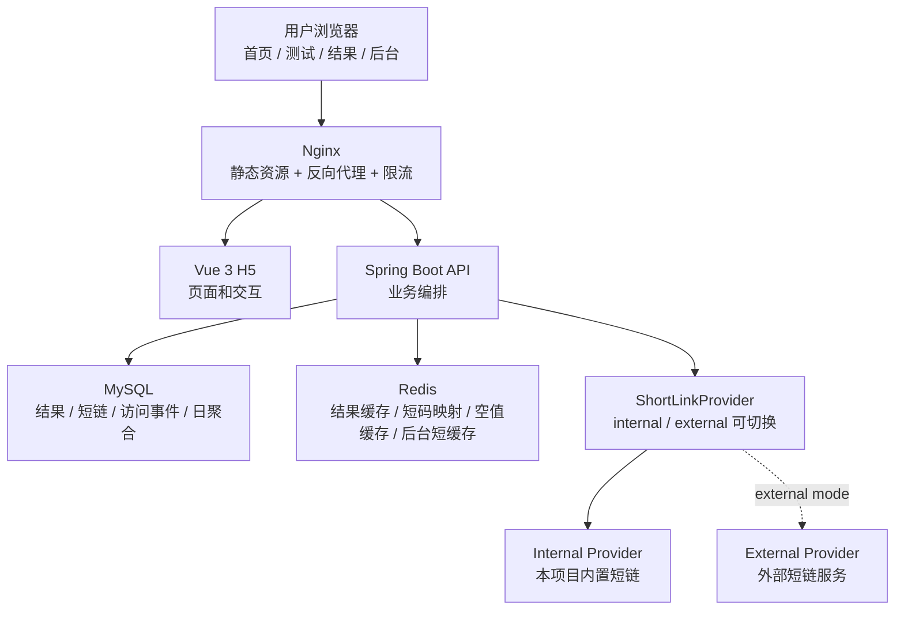
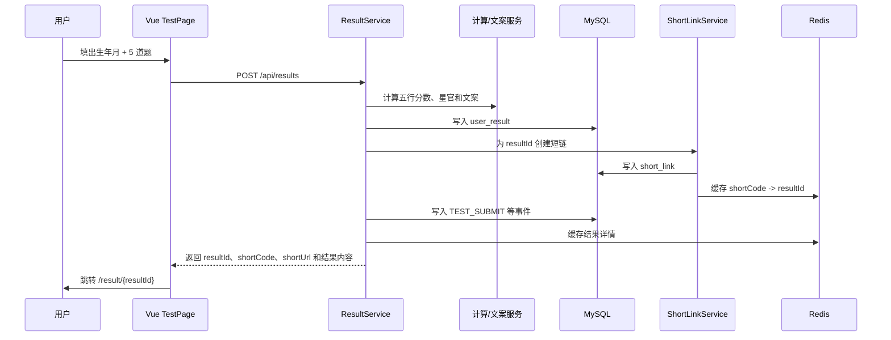
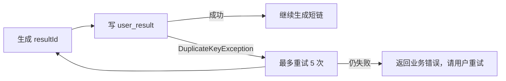
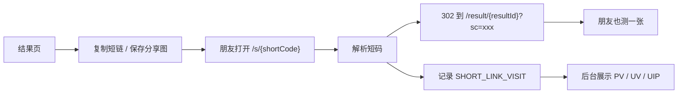
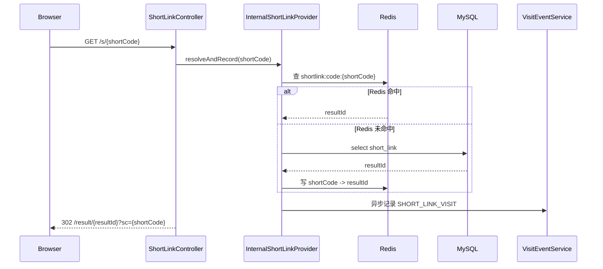
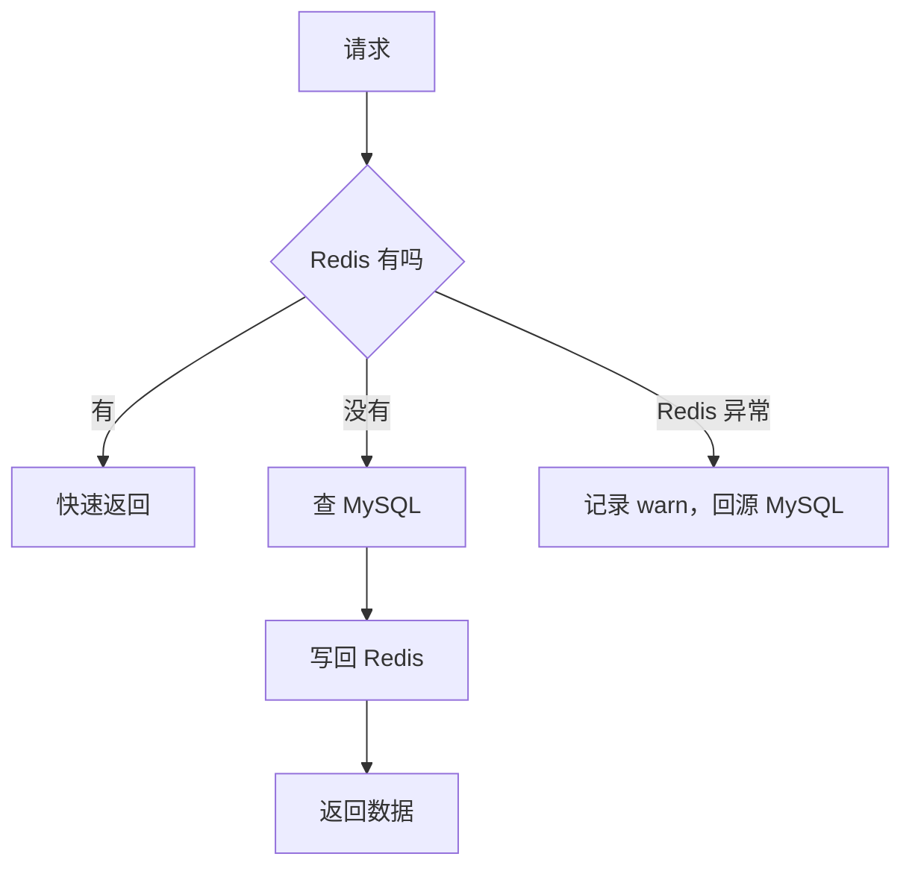
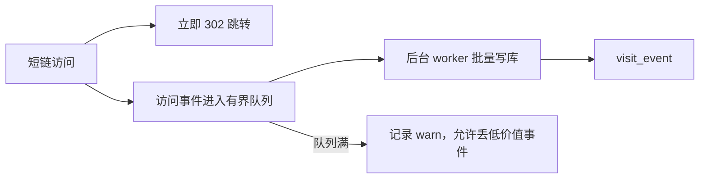
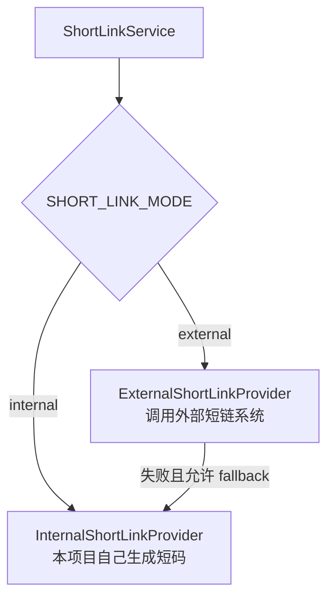
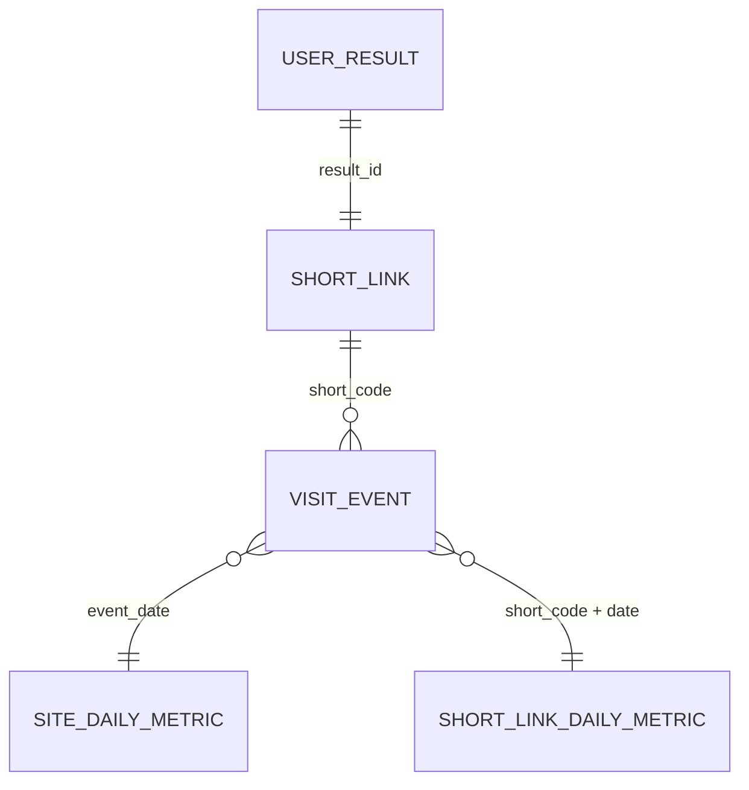
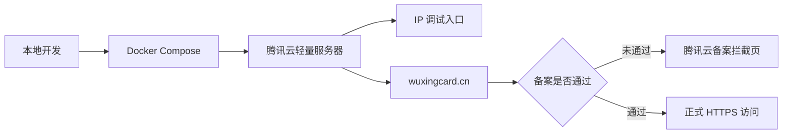

# 五行人格卡项目学习文档 v1

这份文档的目标不是宣传项目，而是帮你重新理解项目。你可以把它当成第一版学习地图：先抓住主线，再顺着图和代码位置一点点补细节。

## 先抓住 5 条主线

| 主线 | 一句话理解 | 你要记住的关键词 |
| --- | --- | --- |
| 1. 整体架构 | 这是一个 Vue H5 + Spring Boot + MySQL + Redis + Nginx 的单机全栈项目。 | 前端体验、后端 API、数据库、缓存、部署 |
| 2. 核心流程 | 用户完成出生年月和 5 道题后，后端生成人格结果，并立刻生成可分享短链。 | 测算、结果、短链、跳转 |
| 3. 分享闭环 | 朋友打开短链会 302 到结果页，同时留下匿名访问事件，后台能看到 PV / UV / UIP。 | 传播、访问事件、后台统计 |
| 4. 工程亮点 | 项目不是静态页面，而是有缓存、异步事件、外部短链适配、质量门和生产运维脚本的工程闭环。 | Redis、异步队列、Provider、质量门 |
| 5. 难点边界 | 最容易出问题的是短链高峰、统计查询、隐私保护、外部依赖和真实域名备案部署。 | 热路径、降级、隐私、运维 |

如果你只记一条线，就记这条：

```text
用户测算 -> 后端生成结果 -> 生成短链 -> 朋友访问短链 -> 记录匿名事件 -> 后台看到传播数据
```

## 1. 整体架构：每一层负责什么



### 用一个生活例子理解

你可以把整个系统想成一个小型活动现场：

- Vue 是前台接待：引导用户填信息、答题、看结果。
- Spring Boot 是主办方后台：计算结果、生成短链、记录行为。
- MySQL 是档案室：所有正式结果和访问记录都存在这里。
- Redis 是便签和快速索引：常用结果和短码先从这里拿，减少翻档案。
- Nginx 是门口保安：分流请求、托管静态页面、限制过快访问。

### 关键代码位置

| 层 | 主要文件 | 作用 |
| --- | --- | --- |
| 首页 | `frontend/src/pages/GuidePage.vue` | 首页引导、剪贴板短码检测、双人匹配入口 |
| 测试页 | `frontend/src/pages/TestPage.vue` | 出生信息、逐题卡片、提交结果或匹配 |
| 结果页 | `frontend/src/pages/ResultPage.vue` | 展示人格卡、分享图、短链复制、回流再测 |
| 结果 API | `backend/src/main/java/com/wuxing/persona/controller/ResultController.java` | `POST /api/results` 和 `GET /api/results/{resultId}` |
| 结果服务 | `backend/src/main/java/com/wuxing/persona/service/ResultService.java` | 五行结果生成、短链创建、事件记录、缓存 |
| 短链服务 | `backend/src/main/java/com/wuxing/persona/service/ShortLinkService.java` | 选择 internal 或 external 短链实现 |
| 短链跳转 | `backend/src/main/java/com/wuxing/persona/controller/ShortLinkController.java` | `/s/{shortCode}` 解析并 302 到结果页 |
| 访问事件 | `backend/src/main/java/com/wuxing/persona/service/VisitEventService.java` | 记录匿名事件、异步批量写入 |
| 后台统计 | `backend/src/main/java/com/wuxing/persona/service/AdminStatService.java` | PV / UV / UIP、漏斗、短链列表、导出 |
| 部署 | `deploy/docker-compose.yml`、`deploy/nginx.conf` | MySQL、Redis、后端、Nginx 单机部署 |

## 2. 核心流程：一张人格卡是怎么生成的



### 后端做了哪几件事

`ResultService.create()` 是结果创建的核心入口。它大致做四步：

1. 调用 `ElementCalculateService` 计算五行主副元素和比例。
2. 调用 `StarOfficerService`、`ResultTextService` 生成星官和文案。
3. 写入 `user_result`，并在 `result_id` 极小概率冲突时重试。
4. 调用 `ShortLinkService.createForResult()` 生成短链，然后记录事件并写 Redis 缓存。

### 为什么要有 resultId 重试

结果 ID 是：

```text
R + 年月日时分秒毫秒 + 6 位随机数
```

正常情况下已经很难重复。但在高并发里，只要数据库有唯一键，就要承认“极小概率冲突”存在。现在的做法是：



这就是后端可靠性思维：不要只假设随机数永远不会撞，也不要因为一次撞库就让用户流程失败。

## 3. 分享闭环：短链为什么是这个项目的核心亮点



这个项目的业务价值不是“生成一句人格文案”，而是“结果可以传播，并且传播数据可观测”。

### 短链跳转链路



### 为什么短链是热路径

创建结果通常只发生一次，但一张卡片被发到群里后，很多人都会点同一个短链。压力会集中在：

```text
GET /s/{shortCode}
```

所以这个接口要尽量快：

- 能从 Redis 拿到 resultId 就不要先查 MySQL。
- 访问事件可以异步写，不要阻塞 302 跳转。
- 不存在的短码要做短 TTL 空值缓存，避免恶意或错误短码反复打数据库。
- `last_visit_at` 这种展示字段不需要每次访问都更新，可以按时间间隔触发。

## 4. 工程亮点：技术选型的作用和意义

### Redis：不是数据库替代品，而是削峰工具



项目里有四类典型缓存：

| 缓存 | Key | TTL | 意义 |
| --- | --- | --- | --- |
| 结果详情 | `result:{resultId}` | 24 小时 | 结果页读多写少，适合缓存 |
| 短码映射 | `shortlink:code:{shortCode}` | 7 天 | 短链跳转热路径要快 |
| 空短码 | `shortlink:null:{shortCode}` | 5 分钟 | 防止不存在短码穿透数据库 |
| 后台总览 | `admin:overview:{range}` | 45 秒 | 运营刷新不必每次实时聚合 |

生动理解：Redis 像前台抽屉，常用资料先放抽屉里；MySQL 像正式档案室，最终事实仍然在档案室。

### 异步事件：用户体验优先，统计稍后落库



为什么这样设计：

- 用户点短链最关心的是打开结果页，不是后台统计立即入库。
- `SHORT_LINK_VISIT` 是高频事件，放在请求线程里写库会拖慢跳转。
- 当前是单机作品，不直接上 MQ，先用有界内存队列降低复杂度。

边界也要理解：

- 进程重启可能丢队列里没刷完的事件。
- 多实例部署时需要 MQ 或日志管道承接事件。
- 统计可以丢少量低价值访问事件，但不能影响结果创建和结果查看。

### Provider 设计：internal / external 可切换



这个设计的意义：

- 业务代码只依赖 `ShortLinkService`，不用关心短链到底来自哪里。
- 默认 internal 能保证项目独立运行。
- external 模式可以对接外部短链服务，展示“系统集成能力”。
- external 失败时可降级 internal，保证用户仍拿到可访问结果。

### 数据库：围绕查询路径建表



核心表的理解：

- `user_result`：一张人格卡的事实数据。
- `short_link`：短码和结果的绑定关系。
- `visit_event`：用户行为事件，后台统计的事实来源。
- `site_daily_metric`：站点级日聚合，减轻历史趋势查询。
- `short_link_daily_metric`：短链级日聚合，减轻短链统计查询。

学习重点不是背字段，而是理解为什么会有这些表：

```text
结果表解决“用户测出来什么”
短链表解决“这张卡怎么分享”
事件表解决“谁访问过、从哪里来、发生了什么”
日聚合表解决“后台不要每次都扫明细”
```

## 5. 难点边界：项目现阶段做到哪里，没做到哪里

### 难点 1：短链传播高峰

问题：一个结果页可能突然被很多人打开，`/s/{shortCode}` 会成为热点。

当前方案：

- Redis 缓存短码映射。
- 访问事件异步写入。
- Nginx 对 `/s/` 单独限流。
- `last_visit_at` 按时间间隔更新，减少同一行反复写。

还没做的：

- 没有真实生产 QPS 压测报告。
- 单机队列不是 MQ。
- 多机部署需要共享队列、统一缓存和负载均衡。

### 难点 2：统计查询和后台刷新

问题：后台统计可能涉及 `COUNT DISTINCT`、日期范围、分组聚合，一刷新就打数据库。

当前方案：

- 后台 overview 45 秒 Redis 短缓存。
- 历史趋势优先读日聚合表。
- 短链列表批量补结果和统计，避免典型 N+1。
- 数据库补了围绕日期、事件类型、短码、client/ip 的索引。

还没做的：

- 生产慢查询报告还没有沉淀。
- 明细表大规模增长后需要归档、分区或离线聚合。

### 难点 3：隐私与娱乐边界

问题：人格测试很容易让人误以为是命理预测，也可能收集不必要隐私。

当前方案：

- 不登录、不收昵称和性别。
- IP、User-Agent、clientId 都 hash 后入库。
- Referer 去 query 和 fragment。
- 文案只做娱乐性人格解读，不做疾病、财富、婚恋判断。

你可以这样理解：这个项目不是在“证明命运”，而是在做“传统文化风格的人格内容产品”。

### 难点 4：真实部署和域名



当前现实：

- IP 调试入口可用。
- 域名 `wuxingcard.cn` 已注册。
- 中国大陆服务器绑定域名需要备案，备案未完成时出现腾讯云拦截页是正常现象。
- 仓库里已经有 `production-health-check.sh`、`set-production-entry.sh`、`server-security-audit.sh` 帮助运维收口。

## 建议学习顺序

1. 先读本文档前 5 条主线，能口头复述项目闭环。
2. 再看 `ResultService.create()`，理解一张结果怎么生成。
3. 再看 `InternalShortLinkProvider.resolveAndRecord()`，理解短链热路径。
4. 再看 `VisitEventService` 和 `AdminStatService`，理解数据怎么从访问事件变成后台统计。
5. 最后看 `deploy/docker-compose.yml` 和 `deploy/nginx.conf`，理解为什么这个项目能部署起来。

## 你应该能讲出的 60 秒版本

> 五行人格卡是一个 Vue + Spring Boot 的全栈项目，主线是用户完成出生年月和 5 道题后生成人格结果，并生成可分享短链。朋友打开短链时，后端会通过短码解析到 resultId，302 到结果页，同时异步记录匿名访问事件。后台可以看到 PV、UV、UIP、漏斗和短链访问明细。工程上我做了 Redis 缓存、短链 Provider 可切换、访问事件异步队列、后台短缓存、Nginx 限流、Docker Compose 部署和生产健康检查脚本。它现阶段是单机可部署作品，亮点是业务闭环完整，边界是还没有真实生产压测和多实例 MQ 化。
