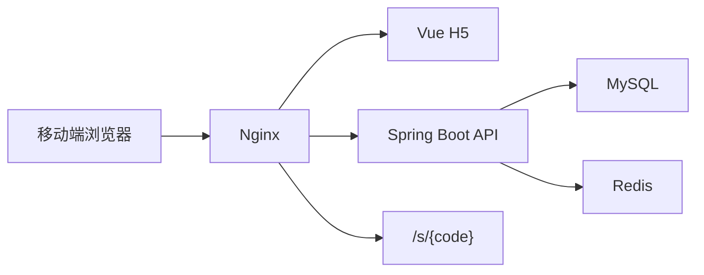
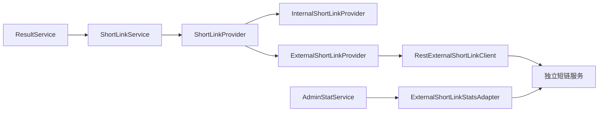

# 五行人格卡 MVP 项目计划

规划日期：2026-06-08

当前状态：第一版 MVP 主链路已实现，并通过本地构建、后端集成测试、H2 演示模式浏览器验收和 Docker Compose 容器全链路验收。v0.2 已新增短链 Provider 适配层，v0.3 已补 external 模式真实 HTTP 联调配置和后台日期筛选统计，v0.4 已完成外部短链服务级联调和外部 PV / UV / UIP 统计适配，v0.5 已接入外部短链访问明细，v0.6 已建立 v1.0 前的统一质量门禁，v0.7 已完成生产路由与部署预检，v0.8 已增强后台运营可读性。

关联文档：

- 根目录开发指令：`AGENTS.md`
- 开发规范：`docs/development-standards.md`
- 质量评分：`docs/quality-scorecard.md`
- 短链系统评估：`docs/shortlink-integration-assessment.md`
- v0.2 短链适配层设计：`docs/v0.2-shortlink-adapter-design.md`
- v0.3 外部短链联调准备与后台日期统计：`docs/v0.3-external-shortlink-and-analytics.md`
- v0.4 外部短链服务级联调与统计适配：`docs/v0.4-external-shortlink-service-integration.md`
- v0.5 外部短链访问明细接入：`docs/v0.5-external-shortlink-access-records.md`
- v1.0 路线图与质量门禁：`docs/v1.0-roadmap-and-quality-gates.md`
- v0.7 生产路由与部署加固：`docs/v0.7-production-routing-hardening.md`
- v0.8 后台运营可读性增强：`docs/v0.8-admin-operational-insights.md`
- 教学手册：`docs/teaching-manual.md`

## 1. MVP 目标

第一版只做一条完整单人测算闭环：

```text
引导页
  -> 测试页
  -> 后端生成结果
  -> 结果页
  -> 生成专属短链接
  -> 短链访问跳回结果页
  -> 访问数据进入后台
```

成功标准：

1. 用户能匿名完成一次五行人格测算。
2. 后端能返回五行比例、星官、关键词和三段正向解读。
3. 每个结果能生成唯一短链接。
4. 短链接能访问并跳转到同一个结果页。
5. 短链访问能统计 PV、UV、UIP。
6. `/admin` 能看到网站整体数据和短链数据。
7. 项目能通过 Docker Compose 单机部署。

第一版不做朋友匹配、登录注册、用户历史记录、社区、付费、AI 深度解读、复杂排盘和复杂后台权限。

## 2. 当前实现架构



第一版短链接内置在五行后端，原因是：

- 可控：不用先处理外部短链系统的账号、分组、网关和多服务部署。
- 快速：MVP 能独立完成结果分享、跳转、统计。
- 可演进：后续只需要替换 `ShortLinkService` 的实现，五行业务表继续保存 resultId 和 shortUrl 绑定。

v0.4 后，短链模块已经具备可切换服务形态：



## 3. 服务职责

五行后端负责：

- 表单校验
- 五行分数计算
- 星官生成
- 模板文案
- 结果保存和查询
- 短码生成与解析
- Redis 缓存
- 事件记录
- PV/UV/UIP 聚合
- 管理 token 校验

前端负责：

- 移动端 H5 页面
- 匿名 clientId 生成
- 事件上报
- 表单校验提示
- 结果展示和短链复制
- 后台 token 输入与数据展示

## 4. 已完成阶段

### 阶段 1：项目初始化

- Vue 3 + Vite + TypeScript 前端骨架。
- Spring Boot + Maven 后端骨架。
- Docker Compose、Nginx、Dockerfile 初版。
- README 和 docs 初版。
- 克隆并评估外部短链接项目。

### 阶段 2：后端基础能力

- `ApiResponse<T>` 统一返回。
- `BusinessException` 和全局异常处理。
- 枚举：五行元素、出生时段、事件类型。
- Entity、Mapper、DTO、VO、Service、Controller 分层。
- `schema.sql` 数据库初始化脚本。
- Redis 缓存封装。

### 阶段 3：五行结果生成

- `GET /api/questions` 返回 5 道题。
- `ElementCalculateService` 实现 MVP 分数规则。
- `StarOfficerService` 实现月份星官。
- `ResultTextService` 实现正向模板文案。
- `POST /api/results` 创建并保存结果。
- `GET /api/results/{resultId}` 查询结果并缓存。

### 阶段 4：短链接模块

- `short_link` 表。
- 6 位 Base62 短码生成。
- 同一 resultId 复用已有短链。
- Redis 短链解析缓存。
- Redis 无效短码空值缓存。
- `/s/{code}` 302 跳转。
- 短链访问事件和 PV 更新。

### 阶段 5：访问统计

- 前端 `wuxing_client_id`。
- 请求统一携带 `X-Client-Id`。
- `POST /api/events`。
- 后端保存 clientId、IP、User-Agent 的 hash。
- 首页、开始测试、结果页、短链复制埋点。
- 后台聚合 PV、UV、UIP。

### 阶段 6：H5 页面

- 引导页 `/`。
- 测试页 `/test`。
- 结果页 `/result/:resultId`。
- 后台页 `/admin`。
- 短链详情页 `/admin/short-links/:shortCode`。
- 移动端基础样式和娱乐声明。

### 阶段 7：数据中台

- 总览指标。
- 热门五行组合。
- 热门星官。
- 最近结果。
- 短链列表。
- 单条短链访问日志。
- 管理 token 校验。

### 阶段 8：部署初版

- Compose 包含 MySQL、Redis、backend、nginx。
- Nginx 路由已配置 `/api/`、`/s/`、`/admin`。
- `.env.example` 已包含核心环境变量。
- Compose 配置已通过静态校验。
- Docker 容器模式已通过 `http://127.0.0.1:8088` 验收。
- Dockerfile 支持可配置基础镜像，便于 Docker Hub 不稳定时切换可信镜像源。

### 阶段 9：v0.2 短链适配层

- 新增 `ShortLinkProvider` 接口。
- `ShortLinkService` 改为门面服务，对上层保持 v0.1 调用入口。
- `InternalShortLinkProvider` 保留内置短链默认能力。
- `ExternalShortLinkProvider` 预留外部短链创建流程。
- `ExternalShortLinkClient` 封装外部 HTTP 调用边界。
- 支持 `SHORT_LINK_MODE=internal|external` 配置切换。
- 支持外部服务失败时按配置降级到内置短链。
- 五行项目继续保存 `short_link` 本地业务绑定。

### 阶段 10：v0.3 external 联调准备与统计增强

- 对齐外部短链项目创建接口 `/api/short-link/v1/create`。
- external HTTP 请求补充 `username/userId/realName` 系统用户 header 验证。
- external 请求体补充 `domain` 字段。
- 新增 `SHORT_LINK_EXTERNAL_DOMAIN`、连接超时、读取超时配置。
- 保留外部失败降级到内置短链的默认策略。
- 后台总览支持 `startDate/endDate` 筛选。
- 短链列表支持按短链创建日期筛选。
- 短链访问日志支持按访问日期筛选。
- 前端后台页和短链详情页增加日期筛选控件。

### 阶段 11：v0.4 外部短链服务级联调与统计适配

- 启动本地独立短链项目 `aggregation` 服务完成真实联调。
- external 模式下五行创建结果可调用外部短链服务创建短链。
- 外部短链服务返回的 `fullShortUrl` 会保存为五行本地业务绑定。
- 访问外部短链可 302 到五行结果页。
- 五行本地 `/s/{code}` 保留兼容跳转能力。
- 新增外部短链统计读取适配，后台短链列表可显示 external PV / UV / UIP。
- 新增 `statSource` 字段区分本地统计和外部统计。
- 外部统计不可用时回退本地统计。

### 阶段 12：v0.5 外部短链访问明细接入

- 接入独立短链服务 `/api/short-link/v1/stats/access-record`。
- 后台短链详情优先读取 external 访问记录。
- external 失败、internal 模式、domain 不匹配或 stats 未启用时回退本地 `visit_event`。
- 外部 `ip` 和 `user` 按五行项目 `HASH_SALT` 做 hash 后返回。
- `ShortLinkVisitVO` 新增 `statSource`。
- 前端短链访问详情表格新增来源列。
- 完成 PR 合并和标签：`v0.5.0-external-shortlink-access-records`。

### 阶段 13：v0.6 质量门禁与 v1.0 路线

- 新增 `.editorconfig` 统一编辑器基础规范。
- 新增 `scripts/quality-check.sh` 作为版本合并前统一门禁。
- 新增 `docs/v1.0-roadmap-and-quality-gates.md`。
- 开始按 v0.7、v0.8、v0.9、v1.0 的节奏推进稳定版。

### 阶段 14：v0.7 生产路由与部署加固

- 新增 `deploy/nginx.shortlink-routing.example.conf`。
- 推荐短链子域名 `s.your-domain.com`，保留同域 `/s/**` rewrite 备选。
- 新增 `scripts/deploy-preflight.sh`，上线前检查 `.env` 必填项、占位值和 external 配置完整性。
- 更新部署文档，明确 `SHORT_LINK_EXTERNAL_DOMAIN` 必须与外部短链服务生成域名一致。

### 阶段 15：v0.8 后台运营可读性增强

- 后端 `/api/admin/overview` 新增 `dailyTrends`。
- 默认展示最近 7 天趋势，日期筛选范围最多展示 14 天。
- 趋势指标包含 PV、结果生成、短链生成和短链访问。
- 前端 `/admin` 新增日趋势、热门星官、最近结果和最近短链展示。
- 保留短链列表、访问明细、PV / UV / UIP 和 `local` / `external` 来源展示。

## 5. 当前验证

已通过：

```bash
cd backend && mvn -q test
cd frontend && npm run build
docker compose --env-file deploy/.env.example -f deploy/docker-compose.yml config
```

容器运行验收使用 `APP_BASE_URL=http://localhost:8088`、`NGINX_HTTP_PORT=8088` 和可选镜像源参数启动 Compose，详见 `docs/deploy.md`。

后端集成测试覆盖：

- 创建结果。
- 查询结果。
- 短链 302 跳转。
- 后台总览统计。
- 短链列表和访问详情。
- 非法参数、非法事件、后台 token、无效短码。

浏览器验收覆盖：

- 首页进入测试页。
- 测试页提交出生年月和 5 道题。
- 结果页展示五行比例、星官、关键词、解读和短链。
- 短链入口返回相对路径 302。
- 后台总览展示 PV、UV、UIP 和短链访问。
- 短链详情展示 hash 后的访问日志。

Docker 入口验收覆盖：

- MySQL、Redis 健康检查通过。
- backend 和 nginx 容器启动成功。
- `GET /api/health`、`GET /api/questions` 正常。
- `POST /api/results` 生成 `R20260609005159599703` 和短码 `4fB7av`。
- `GET /s/4fB7av` 返回 `Location: /result/R20260609005159599703?sc=4fB7av`。
- 后台总览、短链列表和访问日志接口返回 PV/UV/UIP。

v0.2 适配层测试覆盖：

- 默认 `internal` 模式。
- `external` 模式配置切换。
- 外部短链创建成功并保存本地绑定。
- 外部短链失败时自动降级。
- 禁止降级时返回明确业务错误。

v0.3 测试覆盖：

- external RestClient 路径、请求体和 `username/userId/realName` header。
- external Provider 创建请求中的 `domain`、`originUrl`、`gid`。
- 后台日期筛选：当天有数据、未来日期为空、非法日期范围返回 400。
- 不传日期时保持原有全量累计统计行为。

v0.4 测试和联调覆盖：

- external RestClient 统计接口路径、查询参数和系统用户 header。
- `ExternalShortLinkStatsAdapter` 的成功读取、失败回退、internal 模式跳过和 domain 不匹配跳过。
- 本地服务级联调：创建结果、外部短链创建、外部 302、五行本地业务绑定、后台 `statSource=external`。

v0.5 测试和联调覆盖：

- external RestClient 访问明细接口路径、分页参数和系统用户 header。
- external 访问明细读取、分页转换、失败回退和 hash 映射。
- Docker 容器内验证：健康检查、Nginx 到 backend、创建结果、短链访问、访问明细 `statSource=local`。

v0.6 起统一执行：

```bash
scripts/quality-check.sh
```

v0.7 新增验证：

- `scripts/deploy-preflight.sh` 语法检查纳入质量门禁。
- `deploy/nginx.shortlink-routing.example.conf` 作为生产 Nginx 路由参考，不改变默认 Compose internal 行为。

v0.8 新增验证：

- overview 默认返回 `dailyTrends`。
- 日期筛选为当天时，日趋势与总览统计一致。
- 日期筛选为未来日期时，趋势指标为空值口径。
- 前端构建验证后台新增展示区域类型和模板可编译。

## 6. 下一阶段建议

1. v0.9：稳定性、隐私和压力场景审计。
2. v1.0：最终文档、部署检查表、截图、质量评分和稳定版标签。
