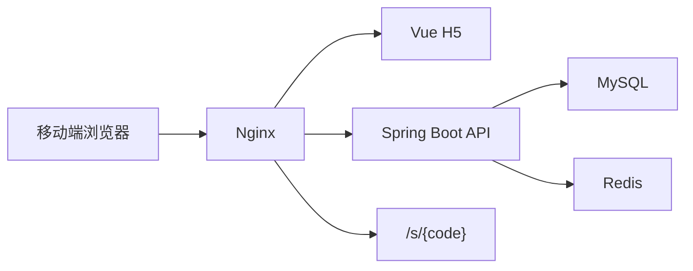

# 五行人格卡 MVP 项目计划

规划日期：2026-06-08

当前状态：第一版 MVP 主链路已实现，并通过本地构建、后端集成测试、H2 演示模式浏览器验收和 Docker Compose 容器全链路验收。

关联文档：

- 根目录开发指令：`AGENTS.md`
- 开发规范：`docs/development-standards.md`
- 质量评分：`docs/quality-scorecard.md`
- 短链系统评估：`docs/shortlink-integration-assessment.md`
- 教学手册：`docs/teaching-manual.md`

## 1. MVP 目标

第一版只做一条完整单人测算闭环：

```text
引导页
  -> 测试页
  -> 后端生成结果
  -> 结果页
  -> 生成专属短链接
  -> 短链访问跳回结果页
  -> 访问数据进入后台
```

成功标准：

1. 用户能匿名完成一次五行人格测算。
2. 后端能返回五行比例、星官、关键词和三段正向解读。
3. 每个结果能生成唯一短链接。
4. 短链接能访问并跳转到同一个结果页。
5. 短链访问能统计 PV、UV、UIP。
6. `/admin` 能看到网站整体数据和短链数据。
7. 项目能通过 Docker Compose 单机部署。

第一版不做朋友匹配、登录注册、用户历史记录、社区、付费、AI 深度解读、复杂排盘和复杂后台权限。

## 2. 当前实现架构



第一版短链接内置在五行后端，原因是：

- 可控：不用先处理外部短链系统的账号、分组、网关和多服务部署。
- 快速：MVP 能独立完成结果分享、跳转、统计。
- 可演进：后续只需要替换 `ShortLinkService` 的实现，五行业务表继续保存 resultId 和 shortUrl 绑定。

## 3. 服务职责

五行后端负责：

- 表单校验
- 五行分数计算
- 星官生成
- 模板文案
- 结果保存和查询
- 短码生成与解析
- Redis 缓存
- 事件记录
- PV/UV/UIP 聚合
- 管理 token 校验

前端负责：

- 移动端 H5 页面
- 匿名 clientId 生成
- 事件上报
- 表单校验提示
- 结果展示和短链复制
- 后台 token 输入与数据展示

## 4. 已完成阶段

### 阶段 1：项目初始化

- Vue 3 + Vite + TypeScript 前端骨架。
- Spring Boot + Maven 后端骨架。
- Docker Compose、Nginx、Dockerfile 初版。
- README 和 docs 初版。
- 克隆并评估外部短链接项目。

### 阶段 2：后端基础能力

- `ApiResponse<T>` 统一返回。
- `BusinessException` 和全局异常处理。
- 枚举：五行元素、出生时段、事件类型。
- Entity、Mapper、DTO、VO、Service、Controller 分层。
- `schema.sql` 数据库初始化脚本。
- Redis 缓存封装。

### 阶段 3：五行结果生成

- `GET /api/questions` 返回 5 道题。
- `ElementCalculateService` 实现 MVP 分数规则。
- `StarOfficerService` 实现月份星官。
- `ResultTextService` 实现正向模板文案。
- `POST /api/results` 创建并保存结果。
- `GET /api/results/{resultId}` 查询结果并缓存。

### 阶段 4：短链接模块

- `short_link` 表。
- 6 位 Base62 短码生成。
- 同一 resultId 复用已有短链。
- Redis 短链解析缓存。
- Redis 无效短码空值缓存。
- `/s/{code}` 302 跳转。
- 短链访问事件和 PV 更新。

### 阶段 5：访问统计

- 前端 `wuxing_client_id`。
- 请求统一携带 `X-Client-Id`。
- `POST /api/events`。
- 后端保存 clientId、IP、User-Agent 的 hash。
- 首页、开始测试、结果页、短链复制埋点。
- 后台聚合 PV、UV、UIP。

### 阶段 6：H5 页面

- 引导页 `/`。
- 测试页 `/test`。
- 结果页 `/result/:resultId`。
- 后台页 `/admin`。
- 短链详情页 `/admin/short-links/:shortCode`。
- 移动端基础样式和娱乐声明。

### 阶段 7：数据中台

- 总览指标。
- 热门五行组合。
- 热门星官。
- 最近结果。
- 短链列表。
- 单条短链访问日志。
- 管理 token 校验。

### 阶段 8：部署初版

- Compose 包含 MySQL、Redis、backend、nginx。
- Nginx 路由已配置 `/api/`、`/s/`、`/admin`。
- `.env.example` 已包含核心环境变量。
- Compose 配置已通过静态校验。
- Docker 容器模式已通过 `http://127.0.0.1:8088` 验收。
- Dockerfile 支持可配置基础镜像，便于 Docker Hub 不稳定时切换可信镜像源。

## 5. 当前验证

已通过：

```bash
cd backend && mvn -q test
cd frontend && npm run build
docker compose --env-file deploy/.env.example -f deploy/docker-compose.yml config
```

容器运行验收使用 `APP_BASE_URL=http://localhost:8088`、`NGINX_HTTP_PORT=8088` 和可选镜像源参数启动 Compose，详见 `docs/deploy.md`。

后端集成测试覆盖：

- 创建结果。
- 查询结果。
- 短链 302 跳转。
- 后台总览统计。
- 短链列表和访问详情。
- 非法参数、非法事件、后台 token、无效短码。

浏览器验收覆盖：

- 首页进入测试页。
- 测试页提交出生年月和 5 道题。
- 结果页展示五行比例、星官、关键词、解读和短链。
- 短链入口返回相对路径 302。
- 后台总览展示 PV、UV、UIP 和短链访问。
- 短链详情展示 hash 后的访问日志。

Docker 入口验收覆盖：

- MySQL、Redis 健康检查通过。
- backend 和 nginx 容器启动成功。
- `GET /api/health`、`GET /api/questions` 正常。
- `POST /api/results` 生成 `R20260609005159599703` 和短码 `4fB7av`。
- `GET /s/4fB7av` 返回 `Location: /result/R20260609005159599703?sc=4fB7av`。
- 后台总览、短链列表和访问日志接口返回 PV/UV/UIP。

## 6. 下一阶段建议

1. 为后台增加日期筛选，避免统计长期累计后不可分析。
2. 接入独立短链接项目，复用其更完整的短链统计能力。
3. 增加结果卡片图片生成或截图分享。
4. 给关键接口补充更多缓存命中、Redis 异常降级和短码冲突测试。
5. 上线前配置域名、HTTPS、强随机 token、强密码和真实 `APP_BASE_URL`。
