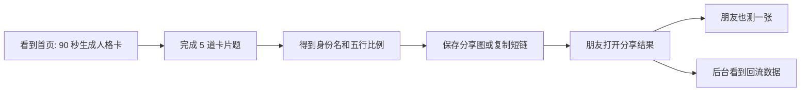
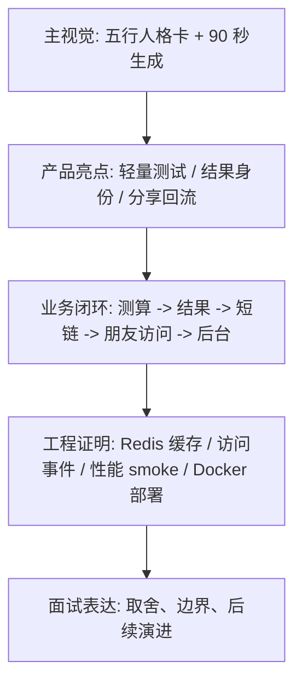

# 五行人格卡项目宣传包

## 一句话介绍

五行人格卡是一个 90 秒完成、5 道题生成、可短链分享的人格测试 H5 项目。它用传统文化里的五行意象做娱乐化人格表达，并把结果页、专属短链、朋友回流和后台 PV / UV / UIP 统计串成完整业务闭环。

## 宣传定位

这个项目不是命理预测工具，也不是单纯的前端页面 Demo。它更适合被介绍为一个可上线、可传播、可观察数据的 Java 全栈作品：

- 用户侧：轻量完成测试，得到一张有身份名、关键词和五行比例的人格卡。
- 传播侧：每个结果生成专属短链接，朋友打开后可以继续测试。
- 工程侧：Spring Boot 承接结果生成、短链跳转、匿名事件统计和后台数据中台。
- 部署侧：Nginx、MySQL、Redis、后端和前端可用 Docker Compose 单机部署。

## 核心亮点

| 亮点 | 展示话术 |
| --- | --- |
| 卡片式问答 | 从表单式测试升级为一题一张卡，移动端完成压力更低 |
| 结果共鸣卡 | 结果页前置“为什么像你”的 3 个生活表现，让用户更容易产生截图和分享动机 |
| 可分享人格卡 | 结果页优先展示身份名、关键词、主副五行和结果卡附近的分享入口 |
| 真实短链接 | 每个结果有独立短码，访问 `/s/{shortCode}` 后 302 回结果页 |
| 传播回流 | 分享短链可带 channel/campaign，朋友访问后可被引导二次测试 |
| 匿名统计 | clientId、IP、User-Agent hash 后入库，统计 PV / UV / UIP |
| 数据中台 | 后台可看漏斗、Top Channel、短链列表、访问明细和导出 |
| 单机部署 | Docker Compose 管理 Nginx、Spring Boot、MySQL 和 Redis |
| 性能意识 | 短链跳转走 Redis 映射，访问事件和统计查询与用户主链路解耦 |
| 真实验收 | 提供设备矩阵、首次用户访谈脚本和截图归档清单，避免只凭主观判断体验 |

## 用户故事



## 宣传文案

### 长版

五行人格卡把传统文化里的五行意象做成了一个轻量、正向、可分享的人格测试 H5。用户无需登录，完成出生年月和 5 道价值取向题后，就能得到一张带身份名、关键词、主副五行比例和专属短链的人格卡。朋友打开短链后会进入同一张结果页，也可以继续生成自己的卡片。项目后端用 Spring Boot 实现结果生成、短链跳转、Redis 缓存、匿名访问统计和后台数据中台，形成从体验到传播再到数据观察的完整闭环。

### 短版

90 秒生成一张可分享的五行人格卡。它不只是 H5 页面，还包含结果生成、专属短链、朋友回流、PV / UV / UIP 和后台运营数据。

### 面试开场版

我做了一个以结果页分享为真实场景的五行人格测试项目。它的重点不是“算人格”，而是把用户测算、结果持久化、短链接传播、匿名访问统计和后台数据中台做成一个可部署的完整业务闭环。

## 截图脚本

建议准备以下素材，用于 README、作品集、简历项目页和面试展示：

| 素材 | 页面 | 说明 |
| --- | --- | --- |
| 产品首屏 | `/` | 展示产品名、90 秒、5 道题、开始测试按钮 |
| 样例人格卡 | `/` | 展示身份名、关键词、五行比例视觉 |
| 出生信息卡 | `/test` | 展示年份滑杆、手动输入、月份横向卡片 |
| 问答卡片 | `/test` | 展示一题一屏、步骤条、选中确认和移动端底部操作条 |
| 结果首屏 | `/result/{resultId}` | 展示身份名、关键词、主副五行 |
| 结果共鸣区 | `/result/{resultId}` | 展示“为什么像你”的 3 个生活表现 |
| 分享模块 | `/result/{resultId}` | 展示保存分享图、我也要测、短链复制 |
| 结果分享图 | 点击“保存分享图” | 展示五行配色、人格身份、短链和朋友回流提示 |
| 朋友回流 | `/result/{resultId}?sc={shortCode}` | 展示“朋友分享给你的五行人格卡”提示 |
| 后台总览 | `/admin` | 展示 PV / UV / UIP、漏斗和 Top Channel |
| 短链详情 | `/admin/short-links/{shortCode}` | 展示访问明细、来源和设备类型 |
| 文档站 | `docs-site/index.html` | 展示项目结构化文档站 |
| 用户验收清单 | `docs/real-user-validation-checklist.md` | 展示设备矩阵、访谈脚本和截图归档要求 |
| 性能烟测输出 | `scripts/performance-smoke-test.sh` | 展示短链连续访问和后台总览缓存的耗时证据 |
| 后台短链列表 | `/admin/short-links` | 展示分页短链、批量 PV / UV / UIP 统计和访问明细入口 |

可复现截图流程：

```bash
E2E_BASE_URL=http://127.0.0.1:5174 \
E2E_ADMIN_TOKEN=dev-token \
scripts/capture-showcase-screenshots.sh
```

脚本会在 Playwright 可用时生成首页、出生信息卡、问答卡、结果页、分享回流页和后台总览截图，默认输出到 `docs/screenshots/showcase/`。`@playwright/test` 已纳入前端依赖；新机器需要先执行 `npm install` 和 `npx playwright install chromium`。`docs/ci-browser-e2e-plan.md` 已整理 GitHub Actions `browser-e2e` 方案，待具备 `workflow` scope 的凭据启用后，可自动运行同一组截图流程并上传 artifact。

当前已归档 11 张自动化 showcase 截图，覆盖 iPhone SE、安卓宽屏和桌面后台：

- `docs/screenshots/showcase/iphone-se-01-home.png`
- `docs/screenshots/showcase/iphone-se-02-test-birth-card.png`
- `docs/screenshots/showcase/iphone-se-03-test-question-card.png`
- `docs/screenshots/showcase/iphone-se-04-result.png`
- `docs/screenshots/showcase/iphone-se-05-shared-result.png`
- `docs/screenshots/showcase/android-wide-01-home.png`
- `docs/screenshots/showcase/android-wide-02-test-birth-card.png`
- `docs/screenshots/showcase/android-wide-03-test-question-card.png`
- `docs/screenshots/showcase/android-wide-04-result.png`
- `docs/screenshots/showcase/android-wide-05-shared-result.png`
- `docs/screenshots/showcase/desktop-06-admin-overview.png`

当前脚本会覆盖三类展示视口：

| 视口 | 输出文件前缀 | 用途 |
| --- | --- | --- |
| iPhone SE 小屏 | `iphone-se-*` | 检查最窄常见手机下按钮、卡片和文字是否拥挤 |
| 安卓宽屏手机 | `android-wide-*` | 检查常见大屏手机下结果页和分享区的视觉节奏 |
| 桌面后台 | `desktop-*` | 展示后台 KPI、漏斗和运营信息层级 |

## 已有视觉资产

- [五行人格卡项目主视觉](assets/wuxing-promo-poster.svg)：16:9 SVG，可用于 README、作品集、答辩 PPT 和项目介绍页。
- [五行人格卡架构与热路径图](assets/wuxing-architecture-map.svg)：16:9 SVG，可用于面试讲解、项目复盘和工程闭环展示。

## 宣传图建议

- 主视觉：手机中的结果人格卡，旁边用短句标注“90 秒生成可分享人格卡”。
- 工程闭环图：用户测试、结果生成、短链分享、朋友访问、后台统计。
- 对比图：普通测试页 vs 卡片式逐题问答，突出 v2 产品化升级。
- 数据可信图：后台 PV / UV / UIP、漏斗、短链访问明细截图。
- 面试展示图：Nginx、Spring Boot、MySQL、Redis、ShortLinkProvider 的架构图。

## 宣传照分镜

这组分镜用于做 README 首屏图、作品集长图、朋友圈/小红书式展示图，核心原则是先让人看懂“这是一个可分享的人格测试产品”，再让面试官看懂“它背后有真实工程闭环”。

| 图 | 画面构成 | 主文案 | 证明点 |
| --- | --- | --- | --- |
| 01 产品主视觉 | 手机中展示结果人格卡，旁边露出五行比例、共鸣句和短链按钮 | 90 秒生成可分享的五行人格卡 | 结果页可截图、可传播 |
| 02 交互升级 | 左侧旧表单感，右侧卡片式逐题问答和底部主按钮 | 从填表到一题一张卡 | v2.6 体验升级 |
| 03 分享回流 | A 用户分享短链，B 用户打开“朋友分享给你的五行人格卡” | 朋友打开后，也能顺手测一张 | 传播主循环 |
| 04 后台可信 | 后台总览、Top Channel、短链访问明细并排 | 分享不是黑盒，数据能回看 | PV / UV / UIP、归因 |
| 05 工程闭环 | Nginx、Spring Boot、MySQL、Redis、ShortLinkProvider 连线 | 一个可部署、可降级、可观测的全栈项目 | 面试工程价值 |

推荐生成一张 16:9 主视觉和一张竖版长图。主视觉适合 GitHub README、简历项目页和答辩 PPT；竖版长图适合在手机上快速解释产品闭环。

## 展示页结构



展示时先讲用户故事，再讲工程链路。不要一上来就讲 MyBatis、Redis 和表结构，否则普通人会失去兴趣；面试官追问时再切到架构图和性能证据。

## 边界声明

五行人格卡仅用于传统文化元素启发下的娱乐性人格解读，不用于命运、疾病、财富、婚恋或其他现实决策判断。项目刻意不收集昵称、性别等多余个人信息，访问统计只保存 hash 后的匿名标识。
