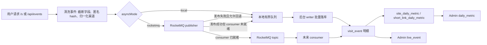

# RocketMQ 访问事件削峰设计 v1

## 定位

本项目的访问统计入口已经集中在 `VisitEventService`：前端埋点、结果页浏览、短链访问都会先被清洗、截断、匿名化，再进入异步写入链路。

这一版 RocketMQ 设计的目标不是立刻替换全部统计系统，而是先把“事件投递通道”做成可开关能力：

- 默认 `local`：继续使用本地有界队列 + 批量写 `visit_event`，不依赖 RocketMQ。
- 可选 `rocketmq`：先把事件发布给 RocketMQ publisher；在未启用 MQ consumer 前，仍然 shadow 写入本地队列，保证数据中台不丢数。
- MQ 不可用：默认回退本地队列；也可以关闭回退，把低价值事件丢弃并通过 runtime 指标暴露。

## 当前已落地

| 能力 | 状态 | 说明 |
| --- | --- | --- |
| 投递接口 | 已落地 | `VisitEventRocketMqPublisher` 抽象了发布动作 |
| 默认禁用实现 | 已落地 | 无 RocketMQ 依赖时也能启动 |
| 配置开关 | 已落地 | `VISIT_EVENT_ASYNC_MODE=local|rocketmq` |
| MQ 发布指标 | 已落地 | runtime 暴露 publish/failure/fallback/shadow 计数 |
| shadow 本地写入 | 已落地 | consumer 落库未就绪时，MQ 发布成功后仍写本地队列 |
| 安全主消费闸门 | 已落地 | 仅当 `consumer-enabled=true` 且 publisher 声明 consumer persistence ready 时，才允许 MQ 接管落库 |
| 真正 RocketMQ producer | 未落地 | 后续接入 `rocketmq-spring-boot-starter` 后实现 publisher |
| 真正 RocketMQ consumer | 未落地 | 生产启用前必须补 consumer 和幂等 |
| eventId 幂等 | 未落地 | 生产消费前必须新增，否则重复消费会抬高 PV |

## 配置

```bash
VISIT_EVENT_ASYNC_MODE=local
VISIT_EVENT_ASYNC_QUEUE_CAPACITY=2048
VISIT_EVENT_ASYNC_DRAIN_LIMIT=64
```

启用 RocketMQ shadow 发布：

```bash
VISIT_EVENT_ASYNC_MODE=rocketmq
VISIT_EVENT_ROCKETMQ_NAME_SERVER=127.0.0.1:9876
VISIT_EVENT_ROCKETMQ_TOPIC=wuxing-visit-event
VISIT_EVENT_ROCKETMQ_TAG=visit
VISIT_EVENT_ROCKETMQ_PRODUCER_GROUP=wuxing-persona-producer
VISIT_EVENT_ROCKETMQ_CONSUMER_GROUP=wuxing-persona-consumer
VISIT_EVENT_ROCKETMQ_FALLBACK_TO_LOCAL=true
VISIT_EVENT_ROCKETMQ_CONSUMER_ENABLED=false
```

`VISIT_EVENT_ROCKETMQ_CONSUMER_ENABLED=false` 是当前推荐值。它表示“MQ 作为旁路 shadow 观察，本地队列仍然负责数据中台口径”。

即使误把 `VISIT_EVENT_ROCKETMQ_CONSUMER_ENABLED=true` 打开，当前默认 publisher 也不会让 MQ 直接接管落库。代码还要求 `VisitEventRocketMqPublisher.isConsumerPersistenceReady()` 返回 `true`，才会跳过本地 shadow 写入。这是为了避免“只接了 producer、没接 consumer”时数据中台突然看不到访问事件。

## 运行态观察

后台接口：

```http
GET /api/admin/visit-events/runtime
X-Admin-Token: <admin-token>
```

重点字段：

| 字段 | 含义 |
| --- | --- |
| `asyncMode` | 当前投递模式，`local` 或 `rocketmq` |
| `queueSize` | 本地队列积压 |
| `droppedAsyncEvents` | 本地队列满或关闭回退时丢弃的事件 |
| `rocketMqAvailable` | 当前 publisher 是否可用 |
| `rocketMqPublishedEvents` | MQ 发布成功数 |
| `rocketMqPublishFailures` | MQ 发布失败数 |
| `rocketMqFallbackEvents` | MQ 失败后回退本地队列的次数 |
| `rocketMqShadowLocalEvents` | MQ 成功发布但仍写本地队列的次数 |
| `rocketMqConsumerEnabled` | 是否允许 MQ consumer 成为落库主链路 |
| `rocketMqConsumerPersistenceReady` | publisher 是否确认 consumer 落库、幂等和失败处理已经就绪 |
| `healthStatus` | `ok`、`watch`、`danger` 三档健康状态 |
| `healthMessage` | 给后台和 smoke 使用的人话诊断 |

## 访问事件一致性总图



核心口径：

- 请求线程只负责创建清洗后的事件，不在热路径做 PV/UV/UIP 聚合。
- 默认事实来源仍是本地落库的 `visit_event`。
- MQ 在当前阶段是 shadow 能力，主要用于验证发布、失败和回退指标。
- 日聚合是历史查询加速层，不是新的事实来源；未聚合日期会回退实时事件。

## 生产启用前必须补齐

1. 新增 `event_id`：由事件类型、resultId/shortCode、clientIdHash、createdAt 或请求侧 nonce 组合生成。
2. `visit_event` 增加唯一键或幂等插入：防止 RocketMQ 至少一次投递导致 PV 重复。
3. 实现 RocketMQ producer：只发送清洗后的匿名事件，不发送原始 IP、User-Agent、完整 Referer。
4. 实现 RocketMQ consumer：批量消费后复用 `VisitEventMapper.insertBatch` 或幂等单写；只有完成后才能让 publisher 返回 `isConsumerPersistenceReady=true`。
5. 明确事务边界：业务表提交后再发布统计事件，避免业务回滚但统计已发送。
6. 处理延迟消费：已闭合日期的日聚合需要支持重跑，避免晚到事件被漏算。
7. 补监控：发送失败、消费失败、DLQ、消费积压、fallback、幂等冲突数。

实现真实 producer 时要注意：`VisitEventRocketMqPublisher.isAvailable()` 应返回本地缓存状态，不能在每个访问事件上同步探测 broker。真实发送失败、超时和重试交给 `publish()` 及其 fallback 处理，否则会把短链热路径重新拖慢。

## 面试表达

可以这样讲：

> 我没有一开始就把 RocketMQ 硬接进主链路，因为项目当前是单机低成本部署，直接引入 MQ 会增加运维复杂度。我的做法是先把访问事件写入抽象成可切换通道：默认本地有界队列，保证低延迟；当访问峰值上来时，可以切到 RocketMQ shadow 发布，观察发送失败和回退指标。真正让 MQ 承担主链路前，我会补 eventId 幂等、consumer 落库、DLQ 和重聚合策略，避免重复消费导致 PV 虚高。

## 当前边界

这版代码让项目“具备 RocketMQ 可选接入点”，不能宣称“已经完成生产级 RocketMQ 接入”。生产级接入必须以 consumer、幂等和监控补齐为完成标准。
