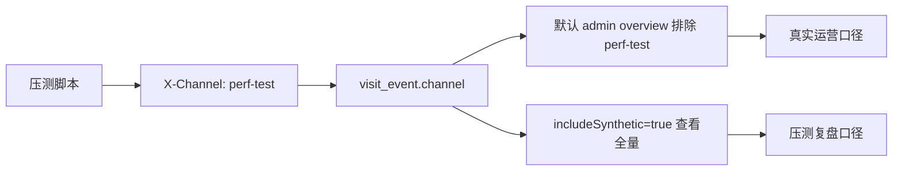

# 测试流量隔离架构决策 v1

## 当前结论

现阶段采用“事件明细标记 + 默认运营视图排除”的方案，不立即修改 `user_result` 和 `short_link` 表结构。

原因是当前项目还处在快速打磨期，压测、数据中台、RocketMQ shadow、人格文案和前端体验都在同时推进。实体层强隔离确实更稳，但需要 schema、写入链路、聚合任务和历史数据回填一起改，适合放到下一次稳定化迭代。

## 现有方案



现有隔离点：

- 压测脚本默认写入 `X-Channel: perf-test`。
- `visit_event` 落库保存 `channel` 和 `campaign`；新版压测脚本会把 `RUN_ID` 追加到 effective campaign，方便按批次追踪。
- 数据中台默认排除 `perf-test`。
- “包含测试流量”开关用于复盘压测全量。
- 前端“口径差异”诊断带显示测试流量增量。

## 当前方案的边界

这不是强隔离，而是视图层隔离。

| 风险 | 说明 | 当前缓解 |
| --- | --- | --- |
| 事件写入失败 | 如果 `RESULT_CREATED` / `SHORT_LINK_CREATED` 事件丢失，结果和短链本身没有 synthetic 标记 | 访问事件运行态暴露队列、丢弃和写入失败 |
| 查询性能 | 默认排除结果和短链时需要通过 `visit_event` 反查 | 当前数据量较小，后续可加实体字段 |
| 历史聚合 | `daily_metric` 是全量口径，默认排除时不能直接复用 | 默认排除时回退 `live_event`，保证口径正确 |
| 人为参数错误 | 如果压测没有使用 `perf-test`，就无法自动隔离 | 脚本默认带标记，文档要求公网压测前确认 |

## 下一阶段强隔离设计

推荐在数据稳定后增加实体层来源字段：

```sql
ALTER TABLE user_result
  ADD COLUMN source_channel VARCHAR(64) NULL,
  ADD COLUMN source_campaign VARCHAR(64) NULL,
  ADD COLUMN synthetic TINYINT NOT NULL DEFAULT 0,
  ADD INDEX idx_user_result_synthetic_created(synthetic, created_at);

ALTER TABLE short_link
  ADD COLUMN source_channel VARCHAR(64) NULL,
  ADD COLUMN source_campaign VARCHAR(64) NULL,
  ADD COLUMN synthetic TINYINT NOT NULL DEFAULT 0,
  ADD INDEX idx_short_link_synthetic_created(synthetic, created_at);
```

写入链路调整：

1. `ResultService.create` 从 request 中解析 `channel/campaign`。
2. `UserResultEntity` 写入 `source_channel/source_campaign/synthetic`。
3. `ShortLinkService.createForResult` 继承结果来源，或接收显式来源参数。
4. Admin 默认查询直接用 `synthetic = 0`，不再依赖 `visit_event` 反查。
5. 聚合任务拆成真实口径和全量口径，避免默认看板为了排除测试流量只能回退实时明细。

## 迁移步骤

1. 添加 nullable 来源字段和默认 `synthetic=0`。
2. 新结果和新短链开始双写来源字段。
3. 对历史数据用 `visit_event` 回填可识别的 `perf-test` 结果和短链。
4. Admin 查询从事件反查迁移到实体字段。
5. 增加聚合表口径字段，例如 `metric_scope=organic|all`。
6. 稳定后再清理旧的反查逻辑。

## 面试表达

可以这样说：

> 我没有一开始就把测试流量隔离做成表级字段，因为项目处于快速迭代期，立即改结果表和短链表会带来迁移、回填和聚合口径的联动风险。第一阶段我先用 `visit_event.channel=perf-test` 做默认运营视图隔离，并提供 `includeSynthetic=true` 和口径差异面板来复盘压测影响。这个方案能快速保护运营判断，但我也明确知道它不是强隔离，所以后续会把 `source_channel` 和 `synthetic` 下沉到 `user_result`、`short_link`，再把日聚合拆成真实口径和全量口径。
