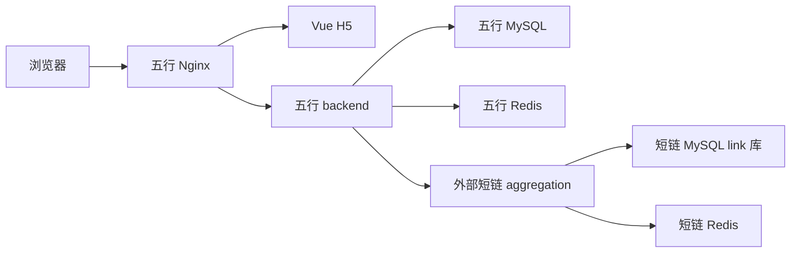

# v1.1 外部短链生产级接入增强

日期：2026-06-10

目标：把 external 模式从“已适配、可联调”推进到“生产接入前可预检、可联调、可审计、可交接”的状态。本阶段不做服务器真实部署，不修改外部短链项目源码，不破坏 v1.0 稳定版主链路。

## 1. 本阶段交付

| 类型 | 文件 | 作用 |
| --- | --- | --- |
| Compose overlay | `deploy/docker-compose.external-mode.yml` | 在五行 Compose 基础上切换 backend 到 external 模式 |
| 环境样例 | `deploy/.env.external.example` | 给明天部署 external 模式时复制和改造 |
| 预检脚本 | `scripts/external-shortlink-preflight.sh` | 检查 external 关键环境变量、系统用户、domain 和可选连通性 |
| 联调脚本 | `scripts/external-shortlink-smoke-test.sh` | 创建一次测算结果，校验短链、302 和可选后台 `statSource` |
| 对接说明 | `docs/external-shortlink-integration-guide.md` | 说明外部短链服务 API、header、domain、统计和路由约定 |
| 隐私审计 | `docs/external-shortlink-privacy-audit.md` | 区分五行项目已脱敏能力和外部短链项目待治理风险 |
| 质量门禁 | `scripts/quality-check.sh` | 纳入 v1.1 脚本语法和 external Compose 配置校验 |

## 2. 接入架构



v1.1 继续保持一个原则：五行项目保存人格结果和 `resultId -> shortCode -> shortUrl` 业务绑定，外部短链服务负责短码基础设施、跳转和外部统计。即使 external 不可用，`SHORT_LINK_EXTERNAL_FALLBACK_TO_INTERNAL=true` 时测算主流程仍可回到内置短链。

## 3. external 模式 Compose

默认 Compose 仍然是 v1.0 的 internal 稳定模式。需要 external 模式时叠加 overlay：

```bash
cp deploy/.env.external.example deploy/.env.external
scripts/deploy-preflight.sh deploy/.env.external
scripts/external-shortlink-preflight.sh deploy/.env.external
docker compose --env-file deploy/.env.external \
  -f deploy/docker-compose.yml \
  -f deploy/docker-compose.external-mode.yml \
  config
```

启动命令：

```bash
docker compose --env-file deploy/.env.external \
  -f deploy/docker-compose.yml \
  -f deploy/docker-compose.external-mode.yml \
  up --build -d
```

`deploy/docker-compose.external-mode.yml` 不会自动启动外部短链项目。原因是当前 `/Users/linyuxiang/JavaBackend/01_Projects/shortlink` 仓库没有可直接复用的 Dockerfile 或 Compose 文件，且它依赖独立的 MySQL `link` 库、Redis、Nacos 和 ShardingSphere 配置。v1.1 选择提供稳定 overlay，让五行 backend 可以访问已经运行的外部 aggregation 服务。

本地 Docker Desktop 场景下，五行容器访问宿主机外部短链服务使用：

```text
SHORT_LINK_EXTERNAL_BASE_URL=http://host.docker.internal:8003
```

服务器部署时，如果外部短链服务也在同一 Docker 网络内，建议改为：

```text
SHORT_LINK_EXTERNAL_BASE_URL=http://shortlink:8003
```

## 4. 预检脚本

基础配置检查：

```bash
scripts/external-shortlink-preflight.sh deploy/.env.external
```

外部服务启动后再做连通性探测：

```bash
scripts/external-shortlink-preflight.sh deploy/.env.external --probe
```

脚本会检查：

- `SHORT_LINK_MODE=external`。
- `SHORT_LINK_EXTERNAL_BASE_URL` 必须带 `http://` 或 `https://`。
- `SHORT_LINK_EXTERNAL_DOMAIN` 必须是不带 scheme 的 `host[:port]`。
- `fallback` 和 `statsEnabled` 必须是布尔值。
- 系统用户 header 不建议继续使用 `admin`。
- 如果配置了 `EXTERNAL_SHORTLINK_PROJECT_DIR`，检查本地 aggregation 配置是否存在。

## 5. 联调脚本

五行服务启动后执行：

```bash
WUXING_BASE_URL=http://127.0.0.1:8088 \
ADMIN_TOKEN=<your-admin-token> \
EXPECTED_STAT_SOURCE=external \
scripts/external-shortlink-smoke-test.sh
```

脚本会完成：

1. 调用 `GET /api/health`。
2. 调用 `POST /api/results` 创建一次真实测算。
3. 提取 `resultId`、`shortCode` 和 `shortUrl`。
4. 访问五行兼容入口 `/s/{shortCode}`，校验 301 / 302 到对应结果页。
5. 如果传入 `ADMIN_TOKEN`，查询后台短链列表并输出 `statSource`。
6. 如果设置 `EXPECTED_STAT_SOURCE`，强校验来源是否符合预期。

说明：如果生产 Nginx 已经把短链子域名或 `/s/**` 切到外部短链服务，还需要额外直接访问 `shortUrl`，确认外部服务自身也能 302 到五行结果页。

## 6. 失败场景

v1.1 新增或纳入测试覆盖：

| 场景 | 预期 |
| --- | --- |
| 外部创建接口返回业务错误码 | 抛出明确 `BusinessException`，Provider 可按配置降级 |
| 外部统计接口返回空 `data` | 抛出明确错误，上层统计适配器回退本地统计 |
| 外部访问明细返回业务错误码 | 抛出明确错误，上层访问明细回退本地记录 |
| 外部返回短码与五行本地绑定冲突 | 默认降级到内置短链，不写错误绑定 |
| 关闭 fallback 后发生短码冲突 | 明确抛错，阻止错误绑定写入 |
| external stats 未启用、internal 模式、domain 不匹配 | 跳过外部统计，使用本地 `visit_event` |

## 7. 明天部署前清单

- 在外部短链项目中准备专用系统用户：`wuxing_system`。
- 在外部短链项目中准备专用分组：`wuxing_persona`。
- 决定短链入口使用 `s.your-domain.com/{code}` 还是同域 `/s/{code}` rewrite。
- 确认 `SHORT_LINK_EXTERNAL_DOMAIN` 与外部短链服务生成的 `fullShortUrl` 域名一致。
- 替换 `deploy/.env.external` 中所有 `replace-with-*` 值。
- 执行 `scripts/deploy-preflight.sh deploy/.env.external`。
- 执行 `scripts/external-shortlink-preflight.sh deploy/.env.external --probe`。
- 启动五行 external Compose 后执行 `scripts/external-shortlink-smoke-test.sh`。

## 8. 不在本阶段做

- 不改朋友匹配。
- 不做登录注册。
- 不做付费。
- 不做 AI 深度解读。
- 不启动服务器真实部署。
- 不修改外部短链项目源码。
- 不提交真实 `.env`、密码、token、构建产物或 `node_modules`。
