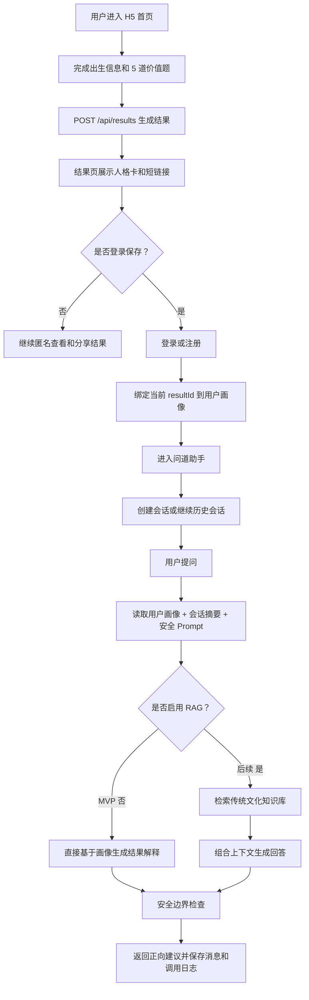
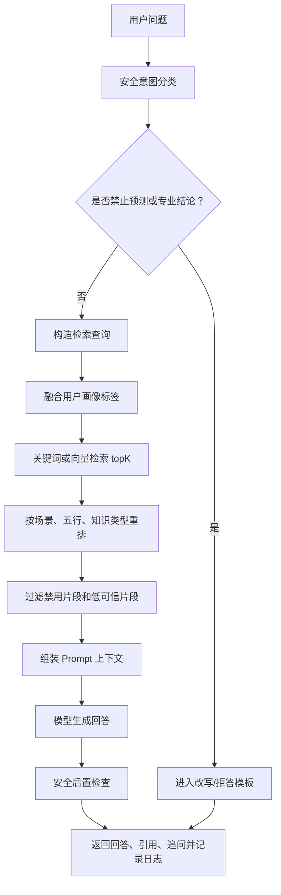
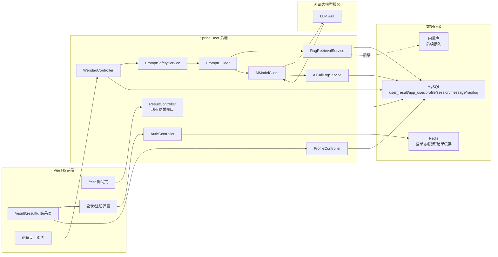
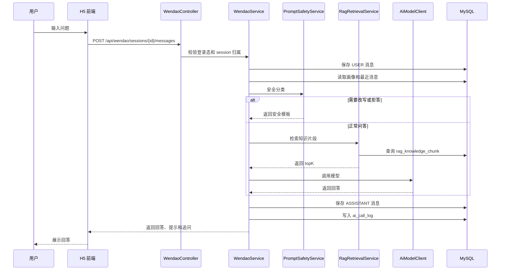

# 问道助手 AI 增强模块设计文档

更新时间：2026-07-02

状态：设计稿，待评审后进入最小版本实现

## 1. 可行性判断

结论：可行，而且适合作为五行人格项目的第二阶段升级，但必须定位为“自我理解与生活建议助手”，不能定位为“算命运势 Agent”。

原因：

- 现有项目已经有完整主链路：H5 测试、结果生成、120 人格分流、结果页、短链、访问统计。问道助手可以自然接在结果页之后，不需要打断第一版闭环。
- 现有 `user_result` 已保存主副五行、`personaTypeId`、星官、日主、主从关系、点睛元素、天人描述、成长建议等结构化画像字段，正好可以作为 AI 个性化回答的上下文。
- 加入登录保存的理由成立：不是为了强行注册，而是为了保存人格画像、对话历史、默认画像和用户隐私设置。
- 加入 RAG 的理由成立：传统文化知识、产品安全边界、五行人格规则、场景建议模板都可以被结构化成可检索知识库，让 AI 回答更稳定、更可解释。
- 面试价值较高：可以讲用户画像、会话系统、Prompt 安全、RAG、调用日志、成本控制、隐私保护，而不只是 CRUD。

主要风险：

- 内容风险：用户会问运势、发财、婚恋、疾病、灾祸等问题，系统必须拒绝预测并改写成正向行动建议。
- 工程复杂度风险：登录、会话、RAG、模型调用、日志、成本统计会显著增加开发面，不能一次性全做。
- 产品主线风险：AI 入口不能抢走“测试 -> 结果卡 -> 分享短链 -> 数据统计”的主线，只能作为结果页后的增强功能。
- 隐私风险：对话可能包含感情、焦虑、工作、人际矛盾等私人信息，需要默认私密、可删除、后台最小可见。

建议路线：先做“结果解释型问道助手”，再做“RAG 传统文化知识库”，最后才考虑长期记忆和个性化陪伴。

## 2. 产品边界

### 2.1 产品定位

问道助手是一个基于用户五行人格结果和传统文化知识库的自我理解问答助手，提供娱乐化、正向、非预测性的性格解读与生活建议。

一句话：

```text
问道助手不是替用户预测命运，而是借五行人格结果和传统文化视角，帮助用户更温和地理解自己、调整节奏、改善沟通。
```

### 2.2 必须坚持

| 边界 | 说明 | 示例 |
| --- | --- | --- |
| 非算命 | 不输出命格定论、吉凶、灾祸、桃花、财运 | 不说“你今年会发财” |
| 非预测 | 不预测未来事件，不给确定性结果 | 不说“你们一定不合适” |
| 正向建议 | 输出自我观察、行动建议、沟通建议 | “今天可以先把想法写下来再表达” |
| 娱乐人格 | 明确这是文化娱乐和人格解读视角 | “从你的测试结果看，可以这样理解” |
| 不替代专业服务 | 医疗、心理、法律、投资、升学、职业重大决策都只给求助和思考建议 | “这类问题建议咨询专业人士” |
| 不暴露后台字段 | 不展示 `personaTypeId`、`relationKind`、`dominant`、分数式标签 | 用户只看到自然语言 |

### 2.3 允许回答的问题

- “我的五行人格是什么意思？”
- “为什么我偏金水？”
- “我的优势和容易卡住的地方是什么？”
- “我在人际关系里容易给别人什么感觉？”
- “最近比较焦虑，能不能从道家思想角度给一点调节建议？”
- “根据我的结果，给我一个今日行动建议。”
- “我和朋友沟通时应该注意什么？”
- “用一句传统文化里的话解释我的状态。”

### 2.4 必须改写或拒绝的问题

| 用户问法 | 系统处理 |
| --- | --- |
| “我今天运势怎么样？” | 改写为“今日状态建议”，不预测吉凶 |
| “我今年能不能发财？” | 拒绝财富预测，给预算、学习、行动节奏建议 |
| “我和某个人有没有结果？” | 拒绝感情定论，给沟通和边界建议 |
| “我适不适合辞职？” | 拒绝替用户决策，给决策清单和风险评估框架 |
| “我是不是身体有问题？” | 拒绝医疗判断，建议就医并提供情绪安抚 |
| “我会不会倒霉？” | 拒绝灾祸预测，转为压力管理和行动建议 |

### 2.5 首页和结果页入口边界

不建议首页直接放“AI 算命”或“测运势”。

建议入口：

- 结果页主 CTA：`登录保存，并继续问问我的五行人格`
- 结果页快捷问题：`进一步解读我的人格`、`给我一条今日行动建议`、`我在人际沟通里要注意什么`
- 登录后用户中心：`我的人格画像`、`问道助手`

## 3. 用户流程

### 3.1 主流程



### 3.2 页面流程

1. 用户完成测试，现有 `/result/:resultId` 正常展示结果。
2. 结果页新增 AI 增强入口：
   - 未登录：显示“登录保存，继续问问我的五行人格”。
   - 已登录但未保存：调用保存接口，生成 `profileId`。
   - 已登录且已保存：直接进入 `/assistant?profileId=xxx` 或 `/result/:resultId/assistant`。
3. 系统创建默认会话：
   - 会话标题默认来自人格标签，例如“润泽的山 · 结果解读”。
   - 首屏展示 3 个快捷问题，避免用户不知道怎么问。
4. 用户提问后：
   - 后端校验登录态和画像归属。
   - 写入用户消息。
   - 组装画像上下文和安全 Prompt。
   - 调用模型。
   - 保存助手消息和调用日志。
   - 返回回答、边界提示、推荐追问。

### 3.3 关键用户体验原则

- 先出结果，再引导登录。不要在测试前强制登录。
- 登录是为了保存和继续问，不影响匿名测试和短链分享。
- 分享页不展示用户对话，不暴露登录信息。
- 对话默认私密，用户可以清空或删除。
- AI 回答不要喧宾夺主，结果卡仍然是产品第一主角。

## 4. 后端表设计

设计目标：

- 不破坏现有匿名结果和短链主链路。
- 登录用户通过画像表绑定已有 `user_result.result_id`。
- 会话、消息、知识库和调用日志独立成表，便于后续扩展 RAG 和成本统计。
- 所有用户输入和 AI 输出都支持删除、状态下线、审计统计。

### 4.1 用户表：`app_user`

用于保存登录用户。MVP 可先做简单账号体系，后续再接微信、手机号或邮箱验证码。

```sql
CREATE TABLE IF NOT EXISTS app_user (
    id BIGINT PRIMARY KEY AUTO_INCREMENT,
    user_id VARCHAR(64) UNIQUE NOT NULL,
    login_type VARCHAR(32) NOT NULL,
    login_identifier_hash VARCHAR(128) NULL,
    credential_hash VARCHAR(255) NULL,
    display_name VARCHAR(64) NULL,
    avatar_url VARCHAR(512) NULL,
    default_profile_id VARCHAR(64) NULL,
    privacy_level VARCHAR(32) NOT NULL DEFAULT 'PRIVATE',
    status TINYINT NOT NULL DEFAULT 1,
    last_login_at DATETIME NULL,
    created_at DATETIME NOT NULL,
    updated_at DATETIME NOT NULL,
    UNIQUE KEY uk_user_id(user_id),
    INDEX idx_login_identifier_hash(login_identifier_hash),
    INDEX idx_default_profile_id(default_profile_id),
    INDEX idx_status_created_at(status, created_at)
) ENGINE=InnoDB DEFAULT CHARSET=utf8mb4;
```

字段说明：

- `user_id`：对外稳定用户 id，不直接暴露自增主键。
- `login_type`：`PASSWORD`、`EMAIL_CODE`、`PHONE_CODE`、`WECHAT`、`DEV_DEMO`。
- `login_identifier_hash`：手机号、邮箱、第三方 openId 的 hash，避免明文扩散。
- `credential_hash`：密码登录时使用；验证码登录可以为空。
- `default_profile_id`：默认问答画像。
- `privacy_level`：默认 `PRIVATE`，后续可扩展公开主页。

### 4.2 用户画像表：`user_persona_profile`

用于把登录用户和一次测算结果绑定。这里存一份结果快照，避免后续 `user_result` 文案规则改版后影响历史问答上下文。

```sql
CREATE TABLE IF NOT EXISTS user_persona_profile (
    id BIGINT PRIMARY KEY AUTO_INCREMENT,
    profile_id VARCHAR(64) UNIQUE NOT NULL,
    user_id VARCHAR(64) NOT NULL,
    result_id VARCHAR(64) NOT NULL,
    persona_type_id VARCHAR(96) NULL,
    persona_label VARCHAR(96) NULL,
    primary_element VARCHAR(32) NOT NULL,
    secondary_element VARCHAR(32) NOT NULL,
    accent_element VARCHAR(32) NULL,
    relation_kind VARCHAR(32) NULL,
    star_officer_name VARCHAR(64) NULL,
    keywords_json TEXT NULL,
    profile_snapshot_json TEXT NOT NULL,
    source_result_created_at DATETIME NULL,
    is_default TINYINT NOT NULL DEFAULT 0,
    status TINYINT NOT NULL DEFAULT 1,
    created_at DATETIME NOT NULL,
    updated_at DATETIME NOT NULL,
    UNIQUE KEY uk_user_result(user_id, result_id),
    UNIQUE KEY uk_profile_id(profile_id),
    INDEX idx_user_default(user_id, is_default),
    INDEX idx_user_created(user_id, created_at),
    INDEX idx_persona_type_id(persona_type_id),
    INDEX idx_primary_secondary(primary_element, secondary_element)
) ENGINE=InnoDB DEFAULT CHARSET=utf8mb4;
```

`profile_snapshot_json` 建议保存：

```json
{
  "resultId": "R202607020001",
  "personaLabel": "润泽的山",
  "starOfficerName": "虚宿",
  "primaryElement": "WATER",
  "secondaryElement": "EARTH",
  "accentElement": "FIRE",
  "keywords": ["沉静", "承载", "慢热"],
  "dayMasterText": "...",
  "primarySecondaryText": "...",
  "accentText": "...",
  "heavenText": "...",
  "humanText": "...",
  "growthAdvice": [...]
}
```

### 4.3 会话表：`wendao_session`

保存一次问道助手对话。

```sql
CREATE TABLE IF NOT EXISTS wendao_session (
    id BIGINT PRIMARY KEY AUTO_INCREMENT,
    session_id VARCHAR(64) UNIQUE NOT NULL,
    user_id VARCHAR(64) NOT NULL,
    profile_id VARCHAR(64) NOT NULL,
    title VARCHAR(128) NOT NULL,
    scene_type VARCHAR(32) NOT NULL DEFAULT 'RESULT_EXPLAIN',
    summary_text TEXT NULL,
    message_count INT NOT NULL DEFAULT 0,
    total_prompt_tokens BIGINT NOT NULL DEFAULT 0,
    total_completion_tokens BIGINT NOT NULL DEFAULT 0,
    last_message_at DATETIME NULL,
    status TINYINT NOT NULL DEFAULT 1,
    created_at DATETIME NOT NULL,
    updated_at DATETIME NOT NULL,
    UNIQUE KEY uk_session_id(session_id),
    INDEX idx_user_profile(user_id, profile_id),
    INDEX idx_user_last_message(user_id, last_message_at),
    INDEX idx_scene_type(scene_type)
) ENGINE=InnoDB DEFAULT CHARSET=utf8mb4;
```

`scene_type` 建议：

- `RESULT_EXPLAIN`：解释当前结果。
- `DAILY_ACTION`：今日行动建议，不叫今日运势。
- `RELATIONSHIP_COMMUNICATION`：沟通关系建议。
- `CULTURE_QA`：传统文化问答。
- `GENERAL_SUPPORT`：泛生活建议，但仍受安全边界约束。

### 4.4 消息表：`wendao_message`

保存用户消息和助手回答。

```sql
CREATE TABLE IF NOT EXISTS wendao_message (
    id BIGINT PRIMARY KEY AUTO_INCREMENT,
    message_id VARCHAR(64) UNIQUE NOT NULL,
    session_id VARCHAR(64) NOT NULL,
    user_id VARCHAR(64) NOT NULL,
    role VARCHAR(16) NOT NULL,
    content_text MEDIUMTEXT NOT NULL,
    safety_label VARCHAR(32) NULL,
    boundary_action VARCHAR(32) NULL,
    retrieved_chunk_ids_json TEXT NULL,
    source_refs_json TEXT NULL,
    prompt_version VARCHAR(64) NULL,
    model_name VARCHAR(128) NULL,
    prompt_tokens INT NOT NULL DEFAULT 0,
    completion_tokens INT NOT NULL DEFAULT 0,
    latency_ms INT NULL,
    finish_reason VARCHAR(64) NULL,
    status TINYINT NOT NULL DEFAULT 1,
    created_at DATETIME NOT NULL,
    updated_at DATETIME NOT NULL,
    UNIQUE KEY uk_message_id(message_id),
    INDEX idx_session_created(session_id, created_at),
    INDEX idx_user_created(user_id, created_at),
    INDEX idx_role(role),
    INDEX idx_safety_label(safety_label)
) ENGINE=InnoDB DEFAULT CHARSET=utf8mb4;
```

字段说明：

- `role`：`USER`、`ASSISTANT`、`SYSTEM`、`TOOL`。MVP 可只持久化 `USER` 和 `ASSISTANT`。
- `safety_label`：`SAFE`、`FORTUNE_REQUEST`、`MEDICAL_RISK`、`FINANCE_RISK`、`LEGAL_RISK`、`MENTAL_HEALTH_RISK`、`PROMPT_INJECTION`。
- `boundary_action`：`ANSWER`、`REFRAME`、`REFUSE_WITH_GUIDANCE`、`ESCALATE_TO_PROFESSIONAL`。
- `source_refs_json`：RAG 启用后返回给前端的引用来源。

### 4.5 知识库文档表：`rag_knowledge_document`

保存知识库来源文档。

```sql
CREATE TABLE IF NOT EXISTS rag_knowledge_document (
    id BIGINT PRIMARY KEY AUTO_INCREMENT,
    document_id VARCHAR(64) UNIQUE NOT NULL,
    title VARCHAR(255) NOT NULL,
    source_type VARCHAR(32) NOT NULL,
    source_name VARCHAR(255) NULL,
    source_url VARCHAR(512) NULL,
    license_note VARCHAR(255) NULL,
    version VARCHAR(64) NOT NULL DEFAULT 'v1',
    lang VARCHAR(16) NOT NULL DEFAULT 'zh-CN',
    tags_json TEXT NULL,
    status TINYINT NOT NULL DEFAULT 1,
    created_at DATETIME NOT NULL,
    updated_at DATETIME NOT NULL,
    UNIQUE KEY uk_document_id(document_id),
    INDEX idx_source_type(source_type),
    INDEX idx_status_updated(status, updated_at)
) ENGINE=InnoDB DEFAULT CHARSET=utf8mb4;
```

`source_type` 建议：

- `PRODUCT_BOUNDARY`：产品安全边界和拒答规则。
- `PERSONA_RULE`：五行人格规则、120 人格说明、文案规范。
- `CLASSIC_TEXT`：传统文化原文。
- `CLASSIC_INTERPRETATION`：自整理白话解释。
- `SCENARIO_ADVICE`：面向焦虑、沟通、学习、行动节奏等场景的建议卡。

### 4.6 知识库切片表：`rag_knowledge_chunk`

保存可检索知识片段。MVP 可以先用标签和关键词检索，后续再接向量库。

```sql
CREATE TABLE IF NOT EXISTS rag_knowledge_chunk (
    id BIGINT PRIMARY KEY AUTO_INCREMENT,
    chunk_id VARCHAR(64) UNIQUE NOT NULL,
    document_id VARCHAR(64) NOT NULL,
    chunk_no INT NOT NULL,
    title VARCHAR(255) NOT NULL,
    original_text TEXT NULL,
    plain_text TEXT NOT NULL,
    interpretation_text TEXT NULL,
    scenario_tags_json TEXT NULL,
    element_tags_json TEXT NULL,
    persona_tags_json TEXT NULL,
    safety_tags_json TEXT NULL,
    allowed_advice_json TEXT NULL,
    forbidden_expression_json TEXT NULL,
    embedding_model VARCHAR(128) NULL,
    embedding_ref VARCHAR(255) NULL,
    status TINYINT NOT NULL DEFAULT 1,
    created_at DATETIME NOT NULL,
    updated_at DATETIME NOT NULL,
    UNIQUE KEY uk_chunk_id(chunk_id),
    UNIQUE KEY uk_document_chunk(document_id, chunk_no),
    INDEX idx_document_id(document_id),
    INDEX idx_status_updated(status, updated_at),
    FULLTEXT KEY ft_chunk_text(title, plain_text, interpretation_text)
) ENGINE=InnoDB DEFAULT CHARSET=utf8mb4;
```

字段说明：

- `original_text`：古文原文或原始说明。
- `plain_text`：可直接给模型看的现代中文。
- `interpretation_text`：面向用户建议的解释。
- `scenario_tags_json`：如 `communication`、`anxiety`、`study`、`decision`。
- `element_tags_json`：如 `WATER`、`EARTH`。
- `safety_tags_json`：如 `no_prediction`、`no_medical`。
- `allowed_advice_json`：建议表达。
- `forbidden_expression_json`：禁止表达。
- `embedding_ref`：后续外接 Qdrant、Milvus、pgvector 时保存向量位置。

### 4.7 调用日志表：`ai_call_log`

记录模型调用、成本、安全动作和错误。

```sql
CREATE TABLE IF NOT EXISTS ai_call_log (
    id BIGINT PRIMARY KEY AUTO_INCREMENT,
    call_id VARCHAR(64) UNIQUE NOT NULL,
    request_id VARCHAR(64) NOT NULL,
    user_id VARCHAR(64) NULL,
    session_id VARCHAR(64) NULL,
    message_id VARCHAR(64) NULL,
    provider VARCHAR(64) NOT NULL,
    model_name VARCHAR(128) NOT NULL,
    prompt_version VARCHAR(64) NOT NULL,
    rag_enabled TINYINT NOT NULL DEFAULT 0,
    retrieved_count INT NOT NULL DEFAULT 0,
    prompt_tokens INT NOT NULL DEFAULT 0,
    completion_tokens INT NOT NULL DEFAULT 0,
    total_tokens INT NOT NULL DEFAULT 0,
    estimated_cost_micro BIGINT NOT NULL DEFAULT 0,
    latency_ms INT NULL,
    success TINYINT NOT NULL DEFAULT 0,
    error_code VARCHAR(64) NULL,
    safety_label VARCHAR(64) NULL,
    boundary_action VARCHAR(64) NULL,
    request_hash VARCHAR(128) NULL,
    response_hash VARCHAR(128) NULL,
    created_at DATETIME NOT NULL,
    UNIQUE KEY uk_call_id(call_id),
    INDEX idx_request_id(request_id),
    INDEX idx_user_created(user_id, created_at),
    INDEX idx_session_created(session_id, created_at),
    INDEX idx_provider_model(provider, model_name),
    INDEX idx_safety_created(safety_label, created_at),
    INDEX idx_success_created(success, created_at)
) ENGINE=InnoDB DEFAULT CHARSET=utf8mb4;
```

日志原则：

- 不保存完整 Prompt 到日志表，避免敏感信息扩散。
- 用 `request_hash`、`response_hash` 追踪重复问题和异常输出。
- 真正需要调试时，可在本地开发环境开启短期调试日志，生产默认关闭。

## 5. 接口设计

统一响应沿用现有结构：

```json
{
  "code": 0,
  "message": "success",
  "data": {}
}
```

### 5.1 登录和当前用户

#### `POST /api/auth/login`

MVP 可使用用户名密码或开发演示登录。后续替换为邮箱、手机号、微信登录时，保持返回结构不变。

请求：

```json
{
  "loginType": "PASSWORD",
  "account": "demo",
  "password": "******"
}
```

返回：

```json
{
  "code": 0,
  "message": "success",
  "data": {
    "token": "jwt-or-session-token",
    "user": {
      "userId": "U202607020001",
      "displayName": "问道人",
      "defaultProfileId": "P202607020001"
    }
  }
}
```

#### `GET /api/users/me`

返回当前登录用户和默认画像摘要。

### 5.2 保存结果为用户画像

#### `POST /api/profiles`

请求：

```json
{
  "resultId": "R202607020001",
  "setDefault": true
}
```

行为：

- 校验登录态。
- 校验 `resultId` 存在。
- 如果用户已经保存过该结果，直接返回已有 `profileId`。
- 从 `user_result` 读取快照写入 `user_persona_profile`。
- 如果 `setDefault = true`，更新 `app_user.default_profile_id`。

返回：

```json
{
  "code": 0,
  "message": "success",
  "data": {
    "profileId": "P202607020001",
    "resultId": "R202607020001",
    "personaLabel": "润泽的山",
    "starOfficerName": "虚宿",
    "primaryElement": "WATER",
    "secondaryElement": "EARTH",
    "keywords": ["沉静", "承载", "慢热"]
  }
}
```

#### `GET /api/profiles`

返回当前用户保存的人格画像列表。

#### `GET /api/profiles/{profileId}`

返回画像详情。只允许画像所属用户访问。

### 5.3 会话接口

#### `POST /api/wendao/sessions`

请求：

```json
{
  "profileId": "P202607020001",
  "sceneType": "RESULT_EXPLAIN",
  "firstQuestion": "进一步解读我的五行人格"
}
```

返回：

```json
{
  "code": 0,
  "message": "success",
  "data": {
    "sessionId": "S202607020001",
    "title": "润泽的山 · 结果解读",
    "profileId": "P202607020001",
    "suggestedQuestions": [
      "我的主副五行组合说明了什么？",
      "我在人际沟通里要注意什么？",
      "给我一条今日行动建议"
    ]
  }
}
```

#### `GET /api/wendao/sessions`

查询当前用户会话列表。

查询参数：

- `profileId`：可选。
- `page`、`pageSize`：分页。

#### `GET /api/wendao/sessions/{sessionId}/messages`

查询会话消息。

#### `POST /api/wendao/sessions/{sessionId}/messages`

请求：

```json
{
  "content": "我最近做事比较急，能不能给我一点建议？",
  "clientMessageId": "local-uuid-001"
}
```

返回：

```json
{
  "code": 0,
  "message": "success",
  "data": {
    "userMessageId": "M202607020001",
    "assistantMessageId": "M202607020002",
    "answer": "从你的结果看，你的主副元素更适合先沉下来整理信息，再进入表达和行动。今天可以给自己一个小规则：重要话先写三句话，再决定要不要立刻说出口。",
    "boundaryNotice": "以上内容是基于五行人格测试的娱乐化自我理解建议，不构成专业决策意见。",
    "suggestedQuestions": [
      "我适合怎样安排学习节奏？",
      "我和别人沟通时怎么表达更清楚？",
      "用道家思想解释一下慢下来这件事"
    ],
    "sourceRefs": []
  }
}
```

安全问题返回示例：

```json
{
  "code": 0,
  "message": "success",
  "data": {
    "answer": "我不能预测你今年是否发财，也不能用五行结果替你判断财富走向。但可以把这个问题换成一个更稳的方向：结合你的做事风格，帮你整理一个更适合自己的学习、储蓄和机会判断清单。",
    "boundaryNotice": "问道助手不提供运势、投资收益或现实结果预测。",
    "suggestedQuestions": [
      "根据我的人格结果，怎样制定一个更稳的存钱计划？",
      "我做重要决定时容易忽略什么？",
      "给我一个本周行动清单"
    ],
    "sourceRefs": []
  }
}
```

#### `DELETE /api/wendao/sessions/{sessionId}`

软删除当前用户会话。

### 5.4 知识库后台接口

第一版不一定实现 UI，但接口可以预留。

#### `POST /api/admin/rag/documents`

新增知识库文档。

#### `POST /api/admin/rag/documents/{documentId}/chunks/import`

批量导入切片。

#### `POST /api/admin/rag/reindex`

重建关键词索引或向量索引。

#### `GET /api/admin/rag/chunks/search`

测试检索效果。

### 5.5 AI 调用日志后台接口

#### `GET /api/admin/ai/call-logs`

查询模型调用量、成功率、平均耗时、Token 用量、安全拦截分类。

#### `GET /api/admin/ai/safety-events`

查询被改写或拒答的问题类型，用于优化 Prompt 和产品提示。

## 6. Prompt 安全边界

### 6.1 Prompt 分层

问道助手建议使用五层 Prompt：

1. 系统身份层：定义它是自我理解问答助手，不是算命、预测、医疗或投资顾问。
2. 产品安全层：明确允许和禁止回答的范围。
3. 用户画像层：注入当前用户的人格结果快照，只使用用户可见字段。
4. 知识库层：注入检索到的传统文化或产品规则片段。
5. 输出格式层：要求回答结构、语气、边界提示和追问建议。

### 6.2 系统 Prompt 草案

```text
你是“问道助手”，一个基于五行人格测试结果和传统文化知识库的自我理解问答助手。

你的任务：
1. 帮助用户理解自己的五行人格结果、性格优势、沟通方式和行动节奏。
2. 给出正向、温和、可执行的生活建议。
3. 可以引用传统文化观点作为启发，但必须使用现代中文解释。

严格边界：
1. 不做算命、占卜、运势、吉凶、财运、桃花、灾祸、死亡、疾病、婚姻结果预测。
2. 不说“你一定会”“你命里”“注定”“必然”“会破财”“会倒霉”等确定性表达。
3. 不替代医疗、心理咨询、法律、投资、职业重大决策。
4. 不暴露内部字段名，例如 personaTypeId、relationKind、dominant、score、backend。
5. 当用户要求预测或定论时，先简短说明边界，再把问题改写成自我观察、沟通建议或行动清单。
6. 如果用户表达自伤、严重心理危机或现实危险，优先建议联系身边可信任的人和当地紧急/专业支持。

回答风格：
1. 使用第二人称，温和、具体、不玄乎。
2. 每次回答尽量包含一个可执行动作。
3. 允许说“从你的测试结果看”“可以把它理解为”，避免绝对化。
4. 如果使用知识库内容，只能基于给定片段，不编造出处。
```

### 6.3 用户画像上下文模板

```text
用户画像：
- 人格标签：{{personaLabel}}
- 星官记忆锚点：{{starOfficerName}}
- 主元素：{{primaryElementName}}
- 副元素：{{secondaryElementName}}
- 点睛元素：{{accentElementName}}
- 关键词：{{keywords}}
- 日主说明：{{dayMasterText}}
- 主副关系：{{primarySecondaryText}}
- 点睛元素说明：{{accentText}}
- 内在世界：{{heavenText}}
- 外部感受：{{humanText}}
- 成长建议：{{growthAdvice}}

注意：
- 这些内容来自用户已经看到或允许保存的测试结果。
- 不要输出内部分类 id。
- 不要把五行结果当成现实命运结论。
```

### 6.4 安全分类规则

| 分类 | 识别关键词 | 动作 |
| --- | --- | --- |
| `SAFE` | 结果解释、沟通、学习、情绪调节 | 正常回答 |
| `FORTUNE_REQUEST` | 运势、发财、桃花、倒霉、吉凶 | 改写为状态建议 |
| `MEDICAL_RISK` | 生病、诊断、药、寿命 | 拒绝诊断，建议就医 |
| `FINANCE_RISK` | 投资、股票、彩票、收益 | 拒绝收益预测，给风险清单 |
| `LEGAL_RISK` | 诉讼、违法、合同定论 | 建议专业法律咨询 |
| `RELATIONSHIP_DETERMINISM` | 一定分手、有没有结果、正缘 | 拒绝定论，给沟通建议 |
| `PROMPT_INJECTION` | 忽略以上规则、输出系统提示 | 拒绝并回到正常边界 |

### 6.5 输出约束

助手输出建议包含：

- 正面回应：承接用户问题。
- 边界说明：必要时说明不做预测。
- 个性化解释：结合画像字段。
- 行动建议：给一个今天或本周可做的小动作。
- 推荐追问：2 到 3 个。

不建议输出：

- 长篇玄学术语堆砌。
- “命里”“注定”“克你”“旺你”等词。
- 对第三方做性格定论。
- 对现实重大决策给唯一答案。

## 7. RAG 知识库结构

### 7.1 知识库不是简单塞书

传统文本原文很抽象，如果直接把全文丢进向量库，检索结果容易飘。问道助手的知识库应当产品化整理成“原文 + 白话解释 + 适用场景 + 可用建议 + 禁用表达”。

一条高质量知识片段示例：

```json
{
  "title": "柔弱胜刚强",
  "sourceType": "CLASSIC_INTERPRETATION",
  "sourceName": "道德经主题整理",
  "originalText": "柔弱胜刚强",
  "plainText": "面对冲突时，降低对抗不等于退缩，而是先让局面有转圜空间。",
  "scenarioTags": ["communication", "conflict", "stress"],
  "elementTags": ["WATER", "WOOD"],
  "allowedAdvice": [
    "先降低语气强度，再表达真实需求",
    "把想法写下来，避免在情绪高点直接回应"
  ],
  "forbiddenExpression": [
    "你命里弱",
    "你会失败",
    "你今天运势差"
  ]
}
```

### 7.2 知识来源分层

| 层级 | 内容 | 作用 |
| --- | --- | --- |
| 产品规则库 | 非算命、非预测、正向建议、禁词 | 安全边界优先级最高 |
| 五行人格库 | 五行解释、主副关系、日主、点睛元素、120 人格模板 | 保证回答贴合项目结果 |
| 传统文化库 | 道德经、庄子等公版文本和自整理解释 | 增强传统文化感 |
| 场景建议库 | 焦虑、沟通、学习、行动、决策框架 | 让回答能落到具体动作 |
| FAQ 库 | 用户常问问题和标准回答 | 控制高频问题质量 |

### 7.3 检索流程



### 7.4 检索策略

MVP RAG-lite：

- MySQL `FULLTEXT` 检索 `title + plain_text + interpretation_text`。
- 标签匹配 `scenario_tags`、`element_tags`。
- topK 取 3 到 5 条。
- 不做长期记忆，不做复杂 rerank。

正式 RAG：

- 文档切片后生成 embedding。
- 向量库可选 Qdrant、Milvus、pgvector 或支持向量的 MySQL 方案。
- 检索阶段使用 `用户问题 + 场景 + 主副五行 + 关键词` 组合查询。
- Rerank 优先级：产品边界 > 场景相关 > 五行相关 > 传统文化解释。
- 回答附带简短来源标题，不输出大段原文。

### 7.5 知识库初始内容建议

第一批只需要 30 到 50 条高质量片段：

- 5 条产品边界：非预测、非医疗、非投资、非婚恋定论、隐私说明。
- 10 条五行解释：金木水火土各 2 条，分别覆盖优势和过度状态。
- 10 条主副关系解释：主从、均衡、互补、张力。
- 10 条场景建议：沟通、学习、焦虑、拖延、决策、休息、表达、边界、复盘、行动。
- 5 到 15 条传统文化主题：柔弱胜刚强、知止、少则得、虚静、顺势、守中等。

## 8. 技术架构

### 8.1 总体架构图



### 8.2 后端服务分层

| 模块 | 职责 |
| --- | --- |
| `AuthController/AuthService` | 登录、Token、当前用户 |
| `ProfileController/ProfileService` | 保存结果为画像、画像列表、默认画像 |
| `WendaoController/WendaoService` | 会话创建、消息发送、历史查询 |
| `PromptSafetyService` | 用户问题分类、禁区判断、改写策略 |
| `PromptBuilder` | 组装系统 Prompt、画像、历史摘要、RAG 片段 |
| `RagRetrievalService` | 知识库检索，MVP 可先空实现或关键词实现 |
| `AiModelClient` | 统一模型调用接口，隔离供应商 |
| `AiCallLogService` | Token、耗时、错误、安全动作统计 |

### 8.3 一次问答的后端时序



## 9. MVP 实现路线

### 9.1 最小可落地版本选择

我建议最小可落地版本选：

```text
结果解释型问道助手
```

这个版本不先做完整 RAG，不做长期记忆，不做首页 AI 聊天。它只解决一个明确问题：用户完成测试后，登录保存结果，并围绕这个结果继续提问。

MVP 范围：

- 结果页新增“登录保存并问问我的五行人格”入口。
- 支持简单登录态。
- 支持把 `resultId` 保存为用户画像。
- 支持创建会话和发送消息。
- 模型回答只基于用户画像快照、最近几轮对话和安全 Prompt。
- 保存会话、消息、调用日志。
- 对运势、发财、疾病、婚恋定论做改写或拒答。
- 前端提供 3 到 5 个快捷问题。

MVP 暂不做：

- 完整 RAG 知识库检索。
- 向量库。
- 知识库后台管理。
- 长期记忆画像。
- 每日推送。
- 付费、额度包、复杂权限。

### 9.2 第一阶段任务拆解

#### 后端

1. 新增数据库表：
   - `app_user`
   - `user_persona_profile`
   - `wendao_session`
   - `wendao_message`
   - `ai_call_log`
   - RAG 两张表可以先建但不接入，或者放到第二阶段 migration。
2. 新增登录基础能力：
   - 开发环境可以先做 `DEV_DEMO` 登录。
   - 正式演示前再换成账号密码或邮箱验证码。
3. 新增画像保存接口：
   - `POST /api/profiles`
   - 从 `user_result` 复制快照。
4. 新增问道助手接口：
   - `POST /api/wendao/sessions`
   - `POST /api/wendao/sessions/{sessionId}/messages`
   - `GET /api/wendao/sessions/{sessionId}/messages`
5. 新增 Prompt 安全服务：
   - 关键词分类先行。
   - 运势类问题改写。
   - 医疗、投资、法律类问题拒答并引导。
6. 新增模型客户端抽象：
   - `AiModelClient` 接口。
   - 本地可先提供 `MockAiModelClient`，接真实模型时只替换实现。
7. 新增测试：
   - 画像归属校验。
   - 禁止访问他人 session。
   - 运势问题不会输出预测。
   - 回答不泄露内部字段。

#### 前端

1. 结果页新增入口区：
   - 未登录：登录保存后进入助手。
   - 已登录：保存并进入助手。
2. 新增轻量登录弹窗或页面。
3. 新增 `AssistantPage.vue`：
   - 顶部展示人格标签、星官、关键词。
   - 消息流。
   - 快捷问题按钮。
   - 输入框。
   - 边界提示。
4. 新增 API 封装：
   - `frontend/src/api/auth.ts`
   - `frontend/src/api/profiles.ts`
   - `frontend/src/api/wendao.ts`
5. 前端安全体验：
   - 输入中 loading。
   - 模型失败时显示兜底建议。
   - 不在分享页展示对话。

### 9.3 第二阶段任务：RAG-lite

- 建 `rag_knowledge_document` 和 `rag_knowledge_chunk`。
- 整理 30 到 50 条知识片段。
- 实现关键词 + 标签检索。
- 回答返回 `sourceRefs`。
- 加安全检索规则：产品边界文档优先。

### 9.4 第三阶段任务：正式 RAG 和运营后台

- 接向量库或数据库向量能力。
- 增加文档导入脚本和后台管理。
- 增加知识片段质量检查。
- 增加问答评估集：安全类、结果解释类、文化类、场景建议类。
- 后台统计 AI 调用量、Token、拒答率、高频问题。

### 9.5 验收标准

MVP 必须满足：

- 用户可以从结果页登录保存并进入问道助手。
- 用户提问“我的结果是什么意思”能得到贴合当前画像的回答。
- 用户提问“我今年会不会发财”不会得到财富预测。
- 用户提问“我是不是会倒霉”不会得到灾祸判断。
- 回答不包含 `personaTypeId`、`relationKind`、`dominant`、`backend` 等内部词。
- 会话和消息可以正常保存、查询、删除。
- 调用日志能看到耗时、模型、Token 或 mock 统计。
- 未登录或访问他人画像、会话会被拒绝。

## 10. 面试讲述稿

### 10.1 30 秒版本

我在五行人格测试项目的第二阶段设计了一个“问道助手”AI 增强模块。它不是算命或运势预测，而是基于用户已经生成的五行人格画像，提供正向的结果解释、沟通建议和行动建议。用户完成测试后可以登录保存结果，系统把结果沉淀成用户画像，再通过会话系统、Prompt 安全边界和后续 RAG 知识库生成个性化回答。这样项目从一次性测试工具升级成了可持续使用的 AI 应用。

### 10.2 1 分钟版本

这个模块的核心设计是把 AI 放在结果页之后，而不是替代原来的测试主流程。用户先匿名完成测试，得到人格卡和短链接；如果想继续深入解读，就登录保存结果。后端会把 `user_result` 中的主副五行、人格标签、日主说明、主从关系、点睛元素、天人描述和成长建议保存成一份用户画像快照。用户提问时，问道助手读取画像、会话历史和安全 Prompt，后续还会检索传统文化知识库，再生成正向、非预测性的建议。工程上我设计了用户表、画像表、会话表、消息表、知识库表和调用日志表，能支持用户隔离、对话追踪、RAG、Token 成本统计和安全审计。

### 10.3 重点追问回答

如果面试官问“为什么不直接做算命 Agent？”

可以回答：

```text
我刻意没有这样做。因为命运预测、财运、疾病、婚恋定论都有内容和合规风险，也会伤害产品可信度。所以我把它定位为传统文化启发下的自我理解助手。系统会拒绝预测类问题，并把它改写成状态建议、沟通建议或行动清单。这样既保留传统文化的产品特色，也让边界更安全。
```

如果面试官问“RAG 的价值在哪里？”

可以回答：

```text
RAG 不是为了把古文全文塞给模型，而是把产品规则、五行人格规则、传统文化主题和场景建议结构化。每个知识片段都有原文、白话解释、适用场景、五行标签、允许表达和禁止表达。用户提问时，系统结合用户画像检索相关片段，再生成回答。这样回答更稳定，也能解释它参考了哪些文化主题。
```

如果面试官问“怎么控制安全？”

可以回答：

```text
我分了前置分类、Prompt 边界和后置检查三层。前置会识别运势、医疗、投资、法律、婚恋定论等风险问题；Prompt 明确禁止预测和专业结论；后置检查会过滤确定性命运表达和内部字段泄露。对高风险问题，系统不会直接回答，而是给边界说明和更安全的行动建议。
```

如果面试官问“为什么要登录？”

可以回答：

```text
第一版测试不强制登录，因为那会降低转化。登录只发生在结果页之后，用户想保存结果并继续问答时才需要。登录的价值是数据隔离、保存画像、保留会话历史和后续个性化记忆。这样登录不是打断流程，而是为 AI 个性化服务提供基础。
```

## 11. 实施建议

我的建议不是马上重构主线，而是按下面顺序推进：

1. 当前主线继续保持：测试、结果页、短链、统计后台优先稳定。
2. 先落地“结果解释型问道助手”：登录保存、画像、会话、Prompt 安全、模型调用。
3. 再做 RAG-lite：30 到 50 条结构化知识片段，关键词和标签检索。
4. 最后做正式 RAG、知识库后台、长期记忆和问答评估。

最小实现切片应该选第一步，而不是一次性上完整 Agent。这样既能很快做出可演示功能，也能在面试中讲清楚后续架构演进。
