# 五行人格卡从零学习手册 v1

这份手册的目标是让你从“只知道页面能跑”走到“能解释项目为什么这样设计”。阅读顺序是由浅到深：先看用户怎么用，再看请求怎么走，再看后端怎么扛住访问、数据怎么统计、压测报告怎么读。

它不是宣传稿，也不是面试稿。它是给你补知识盲区的学习地图。

## 先抓住 5 条主线

| 主线 | 一句话理解 | 你要先记住的词 |
| --- | --- | --- |
| 1. 产品主线 | 用户测完五行人格后拿到一张可分享的结果卡。 | 测算、结果页、分享 |
| 2. 架构主线 | Vue H5 负责体验，Spring Boot 负责编排，MySQL 存事实，Redis 做加速。 | 前端、API、数据库、缓存 |
| 3. 链路主线 | 结果生成后绑定短链，朋友打开短链会跳转到同一结果页。 | resultId、shortCode、302 |
| 4. 数据主线 | 每次访问和关键动作都会变成匿名事件，后台再把事件解释成 PV、UV、漏斗和回流。 | visit_event、PV、UV、漏斗 |
| 5. 性能主线 | 热点不在“生成一次结果”，而在“很多人打开同一个短链”和“后台反复聚合数据”。 | 热路径、异步、压测 |

最短版本就是这一条：

```text
用户测算 -> 生成结果 -> 绑定短链 -> 朋友打开短链 -> 记录匿名事件 -> 后台看传播数据
```

## 0. 怎么使用这份手册

建议你分三轮读，不要一上来就看全部代码。

| 轮次 | 目标 | 看什么 |
| --- | --- | --- |
| 第一轮，30 分钟 | 建立项目全貌 | 第 1-4 章，先看页面、架构图、主链路 |
| 第二轮，60 分钟 | 理解关键设计 | 第 5-8 章，重点看短链、缓存、异步、数据中台 |
| 第三轮，60 分钟 | 形成工程表达 | 第 9-12 章，重点看压测术语、报告阅读、代码阅读路线 |

如果你时间很少，只读这四个文件也能迅速回到状态：

| 文件 | 用途 |
| --- | --- |
| `README.md` | 项目入口、启动方式、总导航 |
| `docs/admin-data-center-guide.md` | 数据中台怎么用 |
| `docs/performance-reports/README.md` | 压测报告怎么读 |
| `docs/rocketmq-visit-event-design.md` | 访问事件削峰方案 |

## 1. 从用户视角看项目

用户不会关心 Java、Redis 或短链 Provider。用户看到的是一个 H5 测试：

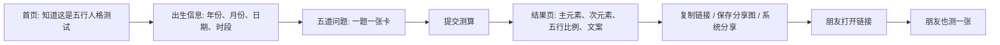

### 页面各自解决什么问题

| 页面 | 用户看到什么 | 工程上发生什么 |
| --- | --- | --- |
| 首页 | 产品承诺、开始按钮 | 记录首页访问、开始测试事件 |
| 测试页 | 出生信息和五道题 | 收集参数，提交给后端 |
| 结果页 | 人格解读、五行比例、分享入口 | 读取 resultId，记录浏览和分享行为 |
| 短链页 | 用户看不到，它会自动跳转 | `/s/{shortCode}` 解析并 302 到结果页 |
| 后台页 | PV、UV、漏斗、趋势、短链列表、运行态 | 从事件、结果、短链和聚合表生成运营视图 |

前端入口主要在：

| 模块 | 文件 |
| --- | --- |
| 测试页 | `frontend/src/pages/TestPage.vue` |
| 结果页 | `frontend/src/pages/ResultPage.vue` |
| 后台数据中台 | `frontend/src/pages/AdminDashboard.vue` |
| 短链详情 | `frontend/src/pages/AdminShortLinkDetail.vue` |
| 问答卡片组件 | `frontend/src/components/QuestionCard.vue` |

## 2. 整体架构：每一层负责什么

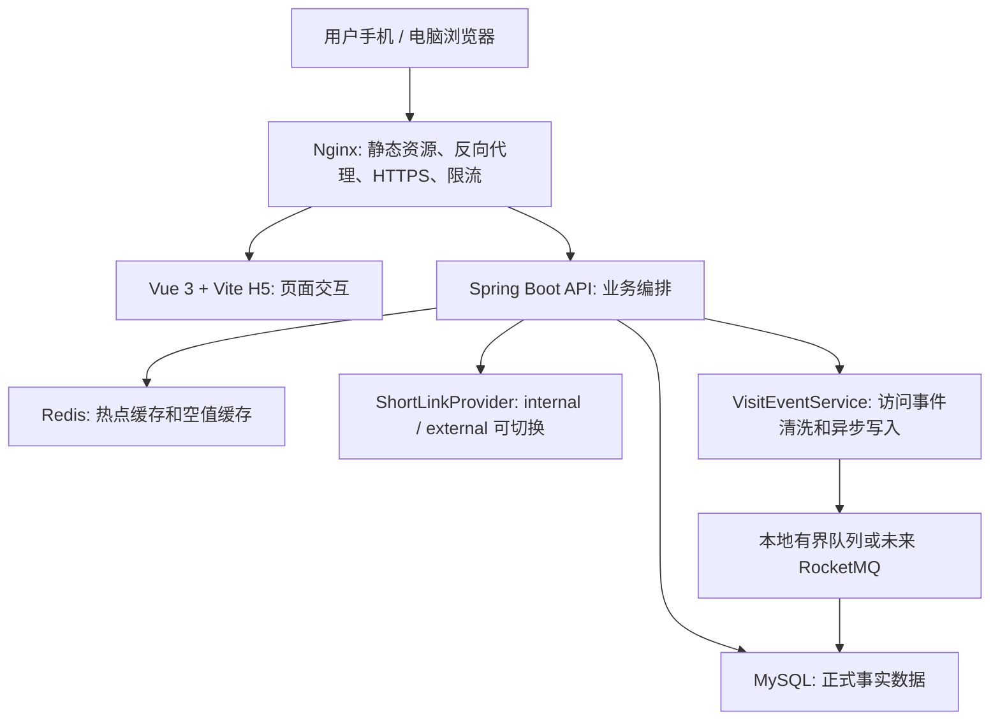

### 用一个比喻理解

你可以把系统想成一个活动现场：

| 角色 | 项目组件 | 比喻 |
| --- | --- | --- |
| 前台接待 | Vue H5 | 负责让用户顺利完成测试 |
| 活动后台 | Spring Boot | 负责算结果、生成链接、记录行为 |
| 档案室 | MySQL | 所有正式记录都在这里 |
| 前台抽屉 | Redis | 常用资料先放抽屉，查起来快 |
| 门口导流 | Nginx | 把静态页面、API、短链请求分流 |
| 统计员 | VisitEventService | 把用户行为记成匿名事件 |

### 为什么是这套技术

| 技术 | 在项目里的作用 | 学习时要理解的重点 |
| --- | --- | --- |
| Vue 3 | 做移动端 H5 交互和后台页面 | 页面状态、路由、API 调用 |
| Spring Boot 3 | 提供 API 和业务服务 | Controller -> Service -> Mapper 分层 |
| MyBatis | 把 Java 对象和 SQL 映射起来 | 数据表、SQL、分页和聚合 |
| MySQL | 保存结果、短链、事件、聚合数据 | 事实来源和查询性能 |
| Redis | 缓存结果、短码映射、空值、后台总览 | 降低热路径延迟 |
| Nginx | 部署入口、HTTPS、反向代理、限流 | 真实上线时的第一道入口 |
| Docker Compose | 单机部署后端、前端、MySQL、Redis | 可复现部署 |

## 3. 主链路：一张结果卡是怎么诞生的

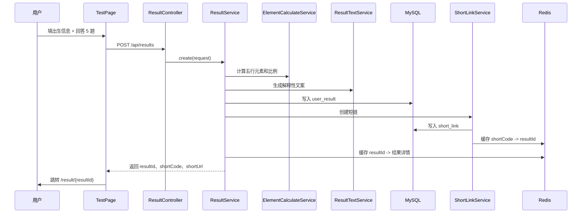

### 后端每一步的小心思

| 环节 | 表面行为 | 设计考虑 |
| --- | --- | --- |
| 参数校验 | 出生年份、月份、问题答案必须合法 | 防止前端被绕过后写入脏数据 |
| 五行计算 | 把出生信息和答案变成元素分数 | 让结果有依据，不像随机文案 |
| 文案生成 | 主元素、次元素、其他元素、相互作用、总览 | 用户要看到“为什么我是这个结果” |
| 写结果表 | `user_result` 保存最终结果 | 结果页和分享页都要可重复读取 |
| 生成短链 | `short_link` 绑定 resultId | 分享动作变成可访问业务入口 |
| 写缓存 | Redis 缓存结果和短码映射 | 朋友反复访问时不用每次查库 |
| 记录事件 | 写入测试提交、结果创建等事件 | 后台可以复盘漏斗 |

核心代码入口：

| 动作 | 文件 |
| --- | --- |
| 创建结果 API | `backend/src/main/java/com/wuxing/persona/controller/ResultController.java` |
| 创建结果业务 | `backend/src/main/java/com/wuxing/persona/service/ResultService.java` |
| 五行计算 | `backend/src/main/java/com/wuxing/persona/service/ElementCalculateService.java` |
| 节气和干支辅助 | `backend/src/main/java/com/wuxing/persona/service/WuxingCalendarTerms.java` |
| 结果文案 | `backend/src/main/java/com/wuxing/persona/service/ResultTextService.java` |
| 数据访问 | `backend/src/main/java/com/wuxing/persona/mapper/UserResultMapper.java` |

## 4. 结果解释：为什么用户会觉得“有依据”

你的结果页不是只说“你是火土人格”。它应该能解释：

1. 出生年份为什么带来某个五行倾向。
2. 出生月份处于什么季节或节气范围，为什么会影响元素。
3. 日期和时段如果填写了，会如何补充判断。
4. 五道题整体偏向哪个元素，它和出生信息是否互相印证。
5. 主元素、次元素、其他元素之间如何互相作用。

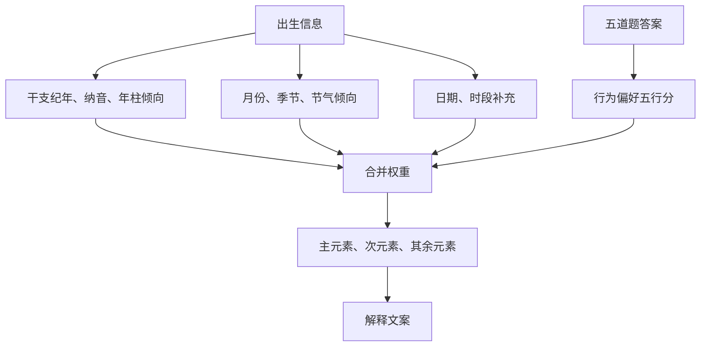

### 推荐的文案结构

用户之前已经明确过文案格式，所以学习时也要按这个结构理解：

| 部分 | 写什么 | 示例方向 |
| --- | --- | --- |
| 元素分别解释 | 主元素、次元素、其他明显元素各自代表什么 | 火代表热情表达，土代表稳定承接 |
| 元素相互作用 | 多个元素如何互相补足 | 火带行动，土让行动落地 |
| 总览评价 | 站在整张命盘角度给积极总结 | 既有探索力，也能稳稳推进 |

重要边界：

- 项目定位是娱乐化人格解读，不是命理预测。
- 文案要正向、具体、有依据，避免恐吓、宿命化或医疗化表达。
- 五行术语用于文化化解释，不应包装成科学诊断。

## 5. 短链接：为什么它是项目的工程核心

短链不是页面上展示的一个假字段。它是完整业务入口：

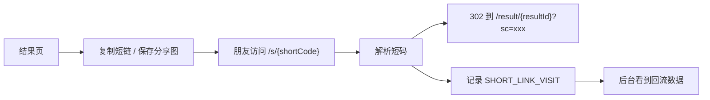

### 为什么短链容易成为压力点

一张结果只生成一次，但它可能被很多人打开。也就是说：

```text
POST /api/results 可能是低频写
GET /s/{shortCode} 可能是高频读
```

高频读就要做热路径优化。

| 优化 | 作用 |
| --- | --- |
| Redis 短码映射缓存 | 短码解析尽量不查 MySQL |
| 空值缓存 | 不存在的短码短时间内不反复打数据库 |
| 异步记录访问事件 | 先跳转，再慢慢写统计 |
| `last_visit_at` 限频更新 | 避免每次访问都更新同一行 |
| 后台批量统计 | 不在跳转接口里实时算 PV/UV/UIP |

短链相关核心文件：

| 文件 | 作用 |
| --- | --- |
| `backend/src/main/java/com/wuxing/persona/controller/ShortLinkController.java` | 接收 `/s/{shortCode}` |
| `backend/src/main/java/com/wuxing/persona/service/ShortLinkService.java` | 短链业务编排 |
| `backend/src/main/java/com/wuxing/persona/service/shortlink/ShortLinkProvider.java` | internal / external 抽象 |
| `backend/src/main/java/com/wuxing/persona/service/shortlink/InternalShortLinkProvider.java` | 内置短链实现 |
| `backend/src/main/java/com/wuxing/persona/service/shortlink/ExternalShortLinkProvider.java` | 外部短链适配 |

## 6. Redis 缓存：它解决什么问题

Redis 在这个项目里有两个关键词：快和保护数据库。

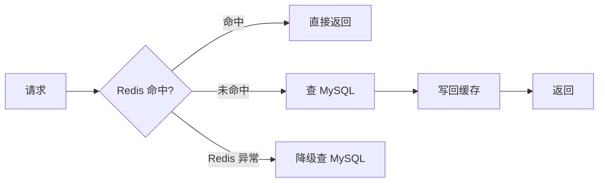

### 项目里的缓存类型

| 缓存 | 典型 key | 为什么需要 |
| --- | --- | --- |
| 结果详情缓存 | `result:{resultId}` | 结果页经常被重复打开 |
| 短码映射缓存 | `shortlink:code:{shortCode}` | 短链跳转是热路径 |
| 无效短码缓存 | `shortlink:null:{shortCode}` | 防止无效短码打穿数据库 |
| 后台总览缓存 | `admin:overview:{range}` | 后台刷新不必每次做聚合 |

学习时要注意一个原则：Redis 不是事实来源。MySQL 仍然是正式事实，Redis 只是让高频读取变快。

## 7. 访问事件：为什么要异步写

访问统计的核心表是 `visit_event`。它记录用户行为，但不保存明文 IP、明文 User-Agent 或昵称。

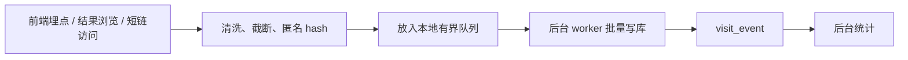

### 为什么不是同步写

同步写的意思是：用户点短链时，后端必须先把访问事件写进数据库，再让浏览器跳结果页。这会拖慢体验。

异步写的意思是：后端先让用户跳过去，再由后台线程批量写事件。

| 方案 | 优点 | 缺点 |
| --- | --- | --- |
| 同步写 | 事件更及时 | 请求变慢，高峰容易拖垮跳转 |
| 本地异步队列 | 请求快，代码简单 | 进程重启可能丢少量事件 |
| RocketMQ | 削峰能力强，适合多实例 | 运维复杂，需要幂等和消费失败处理 |

当前项目默认采用本地有界队列。RocketMQ 作为可选方案预留，见第 10 章。

## 8. 数据中台：你应该怎么看数据

数据中台不是为了把数字堆满屏幕，而是回答四类问题：

| 问题 | 看哪些指标 |
| --- | --- |
| 有没有人来 | PV、UV、UIP、趋势 |
| 用户有没有完成测试 | 首页访问、开始测试、提交尝试、结果生成 |
| 结果有没有被分享 | 分享区曝光、复制链接、保存分享图、系统分享 |
| 分享有没有回流 | 短链创建数、短链访问数、短链详情、来源分布 |

### 数据流总图

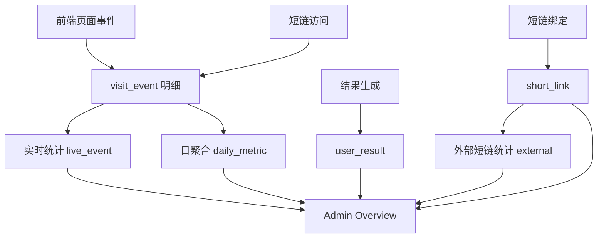

### 核心指标怎么理解

| 指标 | 直觉解释 | 容易误读的地方 |
| --- | --- | --- |
| PV | 页面或事件被访问了多少次 | 同一个人刷新 10 次就是 10 PV |
| UV | 去重后的匿名 clientId 数 | 换浏览器或清缓存会变化 |
| UIP | 去重后的 IP hash 数 | 校园网、公司网多人可能共用出口 |
| 完成率 | 结果生成数 / 开始测试数 | 超过 100% 先查压测、直达或口径 |
| 分享动作 | 复制链接、保存分享图、系统分享 | 自动生成短链不等于用户主动分享 |
| 回流热度 | 短链访问 / 短链创建 | 过高可能是压测或内部反复点 |

### `live_event`、`daily_metric`、`external`、`mixed`

| 来源 | 意思 | 适合场景 |
| --- | --- | --- |
| `live_event` | 直接查访问事件明细 | 当天数据、排障 |
| `daily_metric` | 查日聚合表 | 长日期范围、历史趋势 |
| `external` | 外部短链平台返回的数据 | external 模式短链统计 |
| `mixed` | 不同来源组合 | 某些页面同时使用本地和外部口径 |

学习时要记住：统计不是绝对真相，而是按口径解释出来的结果。先看口径，再看数字。

### 为什么默认排除 `perf-test`

压测和巡检会制造大量访问事件。如果直接混进运营数据，PV、UV、短链访问都会被放大。

项目通过 `channel=perf-test` 标记测试流量，后台默认排除它。这个隔离现在属于事件层隔离，不是实体层强隔离。所以表达时要说：

```text
当前默认视图会排除 perf-test 事件，避免压测污染运营判断；
但 user_result 和 short_link 本身还没有完全按 synthetic 实体隔离。
```

相关文件：

| 文件 | 作用 |
| --- | --- |
| `docs/admin-data-center-guide.md` | 数据中台使用说明 |
| `docs/admin-metric-dictionary.md` | 每个指标的来源和误读风险 |
| `docs/synthetic-traffic-isolation-design.md` | 测试流量隔离下一阶段方案 |
| `backend/src/main/java/com/wuxing/persona/service/AdminStatService.java` | 后台指标计算 |
| `backend/src/main/java/com/wuxing/persona/service/AnalyticsAggregationService.java` | 日聚合 |

## 9. 压测：先理解术语，再看报告

压测的目的不是炫耀“多少 QPS”，而是找到系统在什么压力下开始变慢、出错或排队。

### 压测思路总图

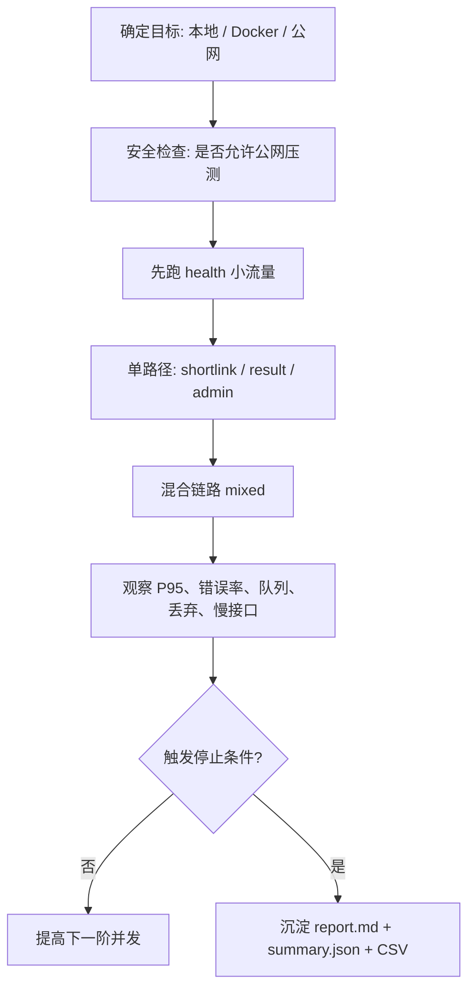

### 常见术语表

| 术语 | 含义 | 你怎么解释 |
| --- | --- | --- |
| RPS / QPS | 每秒请求数 | 系统吞吐量，不等于用户数 |
| 并发 | 同时进行中的请求数量 | 并发高不一定 RPS 高，慢请求会堆并发 |
| P50 | 50% 请求小于这个耗时 | 中位数，代表普通请求体验 |
| P95 | 95% 请求小于这个耗时 | 更适合看大多数用户是否卡顿 |
| P99 | 99% 请求小于这个耗时 | 看尾部慢请求和极端抖动 |
| Avg | 平均耗时 | 容易被极慢或极快请求拉偏 |
| Error rate | 错误率 | 4xx/5xx/超时等失败占比 |
| Stop reason | 停止原因 | 为什么压测不继续加压 |
| Workload | 压测场景 | health、shortlink、result、admin、mixed |
| Readiness | 就绪检查 | 进程活着还不够，业务表也要能查 |
| Synthetic traffic | 测试流量 | 用 channel/campaign/runId 标记，不污染真实分析 |

### `performance-smoke-test.sh` 是什么

Smoke 是低成本回归门。它不是摸极限，而是回答：

```text
我刚改完代码，核心链路还稳不稳？
短链 P95 是否超过阈值？
后台 P95 是否超过阈值？
访问事件队列有没有积压、丢弃、批量写失败？
```

关键变量：

| 变量 | 作用 |
| --- | --- |
| `BASE_URL` | 被测服务地址 |
| `ADMIN_TOKEN` | 后台接口 token |
| `SHORTLINK_HITS` | 短链访问次数 |
| `ADMIN_HITS` | 后台 overview 访问次数 |
| `MAX_SHORTLINK_P95_MS` | 短链 P95 阈值 |
| `MAX_ADMIN_P95_MS` | 后台 P95 阈值 |
| `MAX_ASYNC_QUEUE_SIZE` | 队列积压阈值 |
| `MAX_ASYNC_DROPPED_EVENTS` | 允许丢弃事件阈值 |
| `SMOKE_OUT_DIR` | 输出 smoke 证据目录 |

### `performance-limit-test.sh` 是什么

Limit test 是阶梯压测。它的思路是从低并发开始，一阶一阶加压，直到完成所有阶梯或触发停止条件。

关键变量：

| 变量 | 作用 | 学习重点 |
| --- | --- | --- |
| `STEPS` | 并发阶梯，例如 `1,2,4,8,16,32` | 它是配置并发，不是最终 QPS |
| `REQUESTS_PER_STAGE` | 每一阶总请求数 | 样本太少会误判 |
| `STOP_P95_MS` | P95 超过多少就停止 | 延迟边界 |
| `STOP_ERROR_RATE` | 错误率超过多少就停止 | 可用性边界 |
| `WORKLOAD` | 压测场景 | 分清是短链、结果、后台还是混合 |
| `STRICT_RUNTIME_OBSERVATION` | 是否要求 runtime 必须可观测 | 防止看不到队列状态还误判稳定 |
| `ALLOW_PUBLIC_LOAD_TEST` | 是否允许压公网地址 | 防止误伤线上服务 |
| `DEPLOYMENT_PROFILE` | 部署画像 | local-h2、compose-mysql、public-compose 要分开讲 |
| `STAGE_COOLDOWN_SECONDS` | 阶梯之间冷却秒数 | 公网多阶压测必须给系统喘息 |

### 为什么不能把本地 H2 结果说成生产 QPS

本地 H2、Docker Compose MySQL、公网服务器是不同环境：

| 环境 | 可以说明 | 不能说明 |
| --- | --- | --- |
| local-h2 | 代码链路和脚本逻辑能跑 | 生产数据库容量 |
| compose-mysql | 单机容器链路更接近部署 | 真实公网网络和备案环境 |
| public-compose | 真实服务器链路 | 仍需说明机器规格、数据规模、压测授权 |

所以报告要写清楚 `DEPLOYMENT_PROFILE`，不要把环境混在一起。

## 10. RocketMQ：可选削峰方案怎么理解

当前访问事件默认走本地队列。RocketMQ 的设计目标是未来高峰时把访问事件从请求线程里进一步解耦。

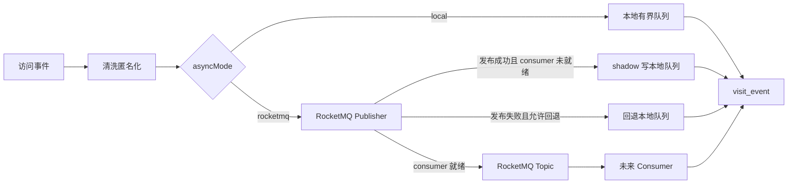

### 为什么现在不直接把 MQ 当主链路

因为 MQ 主链路不是只接一个 producer 就结束。真正生产可用至少要补：

| 必须能力 | 为什么重要 |
| --- | --- |
| eventId 幂等 | RocketMQ 至少一次投递，重复消费会让 PV 虚高 |
| consumer 批量落库 | 否则消息只进了 MQ，后台看不到数据 |
| DLQ 死信队列 | 消费失败的消息要可追踪 |
| 延迟消费重聚合 | 晚到事件要能修正日聚合 |
| 监控和告警 | 发布失败、消费失败、积压都要可见 |

当前策略是稳妥的：

```text
默认 local 最简单稳定；
rocketmq 先 shadow 观察；
consumer、幂等、DLQ 补齐后再让 MQ 接管主链路。
```

相关文件：

| 文件 | 作用 |
| --- | --- |
| `docs/rocketmq-visit-event-design.md` | RocketMQ 方案说明 |
| `backend/src/main/java/com/wuxing/persona/config/VisitEventPublisherConfiguration.java` | Publisher 配置 |
| `backend/src/main/java/com/wuxing/persona/service/VisitEventRocketMqPublisher.java` | MQ 发布接口 |
| `backend/src/main/java/com/wuxing/persona/service/DisabledVisitEventRocketMqPublisher.java` | 默认禁用实现 |
| `backend/src/main/java/com/wuxing/persona/service/VisitEventService.java` | 事件主入口和 runtime 指标 |

## 11. 读压测报告：按这个顺序看

不要一打开报告就盯最大并发。按这个顺序读：

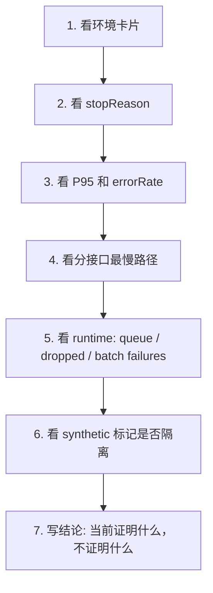

### 报告中的常见结论怎么翻译

| 报告现象 | 说明 | 下一步 |
| --- | --- | --- |
| `completed all stages` | 当前阶梯没打到边界 | 可以提高阶梯或换更真实环境 |
| `P95 exceeded` | 大多数用户边缘体验开始变差 | 找最慢接口、看 DB/线程/缓存 |
| `errorRate exceeded` | 可用性已经出问题 | 先查异常日志和连接池 |
| `runtime danger` | 统计队列或 MQ 运行态危险 | 先修事件写入链路 |
| `preflight_failed` | 安全或前置条件不满足 | 不要硬跑，按原因补授权或环境 |

### 当前已有压测材料怎么定位

| 材料 | 作用 |
| --- | --- |
| `docs/performance-reports/README.md` | 所有报告索引和阅读方式 |
| `docs/performance-visual-brief.md` | 把压测讲成可展示故事 |
| `docs/performance-optimization-plan.md` | 从瓶颈到优化方案 |
| `docs/production-load-observability-checklist.md` | 公网压测前要准备什么 |
| `scripts/performance-smoke-test.sh` | 回归门 |
| `scripts/performance-limit-test.sh` | 阶梯限压 |

## 12. 代码阅读路线：从最短路径开始

如果你想真正理解代码，不要从目录树第一行读到最后一行。按链路读。

### 路线 A：用户生成结果

```text
frontend/src/pages/TestPage.vue
-> frontend/src/api/results.ts
-> backend/src/main/java/com/wuxing/persona/controller/ResultController.java
-> backend/src/main/java/com/wuxing/persona/service/ResultService.java
-> backend/src/main/java/com/wuxing/persona/service/ElementCalculateService.java
-> backend/src/main/java/com/wuxing/persona/service/ResultTextService.java
-> backend/src/main/resources/db/schema.sql
```

你要带着这些问题读：

- 前端提交了哪些字段？
- 后端如何校验出生信息和答案？
- 五行分数如何合并？
- 文案怎么解释“为什么是这个元素”？
- 结果落到了哪张表？

### 路线 B：朋友打开短链

```text
backend/src/main/java/com/wuxing/persona/controller/ShortLinkController.java
-> backend/src/main/java/com/wuxing/persona/service/ShortLinkService.java
-> backend/src/main/java/com/wuxing/persona/service/shortlink/InternalShortLinkProvider.java
-> backend/src/main/java/com/wuxing/persona/service/RedisCacheService.java
-> backend/src/main/java/com/wuxing/persona/service/VisitEventService.java
```

你要带着这些问题读：

- 短码怎么解析到 resultId？
- Redis 命中和未命中有什么差别？
- 无效短码怎么处理？
- 302 跳转前后记录了什么事件？
- 访问事件为什么不能阻塞跳转？

### 路线 C：后台统计

```text
frontend/src/pages/AdminDashboard.vue
-> frontend/src/api/admin.ts
-> backend/src/main/java/com/wuxing/persona/controller/AdminController.java
-> backend/src/main/java/com/wuxing/persona/service/AdminStatService.java
-> backend/src/main/java/com/wuxing/persona/service/AnalyticsAggregationService.java
-> backend/src/main/java/com/wuxing/persona/mapper/VisitEventMapper.java
```

你要带着这些问题读：

- 页面每个卡片对应哪个字段？
- 默认是否排除 perf-test？
- 哪些指标来自事件，哪些来自结果表或短链表？
- 为什么要区分 live_event、daily_metric、external？
- 后台卡顿时应该先看哪些查询？

### 路线 D：压测和运行态

```text
scripts/performance-smoke-test.sh
-> scripts/performance-limit-test.sh
-> backend/src/main/java/com/wuxing/persona/controller/HealthController.java
-> backend/src/main/java/com/wuxing/persona/service/VisitEventService.java
-> docs/performance-reports/README.md
```

你要带着这些问题读：

- 脚本为什么先检查 readiness？
- 为什么公网压测默认拒跑？
- `WORKLOAD=mixed` 到底压了哪些接口？
- runtime 里 queue、dropped、batch failures 各自代表什么？
- 报告结论有没有写清“能证明什么，不能证明什么”？

## 13. 常见知识盲区速查

| 你可能卡住的点 | 快速理解 |
| --- | --- |
| resultId 和 shortCode 区别 | resultId 是结果主键，shortCode 是分享入口 |
| 短链为什么 302 | 用户访问短链接时，浏览器被重定向到真实结果页 |
| PV 和 UV 区别 | PV 是次数，UV 是去重后的匿名用户 |
| Redis 和 MySQL 区别 | Redis 快但不是事实来源，MySQL 是正式记录 |
| 为什么统计最终一致 | 事件异步写入，后台数字可能稍后才完整 |
| 为什么压测默认排除公网 | 未授权公网压测可能伤害真实服务或触发风控 |
| 为什么不直接用 RocketMQ | MQ 需要 consumer、幂等、DLQ、监控，不是只接 producer |
| 为什么 local-h2 不能外推生产 | 数据库、网络、机器、Nginx 链路都不一样 |

## 14. 一段完整项目表达

当你要向别人解释这个项目，可以这样组织：

> 五行人格卡是一个娱乐化人格测试 H5。用户在移动端填写出生信息并回答五道题，后端根据出生信息、季节节气倾向和答题偏好计算五行比例，生成正向的人格结果。每个结果会写入数据库并绑定一个短链，用户可以复制或保存分享图。朋友打开短链时，后端先解析短码并 302 到结果页，同时异步记录匿名访问事件。后台数据中台会根据结果、短链、访问事件和日聚合展示 PV、UV、UIP、漏斗、渠道、短链回流和运行态。工程上重点做了 Redis 缓存、短链热路径降压、访问事件异步写入、测试流量隔离、压测脚本和 RocketMQ 可选削峰预留。

这段话里有完整主线：产品、算法解释、短链、统计、性能。

## 15. 下一步学习任务

如果你想继续深入，建议按这个顺序做小任务：

1. 打开本地 H5，完成一次测试，记下 resultId 和 shortCode。
2. 在数据库里查 `user_result`、`short_link`、`visit_event` 三张表。
3. 打开 `/s/{shortCode}`，观察浏览器是否跳到 `/result/{resultId}`。
4. 打开 `/admin`，切换是否包含测试流量，对比 PV、UV、短链访问。
5. 跑一次 smoke，看 `shortlinkP95Ms`、`adminP95Ms`、`asyncDroppedEvents`。
6. 读一份 `report.md`，用第 11 章的顺序写 5 行结论。

完成这 6 件事后，你就不是“看过项目”，而是真的走过项目的业务、数据和性能闭环。
