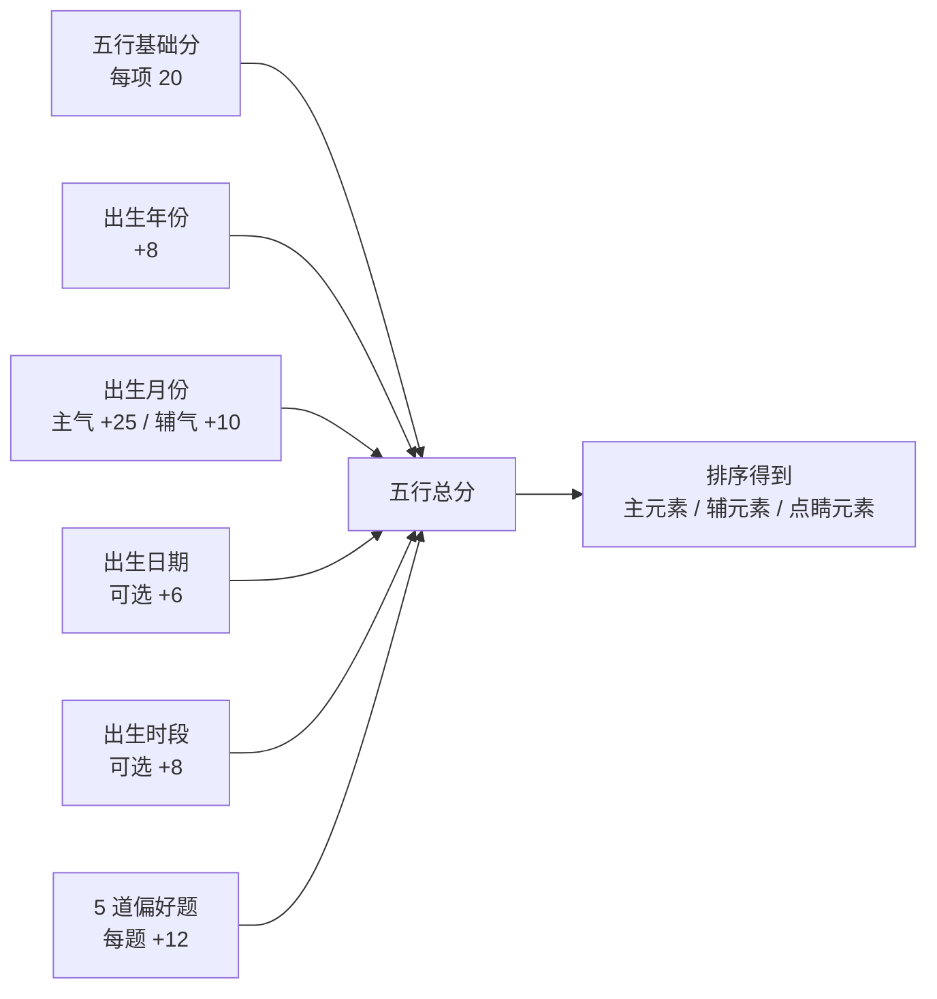
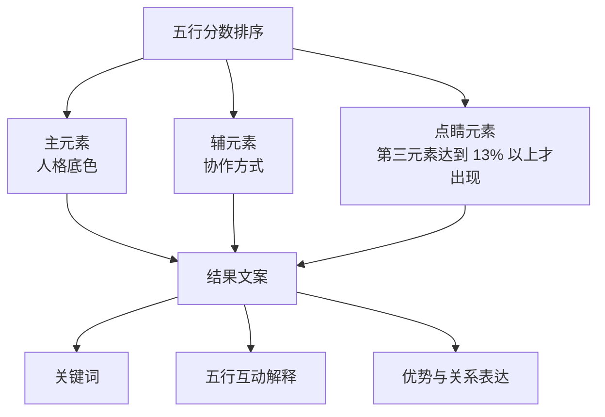

# 五行人格评判标准 v1

> 目标：先定标准，再扩文案。本文只给出第一版计算、分类和语言边界，不一次性枚举全部人格描述。

## 1. 项目定位

五行人格卡不是命理预测，也不判断命运好坏。它借用五行的“气质分类”和“相互作用”作为语言框架，把用户的出生背景、答题偏好和结果表达整理成一份正向、可分享的人格解读。

第一版的产品目标只有三个：

- **让用户觉得被理解**：结果要解释“为什么像我”，而不只是给标签。
- **让用户相信判定有依据**：年份、月份、可选日期/时段和 5 题选择都要说明为什么影响主次元素。
- **让文案足够正向**：所有组合都只说优势、潜力、互补和调和。
- **让系统可以扩展**：先用主元素、辅元素、点睛元素的规则生成，再逐步打磨高频组合。

## 2. 理论参照

第一版参考的是传统五行框架中的三个稳定概念：

| 概念 | 产品化理解 | 使用边界 |
| --- | --- | --- |
| 五行本义 | 金、木、水、火、土分别代表不同气质方向 | 用作文化隐喻，不做现实断命 |
| 相生 | 一个元素推动、滋养另一个元素 | 写成“推动、滋养、点亮、承接” |
| 相克 | 一个元素约束、校准另一个元素 | 写成“边界、分寸、聚焦、平衡”，不写冲突和克制 |

参考来源：

- 《尚书·洪范》提出五行次序和基本性质，可见 [Chinese Text Project: Great Plan](https://ctext.org/shang-shu/great-plan/zh) 与 [维基文库《尚书/洪范》](https://zh.wikisource.org/wiki/%E5%B0%9A%E6%9B%B8/%E6%B4%AA%E7%AF%84)。
- 五行相生相克的传统解释，可参考 [五行 - Wikipedia](https://zh.wikipedia.org/wiki/%E4%BA%94%E8%A1%8C)。
- 移动端布局遵循内容随视口变化、优先保证可读性与可操作性的响应式原则，可参考 [MDN Responsive Design](https://developer.mozilla.org/en-US/docs/Learn_web_development/Core/CSS_layout/Responsive_Design)。

## 3. 当前权重

当前后端计算不是八字排盘，而是“文化背景 + 自我选择”的人格倾向分数。年份使用干支纪年和纳音取象，月份使用节令/月令取象；如果未填写具体日期，只做月份级近似，不冒充完整四柱。

### 权重解释

| 来源 | 权重 | 意义 |
| --- | ---: | --- |
| 基础分 | 五行各 20 | 保证每个人都有完整五行，不出现“缺某一行”的负面表达 |
| 出生月份 | 35 | 按节令/月令取主辅气，是最强的出生背景权重 |
| 5 道答题 | 60 | 作为当下价值选择，是人格表达的核心权重 |
| 年份、日期、时段 | 8 / 6 / 8 | 年份取纳音主气，日期和时段作为轻量修饰，不压过用户主动选择 |

第一版权重原则：

- 出生信息提供“底色”，答题提供“当下人格表达”。
- 月份权重最高，是因为它更接近季节节律；但它不能替代用户选择。
- 所有元素都有基础分，所以文案只谈强弱重心，不说缺陷。
- 当前 `primaryPercent` 是主副元素之间的相对占比；后续如果要展示全五行百分比，应使用五行总分归一化。

## 4. 分类标准

第一版不直接生成 125 种长文案，而是先按三层结构生成：

### 输出格式

新生成结果统一使用三段：

1. **为什么判定为这个命盘**：说明年份干支/纳音、月份节令/月令、可选日期/时段取象，以及 5 题选择偏向。
2. **元素逐项解读**：分别解释主元素、次元素和点睛元素给这个用户带来的具体关键词。
3. **元素互动与总览**：分析元素之间的相生、制衡或互补，再给一个整体正向评价。

### 主元素

主元素是用户最容易被看见的核心气质。

| 元素 | 核心关键词 | 正向人格底色 |
| --- | --- | --- |
| 金 | 清醒、秩序、判断 | 清醒的判断力，适合定边界和做取舍 |
| 木 | 成长、规划、创造 | 向上生长的规划力，适合长期推进 |
| 水 | 观察、共情、适应 | 细腻流动的观察力，适合洞察和理解他人 |
| 火 | 热情、行动、表达 | 点亮现场的行动力，适合表达和带动 |
| 土 | 稳定、承载、协调 | 稳稳托住局面的承载力，适合协调和兜底 |

### 辅元素

辅元素不是第二人格，而是主元素的表达方式。

- 主生辅：主元素把能量自然推向辅元素，写成“推动、延展、转化”。
- 辅生主：辅元素在背后滋养主元素，写成“支撑、补能、让底色更稳定”。
- 主克辅：主元素给辅元素边界，写成“聚焦、收束、定方向”。
- 辅克主：辅元素给主元素校准，写成“分寸、节奏、平衡”。
- 其他组合：写成互补，不写冲突。

### 点睛元素

第三元素达到全五行总分 13% 以上时，进入结果文案。它的作用不是抢主角，而是提供“点睛之笔”。

例子：

> 水木为主，火排在第三：水的观察力推动木的生长感，火像点睛之笔，让细腻和规划多了行动温度。

这类文案应该让用户感到“我不是单一标签”，而是一个有层次的人。

## 5. 正向话术边界

必须避免的表达：

- 不说“缺金、缺火、命弱、过旺、被克、冲突”。
- 不把五行结果和财富、婚姻、寿命、疾病绑定。
- 不写恐吓、暗示补救、付费改运。

推荐转换：

| 不推荐 | 推荐 |
| --- | --- |
| 缺火 | 火作为背景色，提供留白；若出现则是点睛之笔 |
| 水克火 | 水给火带来分寸，让热情更有节奏 |
| 木太旺 | 木的成长感很集中，适合长期推进 |
| 金弱 | 金不抢主角，但会在需要判断时提供清醒感 |

## 6. 命理大师审校意见

以传统命理顾问视角审看，第一版标准可以通过，但后续文案需要守住四条线：

1. **五行要讲流动，不讲孤立标签**  
   单说“你是水型人格”会显得浅。更合理的方式是讲“水如何生木、火如何点亮、水如何给火分寸”。

2. **月令可以作背景，不宜作定论**  
   出生月份在传统体系里很重要，但这个项目是人格产品，所以月令只能做底色，不能压过用户答题。

3. **相克要转译成正向制衡**  
   相克不是坏事。写成边界、分寸、校准，会更符合五行的动态平衡，也更适合大众娱乐产品。

4. **点睛元素是用户惊喜感的来源**  
   用户不只想知道自己“主水辅木”，还想知道那一点火、金或土为什么让自己更立体。第三元素的阈值和文案质量要持续打磨。

## 7. 下一版文案扩展方式

不要一次性铺开全部组合。建议按数据频次迭代：

1. 先观察后台热门五行组合。
2. 为 Top 10 主副组合写人工精修版。
3. 再为高频第三元素写点睛句。
4. 每次只上线一小批，观察真实分享动作率、完成率和用户反馈。

这样做可以避免文案堆量，也能让五行人格描述越来越像一个真正的产品资产。
